<div class="watermark"></div>

# Feature Engineering

```{python, include=FALSE}
from dsml_environment import ensure_conda_environment

ensure_conda_environment()
```

## Regresión polinomial

Es común encontrar en la literatura este tema junto con la regresión múltiple, sin embargo, el alcance de esta transformación va a más allá de la regresión lineal, por lo que estudiaremos este tema como parte de la ingeniería de variables y no como un modelo lineal exclusivamente.

El objetivo de la transformación polinomial dentro de la ingeniería de variables es crear nuevas variables que puedan explicar la relación entre la variable de respuesta y explicativa a través de un polinomio de grado *k*.

En el siguiente gráfico se representa mediante una línea roja a la regresión lineal y mediante una curva azul al polinomio que relaciona a las variables independiente y dependiente.

```{python, warning=FALSE, message=FALSE, echo=FALSE}
import matplotlib.pyplot as plt
import numpy as np
import pandas as pd
from IPython.display import display
from sklearn.linear_model import LinearRegression
from sklearn.pipeline import Pipeline
from sklearn.preprocessing import PolynomialFeatures

rng = np.random.default_rng(12345)
n = 100

fig, axes = plt.subplots(2, 1, figsize=(8, 8))
for ax, x, y, title in [
    (
        axes[0],
        np.linspace(0, 10, n),
        np.linspace(0, 10, n) ** 2 + rng.normal(0, 5, n),
        "Regresión cuadrática Vs Regresión lineal",
    ),
    (
        axes[1],
        np.linspace(-10, 10, n),
        np.linspace(-10, 10, n) ** 3 + rng.normal(0, 100, n),
        "Regresión cúbica Vs Regresión lineal",
    ),
]:
    x_matrix = x.reshape(-1, 1)
    linear = LinearRegression().fit(x_matrix, y)
    polynomial = Pipeline(
        [("poly", PolynomialFeatures(degree=3, include_bias=False)), ("lm", LinearRegression())]
    ).fit(x_matrix, y)
    grid = np.linspace(x.min(), x.max(), 200).reshape(-1, 1)
    _artist = ax.scatter(x, y, s=20)
    _artist = ax.plot(grid.ravel(), linear.predict(grid), color="red", label="Lineal")
    _artist = ax.plot(grid.ravel(), polynomial.predict(grid), color="tab:blue", label="Polinomial")
    _artist = ax.set_title(title)
    _artist = ax.set_xlabel("Variable dependiente")
    _artist = ax.set_ylabel("Variable de respuesta")
    _artist = ax.legend()
plt.tight_layout()

```

Es evidente que existe un mejor ajuste cuando se considera un polinomio de grado *k* en vez de la componente lineal. Este método ofrece mayor flexibilidad para el ajuste de un modelo. Será importante **mediar posteriormente entre el sesgo y la varianza** de forma que podamos tener un mejor ajuste sin caer en el sobreajuste. La fórmula que expresa la relación entre variable de respuesta y explicativas es ahora:

$$Y_i \sim X_1 + X_1^2$$

Es importante mencionar que cuando se ajusta un modelo polinomial de segundo orden, se deben mantener ambas variables en el model (la original y la cuadrática). Cuando se tenga un modelo polinomial de grado *k*, se deberán conservar los *k* elementos que componen el polinomio:

$$Y\sim X_1+X_1^2 + ... + X_1^k$$

Estas transformaciones son posibles realizarlas a múltiples variables que conforman el conjunto de datos que sirve de insumo para el modelo. A través de los pasos secuenciales de un `Pipeline` podemos integrar esta tarea con `PolynomialFeatures`. Veamos un ejemplo:

```{python, message=FALSE, warning=FALSE}
n = 100
rng = np.random.default_rng(12345)
original_data = pd.DataFrame({"x": np.linspace(-10, 10, n)})
original_data["y"] = original_data["x"] ** 3 + rng.normal(0, 100, n)

poly_model = Pipeline(
    [
        ("poly", PolynomialFeatures(degree=3, include_bias=False)),
        ("lm", LinearRegression()),
    ]
)
poly_model.fit(original_data[["x"]], original_data["y"])

poly_features = poly_model.named_steps["poly"].transform(original_data[["x"]])
poly_recipe = pd.DataFrame(poly_features, columns=["x_poly_1", "x_poly_2", "x_poly_3"])
poly_recipe["y"] = original_data["y"].to_numpy()
display(poly_recipe.head())

coeficientes = pd.Series(
    np.r_[poly_model.named_steps["lm"].intercept_, poly_model.named_steps["lm"].coef_],
    index=["intercept", "x_poly_1", "x_poly_2", "x_poly_3"],
)
display(coeficientes)

grid = pd.DataFrame({"x": np.linspace(-10, 10, 200)})
_artist = plt.scatter(original_data["x"], original_data["y"], s=20)
_artist = plt.plot(grid["x"], poly_model.predict(grid), color="tab:blue")
_artist = plt.title("Regresión polinomial")
_artist = plt.xlabel("x")
_artist = plt.ylabel("y")
```

En el ejemplo anterior puede mostrarse que es a través de la ponderación de los términos polinomiales que se logra estimar a la variable de respuesta *Y*.

Este mismo procedimiento puede usarse en la receta de la ingeniería de datos para realizar la predicción de una variable de respuesta mediante cualquier otro algoritmo predictivo.


## Análisis de Componentes Principales

El análisis PCA (por sus siglas en inglés) es una **técnica de reducción de dimensión** útil tanto para el proceso de análisis exploratorio, el inferencial y predictivo. Es una técnica ampliamente usada en muchos estudios, pues permite sintetizar la información relevante y desechar aquello que no aporta tanto. Es particularmente útil en el caso de conjuntos de datos "amplios" en donde las **variables están correlacionadas entre sí** y donde se tienen muchas variables para cada observación.

En los conjuntos de datos donde hay muchas variables presentes, no es fácil trazar los datos en su formato original, lo que dificulta tener una idea de las tendencias presentes en ellos. PCA permite ver la estructura general de los datos, identificando qué observaciones son similares entre sí y cuáles son diferentes. Esto puede permitirnos identificar grupos de muestras que son similares y determinar qué variables hacen a un grupo diferente de otro.

La idea detrás de esta técnica es la siguiente:

* Se desean crear nuevas variables llamadas **Componentes Principales**, las cuales son creadas como combinación lineal (transformación lineal) de las variables originales, por lo que cada una de las variables nuevas contiene parcialmente información de todas las variables originales.

$$Z_1 = a_{11}X_1 +a_{12}X_2 + ... + a_{1p}X_p$$
$$Z_2 = a_{21}X_1 +a_{22}X_2 + ... + a_{2p}X_p$$
$$...$$
$$Z_p = a_{p1}X_1 +a_{p2}X_2 + ... + a_{pp}X_p$$

* Se desea que la primer componente principal capture la mayor varianza posible de todo el conjunto de datos.

$$\forall i \in 2,...,p \quad Var(Z_1)>Var(Z_i)$$

* La segunda componente principal deberá **SER INDEPENDIENTE** de la primera y deberá abarcar la mayor varianza posible del restante. Esta condición se debe cumplir para toda componente *i*, de tal forma que las nuevas componentes creadas son independientes entre sí y acumulan la mayor proporción de varianza en las primeras de ellas, dejando la mínima proporción de varianza a las últimas componentes.

$$Z_1 \perp\!\!\!\perp Z_2 \quad \& \quad Var(Z_1)>Var(Z_2)>Var(Z_i)$$

* El punto anterior permite desechar unas cuantas componentes (las últimas) sin perder mucha varianza.

::: {.infobox .note data-latex="{note}"}
**¡¡ RECORDAR !!**

* **A través de CPA se logra retener la mayor cantidad de varianza útil pero usando menos componentes que el número de variables originales.**

* **Para que este proceso sea efectivo, debe existir ALTA correlación entre las variables originales.**
:::


Cuando muchas variables se correlacionan entre sí, todas contribuirán fuertemente al mismo componente principal. Cada componente principal suma un cierto porcentaje de la variación total en el conjunto de datos. Cuando sus variables iniciales estén fuertemente correlacionadas entre sí y podrá aproximar la mayor parte de la complejidad de su conjunto de datos con solo unos pocos componentes principales.

Agregar componentes adicionales hace que la estimación del conjunto de datos total sea más precisa, pero también más difícil de manejar.


### Eigenvalores y eigenvectores

Los vectores propios y los valores propios vienen en pares: **cada vector propio tiene un valor propio correspondiente**. Los vectores propios son la ponderación que permite crear la combinación lineal de las variables para conformar cada componente principal, mientras que el valor propio es la varianza asociada a cada componente principal. Desde un punto de vista geométrico, el eigenvector es la dirección del vector determinado por la componente principal y el eigenvalor es la magnitud de dicho vector.

::: {.infobox .pin data-latex="{pin}"}

* El valor propio de una componente es la varianza de este.

* La suma acumulada de los primeros $j$ eigenvalores representa la varianza acumulada de las primeras $j$ componentes principales
:::

El número de valores propios y vectores propios que existe es igual al número de dimensiones que tiene el conjunto de datos.

### Implementación en Python

```{python, warning=FALSE, message=FALSE}
from sklearn.decomposition import PCA
from sklearn.preprocessing import StandardScaler

from dsml_utils import load_margin_index

indice_marg = load_margin_index("data/IMEF_2010.dbf")
indice_marg.info()
indice_marg["GM"].value_counts()
```

```{python}
pca_features = ["ANALF", "SPRIM", "OVSDE", "OVSEE", "OVSAE", "VHAC", "OVPT", "PL_5000", "PO2SM"]

scaler = StandardScaler()
X_pca = scaler.fit_transform(indice_marg[pca_features])
pca = PCA(n_components=9, random_state=123)
pca_scores = pca.fit_transform(X_pca)

pca_recipe = pd.concat(
    [
        indice_marg[["IM", "NOM_ENT", "GM"]].reset_index(drop=True),
        pd.DataFrame(pca_scores, columns=[f"PC{i}" for i in range(1, 10)]),
    ],
    axis=1,
)

pca_recipe.head()
```

Veamos los pasos de esta receta:

* Primero, debemos decirle a la receta qué datos se usan para predecir la variable de respuesta.

* Se actualiza el rol de las variables *nombre de entidad*  y *grado de marginación* con la función `NOM_ENT`, ya que es una variable que queremos mantener por conveniencia como identificador de filas, pero no son un predictor ni variable de respuesta.

* Necesitamos centrar y escalar los predictores numéricos, porque estamos a punto de implementar **PCA**.

* Finalmente, usamos `PCA()` para realizar el análisis de componentes principales.

* La función `prep()` es la que realiza toda la preparación de la receta.

Una vez que hayamos hecho eso, podremos explorar los resultados del **PCA**. Comencemos por ver cómo resultó el **PCA**. Podemos ordenar los resultados mediante la función `tidy()`, incluido el paso de **PCA**, que es el segundo paso. Luego hagamos una visualización para ver cómo se ven los componentes.

A continuación se muestran la desviación estándar, porcentaje de varianza y porcentaje de varianza acumulada que aporta cada componente principal.

```{python}
pca_summary = pd.DataFrame(
    {
        "component": [f"PC{i}" for i in range(1, 10)],
        "std": np.sqrt(pca.explained_variance_),
        "variance_ratio": pca.explained_variance_ratio_,
        "cumulative_variance": np.cumsum(pca.explained_variance_ratio_),
    }
)
pca_summary
```

```{python, echo=FALSE, eval=FALSE}
loadings = pd.DataFrame(
    pca.components_.T,
    index=pca_features,
    columns=[f"PC{i}" for i in range(1, 10)],
).reset_index().rename(columns={"index": "terms"})

loadings.loc[:, ["terms", "PC1", "PC2", "PC3", "PC4", "PC5"]].melt(
    id_vars="terms", var_name="component", value_name="value"
)
```

Podemos observar que en la primera componente principal, las $9$ variables que utilizó el Consejo Nacional de Población para obtener el [Índice de Marginación 2010](http://www.conapo.gob.mx/work/models/CONAPO/Resource/862/4/images/06_C_AGEB.pdf) aportan de manera positiva en el primer componente principal.


```{python}
loadings = pd.DataFrame(
    pca.components_.T,
    index=pca_features,
    columns=[f"PC{i}" for i in range(1, 10)],
)

fig, axes = plt.subplots(2, 2, figsize=(12, 8))
for ax, component in zip(axes.ravel(), ["PC1", "PC2", "PC3", "PC4"]):
    values = loadings[component].sort_values(key=lambda s: s.abs())
    colors = np.where(values > 0, "tab:blue", "tab:red")
    _artist = ax.barh(values.index, values.abs(), color=colors)
    _artist = ax.set_title(component)
    _artist = ax.set_xlabel("Absolute value of contribution")
plt.tight_layout()
```

Notamos que las $9$ variables aportan entre el $25\%$ y el $35\%$ a la
primera componente principal.

### Representación gráfica

```{python}
fig, ax = plt.subplots(figsize=(8, 6))
for gm, group in pca_recipe.groupby("GM"):
    _artist = ax.scatter(group["PC1"], group["PC2"], label=gm, alpha=0.7, s=35)
    for _, row in group.iterrows():
        _artist = ax.annotate(row["NOM_ENT"], (row["PC1"], row["PC2"]), fontsize=8)
_artist = ax.set_title("Grado de marginación de entidades")
_artist = ax.set_xlabel("PC1")
_artist = ax.set_ylabel("PC2")
_artist = ax.legend()

```

Finalmente, podemos observar como (de izquierda a derecha) los estados con grado de marginación Muy bajo, Bajo, Medio, Alto y Muy Alto respectivamente.

```{python}
lm_pc1 = LinearRegression().fit(pca_recipe[["IM"]], pca_recipe["PC1"])
grid = pd.DataFrame({"IM": np.linspace(pca_recipe["IM"].min(), pca_recipe["IM"].max(), 100)})

_artist = plt.scatter(pca_recipe["IM"], pca_recipe["PC1"], s=30)
_artist = plt.plot(grid["IM"], lm_pc1.predict(grid), color="tab:blue")
_artist = plt.title("Comparación: Índice Marginación Vs PCA CP1")
_artist = plt.xlabel("IM")
_artist = plt.ylabel("PC1")
```

### ¿Cuántas componentes retener?

Existe en la literatura basta información sobre el número de componentes a retener en un análisis de PCA. El siguiente gráfico lleva por nombre **gráfico de codo** y muestra el porcentaje de varianza explicado por cada componente principal.

```{python, message=FALSE, warning=FALSE}
eig = pca_summary.assign(variance_percent=lambda x: x["variance_ratio"] * 100)

ax = eig.plot(kind="bar", x="component", y="variance_percent", legend=False, figsize=(8, 4))
_artist = ax.set_ylim(0, 100)
_artist = ax.set_title("Porcentaje de varianza explicada")
_artist = ax.set_xlabel("Componente")
_artist = ax.set_ylabel("% varianza")
for i, value in enumerate(eig["variance_percent"]):
    _artist = ax.text(i, value + 1, f"{value:.1f}%", ha="center", fontsize=8)
```

```{python, message=FALSE, warning=FALSE, eval=FALSE, echo=FALSE}
plt.scatter(pca_recipe["PC1"], pca_recipe["PC2"])
for _, row in pca_recipe.iterrows():
    plt.annotate(row["NOM_ENT"], (row["PC1"], row["PC2"]))
```

El grafico anterior muestra que hay una diferencia muy grande entre la varianza retenida por la 1er componente principal y el resto de las variables. Dependiendo del objetivo del analisis podra elegirse el numero adecuado de componentes a retener, no obstante, la literatura sugiere retener 1 o 2 componentes principales.

Regresando al tema de **feature engineering**, es posible realizar el proceso de componentes principales y elegir una de las dos opciones siguientes:

1. Especificar el número de componentes a retener

2. Indicar el porcentaje de varianza a alcanzar

La segunda opción elegirá tantas componentes como sean necesarias hasta alcanzar el hiperparámetro mínimo indicado. A continuación se ejemplifica:

**Caso 1:**

```{python}
pca_2 = PCA(n_components=2, random_state=123)
pca_scores_2 = pca_2.fit_transform(X_pca)

pca_recipe_2 = pd.concat(
    [
        indice_marg[["IM", "NOM_ENT", "GM"]].reset_index(drop=True),
        pd.DataFrame(pca_scores_2, columns=["PC1", "PC2"]),
    ],
    axis=1,
)
pca_recipe_2.head()
```

**Caso 2:**

```{python}
pca_90 = PCA(n_components=0.90, random_state=123)
pca_scores_90 = pca_90.fit_transform(X_pca)

pca_recipe_90 = pd.concat(
    [
        indice_marg[["IM", "NOM_ENT", "GM"]].reset_index(drop=True),
        pd.DataFrame(pca_scores_90, columns=[f"PC{i}" for i in range(1, pca_scores_90.shape[1] + 1)]),
    ],
    axis=1,
)
pca_recipe_90.head()
```

Así es como usaremos el análisis de componentes principales para mejorar la estructura de variables que sirven de input para cualquiera de los modelos posteriores. Continuaremos con un paso más de pre-procesamiento antes de comenzar a aprender nuevos modelos.

## Imputación KNN

Antes de aprender el uso de la función de imputación, recordaremos brevemente como funciona el algoritmo de K-Nearest-Neighbor (KNN)

KNN es un algoritmo de aprendizaje supervisado que podemos usar tanto para regresión como clasificación. Es un algoritmo fácil de interpretar y que permite ser flexible en el balance entre sesgo y varianza (dependiendo de los hiper-parámetros seleccionados).

El algoritmo de K vecinos más cercanos realiza comparaciones entre un nuevo elemento y las observaciones anteriores que ya cuentan con etiqueta. La esencia de este algoritmo está en **etiquetar a un nuevo elemento de manera similar a como están etiquetados aquellos _K_ elementos que más se le parecen**. Veremos este proceso para cada uno de los posibles casos:

```{r, fig.align='center', out.height='400pt', out.width='800pt',echo=F}

```

### **Ventajas y limitaciones del Clasificador KNN**

**Ventajas:**

* KNN no hace ninguna suposición subyacente sobre los datos.
* Con la adición de más puntos de datos, el clasificador evoluciona constantemente y es capaz de adaptarse rápidamente a los cambios en el conjunto de datos de entrada.
* Le da al usuario la flexibilidad de elegir la [métrica de medida de distancia](https://www.maartengrootendorst.com/blog/distances/).

**Desventajas:**

* KNN es muy sensible a los valores atípicos.
* No funciona con datos faltantes.
* A medida que crece el conjunto de datos, la clasificación se vuelve más lenta.
* Existe la llamada maldición de la dimensionalidad.

Este algoritmo es altamente usado para imputación de datos faltantes, ¿tiene lógica, cierto? Con **scikit-learn** podemos aplicar este paso con la clase **`KNNImputer`**.

### Implementación en Python

Veámos cómo implementar la imputación por *KNN* para datos faltantes en *Python*:

```{python, eval=FALSE}
from sklearn.impute import KNNImputer

imputer = KNNImputer(n_neighbors=5)
datos_imputados = imputer.fit_transform(datos_con_nulos)
```

Acerca de los parámetros:

* *neighbors:* Número de vecinos

* *impute_with:* Una llamada a _imp_vars_ para especificar qué variables se usan para imputar las variables. Si una columna se incluye en ambas listas para ser imputada y para ser un predictor de imputación, se eliminará de esta última y no se usará para imputarse a sí misma.

* *id:* Una cadena de caracteres que es exclusiva de este paso para identificarlo.

La función utiliza el conjunto de entrenamiento para imputar cualquier otro conjunto de datos. La única función de distancia disponible es la distancia de **Gower**, que se puede utilizar para combinaciones de datos nominales y numéricos.

::: {.infobox .note data-latex="{note}"}
_Acerca de **Gower**_ El coeficiente de similitud de Gower propuesto en 1971 permite la manipulación simultánea de variables cuantitativas y cualitativas en una base de datos, mediante la aplicación de este coeficiente se logra hallar la similitud entre individuos a los cuales se les han medido una serie de características en común. Una similaridad alta, es decir cercana a 1, indicara gran homogeneidad entre los individuos; por el contrario, una similaridad cercana a cero indica que los individuos son diferentes
:::

Vamos a utilizar los datos de *biomass*  de la libreria _modeldata_ que
contiene un conjunto de datos donde diferentes combustibles de biomasa se caracterizan por la cantidad de ciertas moléculas (carbono, hidrógeno, oxígeno, nitrógeno y azufre) y el poder calorífico superior correspondiente (HHV). En esta base hemos retirado valores aleatoriamente sobre dos variables para realizar el ejercicio.

```{python, message=FALSE, warning=FALSE}
from sklearn.impute import KNNImputer

from dsml_utils import load_biomass, show_missing

biomass = load_biomass()
biomass_te_whole = biomass.copy()

rng = np.random.default_rng(19735)
carb_missing = rng.choice(biomass_te_whole.index, 75, replace=False)
nitro_missing = rng.choice(biomass_te_whole.index, 75, replace=False)

biomass_te_whole.loc[carb_missing, "carbon"] = np.nan
biomass_te_whole.loc[nitro_missing, "nitrogen"] = np.nan
biomass_te_whole["carb_imputed"] = "No"
biomass_te_whole.loc[carb_missing, "carb_imputed"] = "Yes"
biomass_te_whole["nitro_imputed"] = "No"
biomass_te_whole.loc[nitro_missing, "nitro_imputed"] = "Yes"

biomass_tr = biomass_te_whole.query("dataset == 'Training'").copy()
biomass_te = biomass_te_whole.query("dataset == 'Testing'").copy()

biomass_te_whole.loc[nitro_missing].head()
```


```{python}
show_missing(biomass_tr, title="Train")
show_missing(biomass_te, title="Test")
```

En la primera opción vamos a aplicar el paso de immputación indicando qué columnas quieren ser imputadas y con cuáles variables queremos que se haga el proceso.


```{python}
recipe_esp = KNNImputer(n_neighbors=3)
columns_esp = ["carbon", "nitrogen", "hydrogen", "oxygen"]

imputed_esp_train = biomass_tr.copy()
imputed_esp_test = biomass_te.copy()
imputed_esp_train[columns_esp] = recipe_esp.fit_transform(biomass_tr[columns_esp])
imputed_esp_test[columns_esp] = recipe_esp.transform(biomass_te[columns_esp])

show_missing(imputed_esp_train, title="Imputacion Train")
show_missing(imputed_esp_test, title="Imputacion Test")
```

Sin embargo, siempre podemos pedirle al modelo que haga la imputación de todas las variables que tengan nulos, con toda la información de las demás variables disponibles (no nulas).

```{python}
numeric_predictors = ["carbon", "hydrogen", "oxygen", "nitrogen", "sulfur"]
recipe = KNNImputer(n_neighbors=3)
recipe.fit(biomass_tr[numeric_predictors])

imputed = biomass_te.copy()
imputed[numeric_predictors] = recipe.transform(biomass_te[numeric_predictors])
show_missing(imputed)
```


```{python, warning=FALSE, message=FALSE}
biomass_test_original = biomass.query("dataset == 'Testing'").reset_index(drop=True)
imputed_plot = imputed.reset_index(drop=True)

fig, axes = plt.subplots(1, 2, figsize=(10, 4))
_artist = axes[0].scatter(imputed_plot["nitrogen"], biomass_test_original["nitrogen"], c=(imputed_plot["nitro_imputed"] == "Yes"))
_artist = axes[0].set_title("Comparación de datos reales vs imputados (Nitrógeno)")
_artist = axes[0].set_xlabel("Imputado")
_artist = axes[0].set_ylabel("Real")

_artist = axes[1].scatter(imputed_plot["carbon"], biomass_test_original["carbon"], c=(imputed_plot["carb_imputed"] == "Yes"))
_artist = axes[1].set_title("Comparación de datos reales vs imputados (Carbono)")
_artist = axes[1].set_xlabel("Imputado")
_artist = axes[1].set_ylabel("Real")
plt.tight_layout()
```

## Ejercicios

1. Cada equipo estará a cargo de desarrollar una receta de *feature engineering* utilizando los pasos vistos en el curso pasado y el actual.

2. Tendrán 15 días para probar distintas estrategias que mejoren las predicciones del precio de ventas.

3. Se deberá entregar y explicar el código creado por el equipo. Este código servirá para los ejercicios de optimización de modelos en los siguientes capítulos.


# Regularización Elasticnet

En muchas técnicas de aprendizaje automático, **el aprendizaje consiste en encontrar los coeficientes que minimizan una función de costo**. Un modelo estándar de mínimos cuadrados tiende a tener alguna variación, es decir, este modelo no se generalizará bien para un conjunto de datos diferente a sus datos de entrenamiento.

La regularización consiste en **añadir una penalización a la función de costo. Esta penalización produce modelos más simples que generalizan mejor y evita el riesgo de sobre-ajuste**.

El procedimiento de ajuste implica una función de pérdida, conocida como suma de cuadrados residual o *RSS*. Los coeficientes $\beta$ se eligen de manera que minimicen esta función de pérdida.

$$RSS = \sum_{i=1}^n\left(y_i - \beta_0- \sum_{i=1}^p \beta_jx_{ij}\right)^2$$

Esto ajustará los coeficientes en función de sus datos de entrenamiento. Si hay ruido en los datos de entrenamiento, los coeficientes estimados no se generalizarán bien a los datos futuros. Aquí es donde entra la regularización y reduce o regulariza estas estimaciones aprendidas hacia cero.

En esta sección se verán las regularizaciones más usadas en machine learning: 

* Ridge (conocida también como L2) 
* Lasso (también conocida como L1)
* ElasticNet que combina tanto Lasso como Ridge.

Para cada una de estas regularizaciones ajustaremos modelos lineales con `scikit-learn`. En regresión usaremos el conjunto de viviendas de *Ames*; en clasificación usaremos el conjunto de abandono de clientes de Telco.

```{r, fig.align='center', out.height='250pt', out.width='500pt', echo=F, include=TRUE}
knitr::include_graphics("img/10-ml-elasticnet/overfitting.png")
```


## Regularización Ridge


En este tipo de regularización *RSS* se modifica agregando una cantidad de **contracción a los coeficientes**, los cuales se estiman minimizando esta función. $\lambda$ es el parámetro de ajuste que decide cuánto queremos penalizar la flexibilidad de el modelo. 

$$\sum_{i=1}^n\left(y_i - \beta_0- \sum_{i=1}^p \beta_jx_{ij}\right)^2 + \lambda \sum_{j=1}^p \beta_j^2 = RSS + \lambda \sum_{j=1}^p \beta_j^2$$

El aumento de la flexibilidad de un modelo está representado por el aumento de sus coeficientes, si se desea minimizar la función anterior, los coeficientes  deben ser pequeños. 

Así es como la técnica de regresión de *Ridge* evita que los coeficientes aumenten demasiado. Además, reduce la asociación estimada de cada variable con la respuesta excepto la intersección $\beta_0$. Esta intersección es una medida del valor medio de la respuesta cuando $x_{i1} = x_{i2} =\dots= x_{ip} = 0$.

> Cuando $\lambda = 0$, el término de penalización no tiene efecto y las estimaciones  serán iguales a mínimos cuadrados. 

> A medida que $\lambda \rightarrow \infty$, el impacto de la penalización por contracción aumenta, y las estimaciones se acercarán a cero. 

La selección de un buen valor de $\lambda$ es fundamental. Las estimaciones de  coeficientes producidas por este método también se conocen como la **norma L2**.


**Nota:** Es necesario estandarizar los predictores o llevarlos a la misma escala antes de aplicar esta regularización. 


## Regularización Lasso

Lasso es otra variación, en la que se minimiza la función *RSS*. Utiliza $|\beta_j|$ en lugar de los cuadrados de $\beta$ como penalización. Las estimaciones de coeficientes producidas por este método también se conocen como la **norma L1**.

$$\sum_{i=1}^n\left(y_i - \beta_0- \sum_{i=1}^p \beta_jx_{ij}\right)^2 + \lambda \sum_{j=1}^p |\beta_j| = RSS + \lambda \sum_{j=1}^p |\beta_j|$$

> Cuando $\lambda = 0$, el término de penalización no tiene efecto y las estimaciones  serán iguales a mínimos cuadrados. 

> A medida que $\lambda \rightarrow \infty$, el impacto de la penalización por contracción aumenta, y las estimaciones se convierten en cero (eliminando variables). 

Este método de regularización permite eliminar coeficientes con alta variación, lo cual **ayuda a la selección de variables**.

## Comparación entre Ridge y Lasso

La regresión *Ridge* se puede considerar como la solución de una ecuación, donde la suma de los cuadrados de los coeficientes es menor o igual que $s$,  donde $s$ es una constante que existe para cada valor del factor de contracción $\lambda$

$$\beta_1^2 + \beta_2^2 \leq s$$

Esto implica que los coeficientes de la regresión *Ridge* tienen el *RSS* (función de pérdida) más pequeño para todos los puntos que se encuentran dentro del círculo dado por la función de restricción  $\beta_1^2 + \beta_2^2 \leq s$. 

Y en la regresión *Lasso* se puede considerar como una ecuación en la que la suma del módulo de coeficientes es menor o igual que $s$. 

$$|\beta_1| + |\beta_2| \leq s$$

Esto implica que los coeficientes de lasso tienen la *RSS* (función de pérdida) más pequeña para todos los puntos que se encuentran dentro del diamante dado por la función de restricción $|\beta_1| + |\beta_2| \leq s$

```{r, fig.align='center', out.height='300pt', out.width='600pt', echo=F, include=TRUE}
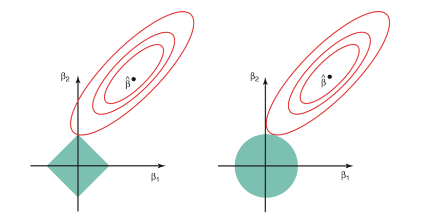
```

La imagen de arriba muestra las funciones de restricción (áreas verdes) para *Lasso* (izquierda) y *Ridge* (derecha), junto con contornos para *RSS* (elipse roja).

Para un valor muy grande de $s$, las regiones verdes contendrán el centro de la elipse, lo que hará que las estimaciones de los coeficientes de ambas técnicas de regresión sean iguales a las estimaciones de mínimos cuadrados. Pero este no es el caso en la imagen de arriba. 

En este caso, las estimaciones del coeficiente de regresión de *Lasso* y *Ridge* vienen dadas por el primer punto en el que una elipse contacta con la región de restricción. Dado que la regresión *Ridge* tiene una restricción circular sin puntos agudos, **esta intersección generalmente no ocurrirá en un eje, por lo que las estimaciones del coeficiente de regresión de _Ridge_ serán exclusivamente distintas de cero**.

Sin embargo, la restricción de *Lasso* **tiene esquinas en cada uno de los ejes**, por lo que la elipse a menudo intersectará la región de restricción en un eje. **Cuando esto ocurre, uno de los coeficientes será igual a cero**. En dimensiones más altas, muchas de las estimaciones de coeficientes pueden ser iguales a cero simultáneamente.

**Desventajas**

* Regresión *Ridge*: Reducirá los coeficientes de los predictores menos importantes, muy cerca de cero. Pero nunca los hará exactamente cero. En otras palabras, el modelo final incluirá todos los predictores. 

* Regresión *Lasso*: La penalización *L1* tiene el efecto de forzar algunas de las estimaciones de              coeficientes a ser exactamente iguales a cero cuando el parámetro de ajuste $\lambda$ es suficientemente grande. Por lo tanto, este método realiza una selección de variables.


## ElasticNet

*ElasticNet* surgió por primera vez como resultado de la crítica a *Lasso*, cuya selección de variables puede ser demasiado dependiente de los datos y, por lo tanto, inestable. La solución es **combinar las penalizaciones** de la regresión de *Ridge* y *Lasso* para obtener lo mejor de ambas regularizaciones.

*ElasticNet* tiene como objetivo minimizar la siguiente función de pérdida:

$$\frac{\sum_{i=1}^n\left(y_i - \beta_0- \sum_{i=1}^p \beta_jx_{ij}\right)^2}{2n} + 
\lambda\left(\alpha \sum_{j=1}^p|\beta_j| + \frac{1-\alpha}{2} \sum_{j=1}^p \beta_j ^2\right)$$

$$= \frac{RSS}{2n}+ \lambda\left(\alpha \sum_{j=1}^p|\beta_j| + \frac{1-\alpha}{2} \sum_{j=1}^p \beta_j ^2\right)$$

donde $\alpha \in [0,1]$ es el parámetro de mezcla entre la regularización *Ridge* $(\alpha = 0)$ y la regularización *Lasso* $(\alpha = 1)$. En `scikit-learn`, este parámetro se llama `l1_ratio`; la intensidad total de la penalización se controla con `alpha` en regresión y con `C` en regresión logística.

La combinación de ambas penalizaciones suele dar lugar a buenos resultados. Una estrategia frecuentemente utilizada es asignarle casi todo el peso a la penalización *L1* ( $\alpha \approx 1$) para conseguir seleccionar predictores y menos peso a la regularización $L2$ para dar cierta estabilidad en el caso de que algunos predictores estén correlacionados.

```{r, fig.align='center', out.height='400pt', out.width='550pt', echo=F, include=TRUE}
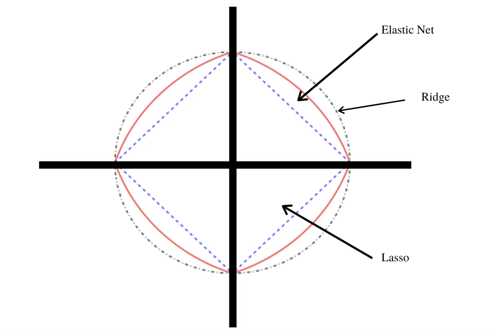
```


## Implementación en Python

### Regresión

Utilizaremos `Ridge`, `Lasso` y `ElasticNet` de `sklearn.linear_model`. El preprocesamiento se encapsula en un `Pipeline`, de forma que la imputación, escalamiento y codificación de variables se estimen solamente con los datos de entrenamiento.

En `scikit-learn` los parámetros principales son:

* `alpha`: intensidad total de regularización en `Ridge`, `Lasso` y `ElasticNet`. Valores mayores producen coeficientes más pequeños.

* `l1_ratio`: proporción de regularización *L1* en `ElasticNet`. Cuando `l1_ratio = 1`, el comportamiento es equivalente a *Lasso*; cuando `l1_ratio = 0`, es equivalente a *Ridge*. Para los casos puros usaremos directamente `Ridge` y `Lasso`.


**Paso 1: Separación inicial de datos ( test, train, KFCV )**
```{python, warning=FALSE, message=FALSE}
import matplotlib.pyplot as plt
import numpy as np
import pandas as pd
from IPython.display import display
from scipy.stats import loguniform, uniform
from sklearn.linear_model import ElasticNet, Lasso, LogisticRegression, Ridge
from sklearn.metrics import average_precision_score, make_scorer
from sklearn.model_selection import KFold, RandomizedSearchCV, StratifiedKFold, train_test_split

from dsml_utils import (
    best_cv_results,
    classification_metrics,
    load_ames,
    load_telco,
    make_ames_pipeline,
    make_telco_pipeline,
    pr_curve_table,
    regression_metrics,
    roc_curve_table,
)

ames = load_ames()
ames_train, ames_test = train_test_split(ames, train_size=0.75, random_state=4595)
X_ames_train = ames_train.drop(columns="Sale_Price")
y_ames_train = ames_train["Sale_Price"]
X_ames_test = ames_test.drop(columns="Sale_Price")
y_ames_test = ames_test["Sale_Price"]
ames_folds = KFold(n_splits=5, shuffle=True, random_state=4595)
```

Contando con datos de entrenamiento, procedemos a realizar el feature engineering para extraer las mejores características que permitirán realizar las estimaciones en el modelo.

**Paso 2: Pre-procesamiento e ingeniería de variables**

```{python, warning=FALSE,message=FALSE}
receta_casas = make_ames_pipeline(ElasticNet(max_iter=20_000), scale_numeric=True)
receta_casas
```

Recordemos que un **Pipeline** contiene los pasos a seguir. Usamos **fit()** para estimar transformaciones y modelo, y **transform()** o **predict()** para aplicarlo a nuevos datos.

Una vez que la receta de transformación de datos está lista, procedemos a implementar el pipeline del modelo de interés.

**Paso 3: Selección de tipo de modelo con hiperparámetros iniciales**

```{python, warning=FALSE,message=FALSE}
ridge_regression_model = Ridge()
lasso_regression_model = Lasso(max_iter=20_000)
elasticnet_regression_model = ElasticNet(max_iter=20_000)
elasticnet_regression_model
```

**Paso 4: Inicialización de workflow o pipeline**

```{python, warning=FALSE,message=FALSE}
ridge_workflow = make_ames_pipeline(ridge_regression_model, scale_numeric=True)
lasso_workflow = make_ames_pipeline(lasso_regression_model, scale_numeric=True)
elasticnet_workflow = make_ames_pipeline(elasticnet_regression_model, scale_numeric=True)
elasticnet_workflow
```

Antes de optimizar hiperparámetros, comparemos los tres enfoques con valores fijos de regularización:

```{python, warning=FALSE,message=FALSE}
regularized_models = {
    "Ridge": make_ames_pipeline(Ridge(alpha=10), scale_numeric=True),
    "Lasso": make_ames_pipeline(Lasso(alpha=1_000, max_iter=20_000), scale_numeric=True),
    "ElasticNet": make_ames_pipeline(ElasticNet(alpha=1_000, l1_ratio=0.5, max_iter=20_000), scale_numeric=True),
}

comparison_rows = []
for name, model in regularized_models.items():
    model.fit(X_ames_train, y_ames_train)
    predictions = model.predict(X_ames_test)
    metrics = regression_metrics(y_ames_test, predictions)
    coefficients = model.named_steps["model"].coef_
    comparison_rows.append(
        {
            "modelo": name,
            "rmse": metrics.query("metric == 'rmse'")["estimate"].iloc[0],
            "mae": metrics.query("metric == 'mae'")["estimate"].iloc[0],
            "rsq": metrics.query("metric == 'rsq'")["estimate"].iloc[0],
            "coeficientes_no_cero": np.sum(np.abs(coefficients) > 1e-8),
        }
    )

pd.DataFrame(comparison_rows).round(3)
```

**Paso 5: Creación de grid search**

```{python, warning=FALSE,message=FALSE}
elasticnet_param_distributions = {
    "model__alpha": loguniform(1e-4, 1e2),
    "model__l1_ratio": uniform(0.05, 0.95),
}

regression_scoring = {
    "rmse": "neg_root_mean_squared_error",
    "mae": "neg_mean_absolute_error",
    "mape": "neg_mean_absolute_percentage_error",
    "rsq": "r2",
}
elasticnet_param_distributions
```

**Paso 6: Entrenamiento de modelos con hiperparámetros definidos**

```{python, warning=FALSE,message=FALSE, eval=FALSE}
elasticnet_tune_result = RandomizedSearchCV(
    elasticnet_workflow,
    param_distributions=elasticnet_param_distributions,
    n_iter=50,
    cv=ames_folds,
    scoring=regression_scoring,
    refit="rmse",
    random_state=195628,
    n_jobs=-1,
)
elasticnet_tune_result.fit(X_ames_train, y_ames_train)

import joblib
joblib.dump(elasticnet_tune_result, "models/elasticnet_model_reg.joblib")
```

Para que el documento se pueda ejecutar en clase sin esperar un ajuste largo, usamos menos iteraciones en el siguiente bloque:

```{python, warning=FALSE,message=FALSE}
elasticnet_tune_result = RandomizedSearchCV(
    elasticnet_workflow,
    param_distributions=elasticnet_param_distributions,
    n_iter=20,
    cv=ames_folds,
    scoring=regression_scoring,
    refit="rmse",
    random_state=195628,
    n_jobs=-1,
)
elasticnet_tune_result.fit(X_ames_train, y_ames_train)
pd.DataFrame(elasticnet_tune_result.cv_results_).head()
```

**Paso 7: Análisis de métricas de error e hiperparámetros (Vuelve al paso 3, si es necesario)**

Podemos obtener las métricas de cada *fold* con el siguiente código:

```{python}
best_cv_results(elasticnet_tune_result, metric="rmse", n=10)
```

En la siguiente gráfica observamos las distintas métricas de error asociadas a los hiperparámetros elegidos:

```{python}
elasticnet_cv_results = pd.DataFrame(elasticnet_tune_result.cv_results_)
elasticnet_cv_results["rmse"] = -elasticnet_cv_results["mean_test_rmse"]
elasticnet_cv_results["mae"] = -elasticnet_cv_results["mean_test_mae"]
elasticnet_cv_results["mape"] = -elasticnet_cv_results["mean_test_mape"]

ax = elasticnet_cv_results.plot.scatter(
    x="param_model__alpha",
    y="rmse",
    c="param_model__l1_ratio",
    colormap="viridis",
    logx=True,
    figsize=(7, 4),
)
_artist = ax.set_title("RMSE por alpha y l1_ratio")
_artist = ax.set_xlabel("alpha")
_artist = ax.set_ylabel("RMSE")
```

En la siguiente gráfica observamos la $R^2$ asociada a distintos niveles de regularización.

```{python}
ax = elasticnet_cv_results.plot.scatter(
    x="param_model__alpha",
    y="mean_test_rsq",
    c="param_model__l1_ratio",
    colormap="viridis",
    logx=True,
    figsize=(7, 4),
)
_artist = plt.title("R cuadrada por alpha y l1_ratio")
_artist = plt.xlabel("alpha")
_artist = plt.ylabel("R cuadrada promedio en CV")
```


**Paso 8: Selección de modelo a usar**

Con el siguiente código obtenemos los mejores 10 modelos respecto al *rmse*.

```{python}
best_cv_results(elasticnet_tune_result, metric="rmse", n=10)
```

Ahora obtendremos el modelo que mejor desempeño tiene tomando en cuenta el *rmse*.

```{python}
best_elasticnet_regression_model = elasticnet_tune_result.best_params_
best_elasticnet_regression_model
```

**Paso 9: Ajuste de modelo final con todos los datos (Vuelve al paso 2, si es necesario)**

```{python}
final_elasticnet_regression_model = elasticnet_tune_result.best_estimator_
final_elasticnet_regression_model
```

Este último objeto es el modelo final entrenado, el cual contiene toda la información del pre-procesamiento de datos, por lo que en caso de ponerse en producción el modelo, sólo se necesita de este último elemento para poder realizar nuevas predicciones. 

Antes de pasar al siguiente paso, es importante validar que hayamos hecho un uso correcto de las variables predictivas. En este momento es posible detectar variables que no estén aportando valor o variables que no debiéramos estar usando debido a que cometeríamos [data leakage](https://towardsdatascience.com/data-leakage-in-machine-learning-6161c167e8ba). Para enfrentar esto, ayuda estimar y ordenar el valor de importancia de cada variable en el modelo. En modelos lineales regularizados podemos inspeccionar los coeficientes después del preprocesamiento.

```{python}
feature_names = final_elasticnet_regression_model.named_steps["preprocess"].get_feature_names_out()
coeficientes_elasticnet = (
    pd.DataFrame(
        {
            "Variable": feature_names,
            "Coeficiente": final_elasticnet_regression_model.named_steps["model"].coef_,
        }
    )
    .assign(Importancia=lambda data: data["Coeficiente"].abs())
    .sort_values("Importancia", ascending=False)
)
display(coeficientes_elasticnet.head(20))

ax = coeficientes_elasticnet.head(20).sort_values("Importancia").plot.barh(
    x="Variable", y="Importancia", legend=False, figsize=(8, 6)
)
_artist = ax.set_title("Importancia de las variables")
```


**Paso 10: Validar poder predictivo con datos de prueba**

Imaginemos por un momento que pasa un mes de tiempo desde que hicimos nuestro modelo, es hora de ponerlo a prueba prediciendo valores de nuevos elementos:

```{python}
results = pd.DataFrame(
    {
        "Sale_Price": y_ames_test.to_numpy(),
        "pred_elasticnet_reg": final_elasticnet_regression_model.predict(X_ames_test),
    }
)
results.head()
```

**Métricas de desempeño**

Ahora para calcular las métricas de desempeño usaremos funciones de `sklearn.metrics` envueltas en una utilidad del repositorio:

```{python}
regression_metrics(results["Sale_Price"], results["pred_elasticnet_reg"]).assign(
    estimate=lambda data: data["estimate"].round(2)
)
```

```{python}
_artist = plt.figure(figsize=(6, 5))
_artist = plt.scatter(results["pred_elasticnet_reg"], results["Sale_Price"], alpha=0.6)
lims = [
    results[["pred_elasticnet_reg", "Sale_Price"]].min().min(),
    results[["pred_elasticnet_reg", "Sale_Price"]].max().max(),
]
_artist = plt.plot(lims, lims, color="red")
_artist = plt.xlabel("Predicción")
_artist = plt.ylabel("Observación")
_artist = plt.title("Comparación")
plt.tight_layout()
```


### Clasificación

Para clasificación usaremos regresión logística con penalización `elasticnet`. En `scikit-learn`, la regresión logística usa `C` como inverso de la regularización: valores pequeños de `C` implican una penalización más fuerte.

**Paso 1: Separación inicial de datos (test, train)**

```{python}
telco = load_telco("data/Churn.csv")

telco_train, telco_test = train_test_split(
    telco,
    train_size=0.70,
    random_state=1234,
    stratify=telco["Churn"],
)
X_telco_train = telco_train.drop(columns="Churn")
y_telco_train = telco_train["Churn"]
X_telco_test = telco_test.drop(columns="Churn")
y_telco_test = telco_test["Churn"]
telco_folds = StratifiedKFold(n_splits=5, shuffle=True, random_state=1234)
telco_train.head()
```

**Paso 2: Pre-procesamiento e ingeniería de variables**

```{python}
telco_rec = make_telco_pipeline(
    LogisticRegression(penalty="elasticnet", solver="saga", l1_ratio=0.5, max_iter=5_000),
    scale_numeric=True,
)
telco_rec
```

**Paso 3: Selección de tipo de modelo con hiperparámetros iniciales**

```{python}
elasticnet_class_model = LogisticRegression(
    penalty="elasticnet",
    solver="saga",
    l1_ratio=0.5,
    max_iter=5_000,
    random_state=1234,
)
elasticnet_class_model
```

**Paso 4: Inicialización de workflow o pipeline**

```{python}
elasticnet_class_workflow = make_telco_pipeline(elasticnet_class_model, scale_numeric=True)
elasticnet_class_workflow
```

**Paso 5: Creación de grid search**

```{python}
elasticnet_class_param_distributions = {
    "model__C": loguniform(1e-2, 1e2),
    "model__l1_ratio": uniform(0.05, 0.95),
}

classification_scoring = {
    "roc_auc": "roc_auc",
    "pr_auc": make_scorer(
        average_precision_score,
        response_method="predict_proba",
        pos_label="Yes",
    ),
}
elasticnet_class_param_distributions
```


**Paso 6: Entrenamiento de modelos con hiperparámetros definidos**

```{python, eval=FALSE}
elasticnet_class_tune_result = RandomizedSearchCV(
    elasticnet_class_workflow,
    param_distributions=elasticnet_class_param_distributions,
    n_iter=50,
    cv=telco_folds,
    scoring=classification_scoring,
    refit="pr_auc",
    random_state=1234,
    n_jobs=-1,
)
elasticnet_class_tune_result.fit(X_telco_train, y_telco_train)

import joblib
joblib.dump(elasticnet_class_tune_result, "models/elasticnet_class_model.joblib")
```

**Paso 7: Análisis de métricas de error e hiperparámetros (Vuelve al paso 3, si es necesario)**

```{python}
elasticnet_class_tune_result = RandomizedSearchCV(
    elasticnet_class_workflow,
    param_distributions=elasticnet_class_param_distributions,
    n_iter=20,
    cv=telco_folds,
    scoring=classification_scoring,
    refit="pr_auc",
    random_state=1234,
    n_jobs=-1,
)
elasticnet_class_tune_result.fit(X_telco_train, y_telco_train)
best_cv_results(elasticnet_class_tune_result, metric="pr_auc", n=10)
```

En la siguiente gráfica observamos las distintas métricas de error asociadas a los hiperparámetros elegidos:

```{python}
elasticnet_class_results = pd.DataFrame(elasticnet_class_tune_result.cv_results_)
ax = elasticnet_class_results.plot.scatter(
    x="param_model__C",
    y="mean_test_pr_auc",
    c="param_model__l1_ratio",
    colormap="viridis",
    logx=True,
    figsize=(7, 4),
)
_artist = plt.title("PR AUC por C y l1_ratio")
_artist = plt.xlabel("C")
_artist = plt.ylabel("PR AUC promedio en CV")
```

```{python}
best_cv_results(elasticnet_class_tune_result, metric="roc_auc", n=10)
```

```{python}
best_cv_results(elasticnet_class_tune_result, metric="pr_auc", n=10)
```


**Paso 8: Selección de modelo a usar**

```{python, message=FALSE, warning=FALSE}
best_elasticnet_class_model = elasticnet_class_tune_result.best_params_
best_elasticnet_class_model
```

**Paso 9: Ajuste de modelo final con todos los datos (Vuelve al paso 2, si es necesario)**

```{python, message=FALSE, warning=FALSE}
final_elasticnet_class_model = elasticnet_class_tune_result.best_estimator_
final_elasticnet_class_model
```

Como hemos hablado anteriormente, este último objeto es el modelo final entrenado, el cual contiene toda la información del pre-procesamiento de datos, por lo que en caso de ponerse en producción el modelo, sólo se necesita de este último elemento para poder realizar nuevas predicciones.

Antes de pasar al siguiente paso, es importante validar que hayamos hecho un uso correcto de las variables predictivas. En modelos lineales regularizados podemos revisar los coeficientes para identificar qué variables tienen mayor peso en la predicción.

```{python}
telco_feature_names = final_elasticnet_class_model.named_steps["preprocess"].get_feature_names_out()
coeficientes_churn = (
    pd.DataFrame(
        {
            "Variable": telco_feature_names,
            "Coeficiente": final_elasticnet_class_model.named_steps["model"].coef_.ravel(),
        }
    )
    .assign(Importancia=lambda data: data["Coeficiente"].abs())
    .sort_values("Importancia", ascending=False)
)
display(coeficientes_churn.head(20))

ax = coeficientes_churn.head(20).sort_values("Importancia").plot.barh(
    x="Variable", y="Importancia", legend=False, figsize=(8, 6)
)
_artist = ax.set_title("Importancia de las variables")
```

**Paso 10: Validar poder predictivo con datos de prueba**

Imaginemos por un momento que pasa un mes de tiempo desde que hicimos nuestro modelo, es hora de ponerlo a prueba prediciendo valores de nuevos elementos:

```{python, message=FALSE, warning=FALSE}
class_labels = list(final_elasticnet_class_model.named_steps["model"].classes_)
proba_yes_index = class_labels.index("Yes")
class_results = pd.DataFrame(
    {
        "Churn": y_telco_test.to_numpy(),
        "pred_Yes": final_elasticnet_class_model.predict_proba(X_telco_test)[:, proba_yes_index],
    }
)
class_results.head()
```

```{python}
classification_metrics(class_results["Churn"], class_results["pred_Yes"], positive_label="Yes")
```


A continuación, conoceremos el nivel de sensitividad y especificidad para cada punto de corte:

```{python}
roc_curve_data = roc_curve_table(
    class_results["Churn"],
    class_results["pred_Yes"],
    positive_label="Yes",
)
roc_curve_data.head()
```

A través de estas métricas es posible crear la curva ROC:

```{python}
_artist = plt.figure(figsize=(5, 5))
_artist = plt.plot(1 - roc_curve_data["specificity"], roc_curve_data["sensitivity"], color="lightblue", lw=2)
_artist = plt.plot([0, 1], [0, 1], color="gray", linestyle="--")
_artist = plt.xlabel("1 - especificidad")
_artist = plt.ylabel("sensitividad")
_artist = plt.title("ROC Curve")
_artist = plt.axis("square")
plt.tight_layout()
```

De igual manera, podemos calcular la precisión y cobertura para cada punto de corte:

```{python}
pr_curve_data = pr_curve_table(
    class_results["Churn"],
    class_results["pred_Yes"],
    positive_label="Yes",
)
pr_curve_data.head()
```

Y graficar su respectiva curva:

```{python}
_artist = plt.figure(figsize=(5, 5))
_artist = plt.plot(pr_curve_data["recall"], pr_curve_data["precision"], color="lightblue", lw=2)
_artist = plt.xlabel("cobertura")
_artist = plt.ylabel("precisión")
_artist = plt.title("Precision vs Recall")
_artist = plt.ylim(0, 1)
_artist = plt.axis("square")
plt.tight_layout()
```


# Support Vector Machine (SVM / SVR)

Es común encontrar en la literatura el nombre de SVM para referirse tanto al caso de regresión como al de clasificación, no obstante, SVR se refiere particularmente a *Suport Vector Regression*.

Support vector machine, llamado SVM, es un algoritmo de aprendizaje supervisado que se puede utilizar para problemas de clasificación y regresión. Se utiliza para conjuntos de datos más pequeños, ya que **tarda demasiado en procesarse.**

El principal objetivo de esta técnica es encontrar el **Hiperplano de Separación Óptima**, también conocido como *Boundary Decision*, el cual será el margen de clasificación más grande que podamos ajustar para separar a las clases involucradas, limitando las veces que una observación viola dicho margen.

```{r, fig.align='center', out.height='400pt', out.width='800pt',echo=F}
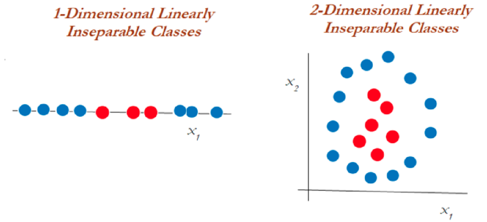
```

Para entender este algoritmo es necesario entender 3 conceptos principales:

> 1. Maximum margin classifiers
>
> 2. Support vector classifiers
>
> 3. Support vector machines

Estudiemos cada uno de estos principios.

## Maximum Margin Classifier

A menudo se generalizan con máquinas de vectores de soporte, pero SVM tiene muchos más parámetros en comparación. El *clasificador de margen máximo* considera un hiperplano con ancho de separación máxima para clasificar los datos. Sin embargo, se pueden dibujar infinitos hiperplanos en un conjunto de datos por lo que es importante **elegir el hiperplano ideal para la clasificación.**

En un espacio *n-dimensional*, un hiperplano es un subespacio de la dimensión n-1. Es decir, si los datos tienen un espacio bidimensional, entonces el hiperplano puede ser una línea recta que divide el espacio de datos en dos mitades y pasa por la siguiente ecuacion:

$$\beta_0 + \beta_1X_1 + \beta_2X_2=0$$

Las observaciones que caen en el hiperplano sigue la ecuación anterior. Las observaciones que caen en la región por encima o por debajo del hiperplano sigue las siguientes ecuaciones:

$$\beta_0 + \beta_1X_1 + \beta_2X_2>0$$

$$\beta_0 + \beta_1X_1 + \beta_2X_2<0$$

El clasificador de margen máximo **a menudo falla en la situación de casos no separables** en los que no puede asignar un hiperplano diferente para clasificar datos no separables. Para tales casos, un clasificador de vectores de soporte viene al rescate.

```{r, fig.align='center', out.height='380pt', out.width='900pt',echo=F}
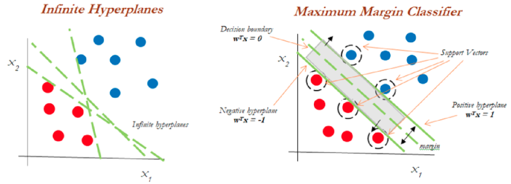
```

Del diagrama anterior, podemos suponer infinitos hiperplanos (izquierda). El clasificador de margen máximo viene con un solo hiperplano que divide los datos como en la gráfica de la derecha. **Los datos que tocan los hiperplanos positivo y negativo se denominan vectores de soporte**.


## Support Vector Classifiers

**Los vectores de soporte son las observaciones que están más cerca del hiperplano e influyen en la posición y orientación del hiperplano**. Este tipo de clasificador puede considerarse como una versión extendida del clasificador de margen máximo. Cuando tratamos con datos de la vida real, encontramos que la mayoría de las observaciones están en clases superpuestas. Es por eso que se implementan clasificadores de vectores de soporte.

Usando estos vectores de soporte, **maximizamos el margen del clasificador**. Eliminar los vectores de soporte cambiará la posición del hiperplano. Estos son los puntos que nos ayudan a construir nuestro *SVM*. Consideremos un **parámetro de ajuste C**. Entendamos con el siguiente diagrama.

```{r, fig.align='center', out.height='380pt', out.width='900pt',echo=F}
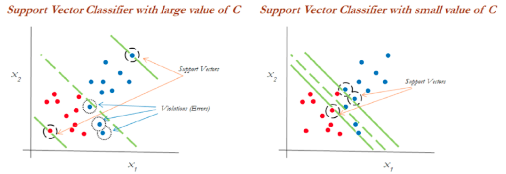
```

Podemos ver en el gráfico de la izquierda que los valores más altos de *C* generaron más errores que se consideran una **violación o infracción**. El diagrama de la derecha muestra un valor más bajo de *C* y no brinda suficientes posibilidades de infracción al reducir el ancho del margen.

::: {.infobox .note data-latex="{note}"}
Puede considerarse al parámetro *C* como el monto de regularización, tal que:

* Si **C es bajo**, el margen será más amplio y tendremos un mayor número de violaciones al margen, pero el modelo generalizará mejor

* Si **C es alto**, nuestro margen será menos amplio y tendrá menos violaciones. Sin embargo, no generalizará bien.
:::

Este modelo es sensible a cambios en la escala de datos de entrada, por lo que será **importante estandarizar las variables antes de usar este modelo**.

## Support Vector Machine

El enfoque de la máquina de vectores de soporte se considera durante una decisión no lineal y los datos no son separables por un clasificador de vectores de soporte, independientemente de la función de costo.

Cuando es casi imposible separar clases de manera no lineal, aplicamos el truco llamado **truco del kernel** el cual ayuda a manejar la separación de los datos.

```{r, fig.align='center', out.height='380pt', out.width='900pt',echo=F}
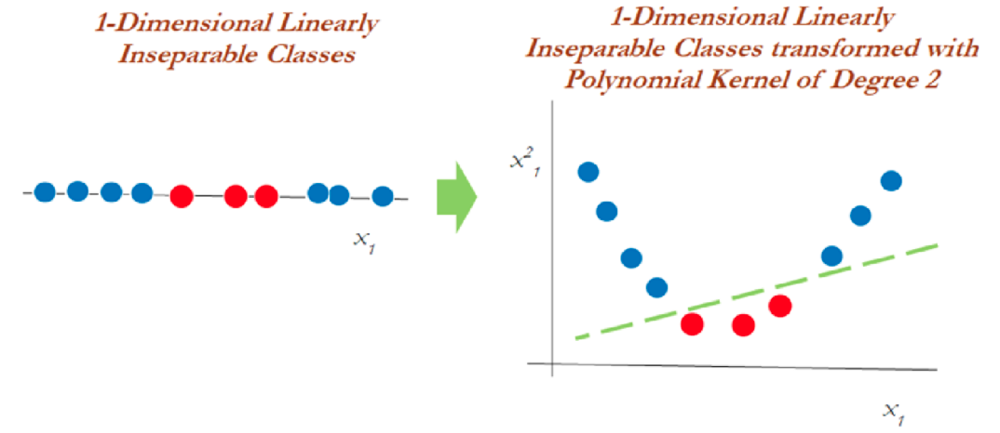
```

En el gráfico anterior, los datos que eran inseparables en una dimensión se separaron una vez que se transformaron a un espacio de dos dimensiones después de aplicar una **transformación mediante kernel polinomial de segundo grado**. Ahora veamos cómo manejar los datos bidimensionales linealmente inseparables.

```{r, fig.align='center', out.height='380pt', out.width='900pt',echo=F}
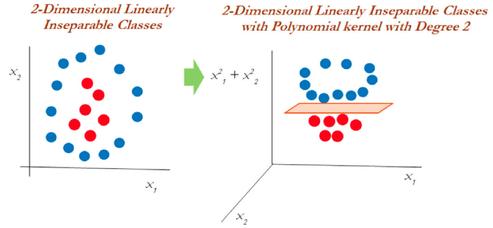
```

En datos bidimensionales, el núcleo polinomial de segundo grado se aplica utilizando un plano lineal después de transformarlo a dimensiones superiores.

## El truco del Kernel

Las funciones Kernel son métodos con los que se utilizan clasificadores lineales como *SVM* para clasificar puntos de datos separables no linealmente. Esto se hace representando los puntos de datos en un espacio de mayor dimensión que su original. Por ejemplo, los datos 1D se pueden representar como datos 2D en el espacio, los datos 2D se pueden representar como datos 3D, etcétera.

El truco del kernel ofrece una **forma de calcular las relaciones entre los puntos de datos** utilizando funciones del kernel y representar los datos de una manera más eficiente con menos cómputo. Los modelos que utilizan esta técnica se denominan **"modelos kernelizados"**.

```{r, fig.align='center', out.height='500pt', out.width='700pt',echo=F}
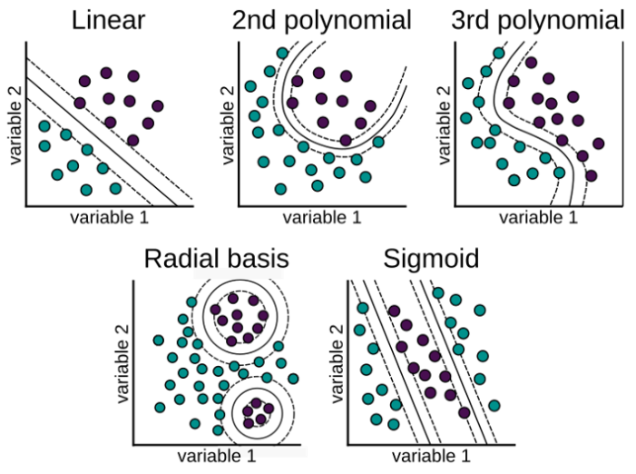
```

Hay varias funciones que utiliza SVM para realizar esta tarea. Algunos de los más comunes son:

1. **El núcleo lineal:** Se utiliza para datos lineales. Esto simplemente representa los puntos de datos usando una relación lineal.

$$K(x, y)=(x^T \cdot y)$$
$$f(x)=w^T \cdot x + b$$
Esta formulación se presenta como solución al problema de optimización sobre w:

$$min_{w\in R^d} \frac{1}{2}\parallel w \parallel ^2+ C\sum_{i}^{N}{max(0, 1-y_i f(x_i))}$$
$$s.a. \quad y_i f(x_i) \geq 1 - max(0, 1-y_i f(x_i))$$
En donde $1-y_i f(x_i)$ es la distancia de $x_i$ al correspondiente margen de la clase si $x_i$ se encuentra en el lado equivocado del margen y cero en caso contrario. De esta forma, los puntos que se encuentran lejos del margen del lado equivocado obtendrán una mayor penalización. Dar click en la siguiente [liga](https://towardsdatascience.com/support-vector-machines-soft-margin-formulation-and-kernel-trick-4c9729dc8efe) para mayor entendimiento del problema de optimización.


2. **Función de núcleo polinomial:** Transforma los puntos de datos mediante el **uso del producto escalar** y la transformación de los datos en una "dimensión *n*", *n* podría ser cualquier valor de 2, 3, etcétera, es decir, la transformación será un producto al cuadrado o superior. Por lo tanto, representar datos en un espacio de mayor dimensión utilizando los nuevos puntos transformados.

$$K(x, y)=(c+ x^T \cdot y)^p$$

Cuando se emplea $p=1$ y $c=0$, el resultado es el mismo que el de un kernel lineal. Si $p>1$, se generan límites de decisión no lineales, aumentando la no linealidad a medida que aumenta *p*. No suele ser recomendable emplear valores de *p* mayores 5 por problemas de **overfitting**.

```{r, fig.align='center', out.height='400pt', out.width='400pt',echo=F}
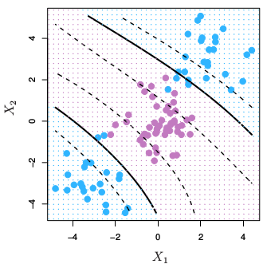
```

3. **La función de base radial (RBF):** Esta función se comporta como un "modelo de vecino más cercano ponderado". Transforma los datos representándolos en dimensiones infinitas,

La función Radial puede ser de Gauss o de Laplace. Esto depende de un hiperparámetro conocido como gamma $\gamma$. Cuanto menor sea el valor del hiperparámetro, menor será el sesgo y mayor la varianza. Mientras que un valor más alto de hiperparámetro da un sesgo más alto y menor varianza. Este es el núcleo más utilizado.

$$K(x, y)=exp(-\gamma \parallel x - y\parallel^2)=exp(-\frac{\parallel x-y \parallel ^2}{2\sigma²})$$
$$f(x)=w^T \cdot \phi(x) + b$$
Se realiza un mapeo de x a $\phi(x)$ en donde los datos son separables

```{r, fig.align='center', out.height='400pt', out.width='400pt',echo=F}
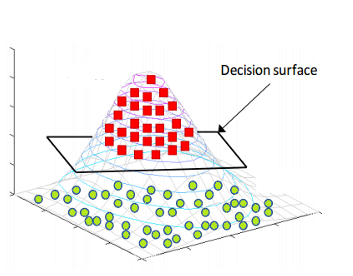
```

Es recomendable probar el kernel **RBF**. Este kernel tiene dos ventajas: que solo tiene dos hiperparámetros que optimizar ($\gamma$ y la penalización $C$ común a todos los SVM) y que su flexibilidad puede ir desde un clasificador lineal a uno muy complejo.

4. **La función sigmoide:** También conocida como función tangente hiperbólica (Tanh), encuentra más aplicación en redes neuronales como función de activación. Esta función mapea los valores de entrada al intervalo [-1, 1].

$$K(x, y)= tanh(\kappa x\cdot y-\delta)$$

**¿Por qué se llama un "truco del kernel"?**

*SVM* vuelve a representar los puntos de datos no lineales utilizando cualquiera de las funciones del kernel de una manera que parece que los datos se han transformado, luego encuentra el hiperplano de separación óptimo, sin embargo, en realidad, **los puntos de datos siguen siendo los mismos**, en realidad no se han transformado. Es por eso que se llama un 'truco del kernel'.


## Support Vector Regression

El problema de la regresión es encontrar una función que aproxime la relación de un dominio de datos de entrada a números reales con base en una muestra de entrenamiento. Veamos cómo funciona SVR en realidad.

```{r, fig.align='center', out.height='400pt', out.width='400pt',echo=F}
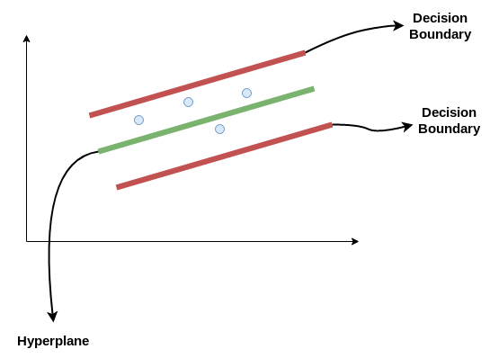
```

Consideremos las dos líneas rojas como el límite de decisión y la línea verde como el hiperplano. Nuestro objetivo, cuando avanzamos con SVR, es básicamente **considerar los puntos que están dentro de la línea límite de decisión**. Nuestra línea de mejor ajuste es el hiperplano que tiene un número máximo de puntos.

Lo primero que entenderemos será el límite de decisión. Consideremos estas líneas como si estuvieran a cualquier distancia, digamos 'a', del hiperplano. Entonces, estas son las líneas que dibujamos a la distancia '+a' y '-a' del hiperplano. Esta 'a' en el texto se conoce básicamente como épsilon y **representa el margen**.

Suponiendo que la ecuación del hiperplano es la siguiente:

$$Y_i = W^TX + b$$
Entonces estas ecuaciones se transforman en la siguiente forma:

* $W^TX + b = +a$

* $W^TX + b = -a$

Por lo tanto, cualquier hiperplano que satisfaga nuestra SVR debería satisfacer: $-a < Y- WX+b < +a$

Nuestro objetivo principal aquí es **decidir un límite de decisión a una distancia 'a' del hiperplano original**, de modo que los puntos de datos más cercanos al hiperplano o los vectores de soporte estén dentro de esa línea límite.

::: {.infobox .note data-latex="{note}"}

Vamos a tomar solo aquellos puntos que están dentro del límite de decisión y tienen la menor tasa de error, o están dentro del margen de tolerancia. Esto nos da un mejor modelo de ajuste.

:::


## Ventajas y desventajas

**Ventajas**

* Es un modelo que ajusta bien con pocos datos

* Son flexibles en datos no estructurados, estructurados y semiestructurados.

* La función Kernel alivia las complejidades en casi cualquier tipo de datos.

* Se observa menos sobreajuste en comparación con otros modelos.

**Desventajas**

* El tiempo de entrenamiento es mayor cuando se calculan grandes conjuntos de datos.

* Los hiperparámetros suelen ser un desafío al interpretar su impacto.

* La interpretación general es difícil (black box).


## Ajuste del modelo con Python

Usaremos las recetas antes implementadas para ajustar tanto el modelo de regresión como el de clasificación. Exploraremos un conjunto de hiperparámetros para elegir el mejor modelo.

Recordemos los pasos a seguir al ajustar un modelo

1. Separación inicial de datos ( test, train <KFCV> )
2. Pre-procesamiento e ingeniería de variables
3. Selección de tipo de modelo con hiperparámetros iniciales
4. Inicialización de workflow o pipeline
5. Creación de grid search
6. **Entrenamiento de modelos con hiperparámetros definidos** (salvar los modelos entrenados)
7. Análisis de métricas de error e hiperparámetros (Vuelve al paso 3, si es necesario)
8. Selección de modelo a usar
9. Ajuste de modelo final con todos los datos (Vuelve al paso 2, si es necesario)
10. Validar poder predictivo con datos de prueba.

### Implementación de SVR en Python

A continuación, revisaremos paso por paso este procedimiento usando SVM como modelo. Los datos corresponden a nuestro ya conocido problema predictivo de precio de casas. Se puede encontrar los datos y documentación en el siguiente [enlace]()

**Paso 1: Separación inicial de datos ( test, train <KFCV> )**
```{python, warning=FALSE,message=FALSE}
from scipy.stats import randint, loguniform, uniform
from sklearn.inspection import permutation_importance
from sklearn.model_selection import KFold, RandomizedSearchCV, StratifiedKFold, train_test_split
from sklearn.svm import SVC, SVR

from dsml_utils import (
    best_cv_results,
    classification_metrics,
    load_ames,
    load_telco,
    make_ames_pipeline,
    make_telco_pipeline,
    pr_curve_table,
    regression_metrics,
    roc_curve_table,
)

ames = load_ames()
ames_train, ames_test = train_test_split(ames, train_size=0.75, random_state=4595)
X_ames_train = ames_train.drop(columns="Sale_Price")
y_ames_train = ames_train["Sale_Price"]
X_ames_test = ames_test.drop(columns="Sale_Price")
y_ames_test = ames_test["Sale_Price"]
ames_folds = KFold(n_splits=5, shuffle=True, random_state=4595)
```

Contando con datos de entrenamiento, procedemos a realizar el feature engineering para extraer las mejores características que permitirán realizar las estimaciones en el modelo.

**Paso 2: Pre-procesamiento e ingeniería de variables**

```{python, warning=FALSE,message=FALSE}
receta_casas = make_ames_pipeline(SVR(kernel="rbf"), scale_numeric=True)
receta_casas
```

Recordemos que un **Pipeline** contiene los pasos a seguir; usamos **fit()** para estimar transformaciones y modelo, y **transform()** o **predict()** para aplicarlo a nuevos datos.

Una vez que la transformación de datos está lista, procedemos a implementar el pipeline del modelo de interés. En `scikit-learn`, los kernels equivalentes se especifican en `SVR` o `SVC`:

* Base lineal: `SVR(kernel="linear")`
* Base polinomial: `SVR(kernel="poly")`
* Base radial: `SVR(kernel="rbf")`

**Paso 3: Selección de tipo de modelo con hiperparámetros iniciales**
```{python, warning=FALSE,message=FALSE}
svm_model = SVR(kernel="rbf")
svm_model
```

**Paso 4: Inicialización de workflow o pipeline**
```{python, warning=FALSE,message=FALSE}
svm_workflow = make_ames_pipeline(svm_model, scale_numeric=True)
svm_workflow
```

**Paso 5: Creación de grid search**
```{python, warning=FALSE,message=FALSE}
svm_param_distributions = {
    "model__C": loguniform(1e-1, 1e2),
    "model__gamma": loguniform(1e-4, 1e0),
    "model__epsilon": uniform(0.01, 0.50),
}
svm_param_distributions
```

**Paso 6: Entrenamiento de modelos con hiperparámetros definidos**
```{python, warning=FALSE,message=FALSE, eval=FALSE}
svm_tune_result = RandomizedSearchCV(
    svm_workflow,
    param_distributions=svm_param_distributions,
    n_iter=50,
    cv=ames_folds,
    scoring="neg_mean_absolute_percentage_error",
    random_state=123,
    n_jobs=-1,
)
svm_tune_result.fit(X_ames_train, y_ames_train)

import joblib
joblib.dump(svm_tune_result, "models/svm_model_reg.joblib")
```

Podemos obtener las métricas de cada *fold* con el siguiente código:

```{python}
svm_tune_result = RandomizedSearchCV(
    svm_workflow,
    param_distributions=svm_param_distributions,
    n_iter=20,
    cv=ames_folds,
    scoring="neg_mean_absolute_percentage_error",
    random_state=123,
    n_jobs=-1,
)
svm_tune_result.fit(X_ames_train, y_ames_train)
pd.DataFrame(svm_tune_result.cv_results_).head()
```

**Paso 7: Análisis de métricas de error e hiperparámetros (Vuelve al paso 3, si es necesario)**
```{python}
best_cv_results(svm_tune_result, n=10)
```

En la siguiente gráfica observamos las distintas métricas de error asociados a los hiperparámetros elegidos:

```{python}
svm_results = pd.DataFrame(svm_tune_result.cv_results_)
ax = svm_results.plot.scatter(x="param_model__C", y="mean_test_score", logx=True)
_artist = plt.title("Desempeño por C")
```

```{python}
best_cv_results(svm_tune_result, n=10)
```

**Paso 8: Selección de modelo a usar**
```{python}
# Selección del mejor modelo según MAPE.
svm_regression_best_model = svm_tune_result.best_params_
svm_regression_best_model
```


```{python}
# Aproximación práctica al criterio 1-SE: preferir C menor entre modelos cercanos al mejor.
best_score = svm_tune_result.best_score_
std_score = svm_results.loc[svm_tune_result.best_index_, "std_test_score"]
svm_regression_best_1se_model = (
    svm_results.query("mean_test_score >= @best_score - @std_score")
    .sort_values("param_model__C")
    .iloc[0]
    .filter(like="param_")
)
svm_regression_best_1se_model
```

**Paso 9: Ajuste de modelo final con todos los datos (Vuelve al paso 2, si es necesario)**
```{python}
# Modelo final.
svm_regression_final_model = svm_tune_result.best_estimator_
svm_regression_final_model
```

Como hemos hablado anteriormente, este último objeto es el modelo final entrenado, el cual contiene toda la información del pre-procesamiento de datos, por lo que en caso de ponerse en producción el modelo, sólo se necesita de este último elemento para poder realizar nuevas predicciones.

Antes de pasar al siguiente paso, es importante validar que hayamos hecho un uso correcto de las variables predictivas. En este momento es posible detectar variables que no estén aportando valor o variables que no debiéramos estar usando debido a que cometeríamos [data leakage](https://towardsdatascience.com/data-leakage-in-machine-learning-6161c167e8ba). Para enfrentar esto, ayuda estimar y ordenar el valor de importancia del modelo

```{python, eval=FALSE}
ames_importance_result = permutation_importance(
    svm_regression_final_model,
    X_ames_test,
    y_ames_test,
    scoring="neg_root_mean_squared_error",
    n_repeats=10,
    random_state=123,
)
```

```{python}
ames_importance_result = permutation_importance(
    svm_regression_final_model,
    X_ames_test,
    y_ames_test,
    scoring="neg_root_mean_squared_error",
    n_repeats=5,
    random_state=123,
)
ames_importance = (
    pd.DataFrame(
        {
            "Variable": X_ames_test.columns,
            "Importance": ames_importance_result.importances_mean,
            "StDev": ames_importance_result.importances_std,
        }
    )
    .sort_values("Importance", ascending=False)
    .head(20)
)
display(ames_importance)

ax = ames_importance.sort_values("Importance").plot.barh(
    x="Variable", y="Importance", xerr="StDev", legend=False, figsize=(8, 6)
)
_artist = ax.set_title("Variable Importance Measure")
```

**Paso 10: Validar poder predictivo con datos de prueba**

Imaginemos por un momento que pasa un mes de tiempo desde que hicimos nuestro modelo, es hora de ponerlo a prueba prediciendo valores de nuevos elementos:

```{python}
# Predicciones
results = pd.DataFrame(
    {
        "Sale_Price": y_ames_test.to_numpy(),
        "pred_svm_reg": svm_regression_final_model.predict(X_ames_test),
    }
)
results.head()
```

```{python}
regression_metrics(results["Sale_Price"], results["pred_svm_reg"])
```

Es posible definir nuestro propio conjunto de metricas que deseamos reportar creando este objeto:

```{python}
regression_metrics(results["Sale_Price"], results["pred_svm_reg"]).assign(
    estimate=lambda x: x["estimate"].round(2)
)
```

```{python}
_artist = plt.scatter(results["pred_svm_reg"], results["Sale_Price"], alpha=0.6)
lims = [results[["pred_svm_reg", "Sale_Price"]].min().min(), results[["pred_svm_reg", "Sale_Price"]].max().max()]
_artist = plt.plot(lims, lims, color="red")
_artist = plt.xlabel("Prediction")
_artist = plt.ylabel("Observation")
_artist = plt.title("Comparison")
```


### Implementación de SVM en Python

Es turno de revisar la implementación de SVM con nuestro bien conocido problema de predicción de cancelación de servicios de telecomunicaciones. Los datos se encuentran disponibles en el siguiente [enlace](https://drive.google.com/drive/folders/1mlDGHvUy-81qfvQi_iB7tqMb9yhy3vyh?usp=sharing):

Los pasos para implementar en *Python* este modelo predictivo son los mismos, cambiando únicamente las especificaciones del tipo de modelo, pre-procesamiento e hiper-parámetros.

```{python, warning=FALSE, message=FALSE}
telco = load_telco("data/Churn.csv")
telco.info()
telco.head()
```

**Paso 1: Separación inicial de datos ( test, train <KFCV> )**

```{python}
telco_train, telco_test = train_test_split(
    telco,
    train_size=0.70,
    random_state=1234,
    stratify=telco["Churn"],
)
X_telco_train = telco_train.drop(columns="Churn")
y_telco_train = telco_train["Churn"]
X_telco_test = telco_test.drop(columns="Churn")
y_telco_test = telco_test["Churn"]
telco_folds = StratifiedKFold(n_splits=5, shuffle=True, random_state=1234)
telco_folds
```

**Paso 2: Pre-procesamiento e ingeniería de variables**

```{python}
telco_rec = make_telco_pipeline(SVC(kernel="rbf", probability=True, random_state=1352))
telco_rec
```

**Paso 3: Selección de tipo de modelo con hiperparámetros iniciales**
```{python}
svm_class_model = SVC(kernel="rbf", probability=True, random_state=1352)
svm_class_model
```

**Paso 4: Inicialización de workflow o pipeline**
```{python}
svm_class_workflow = make_telco_pipeline(svm_class_model)
svm_class_workflow
```


**Paso 5: Creación de grid search**
```{python}
svm_class_param_distributions = {
    "model__C": loguniform(1e-1, 1e2),
    "model__gamma": loguniform(1e-4, 1e0),
}
svm_class_param_distributions
```

**Paso 6: Entrenamiento de modelos con hiperparámetros definidos**
```{python, warning=FALSE, message=FALSE, eval=FALSE}
svm_tune_class_result = RandomizedSearchCV(
    svm_class_workflow,
    param_distributions=svm_class_param_distributions,
    n_iter=50,
    cv=telco_folds,
    scoring="roc_auc",
    random_state=123,
    n_jobs=-1,
)
svm_tune_class_result.fit(X_telco_train, y_telco_train)
```

```{python}
svm_tune_class_result = RandomizedSearchCV(
    svm_class_workflow,
    param_distributions=svm_class_param_distributions,
    n_iter=20,
    cv=telco_folds,
    scoring="roc_auc",
    random_state=123,
    n_jobs=-1,
)
svm_tune_class_result.fit(X_telco_train, y_telco_train)
pd.DataFrame(svm_tune_class_result.cv_results_).head()
```

**Paso 7: Análisis de métricas de error e hiperparámetros (Vuelve al paso 3, si es necesario)**
```{python}
best_cv_results(svm_tune_class_result, n=10)
```

En la siguiente gráfica observamos las distintas métricas de error asociados a los hiperparámetros elegidos.

```{python}
svm_class_results = pd.DataFrame(svm_tune_class_result.cv_results_)
_artist = svm_class_results.plot.scatter(x="param_model__C", y="mean_test_score", logx=True)
_artist = plt.title("ROC AUC por C")
best_cv_results(svm_tune_class_result, n=10)
```

**Paso 8: Selección de modelo a usar**
```{python}
# Selección del mejor modelo según ROC AUC.
svm_classification_best_model = svm_tune_class_result.best_params_
svm_classification_best_model
```

```{python}
# Aproximación al criterio 1-SE para clasificación.
best_score = svm_tune_class_result.best_score_
std_score = svm_class_results.loc[svm_tune_class_result.best_index_, "std_test_score"]
svm_classification_best_1se_model = (
    svm_class_results.query("mean_test_score >= @best_score - @std_score")
    .sort_values("param_model__C")
    .iloc[0]
    .filter(like="param_")
)
svm_classification_best_1se_model
```

**Paso 9: Ajuste de modelo final con todos los datos (Vuelve al paso 2, si es necesario)**

```{python}
# Modelo final.
svm_classification_final_model = svm_tune_class_result.best_estimator_
svm_classification_final_model
```

Como hemos hablado anteriormente, este último objeto es el modelo final entrenado, el cual contiene toda la información del pre-procesamiento de datos, por lo que en caso de ponerse en producción el modelo, sólo se necesita de este último elemento para poder realizar nuevas predicciones.

Antes de pasar al siguiente paso, es importante validar que hayamos hecho un uso correcto de las variables predictivas. En este momento es posible detectar variables que no estén aportando valor o variables que no debiéramos estar usando debido a que cometeríamos [data leakage](https://towardsdatascience.com/data-leakage-in-machine-learning-6161c167e8ba). Para enfrentar esto, ayuda estimar y ordenar el valor de importancia del modelo.

```{python, eval=FALSE}
churn_importance_result = permutation_importance(
    svm_classification_final_model,
    X_telco_test,
    y_telco_test,
    scoring="roc_auc",
    n_repeats=10,
    random_state=123,
)
```

```{python}
churn_importance_result = permutation_importance(
    svm_classification_final_model,
    X_telco_test,
    y_telco_test,
    scoring="roc_auc",
    n_repeats=5,
    random_state=123,
)
churn_importance = (
    pd.DataFrame(
        {
            "Variable": X_telco_test.columns,
            "Importance": churn_importance_result.importances_mean,
            "StDev": churn_importance_result.importances_std,
        }
    )
    .sort_values("Importance", ascending=False)
)
display(churn_importance.head(20))

ax = churn_importance.sort_values("Importance").tail(20).plot.barh(
    x="Variable", y="Importance", xerr="StDev", legend=False, figsize=(8, 6)
)
_artist = ax.set_title("Variable Importance Measure")
```

**Paso 10: Validar poder predictivo con datos de prueba**

Imaginemos por un momento que pasa un mes de tiempo desde que hicimos nuestro modelo, es hora de ponerlo a prueba prediciendo valores de nuevos elementos:

```{python}
# Predicciones
proba = svm_classification_final_model.predict_proba(X_telco_test)
classes = svm_classification_final_model.named_steps["model"].classes_
results_cla = pd.DataFrame({f".pred_{label}": proba[:, i] for i, label in enumerate(classes)})
results_cla["truth"] = y_telco_test.to_numpy()

results_cla.head()
```

```{python}
roc_curve_data = roc_curve_table(results_cla["truth"], results_cla[".pred_Yes"])
pr_curve_data = pr_curve_table(results_cla["truth"], results_cla[".pred_Yes"])

fig, axes = plt.subplots(1, 2, figsize=(10, 4))
_artist = axes[0].plot(1 - roc_curve_data["specificity"], roc_curve_data["sensitivity"], color="lightblue")
_artist = axes[0].plot([0, 1], [0, 1], color="black", linewidth=1)
_artist = axes[0].set_title("ROC Curve")
_artist = axes[0].set_xlabel("1 - specificity")
_artist = axes[0].set_ylabel("sensitivity")

_artist = axes[1].plot(pr_curve_data["recall"], pr_curve_data["precision"], color="lightblue")
_artist = axes[1].set_title("Precision vs Recall")
_artist = axes[1].set_xlabel("recall")
_artist = axes[1].set_ylabel("precision")
plt.tight_layout()
```

Pueden usar la app de [shiny](https://acturio.shinyapps.io/confusion_matrix/?_ga=2.157345976.322506426.1653670259-130075619.1646374742) que nos permite jugar con el treshold de clasificación para tomar la mejor decisión.

## Ejercicios

1. Crear un workflow de principio a fin usando SVM con kernel lineal

2. Crear un workflow de principio a fin usando SVM con kernel polinomial

3. Crear un workflow de principio a fin usando SVR con kernel lineal

4. Crear un workflow de principio a fin usando SVR con kernel polinomial

5. Comparar resultados con ejercicio desarrollado en clase


# Bagging & Boosting

El *bagging o agregación bootstrap*, **es un método de aprendizaje por conjuntos que se usa comúnmente para reducir la varianza dentro de un conjunto de datos ruidoso**. En este método, se selecciona una muestra aleatoria de datos en un conjunto de entrenamiento con reemplazo, lo que significa que los puntos de datos individuales se pueden elegir más de una vez. Después de generar varias muestras de datos, estos modelos se entrenan de forma independiente y, según el tipo de tarea (regresión o clasificación), el promedio o la mayoría de esas predicciones producen una estimación más precisa.

```{r echo=FALSE,fig.align='center', out.height='500pt', out.width='900pt'}
knitr::include_graphics("img/05-bagging/bagging.jpeg")
```

**Nota:** El algoritmo de bosque aleatorio se considera una extensión del método de bagging, utilizando tanto bagging como la aleatoriedad de características para crear un bosque no correlacionado de árboles de decisión.


## Aprendizaje conjunto

El aprendizaje conjunto da crédito a la idea de la “sabiduría de las multitudes”, lo que sugiere que **la toma de decisiones de un grupo más grande de individuos (modelos) suele ser mejor que la de un individuo.**

El aprendizaje en conjunto **es un grupo (o conjunto) de individuos o modelos, que trabajan colectivamente para lograr una mejor predicción final**. Un solo modelo, también conocido como aprendiz básico puede no funcionar bien individualmente debido a una gran variación o un alto sesgo, sin embargo, cuando se agregan individuos débiles, pueden formar un individuo fuerte, ya que su combinación reduce el sesgo o la varianza, lo que produce un mejor rendimiento del modelo.

```{r echo=FALSE,fig.align='center', out.height='350pt', out.width='600pt'}

```

Los métodos de conjunto se ilustran con frecuencia utilizando árboles de decisión, ya que este algoritmo puede ser propenso a sobreajustar (alta varianza y bajo sesgo) y también puede prestarse a desajuste (baja varianza y alto sesgo) cuando es muy pequeño, como un árbol de decisión con un nivel.

**Nota:** Cuando un algoritmo se adapta o no se adapta a su conjunto de entrenamiento, no se puede generalizar bien a nuevos conjuntos de datos, por lo que se utilizan métodos de conjunto para contrarrestar este comportamiento y permitir la generalización del modelo a nuevos conjuntos de datos.

## Bagging vs. boosting

*Bagging* y el *boosting (refuerzo o impulso)* son dos tipos principales de métodos de aprendizaje por conjuntos. La principal diferencia entre estos métodos de aprendizaje es la forma en que se capacitan.

En **_bagging_, los modelos se entrenan en paralelo, pero en el _boosting_, aprenden secuencialmente.** Esto significa que se construyen una serie de modelos y con cada nueva iteración del modelo, se incrementan los pesos de los datos clasificados erróneamente en el modelo anterior. Esta redistribución de pesos ayuda al algoritmo a identificar los parámetros en los que necesita enfocarse para mejorar su desempeño.

```{r echo=FALSE,fig.align='center', out.height='350pt', out.width='600pt'}
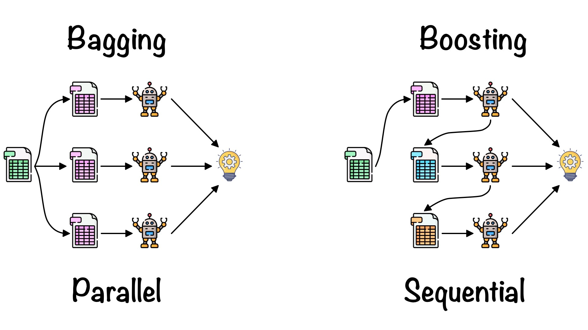
```

Un ejemplo de modelo secuencial es: **Adaboost** y significa "algoritmo de boosting adaptativo", es uno de los algoritmos de boosting más populares, ya que fue uno de los primeros de su tipo. Otros tipos de algoritmos de booting incluyen **XGBoost**, *GradientBoost* y *BrownBoost*.

Otra diferencia en la que difieren *bagging* y *boosting* son los escenarios en los que se utilizan. Por ejemplo, los métodos de *bagging* se utilizan típicamente en modelos débiles que exhiben alta varianza y bajo sesgo, mientras que los métodos de *boosting* se aprovechan cuando se observa baja varianza y alto sesgo.

::: {.infobox .note data-latex="{note}"}
**¡¡ RECORDAR !!**

Bagging realiza replicaciones bootstrap y ajusta un árbol a cada muestra de manera independiente, mientras que boosting ajusta un árbol a una versión modificada del conjunto original de datos, la cual se modifica en cada iteración de entrenamiento.
:::

### Error Out-Of-Bag

Este error es conocido como "OOB". Se trata de un enfoque distinto a KFCV en donde el error predictivo es calculado a través de los elementos que **no fueron seleccionados** en la muestra bootstrap. Recordemos que en las muestras bootstrap algunos elementos son seleccionados más de una vez, mientras que otros no aparecen en la muestra. Empíricamente, en cada replicación bootstrap se observan 2/3 partes de la muestra y el resto queda "fuera de la bolsa" (OOB) de entrenamiento.

Si **B** es el número de replicaciones bootstrap, entonces cada observación *i* recibe cerca de B/3 predicciones, las cuales son usadas para estimar el error predictivo. Para obtener una única predicción en cada observación, las B/3 predicciones son promediadas.

## Algoritmo Bagging

1. **Bootstrapping**: *Bagging* aprovecha una técnica de muestreo de *bootstrapping* para crear muestras diversas. Este método de remuestreo genera diferentes subconjuntos a partir del conjunto de datos de entrenamiento original seleccionando puntos de datos al azar y con reemplazo. Esto significa que cada vez que selecciona un punto del conjunto de entrenamiento, puede seleccionar la misma instancia varias veces. Como resultado, un valor se repite dos veces (o más) en una muestra y algunos no aparecen.

2. **Entrenamiento paralelo**: estos ejemplos de *bootstrap* se entrenan de forma independiente y en paralelo entre sí utilizando modelos débiles o básicos.

3. **Agregación**: Finalmente, dependiendo de la tarea (regresión o clasificación), se toma un promedio o la mayoría de las predicciones para calcular una estimación más precisa. En el caso de la regresión, se toma un promedio de todos los resultados predichos por los clasificadores individuales; esto se conoce como **votación suave**.

Para problemas de clasificación, se acepta la clase con mayor mayoría de votos; esto se conoce como **votación en firme o votación por mayoría**.

### Ventajas y desventajas de bagging

Hay una serie de ventajas y desventajas clave que presenta el método de bagging cuando se usa para problemas de clasificación o regresión.

**Ventajas**

* **Facilidad de implementación**: las bibliotecas de *Python* como `scikit-learn` facilitan la combinación de las predicciones de los aprendices o estimadores base para mejorar el rendimiento del modelo.

* **Reducción de varianza**: bagging puede reducir la varianza dentro de un algoritmo de aprendizaje. Esto es particularmente útil con datos de alta dimensión, donde los valores faltantes pueden conducir a una mayor varianza, lo que los hace más propensos a sobreajustarse y evitar la generalización precisa a nuevos conjuntos de datos.


**Desventajas**

* **Pérdida de interpretabilidad**: es difícil obtener información empresarial muy precisa a través del bagging debido al promedio involucrado en las predicciones. Si bien el resultado es más preciso que cualquier punto de datos individual, un conjunto de datos más exacto o completo también podría producir más precisión dentro de un solo modelo de clasificación o regresión.

* **Computacionalmente costoso**: *bagging* se ralentiza y se vuelve más intensivo a medida que aumenta el número de iteraciones. Por lo tanto, no es adecuado para aplicaciones en tiempo real. Los sistemas agrupados o una gran cantidad de núcleos de procesamiento son ideales para crear rápidamente conjuntos en bolsas en conjuntos de prueba grandes.

* **Menos flexible**: como técnica, *bagging* funciona particularmente bien con algoritmos que son menos estables. Uno que sea más estable o esté sujeto a grandes cantidades de sesgo no proporciona tanto beneficio ya que hay menos variación dentro del conjunto de datos del modelo.

### Aplicaciónes de Bagging

La técnica de *bagging* se utiliza en una gran cantidad de industrias, proporcionando información sobre el valor del mundo real y perspectivas interesantes. Los casos de uso clave incluyen:

* **TI**: *bagging* también puede mejorar la precisión y exactitud en los sistemas de TI, como los sistemas de detección de intrusiones en la red.

* **Medio ambiente**: los métodos de conjunto, como bagging, se han aplicado en el campo de la teledetección (técnica de adquisición de datos de la superficie terrestre desde sensores instalados en plataformas espaciales).

* **Finanzas**: *bagging* también se ha aprovechado con modelos de aprendizaje profundo en la industria financiera, automatizando tareas críticas, incluida la detección de fraudes, evaluaciones de riesgo crediticio y problemas de precios de opciones.


### Implementación en *Python*

```{python, warning=FALSE, message=FALSE}
from sklearn.linear_model import LinearRegression
from sklearn.utils import resample

ames = load_ames()
rng = np.random.default_rng(20211212)
boot_indices = [
    rng.choice(ames.index, size=len(ames), replace=True)
    for _ in range(500)
]
```


```{python}
# Se entrena un modelo para cada muestra.
coef_rows = []
for sample_id, idx in enumerate(boot_indices, start=1):
    sample = ames.loc[idx]
    X_boot = pd.DataFrame(
        {
            "log10_Gr_Liv_Area": np.log10(sample["Gr_Liv_Area"]),
            "Full_Bath": sample["Full_Bath"],
            "Year_Built": sample["Year_Built"],
        }
    )
    y_boot = sample["Sale_Price"]
    lm_boot = LinearRegression(fit_intercept=False).fit(X_boot, y_boot)
    coef_rows.extend(
        {"sample": sample_id, "term": term, "estimate": estimate}
        for term, estimate in zip(X_boot.columns, lm_boot.coef_)
    )

ames_coefs = pd.DataFrame(coef_rows)
ames_coefs.head()
```

```{python, message=FALSE, warning=FALSE}
# Evaluación de resultados.
terms = ames_coefs["term"].unique()
fig, axes = plt.subplots(1, len(terms), figsize=(5 * len(terms), 4))
for ax, term in zip(axes, terms):
    _artist = ax.hist(ames_coefs.loc[ames_coefs["term"].eq(term), "estimate"], color="lightblue")
    _artist = ax.set_title(term)
    _artist = ax.set_xlabel("estimate")
plt.tight_layout()

```


## Algoritmo Boosting

Tradicionalmente, la construcción de una aplicación de aprendizaje automático consistía en tomar un solo estimador, es decir:

* Un regresor logístico
* Un árbol de decisión
* Una máquina de vectores de soporte
* Una red neuronal artificial

Para posteriormente ser entrenado por un conjunto de datos.

Luego nacieron los **métodos de conjunto**, los cuales pueden describirse como **técnicas que utilizan un grupo de modelos "débiles" juntos, con el fin de crear uno más fuerte y agregado**.

El *Boosting* consiste en la idea de filtrar o **ponderar los datos** que se utilizan para capacitar a nuestro conjunto de modelos "débiles", para que **cada nuevo modelo pondere o "solo se entrene" con observaciones que han sido mal clasificadas por los anteriores modelos.**


```{r echo=FALSE,fig.align='center', out.height='400pt', out.width='800pt'}
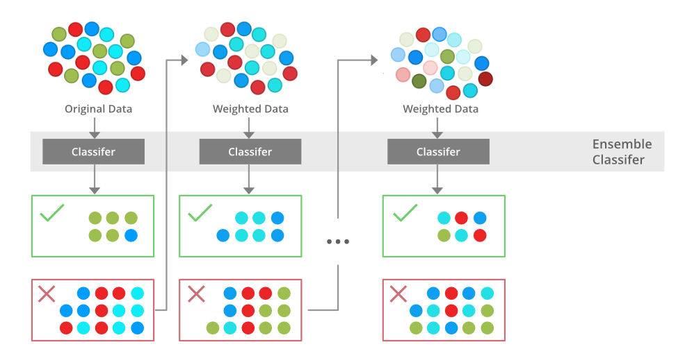
```


Al hacer esto, nuestro conjunto de modelos aprende a hacer predicciones precisas sobre todo tipo de datos, no solo sobre las observaciones más comunes o fáciles. Además, si uno de los modelos individuales es muy malo para hacer predicciones sobre algún tipo de observación, no importa, ya que los otros $N - 1$ modelos  probablemente lo compensarán.


```{r echo=FALSE,fig.align='center', out.height='250pt', out.width='600pt'}
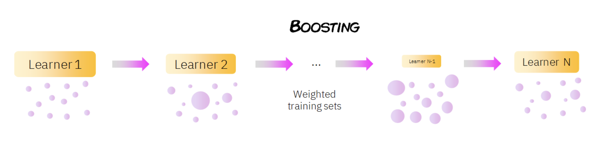
```

Como se puede ver en la imagen anterior, en *boosting* el conjunto de datos se pondera (representado por los diferentes tamaños de los datos), de modo que las observaciones que fueron clasificadas incorrectamente por el clasificador $n$ reciben más importancia en el entrenamiento del modelo $n + 1$. En general, **los métodos de conjunto reducen el sesgo y la varianza de nuestros modelos de aprendizaje automático**.

::: {.infobox .note data-latex="{note}"}
**¡¡ RECORDAR !!**

Los modelos bootstrap buscan aprender lentamente patrones relevantes a lo largo de muchas iteraciones, de forma que se vaya haciendo un ajuste lento pero preciso.
:::

El proceso de entrenamiento depende del algoritmo *boosting* que estemos usando *(Adaboost, LigthGBM, XGBoost, $\dots$)*, pero generalmente sigue este patrón:

1. Todas las muestras de datos comienzan con los mismos pesos. Estas muestras se utilizan para entrenar un modelo individual (digamos un árbol de decisión).

2. Se calcula el error de predicción para cada muestra, **aumentando los pesos de aquellas muestras que han tenido un error mayor**, para hacerlas más importantes para el entrenamiento del siguiente modelo individual.

3. Dependiendo de qué tan bien le fue a este modelo individual en sus predicciones, se le asigna una importancia/peso.

4. Los datos ponderados se pasan al modelo posterior y se repiten lo pasos 2) y 3). Este paso se repite hasta que se haya alcanzado un cierto número de modelos o hasta que el error esté por debajo de un cierto umbral.

```{r echo=FALSE,fig.align='center', out.height='350pt', out.width='600pt'}
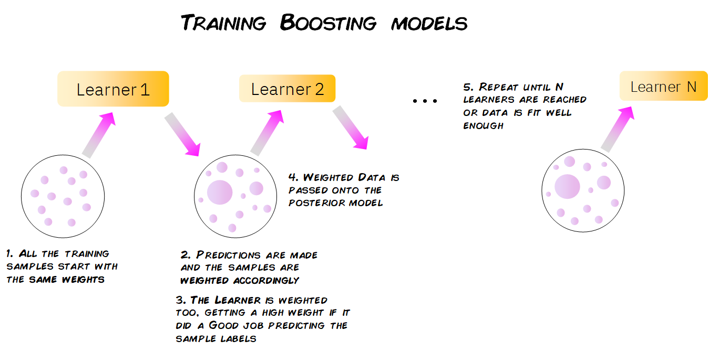
```

En algunos casos, los modelos de *boosting* se entrenan con un peso fijo específico para cada modelo (llamado tasa de aprendizaje) y en lugar de dar a cada muestra un peso individual, los modelos se entrenan tratando de predecir las diferencias entre las predicciones anteriores en las muestras y los valores reales de la variable objetivo. Esta diferencia es conocida como residuales.

La forma de ajustar el modelo sigue los siguientes pasos:

1. Se fija $\hat{f}(x)=0$ y $r_i=y_i$ para todos los elementos del conjunto de entrenamiento

2. Para $b=1,2,...,B$, repetir:

  a) Ajustar un árbol $\hat{f}^b$ al conjunto de entrenamiento $(X, r)$

  b) Actualizar el ajuste $\hat{f}(x)$ al añadir una nueva versión restringida de un nuevo árbol:

 $$\hat{F}_b(X) \leftarrow \hat{F}_{b-1}(X) + \alpha_b\hat{h}_b(X, r_{b-1})$$
  c) Actualizar los residuos:

 $$r_b \leftarrow r_{b-1} - \alpha_b\hat{f}^b(x_i)$$

3. Resultado del modelo *Boosting*:

$$\hat{F}=\sum_{b=1}^{B}\alpha_b\hat{F}_b(x)$$
Para calcular $\alpha_b$ en cada iteración, se usa la siguiente fórmula:

$$\underset{\alpha}{\operatorname{argmin}}=\sum_{i=1}^{b}{L(Y_i, \hat{F}_{i-1}(X_i)+\alpha \hat{h}_i(X_i, r_{i-1}))}$$
Donde $L(Y, F(X))$ es una función de pérdida diferenciable.


### Predicciones de *Boosting*

La forma en que un modelo de *boosting* hace predicciones sobre nuevos datos es muy simple. Cuando obtenemos una nueva observación con sus características, se pasa a través de cada uno de los modelos individuales, haciendo que cada modelo haga su propia predicción.

Luego, teniendo en cuenta el peso de cada uno de estos modelos, todas estas predicciones se escalan y combinan, y se da una predicción global final.

```{r echo=FALSE,fig.align='center', out.height='350pt', out.width='610pt'}
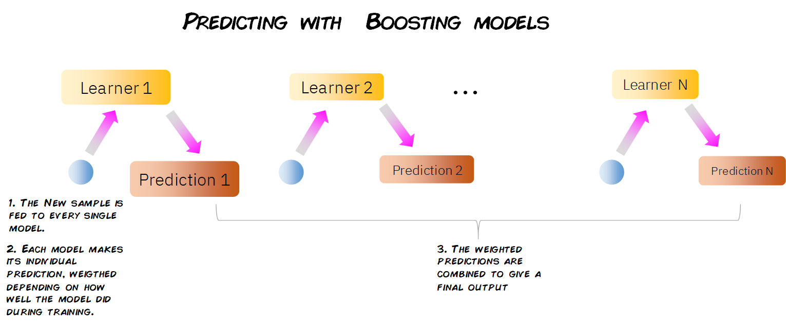
```


### Modelos *Boosting*

**XGBoost**

Abreviatura de *eXtreme Gradient Boosting*, como en *Gradient Boosting*, ajustamos los árboles a los residuos de las predicciones de árboles anteriores, sin embargo, en lugar de usar árboles de decisión de tamaño fijo convencionales, **_XGBoost_ usa un tipo diferente de árboles**.

Estos árboles se construyen calculando puntuaciones de similitud entre las observaciones que terminan en un nodo de salida. Además, *XGBoost* permite la regularización, reduciendo el posible sobreajuste de nuestros árboles individuales y, por lo tanto, del modelo de conjunto general.

Por último, *XGBoost* está optimizado para superar el límite de los recursos computacionales de los algoritmos de árbol impulsados, lo que lo convierte en un algoritmo rápido y de muy alto rendimiento en términos de tiempo y cálculo.

```{r echo=FALSE,fig.align='center', out.height='400pt', out.width='800pt'}
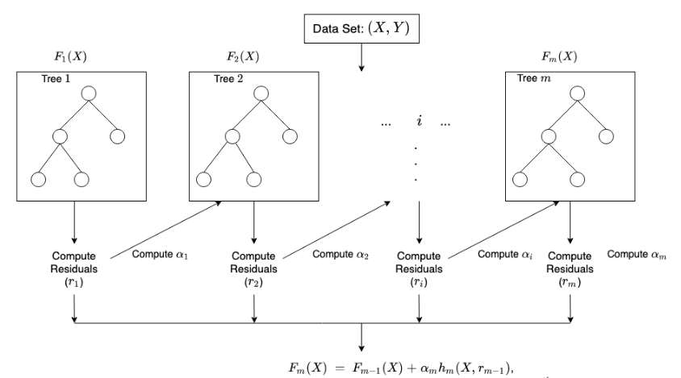
```


**Adaboost**

Abreviatura de *Adaptive Boosting, AdaBoost* funciona mediante el proceso descrito anteriormente de entrenar secuencialmente, predecir y actualizar los pesos de las muestras mal clasificadas y de los modelos débiles correspondientes.

Se usa principalmente con *Decision Tree Stumps*: árboles de decisión con solo un nodo raíz y dos nodos de salida, donde solo se evalúa una característica de los datos. Como podemos ver, al tener en cuenta solo una característica de nuestros datos para hacer predicciones, cada pivote es un modelo muy débil. Sin embargo, al combinar muchos de ellos, se puede construir un modelo de conjunto muy robusto y preciso.

```{r echo=FALSE,fig.align='center', out.height='350pt', out.width='700pt'}
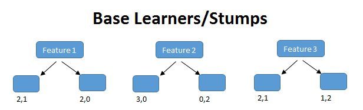
```


### Implementación en Python

### XGBoost para regresión

**Paso 1: Separación inicial de datos (test, train)**

```{python}
from xgboost import XGBClassifier, XGBRegressor

ames = load_ames()
ames_train, ames_test = train_test_split(ames, train_size=0.75, random_state=4595)
X_ames_train = ames_train.drop(columns="Sale_Price")
y_ames_train = ames_train["Sale_Price"]
X_ames_test = ames_test.drop(columns="Sale_Price")
y_ames_test = ames_test["Sale_Price"]
ames_folds = KFold(n_splits=5, shuffle=True, random_state=4595)
```

Contando con datos de entrenamiento, procedemos a realizar el feature engineering para extraer las mejores características que permitirán realizar las estimaciones en el modelo.

**Paso 2: Pre-procesamiento e ingeniería de variables**

```{python}
receta_casas = make_ames_pipeline(
    XGBRegressor(objective="reg:squarederror", random_state=4595, tree_method="hist"),
    scale_numeric=False,
)
receta_casas
```

Recordemos que un `Pipeline` contiene los pasos a seguir; usamos `fit()` para estimar transformaciones y modelo, y `transform()` o `predict()` para aplicarlo a nuevos datos.

**Paso 3: Selección de tipo de modelo con hiperparámetros iniciales**

```{python}
xgboost_reg_model = XGBRegressor(
    objective="reg:squarederror",
    n_estimators=300,
    random_state=4595,
    n_jobs=-1,
    tree_method="hist",
)
xgboost_reg_model
```
**Paso 4: Inicialización de workflow o pipeline**

```{python}
xgboost_reg_workflow = make_ames_pipeline(xgboost_reg_model, scale_numeric=False)
xgboost_reg_workflow
```
**Paso 5: Creación de grid search**

```{python}
xgboost_param_distributions = {
    "model__max_depth": randint(3, 12),
    "model__min_child_weight": randint(1, 20),
    "model__gamma": loguniform(1e-8, 10),
    "model__learning_rate": loguniform(1e-3, 0.3),
    "model__subsample": uniform(0.5, 0.5),
    "model__colsample_bytree": uniform(0.5, 0.5),
    "model__reg_alpha": loguniform(1e-8, 1),
    "model__reg_lambda": loguniform(1e-2, 10),
}
xgboost_param_distributions
```
**Paso 6: Entrenamiento de modelos con hiperparámetros definidos**

```{python, eval=FALSE}
xgboost_reg_tune_result = RandomizedSearchCV(
    xgboost_reg_workflow,
    param_distributions=xgboost_param_distributions,
    n_iter=100,
    cv=ames_folds,
    scoring="r2",
    random_state=4595,
    n_jobs=-1,
)
xgboost_reg_tune_result.fit(X_ames_train, y_ames_train)
```

**Paso 7: Análisis de métricas de error e hiperparámetros (Vuelve al paso 3, si es necesario)**

```{python}
xgboost_reg_tune_result = RandomizedSearchCV(
    xgboost_reg_workflow,
    param_distributions=xgboost_param_distributions,
    n_iter=20,
    cv=ames_folds,
    scoring="r2",
    random_state=4595,
    n_jobs=-1,
)
xgboost_reg_tune_result.fit(X_ames_train, y_ames_train)
best_cv_results(xgboost_reg_tune_result, n=10)
```

En la siguiente gráfica observamos las distintas métricas de error asociados a los hiperparámetros elegidos:

```{python}
xgb_reg_results = pd.DataFrame(xgboost_reg_tune_result.cv_results_)
ax = xgb_reg_results.plot.scatter(x="param_model__learning_rate", y="mean_test_score", logx=True)
_artist = plt.title("XGBoost regression: R2 por learning rate")
```

```{python}
best_cv_results(xgboost_reg_tune_result, n=10)
```


**Paso 8: Selección de modelo a usar**

```{python, message=FALSE, warning=FALSE}
best_xgboost_reg_model = xgboost_reg_tune_result.best_params_
best_xgboost_reg_model
```

**Paso 9: Ajuste de modelo final con todos los datos (Vuelve al paso 2, si es necesario)**

```{python, message=FALSE, warning=FALSE}
final_xgboost_reg_model = xgboost_reg_tune_result.best_estimator_
final_xgboost_reg_model
```
Como hemos hablado anteriormente, este último objeto es el modelo final entrenado, el cual contiene toda la información del pre-procesamiento de datos, por lo que en caso de ponerse en producción el modelo, sólo se necesita de este último elemento para poder realizar nuevas predicciones.

Antes de pasar al siguiente paso, es importante validar que hayamos hecho un uso correcto de las variables predictivas. En este momento es posible detectar variables que no estén aportando valor o variables que no debiéramos estar usando debido a que cometeríamos data leakage. Para enfrentar esto, ayuda estimar y ordenar el valor de importancia del modelo

```{python}
xgb_reg_importance = permutation_importance(
    final_xgboost_reg_model,
    X_ames_test,
    y_ames_test,
    scoring="r2",
    n_repeats=5,
    random_state=4595,
)
xgb_reg_importance_df = (
    pd.DataFrame(
        {
            "Variable": X_ames_test.columns,
            "Importance": xgb_reg_importance.importances_mean,
            "StDev": xgb_reg_importance.importances_std,
        }
    )
    .sort_values("Importance", ascending=False)
    .head(25)
)
ax = xgb_reg_importance_df.sort_values("Importance").plot.barh(
    x="Variable", y="Importance", xerr="StDev", legend=False, figsize=(8, 8)
)
_artist = plt.title("Importancia de las variables")
```

**Paso 10: Validar poder predictivo con datos de prueba**

Imaginemos por un momento que pasa un mes de tiempo desde que hicimos nuestro modelo, es hora de ponerlo a prueba prediciendo valores de nuevos elementos:

```{python}
results = pd.DataFrame(
    {
        "Sale_Price": y_ames_test.to_numpy(),
        "pred_xgb_reg": final_xgboost_reg_model.predict(X_ames_test),
    }
)
results.head()
```

```{python}
regression_metrics(results["Sale_Price"], results["pred_xgb_reg"]).assign(
    estimate=lambda x: x["estimate"].round(2)
)
```


```{python}
_artist = plt.scatter(results["pred_xgb_reg"], results["Sale_Price"], alpha=0.6)
lims = [results[["pred_xgb_reg", "Sale_Price"]].min().min(), results[["pred_xgb_reg", "Sale_Price"]].max().max()]
_artist = plt.plot(lims, lims, color="red")
_artist = plt.xlabel("Prediction")
_artist = plt.ylabel("Observation")
_artist = plt.title("Comparison")
```


### XGBoost para clasificación

**Paso 1: Separación inicial de datos (test, train)**

```{python}
telco = load_telco("data/Churn.csv")
telco_train, telco_test = train_test_split(
    telco,
    train_size=0.70,
    random_state=1234,
    stratify=telco["Churn"],
)
X_telco_train = telco_train.drop(columns="Churn")
y_telco_train = telco_train["Churn"].eq("Yes").astype(int)
X_telco_test = telco_test.drop(columns="Churn")
y_telco_test = telco_test["Churn"].eq("Yes").astype(int)
telco_folds = StratifiedKFold(n_splits=5, shuffle=True, random_state=1234)
telco_folds
```

**Paso 2: Pre-procesamiento e ingeniería de variables**

```{python}
telco_rec = make_telco_pipeline(
    XGBClassifier(eval_metric="logloss", random_state=1234, n_jobs=-1, tree_method="hist"),
    scale_numeric=False,
)
telco_rec
```

**Paso 3: Selección de tipo de modelo con hiperparámetros iniciales**

```{python}
xgboost_model = XGBClassifier(
    n_estimators=300,
    eval_metric="logloss",
    random_state=1234,
    n_jobs=-1,
    tree_method="hist",
)
xgboost_model
```

**Paso 4: Inicialización de workflow o pipeline**

```{python}
xgboost_workflow = make_telco_pipeline(xgboost_model, scale_numeric=False)
xgboost_workflow
```

**Paso 5: Creación de grid search**
```{python}
xgboost_class_param_distributions = {
    "model__max_depth": randint(2, 10),
    "model__min_child_weight": randint(1, 20),
    "model__gamma": loguniform(1e-8, 10),
    "model__learning_rate": loguniform(1e-3, 0.3),
    "model__subsample": uniform(0.5, 0.5),
    "model__colsample_bytree": uniform(0.5, 0.5),
    "model__reg_alpha": loguniform(1e-8, 1),
    "model__reg_lambda": loguniform(1e-2, 10),
}
xgboost_class_param_distributions
```


**Paso 6: Entrenamiento de modelos con hiperparámetros definidos**

```{python, eval=FALSE}
xgboost_tune_result = RandomizedSearchCV(
    xgboost_workflow,
    param_distributions=xgboost_class_param_distributions,
    n_iter=100,
    cv=telco_folds,
    scoring="average_precision",
    random_state=1234,
    n_jobs=-1,
)
xgboost_tune_result.fit(X_telco_train, y_telco_train)
```

**Paso 7: Análisis de métricas de error e hiperparámetros (Vuelve al paso 3, si es necesario)**

```{python}
xgboost_tune_result = RandomizedSearchCV(
    xgboost_workflow,
    param_distributions=xgboost_class_param_distributions,
    n_iter=20,
    cv=telco_folds,
    scoring="average_precision",
    random_state=1234,
    n_jobs=-1,
)
xgboost_tune_result.fit(X_telco_train, y_telco_train)
best_cv_results(xgboost_tune_result, n=10)
```

En la siguiente gráfica observamos las distintas métricas de error asociados a los hiperparámetros elegidos:

```{python}
xgb_class_results = pd.DataFrame(xgboost_tune_result.cv_results_)
ax = xgb_class_results.plot.scatter(x="param_model__learning_rate", y="mean_test_score", logx=True)
_artist = plt.title("XGBoost classification: PR AUC por learning rate")
```

```{python}
best_cv_results(xgboost_tune_result, n=10)
```

```{python}
best_cv_results(xgboost_tune_result, n=10)
```


**Paso 8: Selección de modelo a usar**

```{python, message=FALSE, warning=FALSE}
best_xgboost_model = xgboost_tune_result.best_params_
best_xgboost_model
```

**Paso 9: Ajuste de modelo final con todos los datos (Vuelve al paso 2, si es necesario)**

```{python, message=FALSE, warning=FALSE}
final_xgboost_model = xgboost_tune_result.best_estimator_
final_xgboost_model
```

Como hemos hablado anteriormente, este último objeto es el modelo final entrenado, el cual contiene toda la información del pre-procesamiento de datos, por lo que en caso de ponerse en producción el modelo, sólo se necesita de este último elemento para poder realizar nuevas predicciones.

Antes de pasar al siguiente paso, es importante validar que hayamos hecho un uso correcto de las variables predictivas. En este momento es posible detectar variables que no estén aportando valor o variables que no debiéramos estar usando debido a que cometeríamos data leakage. Para enfrentar esto, ayuda estimar y ordenar el valor de importancia del modelo.

```{python}
xgb_class_importance = permutation_importance(
    final_xgboost_model,
    X_telco_test,
    y_telco_test,
    scoring="average_precision",
    n_repeats=5,
    random_state=1234,
)
xgb_class_importance_df = (
    pd.DataFrame(
        {
            "Variable": X_telco_test.columns,
            "Importance": xgb_class_importance.importances_mean,
            "StDev": xgb_class_importance.importances_std,
        }
    )
    .sort_values("Importance", ascending=False)
    .head(25)
)
ax = xgb_class_importance_df.sort_values("Importance").plot.barh(
    x="Variable", y="Importance", xerr="StDev", legend=False, figsize=(8, 8)
)
_artist = plt.title("Importancia de las variables")
```

**Paso 10: Validar poder predictivo con datos de prueba**

Imaginemos por un momento que pasa un mes de tiempo desde que hicimos nuestro modelo, es hora de ponerlo a prueba prediciendo valores de nuevos elementos:

```{python, message=FALSE, warning=FALSE}
class_prob = final_xgboost_model.predict_proba(X_telco_test)
class_results = pd.DataFrame(
    {
        ".pred_No": class_prob[:, 0],
        ".pred_Yes": class_prob[:, 1],
        "Churn": telco_test["Churn"].to_numpy(),
    }
)

class_results.head()
```
```{python}
classification_metrics(class_results["Churn"], class_results[".pred_Yes"])
```


A continuación, conoceremos el nivel de sensitividad y especificidad para cada punto de corte:

```{python}
roc_curve_data = roc_curve_table(class_results["Churn"], class_results[".pred_Yes"])
roc_curve_data.head()
```

A través de estas métricas es posible crear la curva ROC:

```{python}
_artist = plt.plot(1 - roc_curve_data["specificity"], roc_curve_data["sensitivity"], color="lightblue")
_artist = plt.plot([0, 1], [0, 1], color="black", linewidth=1)
_artist = plt.title("ROC Curve")
_artist = plt.xlabel("1 - specificity")
_artist = plt.ylabel("sensitivity")
```

De igual manera, podemos calcular la precisión y cobertura para cada punte de corte:

```{python}
pr_curve_data = pr_curve_table(class_results["Churn"], class_results[".pred_Yes"])
pr_curve_data.head()
```

Y graficar su respectiva curva:

```{python}
_artist = plt.plot(pr_curve_data["recall"], pr_curve_data["precision"], color="lightblue")
_artist = plt.title("Precision vs Recall")
_artist = plt.xlabel("recall")
_artist = plt.ylabel("precision")
```

## Ejercicios

Ejecutar un modelo propio usando **Adaboost**. Cada alumno deberá proponer su propia configuración y comparar resultados con XGBoost:

```{python}
from sklearn.ensemble import AdaBoostClassifier
from sklearn.tree import DecisionTreeClassifier

adaboost_model = AdaBoostClassifier(
    estimator=DecisionTreeClassifier(max_depth=1, random_state=123),
    n_estimators=1000,
    learning_rate=0.05,
    random_state=123,
)
```
