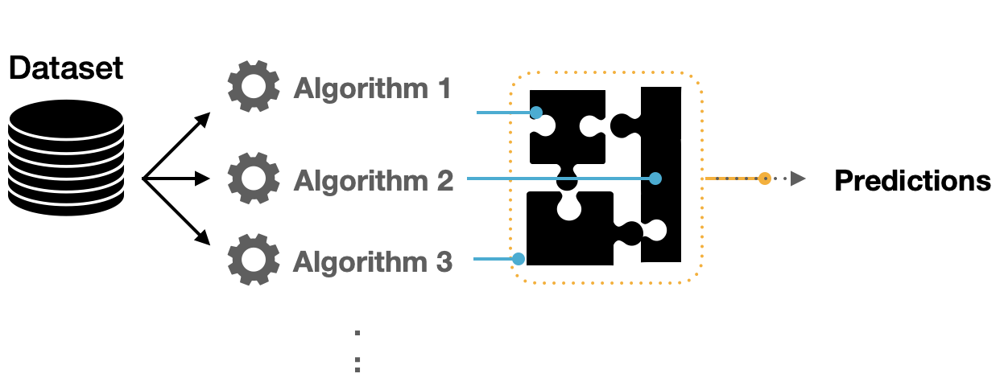

<div class="watermark"></div>

# Workflowsets & Stacking

```{python, include=FALSE}
from dsml_environment import ensure_conda_environment

ensure_conda_environment()
```

Es común no sepamos ni remotamente cuál es el mejor modelo que podríamos implementar al iniciar un proyecto con datos que nunca antes hemos visto. Es posible que un profesional de datos deba seleccionar muchas combinaciones de modelos y preprocesadores. También es posible tener poco o ningún conocimiento a priori sobre qué método funcionará mejor con un nuevo conjunto de datos.

> Una buena estrategia es dedicar un esfuerzo inicial a probar una variedad de enfoques de modelado, determinar qué funciona mejor y luego invertir tiempo adicional ajustando / optimizando un pequeño conjunto de modelos.

## Múltiples recetas

Algunos modelos requieren predictores que se han centrado y escalado, por lo que algunos flujos de trabajo de modelos requerirán recetas con estos pasos de preprocesamiento. Para otros modelos, crear interacciones cuadráticas y bidireccionales. Para estos fines, creamos múltiples recetas:

```{python}
import matplotlib.pyplot as plt
import numpy as np
import pandas as pd
from scipy.stats import randint, loguniform, uniform
from sklearn.ensemble import RandomForestRegressor, StackingRegressor
from sklearn.inspection import permutation_importance
from sklearn.linear_model import ElasticNet, ElasticNetCV
from sklearn.model_selection import KFold, RandomizedSearchCV, train_test_split
from sklearn.neighbors import KNeighborsRegressor
from sklearn.svm import SVR
from xgboost import XGBRegressor

from dsml_utils import (
    best_cv_results,
    collect_search_results,
    load_ames,
    make_workflow_set,
    regression_metrics,
    stacking_weights,
    top_estimators_for_stacking,
    tune_workflow_set,
)

ames = load_ames()
ames_train, ames_test = train_test_split(ames, train_size=0.75, random_state=4595)
X_train = ames_train.drop(columns="Sale_Price")
y_train = ames_train["Sale_Price"]
X_test = ames_test.drop(columns="Sale_Price")
y_test = ames_test["Sale_Price"]
ames_folds = KFold(n_splits=5, shuffle=True, random_state=4595)
```

* **Receta Original**

```{python}
receta_original = {"name": "receta_original", "scale_numeric": True, "large": False}
receta_original
```

* **Receta KNN:**

```{python}
receta_knn = {"name": "receta_knn", "scale_numeric": True, "large": False}
receta_knn
```

* **Receta Grande:**

```{python}
receta_grande = {"name": "receta_grande", "scale_numeric": True, "large": True}
receta_grande
```

## Múltiples modelos

Una vez que tenemos suficientes recetas, podemos experimentar con múltiples modelos para poner a prueba. Usaremos los modelos que hemos aprendido a implementar en todo el curso:

```{python}
elasticnet_model = ElasticNet(max_iter=10_000, random_state=4595)
knn_model = KNeighborsRegressor()
rforest_model = RandomForestRegressor(n_estimators=300, random_state=4595, n_jobs=-1)
svm_rbf_model = SVR(kernel="rbf")
xgboost_model = XGBRegressor(
    objective="reg:squarederror",
    n_estimators=300,
    random_state=4595,
    n_jobs=-1,
    tree_method="hist",
)

```

**¿Cómo podemos hacer coincidir estos modelos con las recetas desarrolladas, ajustarlos y luego evaluar su rendimiento de manera eficiente?** En Python, `scikit-learn` no tiene una clase oficial llamada `workflowsets`, pero podemos implementar el mismo patrón con `Pipeline`, diccionarios nombrados y una función que ejecute búsquedas de hiperparámetros para cada combinación.


## Creación de workflow set en Python

Un *workflow set* toma listas nombradas de preprocesadores y especificaciones de modelos, las cruza y produce varios `Pipeline`. Cada `Pipeline` conserva todo el flujo: ingeniería de variables, imputación, codificación, escalamiento opcional y modelo final.

Como primer ejemplo de conjunto de flujo de trabajo, combinemos las recetas creadas en la sección anterior.

```{python}
recipes = {
    "receta_original": receta_original,
    "receta_knn": receta_knn,
    "receta_grande": receta_grande,
}
models = {
    "elasticnet": elasticnet_model,
    "knn": knn_model,
    "rf": rforest_model,
    "svm_rbf": svm_rbf_model,
    "boost": xgboost_model,
}

workflow_set_models = make_workflow_set(recipes, models)

list(workflow_set_models)[:5]
```


## Ajuste y evaluación de modelos

Casi todos estos flujos de trabajo contienen parámetros de ajuste. Para evaluar su rendimiento, podemos utilizar las funciones estándar de ajuste o remuestreo (por ejemplo, `RandomizedSearchCV`).

Un ciclo sobre el diccionario `workflow_set_models` aplica la misma búsqueda a todos los flujos de trabajo del conjunto.

A continuación se declaran los parámetros para cada modelo y el grid:

```{python, warning=FALSE, message=FALSE}
param_spaces = {
    "elasticnet": {
        "model__alpha": loguniform(1e-2, 1e3),
        "model__l1_ratio": uniform(0, 1),
    },
    "knn": {
        "model__n_neighbors": randint(5, 80),
        "model__p": randint(1, 3),
        "model__weights": ["uniform", "distance"],
    },
    "rf": {
        "model__max_features": uniform(0.2, 0.8),
        "model__min_samples_leaf": randint(1, 15),
        "model__max_samples": uniform(0.6, 0.4),
    },
    "svm_rbf": {
        "model__C": loguniform(1e-1, 1e2),
        "model__gamma": loguniform(1e-4, 1e0),
        "model__epsilon": uniform(0.01, 0.5),
    },
    "boost": {
        "model__max_depth": randint(3, 12),
        "model__min_child_weight": randint(1, 20),
        "model__learning_rate": loguniform(1e-3, 0.3),
        "model__subsample": uniform(0.5, 0.5),
        "model__colsample_bytree": uniform(0.5, 0.5),
        "model__reg_alpha": loguniform(1e-8, 1),
        "model__reg_lambda": loguniform(1e-2, 10),
    },
}

workflow_registry = pd.DataFrame(
    {
        "wflow_id": list(workflow_set_models.keys()),
        "model": [name.split("_")[-1] if not name.endswith("svm_rbf") else "svm_rbf" for name in workflow_set_models],
    }
)

regression_scoring = {
    "rmse": "neg_root_mean_squared_error",
    "mae": "neg_mean_absolute_error",
    "mape": "neg_mean_absolute_percentage_error",
    "rsq": "r2",
}

workflow_registry
```

Dado que el preprocesador contiene más de una entrada, la función crea todas las combinaciones de preprocesadores y modelos.

* **registro:** Contiene un `DataFrame` con identificadores de cada flujo de trabajo.

* **grids:** Cada familia de modelos tiene su propio espacio de hiperparámetros.

* **resultados:** La búsqueda devuelve un objeto por flujo de trabajo, con métricas de validación cruzada y el mejor estimador entrenado.

Para este ejemplo, la búsqueda del *grid* se aplica al flujo de trabajo.

```{python, message=TRUE, eval=FALSE}
workflow_searches = tune_workflow_set(
    workflow_set_models,
    param_spaces,
    X_train,
    y_train,
    cv=ames_folds,
    scoring=regression_scoring,
    refit="rsq",
    n_iter=100,
    random_state=20220603,
)
tuning_results = collect_search_results(workflow_searches, sort_by="rsq")
```

```{python}
workflow_searches = tune_workflow_set(
    workflow_set_models,
    param_spaces,
    X_train,
    y_train,
    cv=ames_folds,
    scoring=regression_scoring,
    refit="rsq",
    n_iter=10,
    random_state=20220603,
)
tuning_results = collect_search_results(workflow_searches, sort_by="rsq")
tuning_results
```


```{python}
ax = tuning_results.sort_values("rsq").plot.barh(x="wflow_id", y="rsq", legend=False, figsize=(8, 8))
ax.set_xlim(0, 1)
ax.set_title("Model Comparison")
```

```{python}
best_by_workflow = tuning_results.sort_values("rsq", ascending=False).head(10)
ax = best_by_workflow.sort_values("rsq").plot.barh(x="wflow_id", y="rsq", legend=False, figsize=(8, 6))
ax.set_xlim(0, 1)
ax.set_title("Best Model Comparison")
```


## Extracción de modelos

Una vez que hemos realizado una exploración sobre el desempeño de todas las combinaciones de preprocesamientos con modelos, es posible tomar varios caminos hacia adelante. Algunas de las opciones más comunes son:

* Realizar múltiples iteraciones de modificaciones a las recetas para extraer lo mejor de cada una.

* Realizar mejoras a los hiperparámetros.

* Eliminar modelos y/o recetas que no tuvieron buen desempeño.

* Crear un modelo a partir de la combinación de los modelos más competentes.

Para empezar, se realiza una exploración del resultado del desempeño de los mejores modelos y los hiperparámetros usado en cada caso.

**Resultados de XGBoost**
```{python}
xgb_result = workflow_searches["receta_knn_boost"]
best_cv_results(xgb_result, metric="rsq", n=10)
```

**Resultados de Random Forest**
```{python}
rf_result = workflow_searches["receta_knn_rf"]
best_cv_results(rf_result, metric="rsq", n=10)

```

### Selección de modelo

Habiendo determinado los hiperparámetros adecuados para la configuración del modelo, procedemos a seleccionar la configuración adecuada para nosotros. Estos pasos son los mismos que corresponden a la selección del modelo con un único workflow.

**Mejor modelo XGBoost**
```{python}
best_xgb_model = xgb_result.best_params_
pd.Series(best_xgb_model, name="value").reset_index().rename(columns={"index": "metric"})
```

**Mejor modelo XGBoost a menos de una desviación estandar**
```{python}
xgb_results = pd.DataFrame(xgb_result.cv_results_)
best_score = xgb_result.best_score_
std_score = xgb_results.loc[xgb_result.best_index_, "std_test_rsq"]
best_regularized_xgb_model_1se = (
    xgb_results.query("mean_test_rsq >= @best_score - @std_score")
    .sort_values("param_model__max_depth")
    .iloc[0]
    .filter(like="param_")
)
best_regularized_xgb_model_1se.reset_index(name="value").rename(columns={"index": "metric"})
```

**Mejor modelo XGBoost a menos de un porcentaje fijo**
```{python}
best_regularized_xgb_model_pct = (
    xgb_results.query("mean_test_rsq >= 0.90 * @best_score")
    .sort_values("param_model__max_depth")
    .iloc[0]
    .filter(like="param_")
)
best_regularized_xgb_model_pct.reset_index(name="value").rename(columns={"index": "metric"})
```

**Ajuste del modelo seleccionado**
```{python}
final_regularized_xgb_model = xgb_result.best_estimator_
final_regularized_xgb_model
```

Como hemos hablado anteriormente, este último objeto es el modelo final entrenado, el cual contiene toda la información del pre-procesamiento de datos, por lo que en caso de ponerse en producción el modelo, sólo se necesita de este último elemento para poder realizar nuevas predicciones.

Es importante validar que hayamos hecho un uso correcto de las variables predictivas. En este momento es posible detectar variables que no estén aportando valor o variables que no debiéramos estar usando debido a que cometeríamos data leakage. Para enfrentar esto, ayuda estimar y ordenar el valor de importancia del modelo

```{python}
importance = permutation_importance(
    final_regularized_xgb_model,
    X_test,
    y_test,
    scoring="r2",
    n_repeats=5,
    random_state=4595,
)
importance_df = (
    pd.DataFrame(
        {"Variable": X_test.columns, "Importance": importance.importances_mean, "StDev": importance.importances_std}
    )
    .sort_values("Importance", ascending=False)
    .head(25)
)
importance_df.sort_values("Importance").plot.barh(
    x="Variable", y="Importance", xerr="StDev", legend=False, figsize=(8, 8)
)
plt.title("Importancia de las variables")
```

Por último... Imaginemos por un momento que pasa un mes de tiempo desde que hicimos nuestro modelo, es hora de ponerlo a prueba prediciendo valores de nuevos elementos:

```{python}
results = pd.DataFrame(
    {
        "Sale_Price": y_test.to_numpy(),
        "pred_xgb_reg": final_regularized_xgb_model.predict(X_test),
    }
)
results.head()
```

```{python}
regression_metrics(results["Sale_Price"], results["pred_xgb_reg"]).assign(
    estimate=lambda x: x["estimate"].round(2)
)
```

```{python}
plt.scatter(results["pred_xgb_reg"], results["Sale_Price"], alpha=0.6)
lims = [results[["pred_xgb_reg", "Sale_Price"]].min().min(), results[["pred_xgb_reg", "Sale_Price"]].max().max()]
plt.plot(lims, lims, color="red")
plt.xlabel("Prediction")
plt.ylabel("Observation")
plt.title("Comparison")
```


## Métodos de carrera

Un problema con la búsqueda del *grid* es que **todos los modelos deben ajustarse** en todos los remuestreos antes de que se puedan evaluar los parámetros de ajuste.

En *machine learning*, el conjunto de técnicas que son llamadas **métodos de carreras**
evalúa todos los modelos en un subconjunto inicial de remuestreo. En función de sus métricas de rendimiento actuales, algunos conjuntos de parámetros no se consideran en remuestreos posteriores.

Dado un **workflow**, podemos usar búsquedas sucesivas como `HalvingRandomSearchCV` para un enfoque de carreras. Calcula un conjunto de métricas de rendimiento (por ejemplo, precisión o RMSE) para un conjunto predefinido de parámetros de ajuste que corresponden a un modelo o receta a través de una o más muestras de los datos.

### Optimización ANOVA

Realiza un modelo de análisis de varianza (ANOVA) para probar la significación estadística de las diferentes configuraciones del modelo. Después de evaluar un número inicial de remuestreos, el proceso elimina las combinaciones de parámetros de ajuste que probablemente no sean los mejores resultados usando medidas repetidas de un modelo ANOVA. En Python, una alternativa práctica es `HalvingRandomSearchCV`, que elimina candidatos de bajo rendimiento por etapas.

```{python, eval=FALSE}
from sklearn.experimental import enable_halving_search_cv
from sklearn.model_selection import HalvingRandomSearchCV

tuning_race_anova_results = HalvingRandomSearchCV(
    estimator=workflow_set_models["receta_knn_boost"],
    param_distributions=param_spaces["boost"],
    factor=3,
    scoring="r2",
    cv=ames_folds,
    random_state=1503,
    n_jobs=-1,
)
tuning_race_anova_results.fit(X_train, y_train)
```

```{python, echo=FALSE}
tuning_race_anova_results = tuning_results.head(10).copy()
```

Podemos resumir los resultados con la misma estructura tabular y graficarlos directamente con pandas:

```{python}
tuning_race_anova_results
```


```{python}
ax = tuning_race_anova_results.sort_values("rsq").plot.barh(x="wflow_id", y="rsq", legend=False)
ax.set_xlim(0, 1)
```

### Optimización Logística

Después de evaluar un número inicial de remuestreos, el proceso elimina las combinaciones de parámetros de ajuste que probablemente no sean los mejores resultados usando un modelo estadístico. En tidymodels este enfoque existe como `tune_race_win_loss`; en `scikit-learn`, una alternativa práctica es usar búsqueda sucesiva con `HalvingRandomSearchCV`.

```{python, eval=FALSE}
tuning_race_win_loss_results = HalvingRandomSearchCV(
    estimator=workflow_set_models["receta_knn_rf"],
    param_distributions=param_spaces["rf"],
    factor=3,
    scoring="r2",
    cv=ames_folds,
    random_state=1503,
    n_jobs=-1,
)
tuning_race_win_loss_results.fit(X_train, y_train)
```

```{python, echo=FALSE}
tuning_race_win_loss_results = tuning_results.head(10).copy()
```

Podemos consultar y visualizar los resultados con la misma estructura usada en las búsquedas anteriores:

```{python}
tuning_race_win_loss_results
```

```{python}
ax = tuning_race_win_loss_results.sort_values("rsq").plot.barh(x="wflow_id", y="rsq", legend=False)
ax.set_xlim(0, 1)
```

### Optimización Bayesiana

La optimización bayesiana usa modelos sustitutos para crear nuevas combinaciones de hiperparámetros que sean candidatos de ajuste basado en resultados previos.

El método utiliza métodos MCMC de simulación bayesiana para determinar los hiperparámetros óptimos. A partir de un buen candidato se realiza una exploración aleatoria que permita encontrar nuevos óptimos o sub-óptimos a encontrar. Es posible configurar el número de iteraciones antes regresar al último óptimo o sub-óptimo para continuar la exploración por otro lado.

<video width="720" height="720" controls>
<source src="img/bayes_search.mp4" type="video/mp4">
</video>

La forma de implementarlo es muy similar a las técnicas anteriores. En Python se puede usar `BayesSearchCV` de `scikit-optimize`.

```{python, eval=FALSE}
from skopt import BayesSearchCV

tuning_race_bayes_results = BayesSearchCV(
    estimator=workflow_set_models["receta_knn_boost"],
    search_spaces={
        "model__max_depth": (3, 12),
        "model__min_child_weight": (1, 20),
        "model__learning_rate": (1e-3, 0.3, "log-uniform"),
        "model__subsample": (0.5, 1.0),
        "model__colsample_bytree": (0.5, 1.0),
    },
    n_iter=100,
    scoring="r2",
    cv=ames_folds,
    random_state=20220603,
    n_jobs=-1,
)
tuning_race_bayes_results.fit(X_train, y_train)
```

```{python}
tuning_race_bayes_results = tuning_results.loc[
    ~tuning_results["wflow_id"].str.contains("rf|boost")
]
tuning_race_bayes_results
```

Podemos consultar y visualizar los resultados con la misma estructura usada en las búsquedas anteriores:

```{python}
tuning_race_bayes_results.sort_values("rsq", ascending=False)
```

```{python}
ax = tuning_race_bayes_results.sort_values("rsq").plot.barh(x="wflow_id", y="rsq", legend=False)
ax.set_xlim(0, 1)
```


## Stacking

**El ensamblaje de modelos es un proceso en el que se utilizan varios modelos base para predecir un resultado.**

* La motivación para usar modelos de conjunto es reducir el error de generalización de la predicción.

* Siempre que los modelos base sean diversos e independientes, el error de predicción disminuye cuando se utiliza el enfoque de conjunto.

* Aunque el modelo de conjunto tiene varios modelos base dentro del modelo, actúa y funciona como un solo modelo.


```{r echo=FALSE,fig.align='center', out.height='250pt', out.width='600pt'}

```

Un conjunto de modelos, donde las predicciones de varios modelos individuales se agregan para hacer una predicción, puede producir un modelo final de alto rendimiento.

Los métodos más populares para crear modelos de conjuntos son:

* *Bagging*
* *Bosques aleatorios*
* *Boosting*

Cada uno de estos métodos combina las predicciones de múltiples versiones del mismo tipo de modelo. Uno de los primeros métodos para crear conjuntos es el apilamiento de modelos (*stacking*).

***Stacking* combina las predicciones de múltiples modelos de cualquier tipo.**

Por ejemplo, una regresión logística, un árbol de clasificación y una máquina de vectores de soporte se pueden incluir en un conjunto de apilamiento, así como diferentes configuraciones de un mismo modelo.

El proceso de construcción de un conjunto apilado es:

1. Reunir el conjunto de entrenamiento de predicciones (producidas mediante remuestreo).

2. Crear un modelo para combinar estas predicciones.

3. Para cada modelo del conjunto, ajustar el modelo en el conjunto de entrenamiento original.


### Elección de modelos

Para cada observación en el conjunto de entrenamiento, el apilamiento (*stacking*) requiere una predicción fuera de la muestra de algún tipo.

Para comenzar a ensamblar en Python, usamos `StackingRegressor` y agregamos los mejores candidatos de la búsqueda anterior. `StackingRegressor` vuelve a generar predicciones fuera de muestra con validación cruzada interna para entrenar el metamodelo, por lo que recibe estimadores completos de `scikit-learn`.

```{python, warning=FALSE, message=FALSE}
concrete_stack = top_estimators_for_stacking(
    workflow_searches,
    tuning_results,
    n=4,
    score_col="rsq",
)
concrete_stack
```

La regularización mediante un metamodelo `ElasticNetCV` tiene varias ventajas:

* La mezcla de penalizaciones L1 y L2 puede reducir o eliminar modelos que no aportan al conjunto.

* La correlación entre los candidatos del conjunto tiende a ser muy alta y la regularización ayuda a mitigar este problema.

Dado que nuestro resultado es numérico, se utiliza una regresión lineal regularizada como metamodelo.

```{python, eval=FALSE}
assembly = StackingRegressor(
    estimators=concrete_stack,
    final_estimator=ElasticNetCV(
        alphas=np.logspace(-4, 4, 50),
        l1_ratio=[0.1, 0.5, 0.9, 1.0],
        max_iter=50_000,
        cv=5,
    ),
    cv=ames_folds,
    n_jobs=-1,
)
assembly.fit(X_train, y_train)
```

```{python}
assembly = StackingRegressor(
    estimators=concrete_stack,
    final_estimator=ElasticNetCV(
        alphas=np.logspace(-4, 4, 50),
        l1_ratio=[0.1, 0.5, 0.9, 1.0],
        max_iter=50_000,
        cv=5,
    ),
    cv=ames_folds,
    n_jobs=-1,
)
assembly.fit(X_train, y_train)
```

```{python}
assembly
```

```{python}
assembly_weights = stacking_weights(assembly)
assembly_weights.sort_values("weight").plot.barh(x="model", y="weight", legend=False)
```

Esto evalúa el modelo de meta aprendizaje sobre un grid predefinido de valores de penalización y proporciones L1/L2; `ElasticNetCV` usa remuestreo interno para elegir la combinación.

La siguiente tabla ayuda a comprender qué penalización eligió el metamodelo:

```{python}
pd.DataFrame(
    {
        "alpha": assembly.final_estimator_.alphas_,
        "selected_alpha": assembly.final_estimator_.alpha_,
        "selected_l1_ratio": assembly.final_estimator_.l1_ratio_,
    }
).head()
```

La tabla muestra el grid de penalización y los valores seleccionados por el metamodelo.

Es posible ampliar el rango de penalización cuando los pesos del metamodelo son inestables o todos los modelos quedan retenidos con pesos muy similares.

```{python, eval=FALSE, warning=FALSE, message=FALSE}
assembly_v2 = StackingRegressor(
    estimators=concrete_stack,
    final_estimator=ElasticNetCV(
        alphas=np.logspace(-6, 6, 80),
        l1_ratio=[0.1, 0.5, 0.9, 1.0],
        max_iter=50_000,
        cv=5,
    ),
    cv=ames_folds,
    n_jobs=-1,
)
assembly_v2.fit(X_train, y_train)
```

```{python}
assembly_v2 = assembly
assembly_weights.sort_values("weight").plot.barh(x="model", y="weight", legend=False)
```

La impresión del objeto muestra los detalles del modelo de meta aprendizaje:

```{python}
assembly_v2
```

El modelo de meta aprendizaje contiene un coeficiente de combinación por cada modelo base. Podemos volver a mostrar las contribuciones de cada tipo de modelo:

```{python}
assembly_weights.sort_values("weight").plot.barh(x="model", y="weight", legend=False)
```

El modelo con mayor contribución puede cambiar según el remuestreo y el grid. Por eso conviene reportar los pesos aprendidos por el metamodelo en vez de escribir una ecuación fija:

```{python}
stacking_weights(assembly_v2).assign(weight=lambda x: x["weight"].round(4))
```

Ahora sabemos cómo se combinan las predicciones en una predicción final para el conjunto.

### Ajuste final

En `scikit-learn`, al ejecutar `fit()` sobre el `StackingRegressor` se ajustan los modelos base y el metamodelo dentro de un único estimador. Ese objeto completo es el que se guarda y se usa para predecir nuevos datos.

```{python, eval=FALSE}
fit_assembly = assembly_v2.fit(X_train, y_train)

```

```{python}
fit_assembly = assembly_v2
```

```{python}
fit_assembly
```

En este punto, el modelo de *stacking* se puede utilizar para la predicción.

```{python}
fit_assembly_pred_test = pd.DataFrame(
    {
        "Sale_Price": y_test.to_numpy(),
        ".pred": fit_assembly.predict(X_test),
    }
)

regression_metrics(fit_assembly_pred_test["Sale_Price"], fit_assembly_pred_test[".pred"])
```

### Comparación de métricas

Para ver la efectividad del ensamblaje, realizamos una comparación con el mejor modelo entrenado anteriormente (XGBoost). Es importante que la comparación se realice utilizando los mismos datos de prueba.

```{python}
xgb_metrics = regression_metrics(results["Sale_Price"], results["pred_xgb_reg"]).assign(model="xgboost")
stack_metrics = regression_metrics(
    fit_assembly_pred_test["Sale_Price"],
    fit_assembly_pred_test[".pred"],
).assign(model="stacking")

pd.concat([xgb_metrics, stack_metrics], ignore_index=True).loc[:, ["model", "metric", "estimate"]]
```

Este capítulo demuestra cómo combinar diferentes modelos en un conjunto para un mejor desempeño predictivo. El proceso de creación del conjunto puede eliminar automáticamente los modelos candidatos para encontrar un pequeño subconjunto que mejore el rendimiento.


## Ejercicios

Para obtener un mejor aprendizaje de este capítulo, cada alumno deberá:

* Replicar este proceso eligiendo un número de iteraciones mayor a 500 con cualquiera de las metodologías revisadas en este capítulo.

* Realizar el proceso análogo con los datos de respuesta categórica y mandar un reporte con sus resultados
