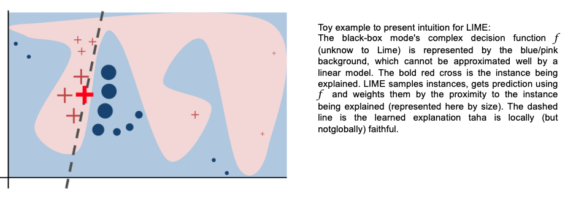
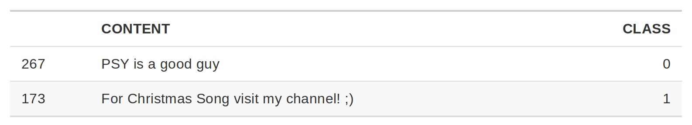
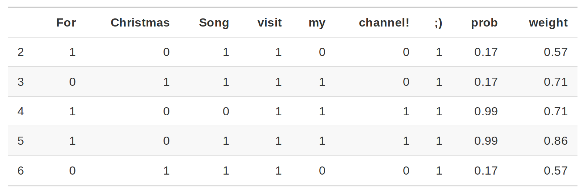
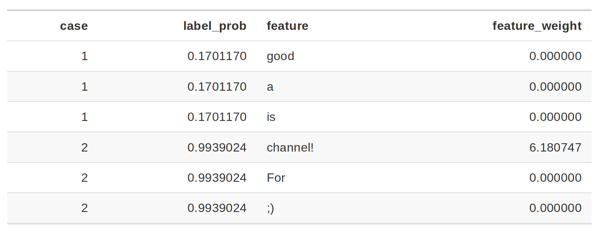
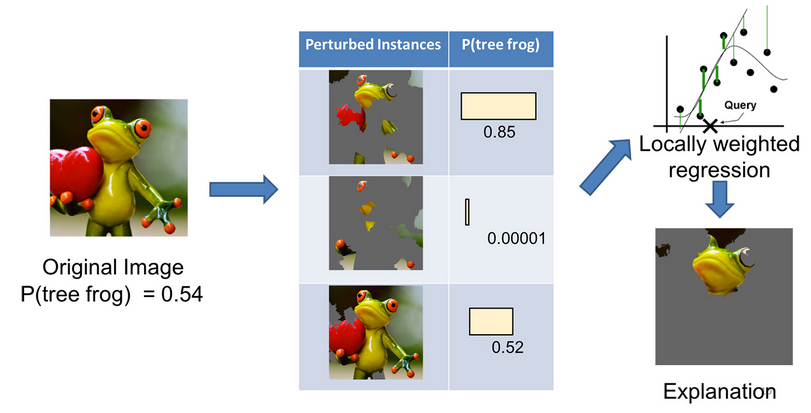
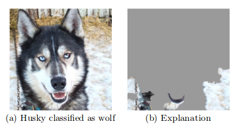
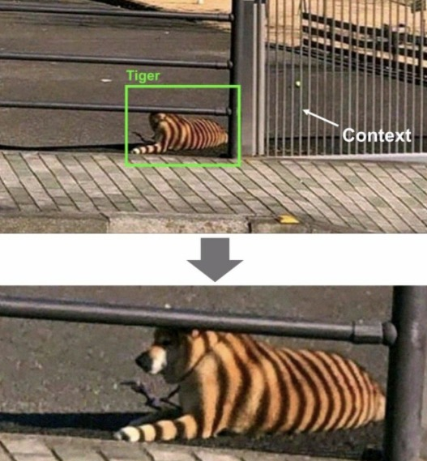
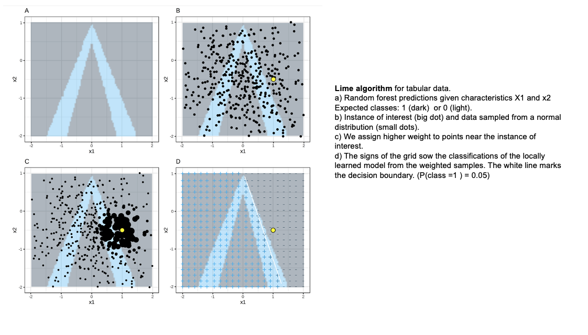

<div class="watermark"></div>

# Interpretabilidad de modelos

```{python, include=FALSE}
from dsml_environment import ensure_conda_environment

ensure_conda_environment()
```

```{python, echo=FALSE, message=FALSE}
import matplotlib.pyplot as plt
import numpy as np
import pandas as pd
from sklearn.ensemble import RandomForestClassifier
from sklearn.model_selection import train_test_split

from dsml_utils import load_telco, make_telco_pipeline

telco = load_telco("data/Churn.csv")

telco_train, telco_test = train_test_split(
    telco,
    train_size=0.70,
    random_state=1234,
    stratify=telco["Churn"],
)

X_telco_train = telco_train.drop(columns="Churn")
y_telco_train = telco_train["Churn"]
```


```{python, echo=FALSE, warning=FALSE}
from dsml_utils import load_ames, make_ames_pipeline

ames = load_ames()
ames_train, ames_test = train_test_split(
    ames,
    train_size=0.75,
    random_state=4595,
)

X_ames_train = ames_train.drop(columns="Sale_Price")
y_ames_train = ames_train["Sale_Price"]
```

**Interpretabilidad:** En Machine Learning, nos referimos a interpretabilidad al grado en el que un humano puede entender la causa de una decisión o clasificación, la cual nos permite identificar y evitar tener sesgo, injusticia, inequidad en los modelos que generamos.

Poder interpretar nuestros modelos nos brinda más confianza en que lo que estamos haciendo es correcto (además de las métricas de desempeño). Por otro lado, para la gente que lo ocupa, permite transparentar y tener más confianza al modelo.

**Ejemplos**

* Etiquetado: Google photos (2015) etiqueta incorrectamente personas afroamericanas como gorillas.

* Facial Recognition (IBM, Microsoft, Megvii): Reconocimiento para hombres blancos 99%, mujeres afroamericanas 35%.

* Facebook automatic translation: Arresto de un palestino por traducción incorrecta de "buenos días" en hebreo a "atácalos".


**Interpretabilidad en ML**

* General Data Protection Regulation (GDPR): Desde mayo de 2018 existe el right to explanation. Por ejemplo: Algoritmos de predicción de riesgo en créditos hipotecarios.

* Se puede tener interpretabilidad de modelos de aprendizaje supervisado.

* Se tiene la creencia equivocada de que en Europa no se puede ocupar Deep Learning debido a la falta de interpretabilidad y el GDPR. Esto no es verdad.

* Es verdad que preferimos ocupar modelos más simples porque nos permiten entender -y explicar- de manera más sencilla por qué se están tomando las decisiones.

* Te recomiendo leer el artículo Why should I trust you? (2016) base de mucho de lo desarrollado para interpretabilidad.

## LIME

Acrónimo de *Local Interpretable Model-Agnostic Explanation*. El objetivo es tener explicacion que un humano pueda entender sobre cualquier modelo supervisado a través de un **modelo local más simple**.

La explicación se genera para cada predicción realizada. Esta basado en la suposición de que un modelo complejo es lineal en una escala local.

En el contexto de LIME:

* Local: Se refiere a que un modelo simple es lo suficientemente bueno/igual de bueno localmente que uno complejo globalmente.

* Interpretable: Se refiere a que la explicación debe ser entendida por un ser humano.

* Model-agnostic: Se refiere a tratar a cualquier modelo de clasificación, complejo o no, como una caja negra a la que metemos observaciones y obtenemos predicciones, no nos interesa cómo genera estas predicciones, lo que nos interesa es generarlas.

```{r echo=FALSE,fig.align='center', out.width='700pt', out.height='400pt'}

```


### Proceso

El objetivo de *LIME* es entender por qué el modelo de machine learning hace cierta predicción, para ello **_LIME_ prueba qué pasa con las predicciones si le brindamos al modelo las mismas observaciones pero con variaciones.**

Genera un nuevo set de datos que consiste de una muestra permutada con sus predicciones originales. Con este nuevo set *LIME* entrena un modelo interpretable que puede ser:

* regresión lineal como LASSO
* regresión logística
* árboles de decisión
* Naive Bayes
* K-NN.
* etc.

Este modelo interpretable es **ponderado por la proximidad de las observaciones en la muestra a la instancia de interés** (la predicción que queremos explicar).

El modelo generado debe ser una buena aproximación al modelo de caja negra localmente, pero no necesariamente en forma global. A esto se le llama *local fidelity*.

Para entrenar el modelo interpertable, seguimos los siguientes pasos:

1. Seleccionamos la observación de la que queremos una explicación.

2. Seleccionamos una vecindad para que *LIME* ajuste el modelo.

3. Seleccionamos el número de features más importantes con los que queremos realizar la explicación (se recomienda que sea menor a $10$).

4. *LIME* genera perturbaciones en una muestra de datos del conjunto de datos

 * **Texto:** "Agrega" o "quita" palabras del texto original aleatoriamente.

```{r echo=FALSE,fig.align='center', out.height='120', out.width='600pt'}

```

```{r echo=FALSE,fig.align='center', out.height='200pt', out.width='600pt'}

```

```{r echo=FALSE,fig.align='center', out.height='210', out.width='600'}

```

La columna de probabilidad corresponde a la probabilidad de que el enunciado sea Spam o no. La columna peso corresponde a la proximidad del enunciado con variación al enunciado original y está calculado como 1 menos la proporción de palabras que fueron eliminadas.

Por ejemplo: Si una de 7 palabras fueron removidas, el peso correspondería a: $1- 1/7=0.86$.

Al pasar dos enunciados al modelo de interpretabilidad se identifica que para los casos donde está la palabra *channel!* el enunciado será clasificado como spam que es el feature con mayor peso para la etiqueta spam.

 * **Imágenes:** "Apaga" y "prende" pixeles de la imágen original.

```{r echo=FALSE,fig.align='center', out.height='250pt', out.width='600pt'}

```

```{r echo=FALSE,fig.align='center', out.height='250pt', out.width='400pt'}

```

```{r echo=FALSE,fig.align='center', out.height='400pt', out.width='400pt'}

```

 * **Datos tabulares:** De cada feature genera nuevas muestras tomadas de una distribución normal con la $\mu$ y $\sigma$ del feature.

```{r echo=FALSE,fig.align='center', out.height='600pt', out.width='700pt'}

```

> Las observaciones más "cercanas" tendrán más peso que el resto. *LIME* ocupa un kernel de suavizamiento exponencial.

> La implementación de *LIME* ocupa como kernel $0.75$ veces la raíz cuadrada del número de features que tenga nuestro dataset. ¿Eso es bueno o malo? Hasta el momento no hay una justificación matemática o estadística que justifique el definir ese número.

5. Obtiene las predicciones del modelo de caja negra para las observaciones generadas en el paso $3$.

6. Calcula las distancias entre la predicción original y las obtenidas con los datos modificados.

  * **Datos tabulares:** Distancia euclidiana por default.

  * **Datos numéricos:** Se obtiene la media y desviación estándar y se discretiza a sus cuartiles.

  * **Datos categóricos:** Se calcula la frecuencia de cada valor.

  * **Texto:** Distancia coseno.

  * **Imágenes:** Distancia euclidiana.

7. Convierte la distancia a un score de similitud.

  * **Datos tabulares:** Utiliza el kernel de suavizamiento exponencial.

  * **Texto:** Distancia coseno.

  * **Imágenes:**
    * Genera un modelo simple con los datos modificados

    * Selecciona las $m$ mejores características (depende del modelo utilizado para crear el modelo de interpretabilidad) como explicación para la predicción del modelo de caja negra.


### Características principales

* Vecindad: kernel con suavizamiento exponencial. Peso de influencia
* Similitud: Con respecto a las observaciones originales.
* Selección de variables: Las variables que explican la predicción generada.

**Ventajas:**

* Fácil de implementar.
* Se puede ocupar en datos tabulares, imágenes y texto.
* Existen paquetes de implementación para Python como `lime` y `shap`.
* Las explicaciones son cortas (pocos features), por lo que son más fáciles de entender por un humano no entrenado en machine learning.
* La métrica de *fidelity* nos permite identificar qué tan confiable es el modelo de interpretabilidad en explicar las predicciones del modelo de caja negra en las vecindad del punto de interés.
* Se pueden ocupar otros features en el modelo de interpretabilidad que los ocupados para entrenar el de caja negra.

**Desventajas:**

* La selección correcta de vecindad es el problema más grave de *LIME*. Para minimizar este problema deberemos probar con diferentes vecindades y ver cuál(es) son las de mayor sentido.

* Variación de las observaciones originales: ¿Qué tal que la distribución no es normal? Al muestrear de una distribución gausiana podemos ignorar correlaciones entre features.

* Dependiendo del tamaño de la vecindad tendremos resultados muy diferentes. Este es el mayor problema de *LIME*.

### Implementación con *Python*

```{python, message=FALSE, warning=FALSE}
from lime.lime_tabular import LimeTabularExplainer
```


```{python, message=FALSE, warning=FALSE}
model_rf = make_telco_pipeline(
    RandomForestClassifier(n_estimators=100, random_state=123, n_jobs=-1),
    scale_numeric=False,
)
model_rf.fit(X_telco_train, y_telco_train)
```

```{python, warning=FALSE, message=FALSE}
telco_transformer = model_rf[:-1]
telco_model = model_rf.named_steps["model"]

X_lime_train = telco_transformer.transform(X_telco_train)
lime_feature_names = model_rf.named_steps["preprocess"].get_feature_names_out()

explainer_caret = LimeTabularExplainer(
    training_data=X_lime_train,
    feature_names=lime_feature_names,
    class_names=telco_model.classes_,
    mode="classification",
    discretize_continuous=True,
    random_state=123,
)
lime_positive_label = list(telco_model.classes_).index("Yes")
```

Veamos cómo llegaron a ser la predicciones, usando *Lime*.

```{python}
def predict_model_random_forest(newdata):
    return telco_model.predict_proba(newdata)
```

```{python}
new_data = X_telco_train.iloc[[1]]
new_data.T

new_data_lime = telco_transformer.transform(new_data)
explanation = explainer_caret.explain_instance(
    data_row=new_data_lime[0],
    predict_fn=predict_model_random_forest,
    num_features=10,
    labels=(lime_positive_label,),
)

explanation.as_list(label=lime_positive_label)
```


Para obtener una representación más intuitiva, podemos usar `plot_features()`
proporcionado para obtener una descripción visual de las explicaciones.

```{python}
fig = explanation.as_pyplot_figure(label=lime_positive_label)
plt.tight_layout()
```

**Otro ejemplo**

```{python}
new_data2 = X_telco_train.iloc[[1, 3]]
new_data2.T

explanations2 = [
    explainer_caret.explain_instance(
        data_row=row,
        predict_fn=predict_model_random_forest,
        num_features=10,
        labels=(lime_positive_label,),
    )
    for row in telco_transformer.transform(new_data2)
]

fig, axes = plt.subplots(1, 2, figsize=(12, 4))
for ax, exp in zip(axes, explanations2):
    values = pd.DataFrame(exp.as_list(label=lime_positive_label), columns=["feature", "weight"])
    colors = np.where(values["weight"] > 0, "tab:blue", "tab:red")
    _artist = ax.barh(values["feature"], values["weight"], color=colors)
    _artist = ax.axvline(0, color="black", linewidth=1)
_artist = plt.tight_layout()
```


## SHAP

El ecosistema de `scikit-learn` se puede complementar con librerías independientes del modelo como *lime*, *shap* y `sklearn.inspection`:

* *SHAP*: Contiene funciones que usamos cuando queremos atribuir contribuciones locales a las variables de un modelo. Puede trabajar con muchos algoritmos, y tiene optimizaciones especiales para árboles.

Construyamos explicaciones independientes del modelo de regresión de *XGBoost* para descubrir por qué hacen las predicciones que hacen. Podemos usar el paquete `shap`, que es el equivalente más común en Python para este tipo de atribuciones locales.

```{python, warning=FALSE, message=FALSE}
from xgboost import XGBRegressor

xgboost_reg_model = XGBRegressor(
    n_estimators=400,
    max_depth=4,
    min_child_weight=5,
    learning_rate=0.05,
    subsample=0.8,
    colsample_bytree=0.8,
    objective="reg:squarederror",
    random_state=1801,
    n_jobs=-1,
    tree_method="hist",
)

final_xgboost_model = make_ames_pipeline(
    xgboost_reg_model,
    scale_numeric=False,
    large=False,
)
final_xgboost_model.fit(X_ames_train, y_ames_train)

```

```{python, message=FALSE, warning=FALSE}
import shap

xgb_transformer = final_xgboost_model[:-1]
xgb_model = final_xgboost_model.named_steps["model"]
xgb_feature_names = final_xgboost_model.named_steps["preprocess"].get_feature_names_out()
X_ames_transformed = xgb_transformer.transform(X_ames_train)

background = shap.sample(X_ames_transformed, 200, random_state=1801)
explainer_xgb = shap.Explainer(
    xgb_model,
    background,
    feature_names=xgb_feature_names,
)
```


Las explicaciones del modelo local proporcionan información sobre una predicción para una sola observación. Por ejemplo, consideremos una casa dúplex antigua en el vecindario de North Ames.

```{python}
duplex = X_ames_train.iloc[[536]]

duplex.info()
duplex.T.head(20)
```

Existen múltiples enfoques para comprender por qué un modelo predice un precio determinado para esta casa dúplex.

Una se denomina explicación de "desglose" y calcula cómo las contribuciones atribuidas a características individuales cambian la predicción del modelo medio para una observación en particular, como nuestro dúplex.

Para el modelo de *XGBoost*, las variables con mayor valor absoluto de SHAP son las que más contribuyen a alejar la predicción de la predicción base.

```{python, eval=FALSE}
import joblib

joblib.dump(explainer_xgb, "models/explainer_xgb.joblib")
```

```{python}
def shap_contribution_table(shap_values, max_features=20):
    values = shap_values.values[0]
    data = pd.DataFrame(
        {
            "variable": shap_values.feature_names,
            "contribution": values,
            "abs_contribution": np.abs(values),
        }
    )
    return data.sort_values("abs_contribution", ascending=False).head(max_features)


shap_duplex = explainer_xgb(xgb_transformer.transform(duplex))
xgb_breakdown = shap_contribution_table(shap_duplex)
xgb_breakdown
```

::: {.infobox .note data-latex="{note}"}
**¡¡ [TEORÍA](https://ema.drwhy.ai/) !!**

La idea detrás de *Shapley Additive Explanations (Lundberg y Lee 2017)*, es que las contribuciones promedio de las características se calculan bajo diferentes combinaciones o "coaliciones" de ordenamientos de características.
:::

Calculemos las atribuciones *SHAP* para nuestra *dúplex*, usando `B = 20` ordenaciones aleatorias.

```{python, eval=FALSE}
shap_duplex = explainer_xgb(xgb_transformer.transform(duplex))
```

Los diagramas de caja de la figura siguiente muestran la distribución de las contribuciones en todos los ordenamientos que probamos, y las barras muestran la atribución promedio para cada variable.

```{python}
shap_duplex2 = shap_contribution_table(shap_duplex)

colors = np.where(shap_duplex2["contribution"] > 0, "tab:blue", "tab:red")
ax = shap_duplex2.sort_values("abs_contribution").plot(
    kind="barh",
    x="variable",
    y="contribution",
    color=colors,
    legend=False,
    figsize=(8, 6),
)
_artist = ax.axvline(0, color="black", linewidth=1)
_artist = ax.set_ylabel(None)
_artist = ax.set_xlabel("Contribución SHAP")
```

¿Qué pasa con una observación diferente en nuestro conjunto de datos? Veamos una casa unifamiliar más grande y nueva en el vecindario de Gilbert.

```{python}
big_house = X_ames_train.iloc[[70]]
big_house.info()
big_house.T.head(20)
```

Calculamos las atribuciones promedio *SHAP* de la misma manera.

```{python, eval=FALSE}
shap_house = explainer_xgb(xgb_transformer.transform(big_house))
```

```{python}
shap_house = explainer_xgb(xgb_transformer.transform(big_house))
shap_house2 = shap_contribution_table(shap_house)

colors = np.where(shap_house2["contribution"] > 0, "tab:blue", "tab:red")
ax = shap_house2.sort_values("abs_contribution").plot(
    kind="barh",
    x="variable",
    y="contribution",
    color=colors,
    legend=False,
    figsize=(8, 6),
)
_artist = ax.axvline(0, color="black", linewidth=1)
_artist = ax.set_ylabel(None)
_artist = ax.set_xlabel("Contribución SHAP")
```

A diferencia del dúplex, el área habitable, año de construcción y área del segundo piso de esta casa contribuyen a que su precio sea más alto.

Los paquetes como *SHAP* y *lime* se pueden integrar en un análisis de `scikit-learn` para proporcionar este tipo de explicativos de modelos.

Las explicaciones del modelo son solo una parte de la comprensión de si su modelo es apropiado y efectivo, junto con las estimaciones del rendimiento del modelo.

### Otros métodos

* *Partial Dependence Plot (PDP)*. Efecto marginal de una o dos variables en la predicción.

* *Accumulated Local Effects (ALE)*. Cómo las variables influyen en promedio a la predicción.

### Consejos

* Trata cada modelo que desarrollas como una afectación de vida o muerte a un humano directamente.

* Identifica si estas agregando sesgo, inequidad, injusticia con interpretabilidad.

* Siempre que tengas un modelo de aprendizaje supervisado genera interpretabilidad en tu proceso de desarrollo.

* Siempre que tengas un modelo de aprendizaje supervisado genera interpretabilidad para el usuario final.


