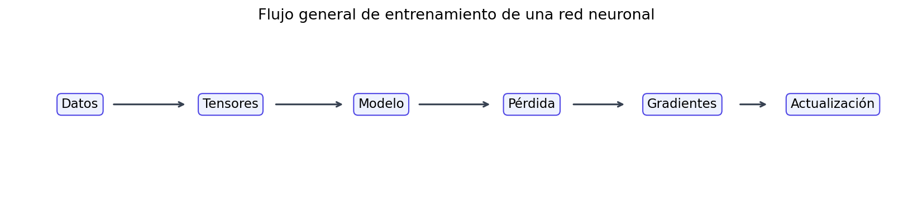
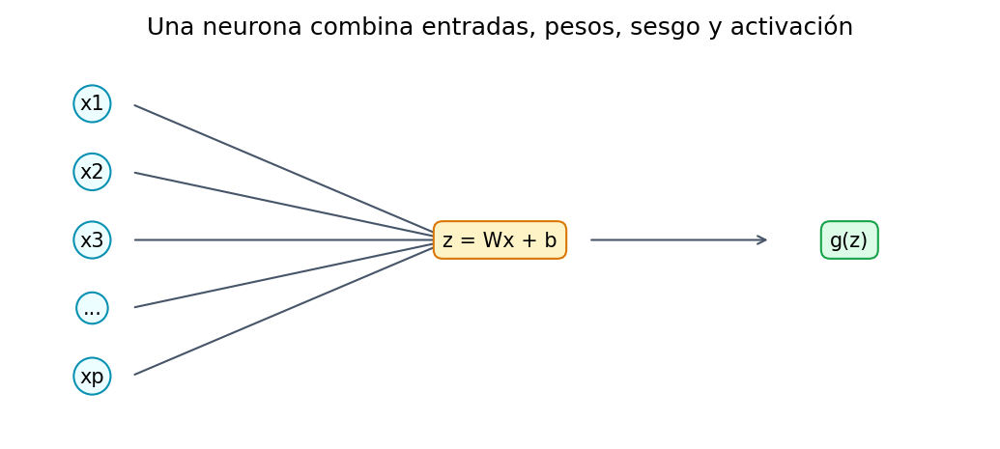
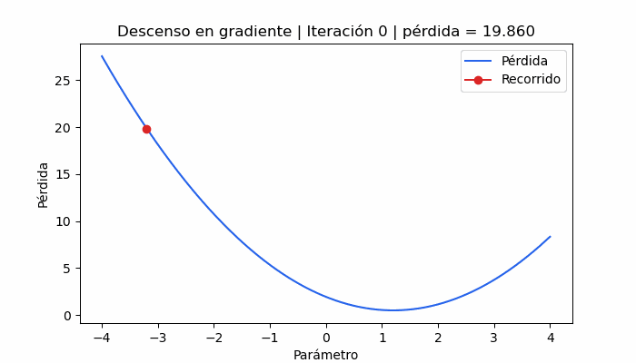

<div class="watermark"></div>

# Introducción a Redes Neuronales

```{python, include=FALSE}
import os

os.environ.setdefault("MPLCONFIGDIR", "/tmp/matplotlib")
os.environ.setdefault("XDG_CACHE_HOME", "/tmp")

from dsml_environment import ensure_conda_environment

ensure_conda_environment()
```

## Idea General

Una red neuronal es un modelo supervisado que aprende una función a partir de ejemplos. Si tenemos variables de entrada $X$ y una respuesta $Y$, la red intenta construir una función que produzca una predicción $\hat{Y}$:

$$X \rightarrow \hat{Y}$$

La idea es la misma que en otros modelos de machine learning:

1. Hacer una predicción.
2. Medir qué tan mala fue la predicción.
3. Ajustar los parámetros.
4. Repetir muchas veces.

La diferencia es que una red neuronal organiza sus parámetros en **capas**. Cada capa transforma la información y la pasa a la siguiente. En este capítulo veremos sólo **redes neuronales densas**, también llamadas *fully connected networks*. No veremos redes convolucionales ni secuenciales todavía; esas aparecerán al final como siguientes pasos.

```{python, warning=FALSE, message=FALSE}
from pathlib import Path

import joblib
import matplotlib.pyplot as plt
import numpy as np
import pandas as pd
import plotly.express as px
import plotly.graph_objects as go
import torch
from sklearn.model_selection import train_test_split
from sklearn.preprocessing import StandardScaler
from torch import nn
from torch.utils.data import DataLoader, TensorDataset

from dsml_utils import (
    load_ames,
    preprocess_ames_frame,
    regression_metrics,
    tabular_preprocessor,
)

seed_status = torch.manual_seed(4595)
np.random.seed(4595)

CACHE_VERSION = "v1"
RECALCULAR_CACHE = False
CACHE_DIR = Path("data/cache/07-redes-neuronales")
_plotly_javascript_included = False


def read_or_create_cache(filename, builder):
    cache_path = CACHE_DIR / filename
    if cache_path.exists() and not RECALCULAR_CACHE:
        return joblib.load(cache_path)
    result = builder()
    CACHE_DIR.mkdir(parents=True, exist_ok=True)
    joblib.dump(result, cache_path, compress=3)
    return result


def interactive_html(figure):
    global _plotly_javascript_included
    figure.update_layout(
        template="plotly_white",
        margin=dict(l=45, r=25, t=55, b=45),
        hovermode="closest",
    )
    include_javascript = True if not _plotly_javascript_included else False
    _plotly_javascript_included = True
    return figure.to_html(
        full_html=False,
        include_plotlyjs=include_javascript,
        config={"displaylogo": False, "responsive": True},
    )
```

```{r, echo=FALSE, fig.align='center', out.width='760px'}

```

Algunas comparaciones de entrenamiento se conservan como gráficas interactivas en la versión HTML del libro. En las secciones conceptuales usaremos también gráficas estáticas para que la idea se entienda sin depender de controles interactivos.

### Ejecución Ágil y Reproducible

Los ejemplos breves de tensores, capas, activaciones y pérdidas se ejecutan cada vez que se compila el capítulo. En cambio, los experimentos con miles de actualizaciones y la preparación completa de Ames tienen semilla fija y producen resultados estables: se conservan en archivos `.pkl` para que la compilación habitual sólo los lea.

El código de entrenamiento sigue visible y es completamente reproducible. Para volver a entrenar los modelos o reconstruir los experimentos, basta cambiar `RECALCULAR_CACHE = True` en el chunk inicial, compilar una vez y después regresarlo a `False`. Si se modifica una arquitectura de manera permanente, debe incrementarse `CACHE_VERSION`.

## Preparación de Datos

Usaremos el conjunto de viviendas de *Ames* para predecir `Sale_Price`. El flujo será:

1. Cargar datos.
2. Separar entrenamiento, validación y prueba.
3. Aplicar ingeniería de variables.
4. Imputar, escalar y convertir variables categóricas a dummies.
5. Escalar también la respuesta.

La validación es importante porque las redes neuronales pueden aprender demasiado bien el conjunto de entrenamiento. Necesitamos un conjunto intermedio para observar si el modelo generaliza.

```{python}
def prepare_ames_data():
    ames = load_ames()
    ames_train_full, ames_test = train_test_split(ames, train_size=0.75, random_state=4595)
    ames_train, ames_valid = train_test_split(ames_train_full, train_size=0.80, random_state=4595)

    X_train_raw = preprocess_ames_frame(ames_train, keep_target=False)
    X_valid_raw = preprocess_ames_frame(ames_valid, keep_target=False)
    X_test_raw = preprocess_ames_frame(ames_test, keep_target=False)

    y_train = ames_train["Sale_Price"]
    y_valid = ames_valid["Sale_Price"]
    y_test = ames_test["Sale_Price"]

    preprocessor = tabular_preprocessor(scale_numeric=True)
    X_train = preprocessor.fit_transform(X_train_raw).astype("float32")
    X_valid = preprocessor.transform(X_valid_raw).astype("float32")
    X_test = preprocessor.transform(X_test_raw).astype("float32")

    target_scaler = StandardScaler()
    y_train_scaled = target_scaler.fit_transform(y_train.to_frame()).astype("float32")
    y_valid_scaled = target_scaler.transform(y_valid.to_frame()).astype("float32")

    return {
        "X_train": X_train,
        "X_valid": X_valid,
        "X_test": X_test,
        "y_train": y_train,
        "y_valid": y_valid,
        "y_test": y_test,
        "y_train_scaled": y_train_scaled,
        "y_valid_scaled": y_valid_scaled,
        "target_scaler": target_scaler,
    }


ames_prepared = read_or_create_cache(
    f"ames_preparado_{CACHE_VERSION}.pkl",
    prepare_ames_data,
)
X_train = ames_prepared["X_train"]
X_valid = ames_prepared["X_valid"]
X_test = ames_prepared["X_test"]
y_train = ames_prepared["y_train"]
y_valid = ames_prepared["y_valid"]
y_test = ames_prepared["y_test"]
y_train_scaled = ames_prepared["y_train_scaled"]
y_valid_scaled = ames_prepared["y_valid_scaled"]
target_scaler = ames_prepared["target_scaler"]

pd.DataFrame(
    {
        "conjunto": ["entrenamiento", "validación", "prueba"],
        "filas": [X_train.shape[0], X_valid.shape[0], X_test.shape[0]],
        "columnas": [X_train.shape[1], X_valid.shape[1], X_test.shape[1]],
    }
)
```

Escalar `Sale_Price` ayuda porque una red neuronal aprende con gradientes. Si la respuesta está en cientos de miles, las pérdidas y gradientes pueden ser muy grandes y el entrenamiento se vuelve menos estable.

## De Regresión Lineal a Neurona

Una regresión lineal calcula:

$$\hat{y} = b + w_1x_1 + w_2x_2 + \dots + w_px_p$$

Una neurona hace casi lo mismo:

$$z = b + w_1x_1 + w_2x_2 + \dots + w_px_p$$

Después puede aplicar una función de activación:

$$a = g(z)$$

Si no usamos activación, una neurona se parece mucho a una regresión lineal. Si usamos activaciones no lineales y muchas neuronas, la red puede aprender relaciones más flexibles.

```{r, echo=FALSE, fig.align='center', out.width='620px'}

```

## Tensores

PyTorch trabaja con **tensores**. Un tensor es parecido a un arreglo de `numpy`, pero puede:

* vivir en CPU o GPU;
* guardar tipo de dato, forma y dispositivo;
* participar en cálculo automático de gradientes.

```{python}
ejemplo_tensor = torch.tensor([[1.0, 2.0], [3.0, 4.0]])
ejemplo_tensor, ejemplo_tensor.shape, ejemplo_tensor.dtype
```

Convertimos los datos ya preprocesados a tensores:

```{python}
X_train_tensor = torch.tensor(X_train, dtype=torch.float32)
y_train_tensor = torch.tensor(y_train_scaled, dtype=torch.float32)
X_valid_tensor = torch.tensor(X_valid, dtype=torch.float32)
y_valid_tensor = torch.tensor(y_valid_scaled, dtype=torch.float32)
X_test_tensor = torch.tensor(X_test, dtype=torch.float32)

X_train_tensor.shape, y_train_tensor.shape
```

## Datasets, Batches y DataLoaders

Una red neuronal no suele actualizar sus pesos con todo el conjunto de datos en cada paso. Es más común usar **mini-batches**, pequeños grupos de observaciones.

`TensorDataset` guarda pares `(X, y)`. `DataLoader` toma esos pares y los entrega por lotes.

La forma más tangible de verlo es imaginar una tabla pequeña. Cada fila es una casa, `X` contiene sus variables y `y` contiene su precio. El `DataLoader` no cambia el contenido de los datos: sólo decide **qué filas se agrupan en cada paso de entrenamiento**.

```{python}
toy_ids = torch.arange(1, 11)
toy_features = torch.tensor(
    [
        [80.0, 1960.0],
        [95.0, 1972.0],
        [110.0, 1985.0],
        [120.0, 1990.0],
        [150.0, 2001.0],
        [165.0, 2005.0],
        [175.0, 2010.0],
        [190.0, 2014.0],
        [205.0, 2018.0],
        [230.0, 2020.0],
    ]
)
toy_target = torch.tensor([140, 155, 170, 185, 230, 245, 260, 285, 310, 340], dtype=torch.float32)

toy_dataset = TensorDataset(toy_ids, toy_features, toy_target)
toy_loader = DataLoader(toy_dataset, batch_size=4, shuffle=False)

batch_rows = []
for batch_number, (ids, features, target) in enumerate(toy_loader, start=1):
    for row_id, row_features, row_target in zip(ids, features, target):
        batch_rows.append(
            {
                "batch": batch_number,
                "id_casa": int(row_id),
                "area_m2": row_features[0].item(),
                "anio": int(row_features[1].item()),
                "precio_miles": row_target.item(),
            }
        )

pd.DataFrame(batch_rows)
```

En este ejemplo `batch_size=4` produce tres grupos: dos lotes de 4 casas y un último lote de 2 casas. Durante el entrenamiento, la red hace una predicción para las casas del lote, calcula una pérdida promedio para ese lote y actualiza sus pesos una vez.

Cuando `shuffle=True`, el orden se mezcla al inicio de cada época. Esto ayuda a que el modelo no aprenda patrones artificiales del orden de la tabla.

```{python}
shuffled_loader = DataLoader(
    toy_dataset,
    batch_size=4,
    shuffle=True,
    generator=torch.Generator().manual_seed(4595),
)

[
    ids.numpy().tolist()
    for ids, _, _ in shuffled_loader
]
```

```{python}
train_dataset = TensorDataset(X_train_tensor, y_train_tensor)
train_loader = DataLoader(train_dataset, batch_size=64, shuffle=True)

batch_X, batch_y = next(iter(train_loader))
batch_X.shape, batch_y.shape
```

## Capas Densas

Una capa densa se implementa con `nn.Linear`. Si una capa recibe 10 variables y produce 5 neuronas, aprende:

* una matriz de pesos de tamaño $10 \times 5$;
* un sesgo por cada neurona de salida.

Matemáticamente, si la entrada de una observación es un vector fila $x$, una capa densa calcula:

$$z = xW^\top + b$$

donde $W$ es la matriz de pesos y $b$ es el vector de sesgos. Cada neurona de salida tiene una columna de pesos que mira todas las entradas. Por eso se llama **densa** o **fully connected**: cada entrada se conecta con cada neurona de la siguiente capa.

```{python}
capa_demo = nn.Linear(in_features=10, out_features=5)
capa_demo.weight.shape, capa_demo.bias.shape
```

La capa recibe un tensor y produce otro:

```{python}
entrada_demo = torch.randn(4, 10)
salida_demo = capa_demo(entrada_demo)
salida_demo.shape
```

```{python, echo=FALSE, warning=FALSE, message=FALSE}
fig, ax = plt.subplots(figsize=(7, 4))
_artist = ax.axis("off")

input_y = np.linspace(0.85, 0.15, 4)
hidden_y = np.linspace(0.8, 0.2, 3)
output_y = np.array([0.5])

for idx, y_pos in enumerate(input_y, start=1):
    _artist = ax.scatter(0.12, y_pos, s=750, color="#dbeafe", edgecolor="#1d4ed8", zorder=3)
    _artist = ax.text(0.12, y_pos, f"x{idx}", ha="center", va="center", fontsize=10)

for idx, y_pos in enumerate(hidden_y, start=1):
    _artist = ax.scatter(0.52, y_pos, s=850, color="#dcfce7", edgecolor="#15803d", zorder=3)
    _artist = ax.text(0.52, y_pos, f"h{idx}", ha="center", va="center", fontsize=10)

_artist = ax.scatter(0.88, output_y[0], s=850, color="#fef3c7", edgecolor="#b45309", zorder=3)
_artist = ax.text(0.88, output_y[0], "ŷ", ha="center", va="center", fontsize=12)

for y_in in input_y:
    for y_h in hidden_y:
        _artist = ax.plot([0.16, 0.48], [y_in, y_h], color="#94a3b8", linewidth=1)

for y_h in hidden_y:
    _artist = ax.plot([0.56, 0.84], [y_h, output_y[0]], color="#94a3b8", linewidth=1)

_artist = ax.text(0.12, 0.98, "Entradas", ha="center", fontsize=11, fontweight="bold")
_artist = ax.text(0.52, 0.98, "Capa densa", ha="center", fontsize=11, fontweight="bold")
_artist = ax.text(0.88, 0.98, "Salida", ha="center", fontsize=11, fontweight="bold")
_artist = ax.text(
    0.52,
    0.04,
    "Cada línea representa un peso aprendible; cada neurona también tiene un sesgo.",
    ha="center",
    fontsize=10,
)
plt.tight_layout()
```

## Parámetros Entrenables

Los parámetros entrenables son los valores que la red ajusta durante el entrenamiento. En una capa densa:

$$\text{parámetros} = (\text{entradas} \times \text{salidas}) + \text{salidas}$$

El primer término son los pesos y el segundo son los sesgos.

```{python}
def count_parameters(model):
    return sum(parameter.numel() for parameter in model.parameters() if parameter.requires_grad)


def parameter_table(model):
    rows = []
    for name, parameter in model.named_parameters():
        rows.append(
            {
                "capa": name,
                "forma": tuple(parameter.shape),
                "parametros": parameter.numel(),
            }
        )
    return pd.DataFrame(rows)
```

```{python}
n_features = X_train_tensor.shape[1]

linear_model = nn.Sequential(nn.Linear(n_features, 1))
parameter_table(linear_model)
```

Una red con capas ocultas aprende más parámetros:

```{python}
small_dense_model = nn.Sequential(
    nn.Linear(n_features, 64),
    nn.ReLU(),
    nn.Linear(64, 32),
    nn.ReLU(),
    nn.Linear(32, 1),
)

small_parameter_summary = parameter_table(small_dense_model)
small_parameter_summary, count_parameters(small_dense_model)
```

Más parámetros pueden dar más flexibilidad, pero también aumentan el riesgo de sobreajuste.

```{python, include=FALSE}
parameter_fig = px.bar(
    small_parameter_summary,
    x="capa",
    y="parametros",
    text="parametros",
    title="Parámetros entrenables por tensor",
)
parameter_fig.update_traces(
    marker_color="#4f46e5",
    hovertemplate="<b>%{x}</b><br>Parámetros: %{y:,}<extra></extra>",
)
parameter_fig.update_xaxes(title="Tensor de pesos o sesgos")
parameter_fig.update_yaxes(title="Número de parámetros")
```

```{python, results='asis', echo=FALSE}
print(interactive_html(parameter_fig))
```

## Funciones de Activación

Las activaciones permiten que la red aprenda relaciones no lineales. Sin activaciones, apilar muchas capas densas sería equivalente a tener una sola transformación lineal, por muy profunda que parezca la arquitectura.

La estructura general es:

$$z = xW^\top + b$$

$$a = g(z)$$

donde $g(\cdot)$ es la función de activación. La capa densa calcula una combinación lineal; la activación decide cómo pasa esa señal a la siguiente capa.

### Activación Lineal

La activación lineal no transforma la señal:

$$g(z) = z$$

Es útil cuando la salida debe ser un número continuo sin límite fijo, como el precio de una casa. Por eso la última capa de una red de regresión suele ser lineal.

### Sigmoid

La función sigmoid comprime cualquier número real al intervalo $(0, 1)$:

$$g(z) = \frac{1}{1 + e^{-z}}$$

Es interpretable como probabilidad binaria. Su problema es la saturación: para valores muy negativos o muy positivos, la curva se aplana y los gradientes se vuelven pequeños.

### Tanh

La función tangente hiperbólica comprime al intervalo $(-1, 1)$:

$$g(z) = \tanh(z) = \frac{e^z - e^{-z}}{e^z + e^{-z}}$$

Tiene la ventaja de estar centrada en cero, pero también puede saturarse cuando $z$ está lejos de cero.

### ReLU

ReLU deja pasar los valores positivos y corta los negativos:

$$g(z) = \max(0, z)$$

Es rápida, simple y funciona muy bien como activación de capas ocultas. Su riesgo es que algunas neuronas pueden quedar "muertas" si siempre reciben valores negativos y dejan de actualizarse de forma útil.

### Leaky ReLU

Leaky ReLU conserva una pequeña pendiente para valores negativos:

$$g(z) = \max(\alpha z, z)$$

donde $\alpha$ suele ser pequeño, por ejemplo $0.01$ o $0.1$. Reduce el riesgo de neuronas muertas.

### ELU

ELU suaviza la parte negativa:

$$g(z)=
\begin{cases}
z, & z > 0 \\
\alpha(e^z - 1), & z \leq 0
\end{cases}$$

Puede producir activaciones negativas suaves y ayudar a centrar la señal, aunque es un poco más costosa que ReLU.

### GELU

GELU usa una compuerta suave basada en la distribución normal:

$$g(z) = z \Phi(z)$$

donde $\Phi(z)$ es la función de distribución acumulada normal estándar. Es común en arquitecturas modernas, especialmente en modelos tipo transformer.

```{python}
x = torch.linspace(-5, 5, 300)

activations = {
    "lineal": x,
    "sigmoid": torch.sigmoid(x),
    "tanh": torch.tanh(x),
    "relu": torch.relu(x),
    "leaky_relu": torch.nn.functional.leaky_relu(x, negative_slope=0.1),
    "elu": torch.nn.functional.elu(x),
    "gelu": torch.nn.functional.gelu(x),
}

activation_df = pd.DataFrame(
    {
        "entrada": x.numpy(),
        **{name: values.numpy() for name, values in activations.items()},
    }
).melt(id_vars="entrada", var_name="activacion", value_name="salida")
```

```{python, echo=FALSE, warning=FALSE, message=FALSE}
activation_order = ["lineal", "sigmoid", "tanh", "relu", "leaky_relu", "elu", "gelu"]
activation_colors = {
    "lineal": "#2563eb",
    "sigmoid": "#7c3aed",
    "tanh": "#0891b2",
    "relu": "#16a34a",
    "leaky_relu": "#ea580c",
    "elu": "#dc2626",
    "gelu": "#4f46e5",
}

fig, axes = plt.subplots(3, 3, figsize=(10, 8), sharex=True)
axes = axes.ravel()

for ax, name in zip(axes, activation_order):
    values = activation_df.query("activacion == @name")
    _artist = ax.plot(
        values["entrada"],
        values["salida"],
        color=activation_colors[name],
        linewidth=2,
    )
    _artist = ax.axhline(0, color="#94a3b8", linewidth=0.8)
    _artist = ax.axvline(0, color="#94a3b8", linewidth=0.8)
    _artist = ax.set_title(name)
    _artist = ax.grid(True, alpha=0.25)

for ax in axes[len(activation_order):]:
    _artist = ax.axis("off")

_artist = fig.suptitle("Funciones de activación comunes", fontsize=13, fontweight="bold")
plt.tight_layout()
```

```{python}
pd.DataFrame(
    {
        "activacion": ["lineal", "sigmoid", "tanh", "ReLU", "Leaky ReLU", "ELU", "GELU"],
        "ventaja": [
            "No limita la escala de salida.",
            "Produce valores interpretables como probabilidad.",
            "Está centrada en cero.",
            "Es simple, rápida y reduce saturación positiva.",
            "Evita que la parte negativa quede totalmente apagada.",
            "Tiene parte negativa suave.",
            "Es suave y flexible.",
        ],
        "desventaja": [
            "No agrega no linealidad.",
            "Satura y puede producir gradientes pequeños.",
            "También satura en los extremos.",
            "Puede generar neuronas muertas.",
            "Agrega un hiperparámetro de pendiente negativa.",
            "Es más costosa que ReLU.",
            "Es más costosa e intuitivamente menos simple.",
        ],
        "uso_comun": [
            "Salida de regresión.",
            "Salida binaria cuando se trabaja explícitamente con probabilidades.",
            "Capas ocultas en redes pequeñas o recurrentes clásicas.",
            "Capas ocultas en redes densas profundas.",
            "Capas ocultas cuando ReLU muere con frecuencia.",
            "Capas ocultas cuando se busca suavidad en negativos.",
            "Arquitecturas modernas y transformers.",
        ],
    }
)
```

### Softmax

Softmax se usa cuando queremos convertir varios logits en probabilidades que suman 1:

$$\text{softmax}(z_i) = \frac{e^{z_i}}{\sum_{j=1}^{K} e^{z_j}}$$

No se aplica de forma independiente a cada elemento: compara todas las clases entre sí. Si un logit sube, su probabilidad sube y las demás bajan.

```{python}
logits_demo = torch.tensor([1.2, 0.4, -0.8])
probabilidades = torch.softmax(logits_demo, dim=0)

pd.DataFrame(
    {
        "clase": ["A", "B", "C"],
        "logit": logits_demo.numpy(),
        "softmax": probabilidades.numpy(),
    }
)
```

```{python, echo=FALSE, warning=FALSE, message=FALSE}
softmax_df = pd.DataFrame({"clase": ["A", "B", "C"], "probabilidad": probabilidades.numpy()})
fig, ax = plt.subplots(figsize=(5.5, 3.4))
_artist = ax.bar(softmax_df["clase"], softmax_df["probabilidad"], color="#0f766e")
_artist = ax.set_ylim(0, 1)
_artist = ax.set_title("Softmax: probabilidades a partir de logits")
_artist = ax.set_xlabel("Clase")
_artist = ax.set_ylabel("Probabilidad")
for idx, row in softmax_df.iterrows():
    _artist = ax.text(idx, row["probabilidad"] + 0.03, f"{row['probabilidad']:.3f}", ha="center")
plt.tight_layout()
```

Para nuestro problema de Ames usamos salida **lineal** porque estamos resolviendo regresión: el precio puede tomar muchos valores continuos.

## Arquitectura de una Red Densa

Una red densa para regresión tabular suele tener:

1. una capa de entrada con tantas variables como columnas tenga `X`;
2. una o más capas ocultas;
3. activaciones en las capas ocultas;
4. una salida de una neurona para predecir el valor continuo.

```{python}
device = torch.device("cuda" if torch.cuda.is_available() else "cpu")

base_model = nn.Sequential(
    nn.Linear(n_features, 64),
    nn.ReLU(),
    nn.Linear(64, 32),
    nn.ReLU(),
    nn.Linear(32, 1),
).to(device)

base_model
```

```{python}
parameter_table(base_model)
```

## Funciones de Pérdida

La función de pérdida responde: **¿qué tan mal estuvo mi predicción?** Durante el entrenamiento, PyTorch calcula esa pérdida y después calcula gradientes para saber cómo ajustar los pesos.

En una red neuronal no optimizamos directamente métricas de negocio como "que el precio estimado sea útil". Optimizamos una función matemática que actúa como sustituto. Por eso conviene elegirla con intención.

### Pérdidas para Regresión

Si definimos el residual como:

$$e_i = \hat{y}_i - y_i$$

entonces las pérdidas de regresión más comunes son:

**MSELoss**

$$\text{MSE} = \frac{1}{n}\sum_{i=1}^{n}(y_i - \hat{y}_i)^2$$

Penaliza mucho los errores grandes porque eleva el error al cuadrado. Es suave, diferenciable y suele entrenar de forma estable. Su desventaja es que un outlier puede dominar el entrenamiento.

**L1Loss / MAE**

$$\text{MAE} = \frac{1}{n}\sum_{i=1}^{n}|y_i - \hat{y}_i|$$

Trata los errores de forma lineal, por lo que es más robusta a valores extremos. Su desventaja es que el gradiente cambia abruptamente en cero y puede ser menos cómodo para optimizar.

**HuberLoss**

$$
L_\delta(e)=
\begin{cases}
\frac{1}{2}e^2, & |e| \leq \delta \\
\delta(|e|-\frac{1}{2}\delta), & |e| > \delta
\end{cases}
$$

Se comporta como MSE cerca de cero y como MAE cuando el error es grande. Es una opción intermedia cuando queremos estabilidad pero también cierta robustez.

```{python}
residuals = torch.linspace(-4, 4, 300)
mse_curve = residuals**2
mae_curve = torch.abs(residuals)
huber_loss = nn.HuberLoss(delta=1.0, reduction="none")
huber_curve = huber_loss(residuals, torch.zeros_like(residuals))

loss_curve_df = pd.DataFrame(
    {
        "error": residuals.numpy(),
        "MSE": mse_curve.numpy(),
        "MAE": mae_curve.numpy(),
        "Huber": huber_curve.numpy(),
    }
).melt(id_vars="error", var_name="perdida", value_name="valor")
```

```{python, echo=FALSE, warning=FALSE, message=FALSE}
fig, ax = plt.subplots(figsize=(7, 4))
loss_colors = {"MSE": "#2563eb", "MAE": "#16a34a", "Huber": "#dc2626"}

for name, group in loss_curve_df.groupby("perdida"):
    _artist = ax.plot(group["error"], group["valor"], label=name, color=loss_colors[name], linewidth=2)

_artist = ax.set_ylim(0, 8)
_artist = ax.set_title("Pérdidas de regresión según el residual")
_artist = ax.set_xlabel("Residual: predicción - observación")
_artist = ax.set_ylabel("Pérdida")
_artist = ax.axvline(0, color="#94a3b8", linewidth=0.8)
_artist = ax.legend()
_artist = ax.grid(True, alpha=0.25)
plt.tight_layout()
```

```{python}
pd.DataFrame(
    {
        "perdida": ["MSELoss", "L1Loss / MAE", "HuberLoss"],
        "ventaja": [
            "Gradiente suave; castiga con fuerza los errores grandes.",
            "Más robusta ante outliers.",
            "Balancea suavidad y robustez.",
        ],
        "desventaja": [
            "Muy sensible a outliers.",
            "Menos suave alrededor de cero.",
            "Requiere elegir delta.",
        ],
        "uso_comun": [
            "Regresión cuando los errores grandes son muy costosos.",
            "Regresión con valores extremos o ruido fuerte.",
            "Regresión con algunos outliers, pero donde se desea entrenamiento estable.",
        ],
    }
)
```

Ejemplo de pérdidas en PyTorch:

```{python}
y_real_demo = torch.tensor([[2.0], [4.0], [8.0]])
y_pred_demo = torch.tensor([[2.5], [3.0], [11.0]])

loss_examples = pd.DataFrame(
    {
        "loss": ["MSELoss", "L1Loss", "HuberLoss"],
        "valor": [
            nn.MSELoss()(y_pred_demo, y_real_demo).item(),
            nn.L1Loss()(y_pred_demo, y_real_demo).item(),
            nn.HuberLoss(delta=1.0)(y_pred_demo, y_real_demo).item(),
        ],
    }
)
loss_examples
```

### Pérdidas para Clasificación

En clasificación no comparamos números continuos, sino probabilidades o logits.

**BCEWithLogitsLoss**

Para clasificación binaria, la entropía cruzada binaria se puede escribir como:

$$
\text{BCE} = -\frac{1}{n}\sum_{i=1}^{n}
\left[y_i\log(p_i) + (1-y_i)\log(1-p_i)\right]
$$

En PyTorch, `BCEWithLogitsLoss` recibe logits, no probabilidades. Internamente aplica sigmoid de manera numéricamente estable. Es preferible a aplicar `torch.sigmoid()` y luego usar una pérdida separada.

**CrossEntropyLoss**

Para clasificación multiclase:

$$
\text{CE} = -\frac{1}{n}\sum_{i=1}^{n}\log
\left(\frac{e^{z_{i,y_i}}}{\sum_{k=1}^{K}e^{z_{i,k}}}\right)
$$

PyTorch también recibe logits aquí. Internamente combina `log_softmax` y negative log likelihood. La clase correcta debe tener el logit más alto para reducir la pérdida.

```{python}
binary_logits = torch.tensor([[1.2], [-0.7], [0.3]])
binary_target = torch.tensor([[1.0], [0.0], [1.0]])

multiclass_logits = torch.tensor([[2.0, 0.5, -1.0], [0.2, 1.5, 0.1]])
multiclass_target = torch.tensor([0, 1])

pd.DataFrame(
    {
        "problema": ["binario", "multiclase"],
        "loss": ["BCEWithLogitsLoss", "CrossEntropyLoss"],
        "valor": [
            nn.BCEWithLogitsLoss()(binary_logits, binary_target).item(),
            nn.CrossEntropyLoss()(multiclass_logits, multiclass_target).item(),
        ],
    }
)
```

```{python, echo=FALSE, warning=FALSE, message=FALSE}
logit_grid = torch.linspace(-6, 6, 300).reshape(-1, 1)
bce_loss = nn.BCEWithLogitsLoss(reduction="none")
bce_y0 = bce_loss(logit_grid, torch.zeros_like(logit_grid)).numpy().ravel()
bce_y1 = bce_loss(logit_grid, torch.ones_like(logit_grid)).numpy().ravel()

fig, ax = plt.subplots(figsize=(7, 4))
_artist = ax.plot(logit_grid.numpy().ravel(), bce_y0, label="y = 0", color="#2563eb", linewidth=2)
_artist = ax.plot(logit_grid.numpy().ravel(), bce_y1, label="y = 1", color="#dc2626", linewidth=2)
_artist = ax.set_title("BCEWithLogitsLoss según el logit")
_artist = ax.set_xlabel("Logit")
_artist = ax.set_ylabel("Pérdida")
_artist = ax.legend()
_artist = ax.grid(True, alpha=0.25)
plt.tight_layout()
```

```{python}
pd.DataFrame(
    {
        "perdida": ["BCEWithLogitsLoss", "CrossEntropyLoss"],
        "problema": ["Clasificación binaria", "Clasificación multiclase"],
        "entrada_esperada": ["Logit por observación", "Vector de logits por observación"],
        "ventaja": [
            "Estable numéricamente y directa para probabilidades binarias.",
            "Estable numéricamente y estándar para múltiples clases.",
        ],
        "cuidado": [
            "No pasarle probabilidades ya transformadas por sigmoid.",
            "No pasarle probabilidades ya transformadas por softmax.",
        ],
    }
)
```

Para Ames usaremos `MSELoss`, porque queremos penalizar errores grandes de precio y estamos trabajando con la respuesta escalada.

```{python}
loss_fn = nn.MSELoss()
loss_fn
```

## Descenso en Gradiente

El descenso en gradiente busca parámetros que reduzcan la pérdida. La intuición es caminar cuesta abajo:

$$\theta_{nuevo} = \theta_{actual} - \eta \nabla L(\theta)$$

donde:

* $\theta$ son los parámetros;
* $\eta$ es la tasa de aprendizaje;
* $\nabla L(\theta)$ es la dirección de mayor crecimiento de la pérdida.

Como queremos bajar, nos movemos en dirección contraria al gradiente.

```{python, include=FALSE}
theta_grid = np.linspace(-4, 4, 300)
loss_grid = (theta_grid - 1.2) ** 2 + 0.5
learning_rate = 0.18

gd_path = [-3.2]
for _ in range(12):
    gradient = 2 * (gd_path[-1] - 1.2)
    gd_path.append(gd_path[-1] - learning_rate * gradient)

gd_path = np.array(gd_path)
gd_loss = (gd_path - 1.2) ** 2 + 0.5


def gradient_traces(iteration):
    return [
        go.Scatter(
            x=theta_grid,
            y=loss_grid,
            mode="lines",
            name="Función de pérdida",
            line=dict(color="#2563eb"),
        ),
        go.Scatter(
            x=gd_path[: iteration + 1],
            y=gd_loss[: iteration + 1],
            mode="lines+markers",
            name="Recorrido",
            line=dict(color="#dc2626"),
            marker=dict(size=7),
        ),
        go.Scatter(
            x=[gd_path[iteration]],
            y=[gd_loss[iteration]],
            mode="markers",
            name="Posición actual",
            marker=dict(size=13, color="#dc2626"),
        ),
    ]


gradient_frames = [
    go.Frame(name=str(iteration), data=gradient_traces(iteration))
    for iteration in range(len(gd_path))
]
gradient_fig = go.Figure(
    data=gradient_traces(0),
    frames=gradient_frames,
)
gradient_fig.update_layout(
    title="Descenso en gradiente: pérdida iteración a iteración",
    xaxis_title="Parámetro",
    yaxis_title="Pérdida",
    updatemenus=[
        {
            "type": "buttons",
            "buttons": [
                {
                    "label": "Reproducir",
                    "method": "animate",
                    "args": [
                        None,
                        {
                            "frame": {"duration": 450, "redraw": True},
                            "fromcurrent": True,
                        },
                    ],
                },
                {
                    "label": "Pausa",
                    "method": "animate",
                    "args": [
                        [None],
                        {
                            "frame": {"duration": 0, "redraw": False},
                            "mode": "immediate",
                        },
                    ],
                },
            ],
        }
    ],
    sliders=[
        {
            "currentvalue": {"prefix": "Iteración: "},
            "steps": [
                {
                    "method": "animate",
                    "label": str(iteration),
                    "args": [
                        [str(iteration)],
                        {
                            "frame": {"duration": 0, "redraw": True},
                            "mode": "immediate",
                        },
                    ],
                }
                for iteration in range(len(gd_path))
            ],
        }
    ],
)
```

```{python, results='asis', echo=FALSE}
print(interactive_html(gradient_fig))
```

En la animación siguiente, el punto parte de un parámetro con pérdida alta y actualiza su posición con el gradiente de la curva. La tasa de aprendizaje controla qué tan largo es cada paso. Como esta trayectoria es determinista, el GIF se conserva como imagen del capítulo; el código queda disponible para regenerarlo si se cambia el ejemplo.

```{python, eval=FALSE}
import matplotlib.pyplot as plt
from matplotlib.animation import FuncAnimation, PillowWriter

gif_path = Path("img/10-nn/descenso-gradiente.gif")
gif_path.parent.mkdir(parents=True, exist_ok=True)

fig, ax = plt.subplots(figsize=(7, 4))
ax.plot(theta_grid, loss_grid, color="#2563eb", label="Pérdida")
path_line, = ax.plot([], [], "-o", color="#dc2626", label="Recorrido")
ax.set_xlabel("Parámetro")
ax.set_ylabel("Pérdida")
ax.legend(loc="upper right")


def update_gradient_frame(frame):
    path_line.set_data(gd_path[: frame + 1], gd_loss[: frame + 1])
    ax.set_title(f"Descenso en gradiente | Iteración {frame} | pérdida = {gd_loss[frame]:.3f}")
    return (path_line,)


gradient_animation = FuncAnimation(
    fig,
    update_gradient_frame,
    frames=len(gd_path),
    interval=550,
    repeat=True,
)
gradient_animation.save(gif_path, writer=PillowWriter(fps=2))
plt.close(fig)
```

```{r, echo=FALSE, fig.align='center', out.width='650px'}

```

### Batch, Estocástico y Mini-Batch

Hay tres formas comunes de calcular gradientes:

* **Batch gradient descent:** usa todos los datos en cada actualización. Es estable, pero puede ser lento.
* **Stochastic gradient descent:** usa una observación por actualización. Es rápido por paso, pero muy ruidoso.
* **Mini-batch gradient descent:** usa grupos pequeños. Es el equilibrio más usado en redes neuronales.

La diferencia no está en la fórmula de actualización, sino en **cuántas observaciones usamos para estimar el gradiente**. Si el conjunto completo tiene $n$ observaciones:

$$\nabla L_{\text{batch}}(\theta) = \frac{1}{n}\sum_{i=1}^{n}\nabla L_i(\theta)$$

$$\nabla L_{\text{estocástico}}(\theta) = \nabla L_i(\theta)$$

$$\nabla L_{\text{mini-batch}}(\theta) = \frac{1}{m}\sum_{i \in B}\nabla L_i(\theta)$$

donde $B$ es un lote con $m$ observaciones. El gradiente de batch completo es más estable, pero puede ser costoso. El estocástico es barato por paso, pero tiene mucho ruido. El mini-batch combina ambas ideas.

```{python, echo=FALSE, warning=FALSE, message=FALSE}
fig, axes = plt.subplots(3, 1, figsize=(8, 4.8), sharex=True)
sample_positions = np.arange(24)
batch_styles = {
    "Batch completo": np.repeat(0, 24),
    "Estocástico": np.arange(24),
    "Mini-batch": np.repeat(np.arange(6), 4),
}

for ax, (title, groups) in zip(axes, batch_styles.items()):
    colors = plt.cm.tab20(groups % 20)
    _artist = ax.scatter(sample_positions, np.zeros_like(sample_positions), s=120, c=colors)
    _artist = ax.set_yticks([])
    _artist = ax.set_ylabel(title, rotation=0, ha="right", va="center")
    _artist = ax.set_xlim(-1, 24)
    _artist = ax.grid(axis="x", alpha=0.15)

_artist = axes[-1].set_xlabel("Observaciones del conjunto de entrenamiento")
_artist = fig.suptitle("Qué observaciones participan en cada actualización", fontsize=12, fontweight="bold")
plt.tight_layout()
```

```{python}
def make_toy_regression(n=256):
    rng = np.random.default_rng(4595)
    x = rng.normal(size=(n, 1)).astype("float32")
    y = (3.0 * x + 0.7 + rng.normal(scale=0.35, size=(n, 1))).astype("float32")
    return torch.tensor(x), torch.tensor(y)


toy_X, toy_y = make_toy_regression()


def train_toy(batch_size, epochs=45, lr=0.05):
    torch.manual_seed(4595)
    dataset = TensorDataset(toy_X, toy_y)
    loader = DataLoader(dataset, batch_size=batch_size, shuffle=True)
    model = nn.Linear(1, 1)
    optimizer = torch.optim.SGD(model.parameters(), lr=lr)
    loss = nn.MSELoss()
    history = []

    for epoch in range(epochs):
        batch_losses = []
        for bx, by in loader:
            pred = model(bx)
            current_loss = loss(pred, by)
            optimizer.zero_grad()
            current_loss.backward()
            optimizer.step()
            batch_losses.append(current_loss.item())
        history.append(np.mean(batch_losses))

    return {
        "batch_size": batch_size,
        "w": model.weight.item(),
        "b": model.bias.item(),
        "loss": history[-1],
        "history": history,
    }


def compare_gradient_batches():
    return {
        "batch": train_toy(batch_size=len(toy_X)),
        "estocástico": train_toy(batch_size=1),
        "mini_batch": train_toy(batch_size=32),
    }


gd_results = read_or_create_cache(
    f"descenso_por_batches_{CACHE_VERSION}.pkl",
    compare_gradient_batches,
)

pd.DataFrame(
    [
        {
            "tipo": name,
            "batch_size": result["batch_size"],
            "w_aprendido": result["w"],
            "b_aprendido": result["b"],
            "loss_final": result["loss"],
        }
        for name, result in gd_results.items()
    ]
).round(4)
```

```{python}
gd_history_df = pd.concat(
    [
        pd.DataFrame(
            {
                "epoca": np.arange(1, len(result["history"]) + 1),
                "mse": result["history"],
                "tipo": name,
            }
        )
        for name, result in gd_results.items()
    ],
    ignore_index=True,
)
```

```{python, echo=FALSE, warning=FALSE, message=FALSE}
fig, ax = plt.subplots(figsize=(7, 4))
batch_colors = {"batch": "#2563eb", "estocástico": "#dc2626", "mini_batch": "#16a34a"}

for name, group in gd_history_df.groupby("tipo"):
    _artist = ax.plot(group["epoca"], group["mse"], label=name, color=batch_colors[name], linewidth=2)

_artist = ax.set_yscale("log")
_artist = ax.set_title("Batch vs estocástico vs mini-batch")
_artist = ax.set_xlabel("Época")
_artist = ax.set_ylabel("MSE en escala logarítmica")
_artist = ax.legend()
_artist = ax.grid(True, alpha=0.25)
plt.tight_layout()
```

En redes neuronales casi siempre usamos mini-batches porque actualizan con frecuencia y reducen parte del ruido extremo del entrenamiento estocástico puro.

## Optimizadores

El optimizador decide cómo actualizar los parámetros usando los gradientes. Todos buscan reducir la pérdida, pero no todos se mueven igual.

### SGD

El descenso en gradiente estocástico actualiza los parámetros con el gradiente del lote actual:

$$\theta_{t+1} = \theta_t - \eta g_t$$

donde $g_t = \nabla_\theta L_t(\theta_t)$ y $\eta$ es la tasa de aprendizaje. Es el optimizador más fácil de entender. Su ventaja es que puede generalizar bien; su desventaja es que puede avanzar lento y oscilar en superficies con curvaturas diferentes.

### SGD con Momentum

Momentum acumula una dirección de movimiento:

$$v_t = \beta v_{t-1} + g_t$$

$$\theta_{t+1} = \theta_t - \eta v_t$$

La intuición es empujar una bola cuesta abajo: si varios gradientes apuntan en dirección parecida, el avance se vuelve más decidido. Ayuda a reducir zigzags.

### RMSprop

RMSprop mantiene un promedio móvil de gradientes cuadrados:

$$s_t = \rho s_{t-1} + (1-\rho)g_t^2$$

$$\theta_{t+1} = \theta_t - \eta \frac{g_t}{\sqrt{s_t} + \epsilon}$$

Si un parámetro recibe gradientes grandes de forma repetida, RMSprop reduce su paso. Si recibe gradientes pequeños, permite pasos relativamente mayores. Esto ayuda cuando cada parámetro tiene una escala de gradiente distinta.

### Adam

Adam combina momentum y RMSprop. Guarda un promedio móvil del gradiente y otro del gradiente cuadrado:

$$m_t = \beta_1 m_{t-1} + (1-\beta_1)g_t$$

$$v_t = \beta_2 v_{t-1} + (1-\beta_2)g_t^2$$

$$\theta_{t+1} = \theta_t - \eta \frac{\hat{m}_t}{\sqrt{\hat{v}_t} + \epsilon}$$

En la práctica suele ser un excelente punto de partida porque adapta los pasos por parámetro y usa una dirección suavizada.

### AdamW

AdamW usa la misma idea de Adam, pero desacopla la penalización de pesos del gradiente principal:

$$\theta_{t+1} =
\theta_t - \eta \frac{\hat{m}_t}{\sqrt{\hat{v}_t}+\epsilon}
- \eta\lambda\theta_t$$

Esta forma hace que `weight_decay` se comporte de manera más clara como regularización. Suele preferirse sobre Adam cuando queremos usar decaimiento de pesos.

```{python}
pd.DataFrame(
    {
        "optimizador": ["SGD", "Momentum", "RMSprop", "Adam", "AdamW"],
        "intuicion": [
            "Dar un paso opuesto al gradiente actual.",
            "Acumular dirección para reducir zigzags.",
            "Ajustar el paso según magnitud reciente del gradiente.",
            "Combinar dirección suavizada y escala adaptativa.",
            "Adam con weight decay desacoplado.",
        ],
        "ventaja": [
            "Simple y robusto.",
            "Converge mejor en valles alargados.",
            "Ayuda con gradientes de distintas escalas.",
            "Funciona bien sin demasiado ajuste inicial.",
            "Mejor manejo de regularización L2 práctica.",
        ],
        "cuidado": [
            "Sensible a learning rate.",
            "Requiere elegir momentum.",
            "Puede necesitar learning rate menor.",
            "Puede generalizar peor si no se regulariza.",
            "Weight decay también debe ajustarse.",
        ],
    }
)
```

```{python, eval=FALSE}
optimizer_examples = {
    "SGD": torch.optim.SGD(base_model.parameters(), lr=0.01),
    "SGD_momentum": torch.optim.SGD(base_model.parameters(), lr=0.01, momentum=0.9),
    "RMSprop": torch.optim.RMSprop(base_model.parameters(), lr=0.001),
    "Adam": torch.optim.Adam(base_model.parameters(), lr=0.001),
    "AdamW": torch.optim.AdamW(base_model.parameters(), lr=0.001, weight_decay=1e-4),
}

list(optimizer_examples)
```

Comparemos optimizadores en el ejemplo sencillo de una recta:

```{python}
def train_toy_optimizer(optimizer_name, epochs=45):
    torch.manual_seed(4595)
    model = nn.Linear(1, 1)
    loss = nn.MSELoss()

    if optimizer_name == "SGD":
        optimizer = torch.optim.SGD(model.parameters(), lr=0.03)
    elif optimizer_name == "Momentum":
        optimizer = torch.optim.SGD(model.parameters(), lr=0.03, momentum=0.9)
    elif optimizer_name == "RMSprop":
        optimizer = torch.optim.RMSprop(model.parameters(), lr=0.01)
    elif optimizer_name == "Adam":
        optimizer = torch.optim.Adam(model.parameters(), lr=0.03)
    elif optimizer_name == "AdamW":
        optimizer = torch.optim.AdamW(model.parameters(), lr=0.03, weight_decay=1e-3)

    loader = DataLoader(TensorDataset(toy_X, toy_y), batch_size=32, shuffle=True)
    history = []

    for epoch in range(epochs):
        losses = []
        for bx, by in loader:
            pred = model(bx)
            current_loss = loss(pred, by)
            optimizer.zero_grad()
            current_loss.backward()
            optimizer.step()
            losses.append(current_loss.item())
        history.append(np.mean(losses))

    return history


def compare_optimizers():
    return {
        name: train_toy_optimizer(name)
        for name in ["SGD", "Momentum", "RMSprop", "Adam", "AdamW"]
    }


optimizer_histories = read_or_create_cache(
    f"optimizadores_{CACHE_VERSION}.pkl",
    compare_optimizers,
	)
```

```{python}
optimizer_history_df = pd.concat(
    [
        pd.DataFrame(
            {
                "epoca": np.arange(1, len(history) + 1),
                "mse": history,
                "optimizador": name,
            }
        )
        for name, history in optimizer_histories.items()
    ],
    ignore_index=True,
)
```

```{python, echo=FALSE, warning=FALSE, message=FALSE}
fig, ax = plt.subplots(figsize=(7, 4))
optimizer_colors = {
    "SGD": "#2563eb",
    "Momentum": "#7c3aed",
    "RMSprop": "#0891b2",
    "Adam": "#16a34a",
    "AdamW": "#dc2626",
}

for name, group in optimizer_history_df.groupby("optimizador"):
    _artist = ax.plot(
        group["epoca"],
        group["mse"],
        label=name,
        color=optimizer_colors[name],
        linewidth=2,
    )

_artist = ax.set_yscale("log")
_artist = ax.set_title("Comparación de optimizadores en un problema simple")
_artist = ax.set_xlabel("Época")
_artist = ax.set_ylabel("MSE en escala logarítmica")
_artist = ax.legend()
_artist = ax.grid(True, alpha=0.25)
plt.tight_layout()
```

En la práctica, `Adam` o `AdamW` suelen ser buenos puntos de partida. `SGD` con momentum puede ser competitivo, pero normalmente requiere más cuidado con la tasa de aprendizaje.

## Entrenamiento de una Red Densa Base

Ahora entrenamos una red densa sobre Ames. Esta primera red no tiene técnicas explícitas de regularización.

```{python}
def make_base_model(hidden_1=128, hidden_2=64):
    return nn.Sequential(
        nn.Linear(n_features, hidden_1),
        nn.ReLU(),
        nn.Linear(hidden_1, hidden_2),
        nn.ReLU(),
        nn.Linear(hidden_2, 1),
    )


def train_model(model, optimizer, train_loader, X_valid_tensor, y_valid_tensor, epochs=80):
    model = model.to(device)
    history = []

    for epoch in range(1, epochs + 1):
        model.train()
        train_losses = []

        for batch_X, batch_y in train_loader:
            batch_X = batch_X.to(device)
            batch_y = batch_y.to(device)

            predictions = model(batch_X)
            loss = loss_fn(predictions, batch_y)

            optimizer.zero_grad()
            loss.backward()
            optimizer.step()

            train_losses.append(loss.item())

        model.eval()
        with torch.no_grad():
            valid_predictions = model(X_valid_tensor.to(device))
            valid_loss = loss_fn(valid_predictions, y_valid_tensor.to(device)).item()

        history.append(
            {
                "epoch": epoch,
                "train_loss": np.mean(train_losses),
                "valid_loss": valid_loss,
            }
        )

    return model, pd.DataFrame(history)
```

```{python}
base_train_loader = DataLoader(train_dataset, batch_size=64, shuffle=True)


def train_unregularized_experiment():
    torch.manual_seed(4595)
    model = make_base_model()
    optimizer = torch.optim.Adam(model.parameters(), lr=0.001)
    model, history = train_model(
        model,
        optimizer,
        base_train_loader,
        X_valid_tensor,
        y_valid_tensor,
        epochs=80,
    )
    return {
        "n_features": n_features,
        "state_dict": {name: value.detach().cpu() for name, value in model.state_dict().items()},
        "history": history,
    }


unregularized_result = read_or_create_cache(
    f"red_sin_regularizacion_{CACHE_VERSION}.pkl",
    train_unregularized_experiment,
)
if unregularized_result["n_features"] != n_features:
    raise ValueError("La caché no corresponde a las variables actuales. Actualice CACHE_VERSION.")

unregularized_model = make_base_model().to(device)
unregularized_load_status = unregularized_model.load_state_dict(unregularized_result["state_dict"])
unregularized_history = unregularized_result["history"]

unregularized_history.tail()
```

```{python, include=FALSE}
base_history_long = unregularized_history.melt(
    id_vars="epoch",
    var_name="conjunto",
    value_name="mse",
)
base_history_fig = px.line(
    base_history_long,
    x="epoch",
    y="mse",
    color="conjunto",
    title="Red sin regularización explícita",
)
base_history_fig.update_xaxes(title="Época")
base_history_fig.update_yaxes(title="MSE en escala estandarizada")
base_history_fig.update_traces(
    hovertemplate="Época: %{x}<br>MSE: %{y:.4f}<extra></extra>"
)
```

```{python, results='asis', echo=FALSE}
print(interactive_html(base_history_fig))
```

## Regularización en Redes Neuronales

La regularización nace de un problema muy común: una red con muchos parámetros puede memorizar detalles accidentales del entrenamiento. A eso le llamamos **sobreajuste**. El modelo parece excelente en entrenamiento, pero pierde desempeño cuando ve datos nuevos.

La idea de fondo es agregar alguna forma de restricción:

$$\text{objetivo regularizado} =
\text{pérdida en datos} + \lambda \cdot \text{penalización}$$

El primer término empuja al modelo a explicar los datos. El segundo término evita soluciones demasiado complejas. El parámetro $\lambda$ controla la fuerza de la regularización.

```{python, echo=FALSE, warning=FALSE, message=FALSE}
complexity = np.linspace(0, 10, 200)
train_error = 1.4 * np.exp(-0.35 * complexity) + 0.08
valid_error = 0.09 * (complexity - 5.2) ** 2 + 0.55

fig, ax = plt.subplots(figsize=(7, 4))
_artist = ax.plot(complexity, train_error, label="Error de entrenamiento", color="#2563eb", linewidth=2)
_artist = ax.plot(complexity, valid_error, label="Error de validación", color="#dc2626", linewidth=2)
_artist = ax.axvline(complexity[np.argmin(valid_error)], color="#64748b", linestyle="--", linewidth=1)
_artist = ax.text(5.4, 1.1, "Zona razonable", color="#334155")
_artist = ax.set_title("Regularización: evitar complejidad innecesaria")
_artist = ax.set_xlabel("Complejidad del modelo")
_artist = ax.set_ylabel("Error")
_artist = ax.legend()
_artist = ax.grid(True, alpha=0.25)
plt.tight_layout()
```

En redes neuronales densas, las técnicas más comunes son:

* **Weight decay:** penaliza pesos grandes. Es parecido a regularización L2.
* **Dropout:** apaga neuronas aleatoriamente durante entrenamiento para evitar dependencia excesiva.
* **Batch normalization:** estabiliza la distribución interna de activaciones.
* **Early stopping:** detiene entrenamiento cuando la pérdida de validación deja de mejorar.
* **Reducir arquitectura:** menos capas o menos neuronas también regulariza.

```{python}
pd.DataFrame(
    {
        "tecnica": ["Weight decay", "Dropout", "Batch normalization", "Early stopping", "Reducir arquitectura"],
        "intuicion": [
            "Preferir pesos pequeños.",
            "Evitar que la red dependa demasiado de neuronas específicas.",
            "Mantener activaciones con escala más estable.",
            "Detener antes de memorizar ruido.",
            "Dar menos capacidad al modelo.",
        ],
        "ventaja": [
            "Simple y efectivo.",
            "Reduce coadaptación entre neuronas.",
            "Puede estabilizar y acelerar entrenamiento.",
            "Muy fácil de interpretar con validación.",
            "Reduce costo y riesgo de sobreajuste.",
        ],
        "desventaja": [
            "Demasiado weight decay puede subajustar.",
            "Puede volver el entrenamiento más lento.",
            "No siempre ayuda en tabular pequeño.",
            "Depende de una validación confiable.",
            "Puede perder capacidad predictiva.",
        ],
    }
)
```

### Weight Decay

Weight decay agrega una penalización proporcional al tamaño de los pesos:

$$L_{\text{total}} = L_{\text{datos}} + \lambda \sum_j w_j^2$$

La intuición es: si dos modelos tienen una pérdida similar, preferimos el que usa pesos más pequeños, porque suele ser menos sensible a pequeñas variaciones de entrada.

```{python, echo=FALSE, warning=FALSE, message=FALSE}
w_grid = np.linspace(-3, 3, 300)
fig, ax = plt.subplots(figsize=(6.5, 3.8))
_artist = ax.plot(w_grid, w_grid**2, label="L2 / weight decay", color="#2563eb", linewidth=2)
_artist = ax.plot(w_grid, np.abs(w_grid), label="L1", color="#16a34a", linewidth=2, linestyle="--")
_artist = ax.set_title("Penalizaciones según el tamaño del peso")
_artist = ax.set_xlabel("Peso")
_artist = ax.set_ylabel("Penalización")
_artist = ax.legend()
_artist = ax.grid(True, alpha=0.25)
plt.tight_layout()
```

En PyTorch se agrega desde el optimizador. Este fragmento muestra la configuración; su aplicación completa aparece en el entrenamiento regularizado posterior.

```{python, eval=FALSE}
weight_decay_example_model = make_base_model()
weight_decay_optimizer = torch.optim.AdamW(
    weight_decay_example_model.parameters(),
    lr=0.001,
    weight_decay=1e-4,
)
weight_decay_optimizer
```

### Dropout

`nn.Dropout(p=0.2)` apaga 20% de las activaciones durante entrenamiento. En evaluación se desactiva automáticamente con `model.eval()`.

Matemáticamente, durante entrenamiento se multiplica la activación por una máscara aleatoria:

$$\tilde{a} = \frac{m \odot a}{1-p}$$

donde $m$ contiene ceros y unos, $p$ es la probabilidad de apagar una activación y $\odot$ indica multiplicación elemento a elemento. La división entre $1-p$ mantiene la escala esperada.

```{python, echo=FALSE, warning=FALSE, message=FALSE}
rng = np.random.default_rng(4595)
activacion_demo = np.ones(18)
mask_demo = rng.binomial(1, 0.7, size=18)

fig, axes = plt.subplots(2, 1, figsize=(7, 3.8), sharex=True)
_artist = axes[0].bar(np.arange(len(activacion_demo)), activacion_demo, color="#2563eb")
_artist = axes[0].set_title("Antes de dropout")
_artist = axes[0].set_ylabel("Activación")

colors = np.where(mask_demo == 1, "#16a34a", "#dc2626")
_artist = axes[1].bar(np.arange(len(mask_demo)), mask_demo, color=colors)
_artist = axes[1].set_title("Máscara de dropout: algunas activaciones se apagan")
_artist = axes[1].set_ylabel("Máscara")
_artist = axes[1].set_xlabel("Neurona")
plt.tight_layout()
```

```{python}
dropout_demo = nn.Dropout(p=0.5)
dropout_demo.train()
dropout_demo(torch.ones(10))
```

### Batch Normalization

`nn.BatchNorm1d` normaliza activaciones dentro de la red. Puede hacer el entrenamiento más estable, aunque no siempre mejora todos los problemas tabulares.

Para un mini-batch, la normalización base es:

$$\hat{x} = \frac{x - \mu_B}{\sqrt{\sigma_B^2 + \epsilon}}$$

Después se aprende una escala y un desplazamiento:

$$y = \gamma \hat{x} + \beta$$

La intuición es que las capas siguientes reciben señales con escala más estable, en lugar de tener que adaptarse a activaciones que cambian mucho durante el entrenamiento.

```{python, echo=FALSE, warning=FALSE, message=FALSE}
rng = np.random.default_rng(4595)
raw_activation = rng.normal(loc=6.0, scale=2.2, size=600)
normalized_activation = (raw_activation - raw_activation.mean()) / raw_activation.std()

fig, axes = plt.subplots(1, 2, figsize=(8, 3.5), sharey=True)
_artist = axes[0].hist(raw_activation, bins=28, color="#f97316", alpha=0.85)
_artist = axes[0].set_title("Antes")
_artist = axes[0].set_xlabel("Activación")
_artist = axes[0].set_ylabel("Frecuencia")

_artist = axes[1].hist(normalized_activation, bins=28, color="#0f766e", alpha=0.85)
_artist = axes[1].set_title("Después de normalizar")
_artist = axes[1].set_xlabel("Activación normalizada")
plt.tight_layout()
```

```{python}
batch_norm_demo = nn.BatchNorm1d(num_features=4)
batch_norm_demo(torch.randn(5, 4))
```

### Early Stopping

Early stopping guarda el mejor modelo observado en validación y detiene el entrenamiento si deja de mejorar durante varias épocas.

La regla práctica es:

$$\text{detener si } L_{\text{validación}} \text{ no mejora durante } p \text{ épocas}$$

donde $p$ es la paciencia. Esta técnica no cambia la arquitectura ni la función de pérdida; cambia **cuándo dejamos de entrenar**.

```{python, echo=FALSE, warning=FALSE, message=FALSE}
epochs_demo = np.arange(1, 41)
valid_demo = 1.2 * np.exp(-0.12 * epochs_demo) + 0.015 * np.maximum(epochs_demo - 20, 0) + 0.18
best_epoch_demo = epochs_demo[np.argmin(valid_demo)]

fig, ax = plt.subplots(figsize=(7, 3.8))
_artist = ax.plot(epochs_demo, valid_demo, color="#dc2626", linewidth=2)
_artist = ax.axvline(best_epoch_demo, color="#2563eb", linestyle="--", label=f"Mejor época: {best_epoch_demo}")
_artist = ax.set_title("Early stopping usa la pérdida de validación")
_artist = ax.set_xlabel("Época")
_artist = ax.set_ylabel("Pérdida de validación")
_artist = ax.legend()
_artist = ax.grid(True, alpha=0.25)
plt.tight_layout()
```

```{python}
def make_regularized_model(hidden_1=128, hidden_2=64, dropout=0.25):
    return nn.Sequential(
        nn.Linear(n_features, hidden_1),
        nn.BatchNorm1d(hidden_1),
        nn.ReLU(),
        nn.Dropout(dropout),
        nn.Linear(hidden_1, hidden_2),
        nn.BatchNorm1d(hidden_2),
        nn.ReLU(),
        nn.Dropout(dropout),
        nn.Linear(hidden_2, 1),
    )


def train_model_early_stopping(
    model,
    optimizer,
    train_loader,
    X_valid_tensor,
    y_valid_tensor,
    epochs=120,
    patience=12,
):
    model = model.to(device)
    best_state = None
    best_valid_loss = np.inf
    epochs_without_improvement = 0
    history = []

    for epoch in range(1, epochs + 1):
        model.train()
        train_losses = []

        for batch_X, batch_y in train_loader:
            batch_X = batch_X.to(device)
            batch_y = batch_y.to(device)
            predictions = model(batch_X)
            loss = loss_fn(predictions, batch_y)

            optimizer.zero_grad()
            loss.backward()
            optimizer.step()

            train_losses.append(loss.item())

        model.eval()
        with torch.no_grad():
            valid_predictions = model(X_valid_tensor.to(device))
            valid_loss = loss_fn(valid_predictions, y_valid_tensor.to(device)).item()

        history.append(
            {
                "epoch": epoch,
                "train_loss": np.mean(train_losses),
                "valid_loss": valid_loss,
            }
        )

        if valid_loss < best_valid_loss:
            best_valid_loss = valid_loss
            best_state = {key: value.detach().cpu().clone() for key, value in model.state_dict().items()}
            epochs_without_improvement = 0
        else:
            epochs_without_improvement += 1

        if epochs_without_improvement >= patience:
            break

    model.load_state_dict(best_state)
    return model, pd.DataFrame(history)
```

```{python}
def train_regularized_experiment():
    torch.manual_seed(4595)
    model = make_regularized_model(dropout=0.25)
    optimizer = torch.optim.AdamW(
        model.parameters(),
        lr=0.001,
        weight_decay=1e-4,
    )
    model, history = train_model_early_stopping(
        model,
        optimizer,
        base_train_loader,
        X_valid_tensor,
        y_valid_tensor,
        epochs=120,
        patience=12,
    )
    return {
        "n_features": n_features,
        "state_dict": {name: value.detach().cpu() for name, value in model.state_dict().items()},
        "history": history,
    }


regularized_result = read_or_create_cache(
    f"red_regularizada_{CACHE_VERSION}.pkl",
    train_regularized_experiment,
)
if regularized_result["n_features"] != n_features:
    raise ValueError("La caché no corresponde a las variables actuales. Actualice CACHE_VERSION.")

regularized_model = make_regularized_model(dropout=0.25).to(device)
regularized_load_status = regularized_model.load_state_dict(regularized_result["state_dict"])
regularized_history = regularized_result["history"]

regularized_history.tail()
```

## Contraste: Sin Regularizar vs Regularizada

La red sin regularizar suele reducir rápido la pérdida de entrenamiento. La pregunta es si eso también se traduce en mejor validación.

```{python}
comparison_history = pd.concat(
    [
        unregularized_history.assign(modelo="sin_regularizacion"),
        regularized_history.assign(modelo="regularizada"),
    ],
    ignore_index=True,
)

comparison_long = comparison_history.melt(
    id_vars=["epoch", "modelo"],
    value_vars=["train_loss", "valid_loss"],
    var_name="conjunto",
    value_name="mse",
)
comparison_long["conjunto"] = comparison_long["conjunto"].replace(
    {"train_loss": "entrenamiento", "valid_loss": "validación"}
)
```

```{python, echo=FALSE, warning=FALSE, message=FALSE}
fig, axes = plt.subplots(1, 2, figsize=(10, 4), sharey=True)
regularization_colors = {
    "sin_regularizacion": "#dc2626",
    "regularizada": "#2563eb",
}

for ax, subset_name in zip(axes, ["entrenamiento", "validación"]):
    subset = comparison_long.query("conjunto == @subset_name")
    for model_name, group in subset.groupby("modelo"):
        _artist = ax.plot(
            group["epoch"],
            group["mse"],
            label=model_name,
            color=regularization_colors[model_name],
            linewidth=2,
        )
    _artist = ax.set_title(subset_name.capitalize())
    _artist = ax.set_xlabel("Época")
    _artist = ax.grid(True, alpha=0.25)

_artist = axes[0].set_ylabel("MSE estandarizado")
_artist = axes[1].legend()
_artist = fig.suptitle(
    "Contraste de pérdida: sin regularización y regularizada",
    fontsize=13,
    fontweight="bold",
)
plt.tight_layout()
```

En el panel de entrenamiento normalmente esperamos que la red sin regularizar baje muy rápido. La parte importante está en validación: si la pérdida de validación deja de mejorar o empeora mientras entrenamiento sigue bajando, el modelo está aprendiendo detalles que no generalizan. La red regularizada acepta un poco más de restricción para buscar una curva de validación más estable.

Evaluemos ambas redes en prueba:

```{python}
def predict_price(model, X_tensor):
    model.eval()
    with torch.no_grad():
        predictions_scaled = model(X_tensor.to(device)).cpu().numpy()
    return target_scaler.inverse_transform(predictions_scaled).ravel()


unregularized_pred = predict_price(unregularized_model, X_test_tensor)
regularized_pred = predict_price(regularized_model, X_test_tensor)

model_comparison = pd.concat(
    [
        regression_metrics(y_test, unregularized_pred).assign(modelo="sin_regularizacion"),
        regression_metrics(y_test, regularized_pred).assign(modelo="regularizada"),
    ],
    ignore_index=True,
)

model_comparison.pivot(index="metric", columns="modelo", values="estimate").round(2)
```

```{python, include=FALSE}
nn_results = pd.DataFrame(
    {
        "Sale_Price": y_test.to_numpy(),
        "pred_regularizada": regularized_pred,
    }
)

lims = [
    nn_results[["pred_regularizada", "Sale_Price"]].min().min(),
    nn_results[["pred_regularizada", "Sale_Price"]].max().max(),
]

prediction_fig = px.scatter(
    nn_results,
    x="pred_regularizada",
    y="Sale_Price",
    opacity=0.65,
    title="Predicción y observación: red neuronal densa regularizada",
)
prediction_fig.add_trace(
    go.Scatter(
        x=lims,
        y=lims,
        mode="lines",
        line=dict(color="#dc2626"),
        name="Predicción perfecta",
        hoverinfo="skip",
    )
)
prediction_fig.update_xaxes(title="Predicción")
prediction_fig.update_yaxes(title="Observación")
prediction_fig.update_traces(
    selector=dict(mode="markers"),
    hovertemplate="Predicción: $%{x:,.0f}<br>Observación: $%{y:,.0f}<extra></extra>",
)
```

```{python, results='asis', echo=FALSE}
print(interactive_html(prediction_fig))
```

El objetivo no es que la red regularizada siempre gane en todos los conjuntos. El objetivo es mostrar la lógica: si una red aprende demasiado el entrenamiento, agregamos restricciones para mejorar su comportamiento en datos nuevos.

## Qué Conviene Revisar al Entrenar

Al entrenar redes densas, conviene revisar:

* **Escalas:** variables y respuesta en rangos razonables.
* **Arquitectura:** número de capas y neuronas.
* **Activación:** ReLU o variantes suelen ser un buen inicio.
* **Pérdida:** depende del tipo de problema.
* **Optimizador:** Adam o AdamW suelen ser buenos puntos de partida.
* **Learning rate:** si es muy alto, la pérdida puede explotar; si es muy bajo, aprende lento.
* **Batch size:** controla ruido y costo por actualización.
* **Regularización:** dropout, weight decay, batch normalization y early stopping.
* **Validación:** mirar validación, no sólo entrenamiento.

## Siguientes Pasos

En un curso completo de redes neuronales, después de redes densas se estudiarían:

* **Redes convolucionales:** útiles para imágenes, visión por computadora y datos con estructura espacial.
* **Redes secuenciales y recurrentes:** útiles para texto, series de tiempo y datos ordenados.
* **Transformers:** útiles en lenguaje natural, visión moderna y modelos generativos.
* **Regularización avanzada:** programación de tasa de aprendizaje, normalización, aumentación y búsqueda de hiperparámetros.
* **Interpretabilidad:** cómo entender qué aprende una red y cuándo confiar en ella.

Por ahora, lo más importante es reconocer que una red neuronal densa es otro modelo supervisado: recibe variables, aprende parámetros y produce predicciones. Lo especial está en que puede combinar muchas transformaciones para aprender relaciones flexibles.
