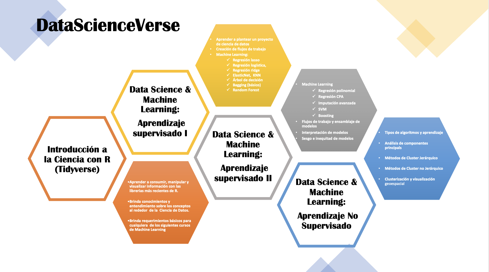
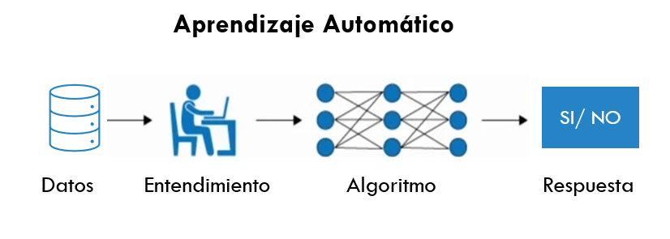
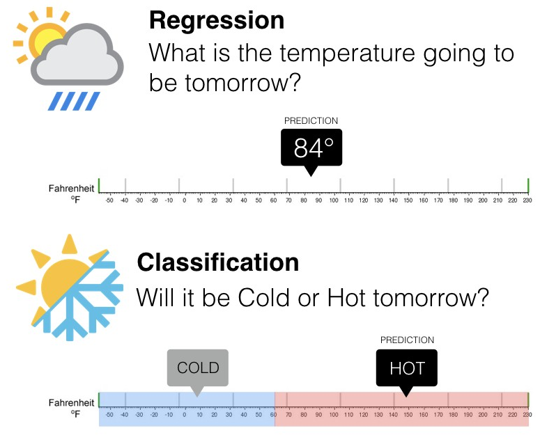
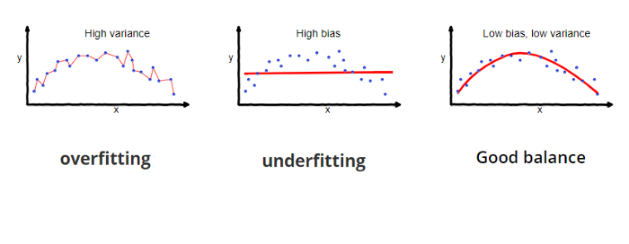
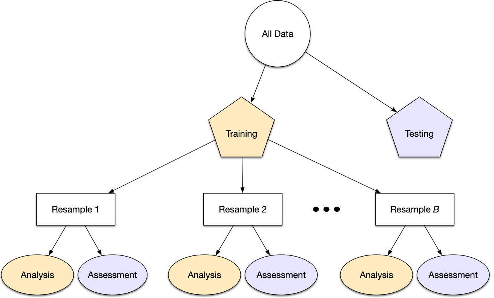
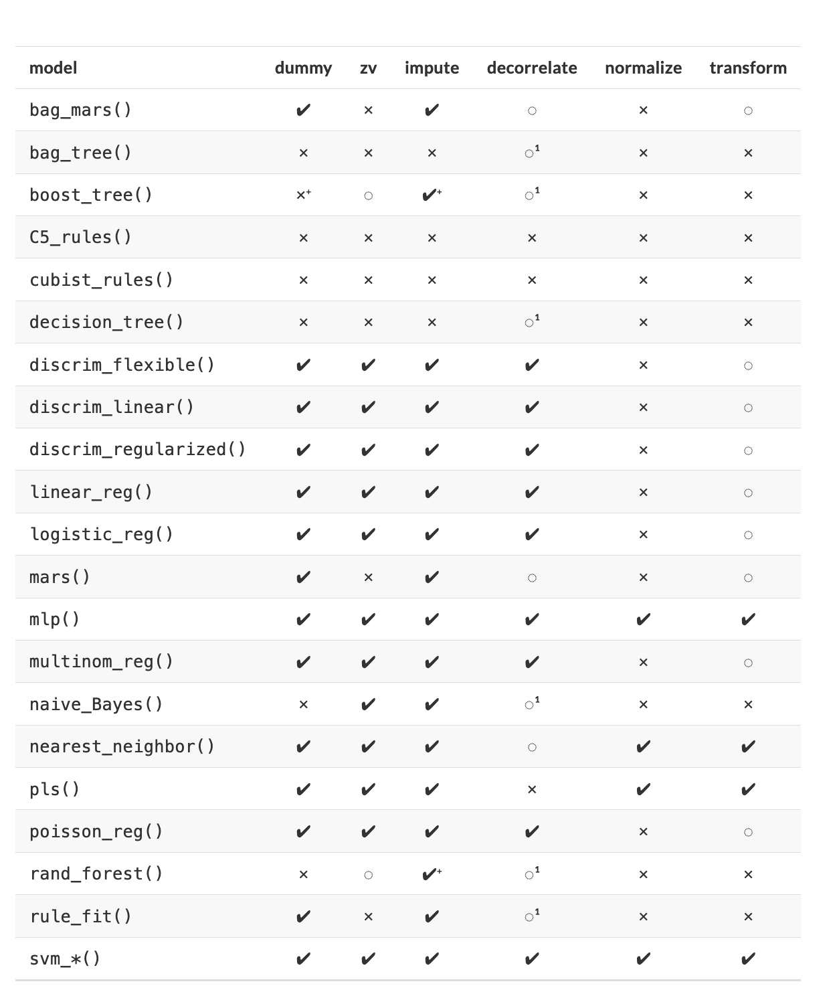
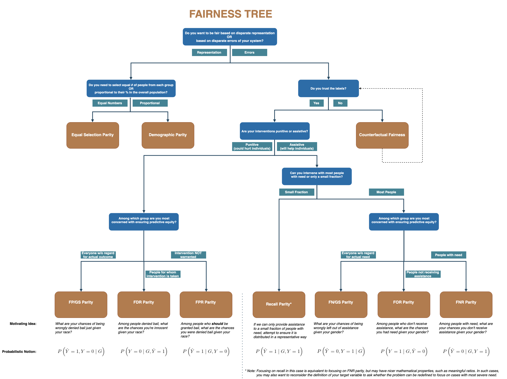
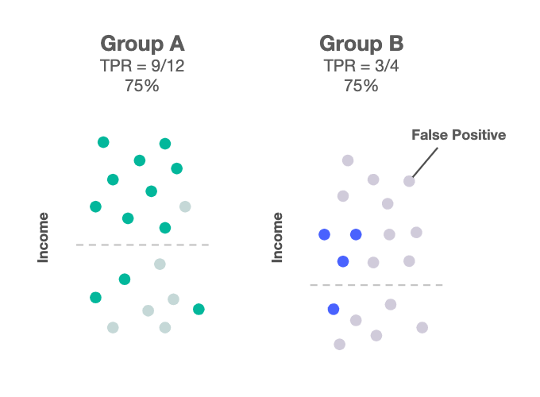

--- 
title: AMAT- Ciencia de Datos y Machine Learning 2
author:
  - Karina Lizette Gamboa Puente
  - Oscar Arturo Bringas López
institute: "AMAT"
site: bookdown::bookdown_site
documentclass: book
bibliography: [book.bib, packages.bib]
biblio-style: apalike
link-citations: yes
description: "AMAT Curso 2 : Ciencia de Datos y Machine Learning 2"
always_allow_html: true
---

```{r setup-python, include=FALSE}
library(reticulate)
use_miniconda("dsml_py_adv")
```

# BIENVENIDA {-}

## Objetivo {-}

Desarrollar conocimiento y habilidades para implementar modelos complejos de Machine Learning a través de un flujo de trabajo limpio, ordenado y sistematizado mediante las librerías de *Python* más usadas en ciencia de datos. Al finalizar este curso, el participante será capáz de combinar distintas clases de modelos para dar una solución compleja y precisa a problemas predictivos. Aprenderá a cuantificar los problemas éticos asociados al sesgo o inequidad producidos por modelos de machine learning, así como su interpretación en el mundo productivo. Finalmente, se estudiará la manera de desarrollar un diseño de experimento para implementarse en el ámbito empresarial de modo que el participante pueda tomar mejores decisiones para contribuir en su ambiente laboral.


::: {.infobox .important data-latex="{important}"}
**Se asume que el alumno tiene conocimientos generales de estadística, bases matemáticas y de programación básica en Python y que cuenta con los conocimientos teóricos básicos de machine learning y prácticos con pandas y scikit-learn.**
:::


## Instructores {-} 

**ACT. ARTURO BRINGAS** 

**LinkedIn:** [arturo-bringas](https://www.linkedin.com/in/arturo-bringas/)
**Email:** act.arturo.b@ciencias.unam.mx

Actuario, egresado de la Facultad de Ciencias y Maestría en Ciencia de Datos, ITAM. 
Experiencia en modelos predictivos y de clasificación de machine learning aplicado a seguros, deportes y movilidad internacional. Es jefe de departamento en Investigación Aplicada y Opinión de la UNAM, donde realiza estudios estadísticos de impacto social. Es consultor para empresas y organizaciones como GNP, El Universal, UNAM, Sinnia, la Organización de las Naciones Unidas Contra la Droga y el Delito (UNODC), entre otros. Actualmente es profesor de *ciencia de datos y machine learning* en AMAT y se desempeña como consultor independiente en diferentes proyectos contribuyendo a empresas en temas de machine learning, estadística, series de tiempo, visualización de datos y análisis geoespacial.

```{r echo=FALSE,fig.align='center'}

```


**ACT. KARINA LIZETTE GAMBOA** 

**LinkedIn:** [KaLizzyGam ](https://www.linkedin.com/in/kalizzygam/)
**Email:**  lizzygamboa@ciencias.unam.mx

Actuaria, egresada de la Facultad de Ciencias, UNAM, candidata a Maestra en
Ciencia de Datos por el ITAM.

Experiencia en áreas de analítica predictiva e inteligencia del negocio. Lead y Senior
Data Scientist en consultoría en diferentes sectores como tecnología, asegurador,
financiero y bancario. Experta en entendimiento de negocio para la correcta
implementación de algoritmos de inteligencia y explotación de datos.
Actualmente se desarrolla como Arquitecta de Soluciones Analíticas en Merama,
startup mexicana clasificada como uno de los nuevos unicornios de Latinoamérica.
Senior Data Science en CLOSTER y como profesora del diplomado de Metodología
de la Investigación Social por la UNAM así como instructora de cursos de Ciencia de
Datos en AMAT.

Empresas anteriores: GNP, Activer Banco y Casa de Bolsa, PlayCity Casinos,
RakenDataGroup Consulting, entre otros.

```{r echo=FALSE,fig.align='center',  out.width='600pt'}

```

## Ciencia de Datos en Python {-}

```{r echo=FALSE,fig.align='center',  out.width='600pt'}

```
 


## Estructura del curso actual {-}

### Alcances del curso {-}

Al finalizar el módulo, el participante sabrá plantear un proyecto de ciencia de datos, desde sus requerimientos hasta sus implementación comercial. Sabrá crear flujos de trabajo limpios y ordenados para crear poderosos modelos de Machine Learning. Podrá comparar múltiples modelos y seleccionar el que más aportación realice a su negocio considerando la ética alrededor del sesgo e inequidad producida por modelos. Profundizará su conocimiento en la interpretación de modelos complejos y aprenderá a cuantificar el beneficio comercial de la implementación de modelos. 

**Requisitos:**

> Computadora con al menos 4Gb Ram. 

> Instalación de Python con al menos versión 3.10

> Instalación de JupyterLab, VS Code o algún ambiente equivalente para ejecutar notebooks y scripts de Python

> Data Science & Machine Learning (Aprendizaje Supervisado I)


**Temario:**

**1.- Machine Learning (10 HRS)**

* Regresión polinomial
* Regresión con CPA
* Imputación
* SVM
* Boosting

**2. Flujos de trabajo y ensamblajes (8 HRS)**

* Pipelines
* Workflowsets
* Comparación de modelos
* Stacking

**3. Sesgo e inequidad de modelos (4 HRS)**

* Cuantificación de sesgo
* Cuantificación de inequidad

**4. Interpretación de modelos (4 HRS)**

* LIME
* DALExtra

**5. Aplicación a negocios (6 HRS)**

* Diseño de experimentos en campañas de retención
* Valuación de implementación de modelos

## Duración y evaluación del curso {-}

* El programa tiene una duración de 32 hrs.

* Las clases serán impartidas los días domingo, de 9:00 am a 1:00 pm 

* Serán asignados ejercicios que el participante deberá resolver entre una semana y otra.

* Al final del curso se solicitará un proyecto final, el cual **deberá ser entregado para ser acreedor a la constancia de participación**.


## Recursos y dinámica de clase {-}

En esta clase estaremos usando: 

* Python [da click aquí si aún no lo descargas](https://www.python.org/downloads/)
* JupyterLab [documentación de instalación](https://jupyter.org/install)
* Zoom [Clases](https://us02web.zoom.us/j/5155440751?pwd=YzJCOGF0VnlZdlZlS0Fpc3MvZEhadz09)
  - Pulgar arriba: Voy bien, estoy entendiendo! 
  - Pulgar abajo: Eso no quedó muy claro
  - Mano arriba: Quiero participar/preguntar ó Ya estoy listo para iniciar 
* Grupo de WhatsApp [El chismecito está aquí](https://chat.whatsapp.com/GgL9amuW4W8LALV6oqqvzu)
* [Google Drive](https://drive.google.com/drive/folders/1mlDGHvUy-81qfvQi_iB7tqMb9yhy3vyh?usp=sharing)
* Notas de clase [Revisame si quieres aprender](https://acturio.github.io/amt22_03intro2mls2/) 
* Finalmente, se dejarán ejercicios que serán clave para el éxito del aprendizaje de los capítulos, por lo que se trabajará en equipo para lograr adquirir el mayor aprendizaje. En este grupo se trabajará en equipos de 3 y 4 personas para enriquecer el aprendizaje y participación de todos.


<div class="watermark"></div>

<!--chapter:end:index.Rmd-->

<div class="watermark"></div>

# Repaso

```{python, include=FALSE}
from dsml_environment import ensure_conda_environment

ensure_conda_environment()
```

En los cursos anteriores, hemos hablando a cerca del proceso completo de Ciencia de Datos, para poder empezar con la segunda parte del curso de Analisis Supervisado, valele la pena hacer un breve repaso de lo que hemos estudiado hasta el momento.

## Machine Learning

**Machine Learning** o --aprendizaje automático-- es una rama de la inteligencia artificial que permite que las máquinas aprendan de los patrones existentes en los datos. Se usan métodos computacionales para aprender de datos con el fin de producir reglas para mejorar el desempeño en alguna tarea o toma de decisión. (Está enfocado en la programación de máquinas para aprender de los patrones existentes en datos principalmente estructurados y anticiparse al futuro)

```{r echo=FALSE,fig.align='center', out.width='600pt'}

```

```{r echo=FALSE,fig.align='center',out.width='600pt'}

```


## Tipos de aprendizaje

Platicamos en el módulo pasado que al hablar de Machine Learning, existen distintos tipos de aprendizaje, siendo los más comúnes:

* Aprendizaje supervisado
* Aprendizaje no supervisado

Otreos ejemplos de especialidades son

* Aprendizaje profundo
* Aprendizaje por refuerzo

La diferencia entre el análisis supervisado y el no supervisado es la etiqueta, es decir, en el análisis supervisado tenemos una etiqueta "correcta" y el objetivo de los algoritmos es predecir esta etiqueta.

### Aprendizaje supervisado

-   Conocemos la respuesta correcta de antemano.

-   Esta respuesta correcta fue "etiquetada" por un humano (la mayoría de las veces, en algunas circunstancias puede ser generada por otro algoritmo).

-   Debido a que conocemos la respuesta correcta, existen muchas métricas de desempeño del modelo para verificar que nuestro algoritmo está haciendo las cosas "bien".

#### Tipos de aprendizaje supervisado (Regresión vs clasificación)

Existen dos tipos principales de aprendizaje supervisado, esto depende del tipo de la variable respuesta:

-   Los algoritmos de **clasificación** se usan cuando el resultado deseado es una etiqueta discreta, es decir, clasifican un elemento dentro de diversas clases.

-   En un problema de **regresión**, la variable target o variable a predecir es un valor numérico.

<br/>

```{r echo=FALSE,fig.align='center', out.height='450pt', out.width='700pt'}

```

### Aprendizaje no supervisado

-   Aquí no tenemos la respuesta correcta de antemano ¿cómo podemos saber que el algoritmo está bien o mal?

-   Estadísticamente podemos verificar que el algoritmo está bien

-   Siempre tenemos que verificar con el cliente si los resultados que estamos obteniendo tienen sentido de negocio. Por ejemplo, número de grupos y características

```{r echo=FALSE,fig.align='center'}

```

## Errores: Sesgo vs varianza


En el mundo de Machine Learning cuando desarrollamos un modelo nos esforzamos para hacer que sea lo más preciso, ajustando los parámetros, pero la realidad es que no se puede construir un modelo 100% preciso ya que nunca pueden estar libres de errores.

Comprender cómo las diferentes fuentes de error generan sesgo y varianza nos ayudará a mejorar el proceso de ajuste de datos, lo que resulta en modelos más precisos, adicionalmente también evitará el error de sobreajuste y falta de ajuste.


- **Error por sesgo:**

Es la diferencia entre la predicción esperada de nuestro modelo y los valores verdaderos. Aunque al final nuestro objetivo es siempre construir modelos que puedan predecir datos muy cercanos a los valores verdaderos, no siempre es tan fácil porque algunos algoritmos son simplemente demasiado rígidos para aprender señales complejas del conjunto de datos.


Imagina ajustar una regresión lineal a un conjunto de datos que tiene un patrón no lineal, no importa cuántas observaciones más recopiles, una regresión lineal no podrá modelar las curvas en esos datos. Esto se conoce como *underfitting*.

- **Error por varianza:**

Se refiere a la cantidad que la estimación de la función objetivo cambiará si se utiliza diferentes datos de entrenamiento. La función objetivo se estima a partir de los datos de entrenamiento mediante un algoritmo de Machine Learning, por lo que deberíamos esperar que el algoritmo tenga alguna variación. Idealmente no debería cambiar demasiado de un conjunto de datos de entrenamiento a otro.

```{r echo=FALSE,fig.align='center', out.height='350pt', out.width='650pt'}

```

Los algoritmos de Machine Learning que tienen una gran varianza están fuertemente influenciados por los detalles de los datos de entrenamiento, esto significa que los detalles de la capacitación influyen en el número y los tipos de parámetros utilizados para caracterizar la función de mapeo.


- **Error irreducible:**
El error irreducible no se puede reducir, independientemente de qué algoritmo se usa. También se le conoce como ruido y, por lo general, proviene por factores como variables desconocidas que influyen en el mapeo de las variables de entrada a la variable de salida, un conjunto de características incompleto o un problema mal enmarcado. Acá es importante comprender que no importa cuán bueno hagamos nuestro modelo, nuestros datos tendrán cierta cantidad de ruido o un error irreductible que no se puede eliminar.

## Partición de datos


Cuando hay una gran cantidad de datos disponibles, una estrategia inteligente es asignar subconjuntos específicos de datos para diferentes tareas, en lugar de asignar la mayor cantidad posible solo a la estimación de los parámetros del modelo.

Si el conjunto inicial de datos no es lo suficientemente grande, habrá cierta superposición
de cómo y cuándo se asignan nuestros datos, y es importante contar con una metodología
sólida para la partición de datos.


### Métodos comunes para particionar datos

El enfoque principal para la validación del modelo es dividir el conjunto de datos existente en dos conjuntos distintos:

* **Entrenamiento:** Este conjunto suele contener la mayoría de los datos, los cuales
sirven para la construcción de modelos donde se pueden ajustar diferentes modelos,
se investigan estrategias de ingeniería de características, etc.

  La mayor parte del proceso de modelado se utiliza este conjunto.

* **Prueba:**  La otra parte de las observaciones se coloca en este conjunto.
Estos datos se mantienen en reserva hasta que se elijan uno o dos modelos como los de mejor rendimiento.

  El conjunto de prueba se utiliza como árbitro final para determinar la eficiencia del modelo,
  por lo que es fundamental mirar el conjunto de prueba una sola vez.

Supongamos que asignamos el $80\%$ de los datos al conjunto de entrenamiento y el $20\%$ restante a las pruebas. El método más común es utilizar un muestreo aleatorio simple.
En Python, `scikit-learn` tiene herramientas para realizar divisiones de datos como esta;
la función `train_test_split()` cubre este propósito.

```{python, message=FALSE, warning=FALSE}
from sklearn.model_selection import train_test_split

from dsml_utils import load_ames

ames = load_ames()

# Fijar una semilla para que los resultados puedan ser reproducibles.
ames_train, ames_test = train_test_split(
    ames,
    train_size=0.80,
    random_state=123,
)

{
    "train": ames_train.shape,
    "test": ames_test.shape,
    "total": ames.shape,
}
```

La información impresa denota la cantidad de datos en el conjunto de entrenamiento
$(n = 2,344)$, la cantidad en el conjunto de prueba $(n = 586)$
y el tamaño del grupo original de muestras $(n = 2,930)$.

El objeto `ames_split` es un objeto *rsplit* y solo contiene la información de partición; para obtener los conjuntos de datos resultantes, aplicamos dos funciones más:

```{python}
ames_train.shape
```


::: {.infobox .tip data-latex="{tip}"}
No hay un porcentaje de división óptimo para el conjunto de entrenamiento y prueba.

Los porcentajes de división más comunes comunes son:

  * Entrenamiento: $80\%$, Prueba: $20\%$
  * Entrenamiento: $67\%$, Prueba: $33\%$
  * Entrenamiento: $50\%$, Prueba: $50\%$
:::


### Conjunto de validación

El conjunto de validación se definió originalmente cuando los investigadores se dieron cuenta de que medir el rendimiento del conjunto de entrenamiento conducía a resultados que eran demasiado optimistas.

Esto llevó a modelos que se sobreajustaban, lo que significa que se desempeñaron muy bien en el conjunto de entrenamiento pero mal en el conjunto de prueba.

Para combatir este problema, se retuvo un pequeño conjunto de datos de *validación* y se utilizó para medir el rendimiento del modelo mientras este está siendo entrenado. Una vez que la tasa de error del conjunto de validación comenzara a aumentar, la capacitación se detendría.

En otras palabras, el conjunto de validación es un medio para tener una idea aproximada de qué tan bien se desempeñó el modelo antes del conjunto de prueba.

Por otra parte esta primera particíón de datos evolucionó hasta la manera en que usualmente se hacen con más de una validación:

```{r, fig.align='center', out.height='350pt', out.width='500pt', echo=F, include=TRUE}

```


## Recetas y tratamiento de datos

La ingenería de datos y procesamiento de datos es parte vital del desarrollo de un buen modelo.

En este curso analizaremos distintos métodos de machine learning que permitirán predecir una respuesta numérica o categórica. Usaremos el lenguaje de programación *Python* para dicho procesamiento.


```{python, include=FALSE}
import numpy as np
import pandas as pd
from sklearn.compose import ColumnTransformer
from sklearn.impute import SimpleImputer
from sklearn.pipeline import Pipeline
from sklearn.preprocessing import OneHotEncoder, StandardScaler
```

Hay varios pasos que se deben de seguir para crear un modelo útil:

* Recopilación de datos.
* Limpieza de datos.
* Creación de nuevas variables.
* Estimación de parámetros.
* Selección y ajuste del modelo.
* Evaluación del rendimiento.

Al comienzo de un proyecto, generalmente hay un conjunto finito de datos disponibles para todas estas tareas.

::: {.infobox .advice  data-latex="{advice}"}
**OJO:** A medida que los datos se reutilizan para múltiples tareas, aumentan los riesgos de agregar sesgos o grandes efectos de errores metodológicos.
:::

### Pre-procesamiento de datos

```{r, fig.align='center', out.height='200pt', out.width='800pt', echo=F, include=TRUE}

```

Como punto de partida para nuestro flujo de trabajo de aprendizaje automático, necesitaremos datos de entrada.
En la mayoría de los casos, estos datos se cargarán y almacenarán en forma de `DataFrame` de pandas.
Incluirán una o varias variables predictoras y, en caso de aprendizaje supervisado, también incluirán un resultado conocido.

Sin embargo, no todos los modelos pueden lidiar con diferentes problemas de datos y, a menudo,
necesitamos transformar los datos para obtener el mejor rendimiento posible del modelo.
Este proceso se denomina pre-procesamiento y puede incluir una amplia gama de pasos, como:

 * Dicotomización de variables
 * Near Zero Value (nzv) o Varianza Cero
 * **Imputaciones**
 * **Des-correlacionar**
 * Normalizar
 * Transformar
 * Creación de nuevas variables
 * Interacciones


En la tabla, $\checkmark$ indica que el método es obligatorio para el modelo y $\times$ indica que no lo es. El símbolo $\circ$ significa que la técnica puede ayudar al modelo, pero no es obligatorio.

```{r, fig.align='center', out.height='650pt', out.width='600pt', echo=F}

```

### Recetas

```{r, fig.align='left', out.height='150pt', out.width='150pt', echo=F, include=TRUE}

```


Una receta es una **serie de pasos o instrucciones para el procesamiento de datos.**
A diferencia del método de fórmula dentro de una función de modelado, **la receta define los pasos sin ejecutarlos** inmediatamente; es sólo una especificación de lo que se debe hacer. La estructura de una receta sigue los siguientes pasos:

1. Inicialización **`Pipeline()`** o **`ColumnTransformer()`**
2. Transformación mediante pasos como **`SimpleImputer()`**, **`StandardScaler()`**, **`OneHotEncoder()`**
3. Preparación **`fit()`**
4. Aplicación **`transform()`** o **`predict()`**

La siguiente sección explica la estructura y flujo de transformaciones:

```{python, eval=FALSE}
from sklearn.compose import ColumnTransformer
from sklearn.impute import SimpleImputer
from sklearn.pipeline import Pipeline
from sklearn.preprocessing import OneHotEncoder, StandardScaler

X_train = dataset.drop(columns="response")
y_train = dataset["response"]

numeric_features = X_train.select_dtypes(include="number").columns
categorical_features = X_train.select_dtypes(exclude="number").columns

preprocessor = ColumnTransformer(
    transformers=[
        ("num", Pipeline([
            ("imputer", SimpleImputer(strategy="median")),
            ("scaler", StandardScaler()),
        ]), numeric_features),
        ("cat", Pipeline([
            ("imputer", SimpleImputer(strategy="most_frequent")),
            ("onehot", OneHotEncoder(handle_unknown="ignore")),
        ]), categorical_features),
    ]
)

preprocessor.fit(X_train, y_train)
receta_aplicacion = preprocessor.transform(new_dataset)

```


#### Transformaciones generales

En cuanto a las transformaciones posibles, existe una gran cantidad de funciones que soportan este proceso. En esta sección se muestran algunas de las transformaciones más comunes y sus equivalentes habituales en pandas y scikit-learn:


* `DataFrame.loc[]` o `ColumnTransformer`: Selecciona un subconjunto de variables específicas en el conjunto de datos.

* `DataFrame.assign()`: Crea una nueva variable o modifica una existente.

* `DataFrame.apply()` o transformadores personalizados: modifica variables seleccionadas usando una función común.

* `DataFrame.query()` o máscaras booleanas: elimina filas de acuerdo con una condición.

* `DataFrame.sort_values()`: Ordena el conjunto de datos de acuerdo con una o más variables.

* `DataFrame.drop()` o `ColumnTransformer`: elimina variables según su nombre, tipo o función.

* `VarianceThreshold`: realiza una selección de variables eliminando aquellas cuya varianza se encuentre cercana a cero.

* `DataFrame.dropna()`: elimina todos los renglones que tengan alguna variable con valores perdidos.

* `StandardScaler`: centra y escala las variables numéricas especificadas.

* `MinMaxScaler`: transforma el rango de un conjunto de variables numéricas al especificado.

* `PolynomialFeatures(interaction_only=True)` o variables creadas con pandas: crea interacciones entre variables.

* `DataFrame.assign()`: crea una nueva variable a partir del cociente entre dos variables.

* `X.columns`: selecciona todos los predictores del conjunto de entrenamiento para aplicarles alguna de las funciones mencionadas.

* `make_column_selector(dtype_include=np.number)`: selecciona todos los predictores numéricos.

* `make_column_selector(dtype_exclude=np.number)`: selecciona todos los predictores categóricos.

<!--chapter:end:01-repaso.Rmd-->

<div class="watermark"></div>

# Feature Engineering

```{python, include=FALSE}
from dsml_environment import ensure_conda_environment

ensure_conda_environment()
```

## Regresión polinomial

Es común encontrar en la literatura este tema junto con la regresión múltiple, sin embargo, el alcance de esta transformación va a más allá de la regresión lineal, por lo que estudiaremos este tema como parte de la ingeniería de variables y no como un modelo lineal exclusivamente.

El objetivo de la transformación polinomial dentro de la ingeniería de variables es crear nuevas variables que puedan explicar la relación entre la variable de respuesta y explicativa a través de un polinomio de grado *k*.

En el siguiente gráfico se representa mediante una línea roja a la regresión lineal y mediante una curva azul al polinomio que relaciona a las variables independiente y dependiente.

```{python, warning=FALSE, message=FALSE, echo=FALSE}
import matplotlib.pyplot as plt
import numpy as np
import pandas as pd
from IPython.display import display
from sklearn.linear_model import LinearRegression
from sklearn.pipeline import Pipeline
from sklearn.preprocessing import PolynomialFeatures

rng = np.random.default_rng(12345)
n = 100

fig, axes = plt.subplots(2, 1, figsize=(8, 8))
for ax, x, y, title in [
    (
        axes[0],
        np.linspace(0, 10, n),
        np.linspace(0, 10, n) ** 2 + rng.normal(0, 5, n),
        "Regresión cuadrática Vs Regresión lineal",
    ),
    (
        axes[1],
        np.linspace(-10, 10, n),
        np.linspace(-10, 10, n) ** 3 + rng.normal(0, 100, n),
        "Regresión cúbica Vs Regresión lineal",
    ),
]:
    x_matrix = x.reshape(-1, 1)
    linear = LinearRegression().fit(x_matrix, y)
    polynomial = Pipeline(
        [("poly", PolynomialFeatures(degree=3, include_bias=False)), ("lm", LinearRegression())]
    ).fit(x_matrix, y)
    grid = np.linspace(x.min(), x.max(), 200).reshape(-1, 1)
    ax.scatter(x, y, s=20)
    ax.plot(grid.ravel(), linear.predict(grid), color="red", label="Lineal")
    ax.plot(grid.ravel(), polynomial.predict(grid), color="tab:blue", label="Polinomial")
    ax.set_title(title)
    ax.set_xlabel("Variable dependiente")
    ax.set_ylabel("Variable de respuesta")
    ax.legend()
plt.tight_layout()

```

Es evidente que existe un mejor ajuste cuando se considera un polinomio de grado *k* en vez de la componente lineal. Este método ofrece mayor flexibilidad para el ajuste de un modelo. Será importante **mediar posteriormente entre el sesgo y la varianza** de forma que podamos tener un mejor ajuste sin caer en el sobreajuste. La fórmula que expresa la relación entre variable de respuesta y explicativas es ahora:

$$Y_i \sim X_1 + X_1^2$$

Es importante mencionar que cuando se ajusta un modelo polinomial de segundo orden, se deben mantener ambas variables en el model (la original y la cuadrática). Cuando se tenga un modelo polinomial de grado *k*, se deberán conservar los *k* elementos que componen el polinomio:

$$Y\sim X_1+X_1^2 + ... + X_1^k$$

Estas transformaciones son posibles realizarlas a múltiples variables que conforman el conjunto de datos que sirve de insumo para el modelo. A través de los pasos secuenciales de un `Pipeline` podemos integrar esta tarea con `PolynomialFeatures`. Veamos un ejemplo:

```{python, message=FALSE, warning=FALSE}
n = 100
rng = np.random.default_rng(12345)
original_data = pd.DataFrame({"x": np.linspace(-10, 10, n)})
original_data["y"] = original_data["x"] ** 3 + rng.normal(0, 100, n)

poly_model = Pipeline(
    [
        ("poly", PolynomialFeatures(degree=3, include_bias=False)),
        ("lm", LinearRegression()),
    ]
)
poly_model.fit(original_data[["x"]], original_data["y"])

poly_features = poly_model.named_steps["poly"].transform(original_data[["x"]])
poly_recipe = pd.DataFrame(poly_features, columns=["x_poly_1", "x_poly_2", "x_poly_3"])
poly_recipe["y"] = original_data["y"].to_numpy()
display(poly_recipe.head())

coeficientes = pd.Series(
    np.r_[poly_model.named_steps["lm"].intercept_, poly_model.named_steps["lm"].coef_],
    index=["intercept", "x_poly_1", "x_poly_2", "x_poly_3"],
)
display(coeficientes)

grid = pd.DataFrame({"x": np.linspace(-10, 10, 200)})
plt.scatter(original_data["x"], original_data["y"], s=20)
plt.plot(grid["x"], poly_model.predict(grid), color="tab:blue")
plt.title("Regresión polinomial")
plt.xlabel("x")
plt.ylabel("y")
```

En el ejemplo anterior puede mostrarse que es a través de la ponderación de los términos polinomiales que se logra estimar a la variable de respuesta *Y*.

Este mismo procedimiento puede usarse en la receta de la ingeniería de datos para realizar la predicción de una variable de respuesta mediante cualquier otro algoritmo predictivo.


## Regularización Elasticnet

En muchas técnicas de aprendizaje automático, **el aprendizaje consiste en encontrar los coeficientes que minimizan una función de costo**. Un modelo estándar de mínimos cuadrados tiende a tener alguna variación, es decir, este modelo no se generalizará bien para un conjunto de datos diferente a sus datos de entrenamiento.

La regularización consiste en **añadir una penalización a la función de costo. Esta penalización produce modelos más simples que generalizan mejor y evita el riesgo de sobre-ajuste**.

El procedimiento de ajuste implica una función de pérdida, conocida como suma de cuadrados residual o *RSS*. Los coeficientes $\beta$ se eligen de manera que minimicen esta función de pérdida.

$$RSS = \sum_{i=1}^n\left(y_i - \beta_0- \sum_{i=1}^p \beta_jx_{ij}\right)^2$$

Esto ajustará los coeficientes en función de sus datos de entrenamiento. Si hay ruido en los datos de entrenamiento, los coeficientes estimados no se generalizarán bien a los datos futuros. Aquí es donde entra la regularización y reduce o regulariza estas estimaciones aprendidas hacia cero.

En esta sección se verán las regularizaciones más usadas en machine learning: 

* Ridge (conocida también como L2) 
* Lasso (también conocida como L1)
* ElasticNet que combina tanto Lasso como Ridge.

Para cada una de estas regularizaciones ajustaremos modelos lineales con `scikit-learn`. En regresión usaremos el conjunto de viviendas de *Ames*; en clasificación usaremos el conjunto de abandono de clientes de Telco.

```{r, fig.align='center', out.height='250pt', out.width='500pt', echo=F, include=TRUE}
knitr::include_graphics("img/10-ml-elasticnet/overfitting.png")
```


### Regularización Ridge


En este tipo de regularización *RSS* se modifica agregando una cantidad de **contracción a los coeficientes**, los cuales se estiman minimizando esta función. $\lambda$ es el parámetro de ajuste que decide cuánto queremos penalizar la flexibilidad de el modelo. 

$$\sum_{i=1}^n\left(y_i - \beta_0- \sum_{i=1}^p \beta_jx_{ij}\right)^2 + \lambda \sum_{j=1}^p \beta_j^2 = RSS + \lambda \sum_{j=1}^p \beta_j^2$$

El aumento de la flexibilidad de un modelo está representado por el aumento de sus coeficientes, si se desea minimizar la función anterior, los coeficientes  deben ser pequeños. 

Así es como la técnica de regresión de *Ridge* evita que los coeficientes aumenten demasiado. Además, reduce la asociación estimada de cada variable con la respuesta excepto la intersección $\beta_0$. Esta intersección es una medida del valor medio de la respuesta cuando $x_{i1} = x_{i2} =\dots= x_{ip} = 0$.

> Cuando $\lambda = 0$, el término de penalización no tiene efecto y las estimaciones  serán iguales a mínimos cuadrados. 

> A medida que $\lambda \rightarrow \infty$, el impacto de la penalización por contracción aumenta, y las estimaciones se acercarán a cero. 

La selección de un buen valor de $\lambda$ es fundamental. Las estimaciones de  coeficientes producidas por este método también se conocen como la **norma L2**.


**Nota:** Es necesario estandarizar los predictores o llevarlos a la misma escala antes de aplicar esta regularización. 


### Regularización Lasso

Lasso es otra variación, en la que se minimiza la función *RSS*. Utiliza $|\beta_j|$ en lugar de los cuadrados de $\beta$ como penalización. Las estimaciones de coeficientes producidas por este método también se conocen como la **norma L1**.

$$\sum_{i=1}^n\left(y_i - \beta_0- \sum_{i=1}^p \beta_jx_{ij}\right)^2 + \lambda \sum_{j=1}^p |\beta_j| = RSS + \lambda \sum_{j=1}^p |\beta_j|$$

> Cuando $\lambda = 0$, el término de penalización no tiene efecto y las estimaciones  serán iguales a mínimos cuadrados. 

> A medida que $\lambda \rightarrow \infty$, el impacto de la penalización por contracción aumenta, y las estimaciones se convierten en cero (eliminando variables). 

Este método de regularización permite eliminar coeficientes con alta variación, lo cual **ayuda a la selección de variables**.

## Comparación entre Ridge y Lasso

La regresión *Ridge* se puede considerar como la solución de una ecuación, donde la suma de los cuadrados de los coeficientes es menor o igual que $s$,  donde $s$ es una constante que existe para cada valor del factor de contracción $\lambda$

$$\beta_1^2 + \beta_2^2 \leq s$$

Esto implica que los coeficientes de la regresión *Ridge* tienen el *RSS* (función de pérdida) más pequeño para todos los puntos que se encuentran dentro del círculo dado por la función de restricción  $\beta_1^2 + \beta_2^2 \leq s$. 

Y en la regresión *Lasso* se puede considerar como una ecuación en la que la suma del módulo de coeficientes es menor o igual que $s$. 

$$|\beta_1| + |\beta_2| \leq s$$

Esto implica que los coeficientes de lasso tienen la *RSS* (función de pérdida) más pequeña para todos los puntos que se encuentran dentro del diamante dado por la función de restricción $|\beta_1| + |\beta_2| \leq s$

```{r, fig.align='center', out.height='300pt', out.width='600pt', echo=F, include=TRUE}
knitr::include_graphics("img/10-ml-elasticnet/ridge-lasso.png")
```

La imagen de arriba muestra las funciones de restricción (áreas verdes) para *Lasso* (izquierda) y *Ridge* (derecha), junto con contornos para *RSS* (elipse roja).

Para un valor muy grande de $s$, las regiones verdes contendrán el centro de la elipse, lo que hará que las estimaciones de los coeficientes de ambas técnicas de regresión sean iguales a las estimaciones de mínimos cuadrados. Pero este no es el caso en la imagen de arriba. 

En este caso, las estimaciones del coeficiente de regresión de *Lasso* y *Ridge* vienen dadas por el primer punto en el que una elipse contacta con la región de restricción. Dado que la regresión *Ridge* tiene una restricción circular sin puntos agudos, **esta intersección generalmente no ocurrirá en un eje, por lo que las estimaciones del coeficiente de regresión de _Ridge_ serán exclusivamente distintas de cero**.

Sin embargo, la restricción de *Lasso* **tiene esquinas en cada uno de los ejes**, por lo que la elipse a menudo intersectará la región de restricción en un eje. **Cuando esto ocurre, uno de los coeficientes será igual a cero**. En dimensiones más altas, muchas de las estimaciones de coeficientes pueden ser iguales a cero simultáneamente.

**Desventajas**

* Regresión *Ridge*: Reducirá los coeficientes de los predictores menos importantes, muy cerca de cero. Pero nunca los hará exactamente cero. En otras palabras, el modelo final incluirá todos los predictores. 

* Regresión *Lasso*: La penalización *L1* tiene el efecto de forzar algunas de las estimaciones de              coeficientes a ser exactamente iguales a cero cuando el parámetro de ajuste $\lambda$ es suficientemente grande. Por lo tanto, este método realiza una selección de variables.


### ElasticNet

*ElasticNet* surgió por primera vez como resultado de la crítica a *Lasso*, cuya selección de variables puede ser demasiado dependiente de los datos y, por lo tanto, inestable. La solución es **combinar las penalizaciones** de la regresión de *Ridge* y *Lasso* para obtener lo mejor de ambas regularizaciones.

*ElasticNet* tiene como objetivo minimizar la siguiente función de pérdida:

$$\frac{\sum_{i=1}^n\left(y_i - \beta_0- \sum_{i=1}^p \beta_jx_{ij}\right)^2}{2n} + 
\lambda\left(\alpha \sum_{j=1}^p|\beta_j| + \frac{1-\alpha}{2} \sum_{j=1}^p \beta_j ^2\right)$$

$$= \frac{RSS}{2n}+ \lambda\left(\alpha \sum_{j=1}^p|\beta_j| + \frac{1-\alpha}{2} \sum_{j=1}^p \beta_j ^2\right)$$

donde $\alpha \in [0,1]$ es el parámetro de mezcla entre la regularización *Ridge* $(\alpha = 0)$ y la regularización *Lasso* $(\alpha = 1)$. En `scikit-learn`, este parámetro se llama `l1_ratio`; la intensidad total de la penalización se controla con `alpha` en regresión y con `C` en regresión logística.

La combinación de ambas penalizaciones suele dar lugar a buenos resultados. Una estrategia frecuentemente utilizada es asignarle casi todo el peso a la penalización *L1* ( $\alpha \approx 1$) para conseguir seleccionar predictores y menos peso a la regularización $L2$ para dar cierta estabilidad en el caso de que algunos predictores estén correlacionados.

```{r, fig.align='center', out.height='400pt', out.width='550pt', echo=F, include=TRUE}
knitr::include_graphics("img/10-ml-elasticnet/elastic-net.png")
```


### Implementación en Python

#### Regresión

Utilizaremos `Ridge`, `Lasso` y `ElasticNet` de `sklearn.linear_model`. El preprocesamiento se encapsula en un `Pipeline`, de forma que la imputación, escalamiento y codificación de variables se estimen solamente con los datos de entrenamiento.

En `scikit-learn` los parámetros principales son:

* `alpha`: intensidad total de regularización en `Ridge`, `Lasso` y `ElasticNet`. Valores mayores producen coeficientes más pequeños.

* `l1_ratio`: proporción de regularización *L1* en `ElasticNet`. Cuando `l1_ratio = 1`, el comportamiento es equivalente a *Lasso*; cuando `l1_ratio = 0`, es equivalente a *Ridge*. Para los casos puros usaremos directamente `Ridge` y `Lasso`.


**Paso 1: Separación inicial de datos ( test, train, KFCV )**
```{python, warning=FALSE, message=FALSE}
import matplotlib.pyplot as plt
import numpy as np
import pandas as pd
from IPython.display import display
from scipy.stats import loguniform, uniform
from sklearn.linear_model import ElasticNet, Lasso, LogisticRegression, Ridge
from sklearn.metrics import average_precision_score, make_scorer
from sklearn.model_selection import KFold, RandomizedSearchCV, StratifiedKFold, train_test_split

from dsml_utils import (
    best_cv_results,
    classification_metrics,
    load_ames,
    load_telco,
    make_ames_pipeline,
    make_telco_pipeline,
    pr_curve_table,
    regression_metrics,
    roc_curve_table,
)

ames = load_ames()
ames_train, ames_test = train_test_split(ames, train_size=0.75, random_state=4595)
X_ames_train = ames_train.drop(columns="Sale_Price")
y_ames_train = ames_train["Sale_Price"]
X_ames_test = ames_test.drop(columns="Sale_Price")
y_ames_test = ames_test["Sale_Price"]
ames_folds = KFold(n_splits=5, shuffle=True, random_state=4595)
```

Contando con datos de entrenamiento, procedemos a realizar el feature engineering para extraer las mejores características que permitirán realizar las estimaciones en el modelo.

**Paso 2: Pre-procesamiento e ingeniería de variables**

```{python, warning=FALSE,message=FALSE}
receta_casas = make_ames_pipeline(ElasticNet(max_iter=20_000), scale_numeric=True)
receta_casas
```

Recordemos que un **Pipeline** contiene los pasos a seguir. Usamos **fit()** para estimar transformaciones y modelo, y **transform()** o **predict()** para aplicarlo a nuevos datos.

Una vez que la receta de transformación de datos está lista, procedemos a implementar el pipeline del modelo de interés.

**Paso 3: Selección de tipo de modelo con hiperparámetros iniciales**

```{python, warning=FALSE,message=FALSE}
ridge_regression_model = Ridge()
lasso_regression_model = Lasso(max_iter=20_000)
elasticnet_regression_model = ElasticNet(max_iter=20_000)
elasticnet_regression_model
```

**Paso 4: Inicialización de workflow o pipeline**

```{python, warning=FALSE,message=FALSE}
ridge_workflow = make_ames_pipeline(ridge_regression_model, scale_numeric=True)
lasso_workflow = make_ames_pipeline(lasso_regression_model, scale_numeric=True)
elasticnet_workflow = make_ames_pipeline(elasticnet_regression_model, scale_numeric=True)
elasticnet_workflow
```

Antes de optimizar hiperparámetros, comparemos los tres enfoques con valores fijos de regularización:

```{python, warning=FALSE,message=FALSE}
regularized_models = {
    "Ridge": make_ames_pipeline(Ridge(alpha=10), scale_numeric=True),
    "Lasso": make_ames_pipeline(Lasso(alpha=1_000, max_iter=20_000), scale_numeric=True),
    "ElasticNet": make_ames_pipeline(ElasticNet(alpha=1_000, l1_ratio=0.5, max_iter=20_000), scale_numeric=True),
}

comparison_rows = []
for name, model in regularized_models.items():
    model.fit(X_ames_train, y_ames_train)
    predictions = model.predict(X_ames_test)
    metrics = regression_metrics(y_ames_test, predictions)
    coefficients = model.named_steps["model"].coef_
    comparison_rows.append(
        {
            "modelo": name,
            "rmse": metrics.query("metric == 'rmse'")["estimate"].iloc[0],
            "mae": metrics.query("metric == 'mae'")["estimate"].iloc[0],
            "rsq": metrics.query("metric == 'rsq'")["estimate"].iloc[0],
            "coeficientes_no_cero": np.sum(np.abs(coefficients) > 1e-8),
        }
    )

pd.DataFrame(comparison_rows).round(3)
```

**Paso 5: Creación de grid search**

```{python, warning=FALSE,message=FALSE}
elasticnet_param_distributions = {
    "model__alpha": loguniform(1e-4, 1e2),
    "model__l1_ratio": uniform(0.05, 0.95),
}

regression_scoring = {
    "rmse": "neg_root_mean_squared_error",
    "mae": "neg_mean_absolute_error",
    "mape": "neg_mean_absolute_percentage_error",
    "rsq": "r2",
}
elasticnet_param_distributions
```

**Paso 6: Entrenamiento de modelos con hiperparámetros definidos**

```{python, warning=FALSE,message=FALSE, eval=FALSE}
elasticnet_tune_result = RandomizedSearchCV(
    elasticnet_workflow,
    param_distributions=elasticnet_param_distributions,
    n_iter=50,
    cv=ames_folds,
    scoring=regression_scoring,
    refit="rmse",
    random_state=195628,
    n_jobs=-1,
)
elasticnet_tune_result.fit(X_ames_train, y_ames_train)

import joblib
joblib.dump(elasticnet_tune_result, "models/elasticnet_model_reg.joblib")
```

Para que el documento se pueda ejecutar en clase sin esperar un ajuste largo, usamos menos iteraciones en el siguiente bloque:

```{python, warning=FALSE,message=FALSE}
elasticnet_tune_result = RandomizedSearchCV(
    elasticnet_workflow,
    param_distributions=elasticnet_param_distributions,
    n_iter=20,
    cv=ames_folds,
    scoring=regression_scoring,
    refit="rmse",
    random_state=195628,
    n_jobs=-1,
)
elasticnet_tune_result.fit(X_ames_train, y_ames_train)
pd.DataFrame(elasticnet_tune_result.cv_results_).head()
```

**Paso 7: Análisis de métricas de error e hiperparámetros (Vuelve al paso 3, si es necesario)**

Podemos obtener las métricas de cada *fold* con el siguiente código:

```{python}
best_cv_results(elasticnet_tune_result, metric="rmse", n=10)
```

En la siguiente gráfica observamos las distintas métricas de error asociadas a los hiperparámetros elegidos:

```{python}
elasticnet_cv_results = pd.DataFrame(elasticnet_tune_result.cv_results_)
elasticnet_cv_results["rmse"] = -elasticnet_cv_results["mean_test_rmse"]
elasticnet_cv_results["mae"] = -elasticnet_cv_results["mean_test_mae"]
elasticnet_cv_results["mape"] = -elasticnet_cv_results["mean_test_mape"]

ax = elasticnet_cv_results.plot.scatter(
    x="param_model__alpha",
    y="rmse",
    c="param_model__l1_ratio",
    colormap="viridis",
    logx=True,
    figsize=(7, 4),
)
ax.set_title("RMSE por alpha y l1_ratio")
ax.set_xlabel("alpha")
ax.set_ylabel("RMSE")
```

En la siguiente gráfica observamos la $R^2$ asociada a distintos niveles de regularización.

```{python}
elasticnet_cv_results.plot.scatter(
    x="param_model__alpha",
    y="mean_test_rsq",
    c="param_model__l1_ratio",
    colormap="viridis",
    logx=True,
    figsize=(7, 4),
)
plt.title("R cuadrada por alpha y l1_ratio")
plt.xlabel("alpha")
plt.ylabel("R cuadrada promedio en CV")
```


**Paso 8: Selección de modelo a usar**

Con el siguiente código obtenemos los mejores 10 modelos respecto al *rmse*.

```{python}
best_cv_results(elasticnet_tune_result, metric="rmse", n=10)
```

Ahora obtendremos el modelo que mejor desempeño tiene tomando en cuenta el *rmse*.

```{python}
best_elasticnet_regression_model = elasticnet_tune_result.best_params_
best_elasticnet_regression_model
```

**Paso 9: Ajuste de modelo final con todos los datos (Vuelve al paso 2, si es necesario)**

```{python}
final_elasticnet_regression_model = elasticnet_tune_result.best_estimator_
final_elasticnet_regression_model
```

Este último objeto es el modelo final entrenado, el cual contiene toda la información del pre-procesamiento de datos, por lo que en caso de ponerse en producción el modelo, sólo se necesita de este último elemento para poder realizar nuevas predicciones. 

Antes de pasar al siguiente paso, es importante validar que hayamos hecho un uso correcto de las variables predictivas. En este momento es posible detectar variables que no estén aportando valor o variables que no debiéramos estar usando debido a que cometeríamos [data leakage](https://towardsdatascience.com/data-leakage-in-machine-learning-6161c167e8ba). Para enfrentar esto, ayuda estimar y ordenar el valor de importancia de cada variable en el modelo. En modelos lineales regularizados podemos inspeccionar los coeficientes después del preprocesamiento.

```{python}
feature_names = final_elasticnet_regression_model.named_steps["preprocess"].get_feature_names_out()
coeficientes_elasticnet = (
    pd.DataFrame(
        {
            "Variable": feature_names,
            "Coeficiente": final_elasticnet_regression_model.named_steps["model"].coef_,
        }
    )
    .assign(Importancia=lambda data: data["Coeficiente"].abs())
    .sort_values("Importancia", ascending=False)
)
display(coeficientes_elasticnet.head(20))

ax = coeficientes_elasticnet.head(20).sort_values("Importancia").plot.barh(
    x="Variable", y="Importancia", legend=False, figsize=(8, 6)
)
ax.set_title("Importancia de las variables")
```


**Paso 10: Validar poder predictivo con datos de prueba**

Imaginemos por un momento que pasa un mes de tiempo desde que hicimos nuestro modelo, es hora de ponerlo a prueba prediciendo valores de nuevos elementos:

```{python}
results = pd.DataFrame(
    {
        "Sale_Price": y_ames_test.to_numpy(),
        "pred_elasticnet_reg": final_elasticnet_regression_model.predict(X_ames_test),
    }
)
results.head()
```

**Métricas de desempeño**

Ahora para calcular las métricas de desempeño usaremos funciones de `sklearn.metrics` envueltas en una utilidad del repositorio:

```{python}
regression_metrics(results["Sale_Price"], results["pred_elasticnet_reg"]).assign(
    estimate=lambda data: data["estimate"].round(2)
)
```

```{python}
plt.figure(figsize=(6, 5))
plt.scatter(results["pred_elasticnet_reg"], results["Sale_Price"], alpha=0.6)
lims = [
    results[["pred_elasticnet_reg", "Sale_Price"]].min().min(),
    results[["pred_elasticnet_reg", "Sale_Price"]].max().max(),
]
plt.plot(lims, lims, color="red")
plt.xlabel("Predicción")
plt.ylabel("Observación")
plt.title("Comparación")
plt.tight_layout()
```


#### Clasificación

Para clasificación usaremos regresión logística con penalización `elasticnet`. En `scikit-learn`, la regresión logística usa `C` como inverso de la regularización: valores pequeños de `C` implican una penalización más fuerte.

**Paso 1: Separación inicial de datos (test, train)**

```{python}
telco = load_telco("data/Churn.csv")

telco_train, telco_test = train_test_split(
    telco,
    train_size=0.70,
    random_state=1234,
    stratify=telco["Churn"],
)
X_telco_train = telco_train.drop(columns="Churn")
y_telco_train = telco_train["Churn"]
X_telco_test = telco_test.drop(columns="Churn")
y_telco_test = telco_test["Churn"]
telco_folds = StratifiedKFold(n_splits=5, shuffle=True, random_state=1234)
telco_train.head()
```

**Paso 2: Pre-procesamiento e ingeniería de variables**

```{python}
telco_rec = make_telco_pipeline(
    LogisticRegression(penalty="elasticnet", solver="saga", l1_ratio=0.5, max_iter=5_000),
    scale_numeric=True,
)
telco_rec
```

**Paso 3: Selección de tipo de modelo con hiperparámetros iniciales**

```{python}
elasticnet_class_model = LogisticRegression(
    penalty="elasticnet",
    solver="saga",
    l1_ratio=0.5,
    max_iter=5_000,
    random_state=1234,
)
elasticnet_class_model
```

**Paso 4: Inicialización de workflow o pipeline**

```{python}
elasticnet_class_workflow = make_telco_pipeline(elasticnet_class_model, scale_numeric=True)
elasticnet_class_workflow
```

**Paso 5: Creación de grid search**

```{python}
elasticnet_class_param_distributions = {
    "model__C": loguniform(1e-2, 1e2),
    "model__l1_ratio": uniform(0.05, 0.95),
}

classification_scoring = {
    "roc_auc": "roc_auc",
    "pr_auc": make_scorer(
        average_precision_score,
        response_method="predict_proba",
        pos_label="Yes",
    ),
}
elasticnet_class_param_distributions
```


**Paso 6: Entrenamiento de modelos con hiperparámetros definidos**

```{python, eval=FALSE}
elasticnet_class_tune_result = RandomizedSearchCV(
    elasticnet_class_workflow,
    param_distributions=elasticnet_class_param_distributions,
    n_iter=50,
    cv=telco_folds,
    scoring=classification_scoring,
    refit="pr_auc",
    random_state=1234,
    n_jobs=-1,
)
elasticnet_class_tune_result.fit(X_telco_train, y_telco_train)

import joblib
joblib.dump(elasticnet_class_tune_result, "models/elasticnet_class_model.joblib")
```

**Paso 7: Análisis de métricas de error e hiperparámetros (Vuelve al paso 3, si es necesario)**

```{python}
elasticnet_class_tune_result = RandomizedSearchCV(
    elasticnet_class_workflow,
    param_distributions=elasticnet_class_param_distributions,
    n_iter=20,
    cv=telco_folds,
    scoring=classification_scoring,
    refit="pr_auc",
    random_state=1234,
    n_jobs=-1,
)
elasticnet_class_tune_result.fit(X_telco_train, y_telco_train)
best_cv_results(elasticnet_class_tune_result, metric="pr_auc", n=10)
```

En la siguiente gráfica observamos las distintas métricas de error asociadas a los hiperparámetros elegidos:

```{python}
elasticnet_class_results = pd.DataFrame(elasticnet_class_tune_result.cv_results_)
elasticnet_class_results.plot.scatter(
    x="param_model__C",
    y="mean_test_pr_auc",
    c="param_model__l1_ratio",
    colormap="viridis",
    logx=True,
    figsize=(7, 4),
)
plt.title("PR AUC por C y l1_ratio")
plt.xlabel("C")
plt.ylabel("PR AUC promedio en CV")
```

```{python}
best_cv_results(elasticnet_class_tune_result, metric="roc_auc", n=10)
```

```{python}
best_cv_results(elasticnet_class_tune_result, metric="pr_auc", n=10)
```


**Paso 8: Selección de modelo a usar**

```{python, message=FALSE, warning=FALSE}
best_elasticnet_class_model = elasticnet_class_tune_result.best_params_
best_elasticnet_class_model
```

**Paso 9: Ajuste de modelo final con todos los datos (Vuelve al paso 2, si es necesario)**

```{python, message=FALSE, warning=FALSE}
final_elasticnet_class_model = elasticnet_class_tune_result.best_estimator_
final_elasticnet_class_model
```

Como hemos hablado anteriormente, este último objeto es el modelo final entrenado, el cual contiene toda la información del pre-procesamiento de datos, por lo que en caso de ponerse en producción el modelo, sólo se necesita de este último elemento para poder realizar nuevas predicciones.

Antes de pasar al siguiente paso, es importante validar que hayamos hecho un uso correcto de las variables predictivas. En modelos lineales regularizados podemos revisar los coeficientes para identificar qué variables tienen mayor peso en la predicción.

```{python}
telco_feature_names = final_elasticnet_class_model.named_steps["preprocess"].get_feature_names_out()
coeficientes_churn = (
    pd.DataFrame(
        {
            "Variable": telco_feature_names,
            "Coeficiente": final_elasticnet_class_model.named_steps["model"].coef_.ravel(),
        }
    )
    .assign(Importancia=lambda data: data["Coeficiente"].abs())
    .sort_values("Importancia", ascending=False)
)
display(coeficientes_churn.head(20))

ax = coeficientes_churn.head(20).sort_values("Importancia").plot.barh(
    x="Variable", y="Importancia", legend=False, figsize=(8, 6)
)
ax.set_title("Importancia de las variables")
```

**Paso 10: Validar poder predictivo con datos de prueba**

Imaginemos por un momento que pasa un mes de tiempo desde que hicimos nuestro modelo, es hora de ponerlo a prueba prediciendo valores de nuevos elementos:

```{python, message=FALSE, warning=FALSE}
class_labels = list(final_elasticnet_class_model.named_steps["model"].classes_)
proba_yes_index = class_labels.index("Yes")
class_results = pd.DataFrame(
    {
        "Churn": y_telco_test.to_numpy(),
        "pred_Yes": final_elasticnet_class_model.predict_proba(X_telco_test)[:, proba_yes_index],
    }
)
class_results.head()
```

```{python}
classification_metrics(class_results["Churn"], class_results["pred_Yes"], positive_label="Yes")
```


A continuación, conoceremos el nivel de sensitividad y especificidad para cada punto de corte:

```{python}
roc_curve_data = roc_curve_table(
    class_results["Churn"],
    class_results["pred_Yes"],
    positive_label="Yes",
)
roc_curve_data.head()
```

A través de estas métricas es posible crear la curva ROC:

```{python}
plt.figure(figsize=(5, 5))
plt.plot(1 - roc_curve_data["specificity"], roc_curve_data["sensitivity"], color="lightblue", lw=2)
plt.plot([0, 1], [0, 1], color="gray", linestyle="--")
plt.xlabel("1 - especificidad")
plt.ylabel("sensitividad")
plt.title("ROC Curve")
plt.axis("square")
plt.tight_layout()
```

De igual manera, podemos calcular la precisión y cobertura para cada punto de corte:

```{python}
pr_curve_data = pr_curve_table(
    class_results["Churn"],
    class_results["pred_Yes"],
    positive_label="Yes",
)
pr_curve_data.head()
```

Y graficar su respectiva curva:

```{python}
plt.figure(figsize=(5, 5))
plt.plot(pr_curve_data["recall"], pr_curve_data["precision"], color="lightblue", lw=2)
plt.xlabel("cobertura")
plt.ylabel("precisión")
plt.title("Precision vs Recall")
plt.ylim(0, 1)
plt.axis("square")
plt.tight_layout()
```


## Análisis de Componentes Principales

El análisis PCA (por sus siglas en inglés) es una **técnica de reducción de dimensión** útil tanto para el proceso de análisis exploratorio, el inferencial y predictivo. Es una técnica ampliamente usada en muchos estudios, pues permite sintetizar la información relevante y desechar aquello que no aporta tanto. Es particularmente útil en el caso de conjuntos de datos "amplios" en donde las **variables están correlacionadas entre sí** y donde se tienen muchas variables para cada observación.

En los conjuntos de datos donde hay muchas variables presentes, no es fácil trazar los datos en su formato original, lo que dificulta tener una idea de las tendencias presentes en ellos. PCA permite ver la estructura general de los datos, identificando qué observaciones son similares entre sí y cuáles son diferentes. Esto puede permitirnos identificar grupos de muestras que son similares y determinar qué variables hacen a un grupo diferente de otro.

La idea detrás de esta técnica es la siguiente:

* Se desean crear nuevas variables llamadas **Componentes Principales**, las cuales son creadas como combinación lineal (transformación lineal) de las variables originales, por lo que cada una de las variables nuevas contiene parcialmente información de todas las variables originales.

$$Z_1 = a_{11}X_1 +a_{12}X_2 + ... + a_{1p}X_p$$
$$Z_2 = a_{21}X_1 +a_{22}X_2 + ... + a_{2p}X_p$$
$$...$$
$$Z_p = a_{p1}X_1 +a_{p2}X_2 + ... + a_{pp}X_p$$

* Se desea que la primer componente principal capture la mayor varianza posible de todo el conjunto de datos.

$$\forall i \in 2,...,p \quad Var(Z_1)>Var(Z_i)$$

* La segunda componente principal deberá **SER INDEPENDIENTE** de la primera y deberá abarcar la mayor varianza posible del restante. Esta condición se debe cumplir para toda componente *i*, de tal forma que las nuevas componentes creadas son independientes entre sí y acumulan la mayor proporción de varianza en las primeras de ellas, dejando la mínima proporción de varianza a las últimas componentes.

$$Z_1 \perp\!\!\!\perp Z_2 \quad \& \quad Var(Z_1)>Var(Z_2)>Var(Z_i)$$

* El punto anterior permite desechar unas cuantas componentes (las últimas) sin perder mucha varianza.

::: {.infobox .note data-latex="{note}"}
**¡¡ RECORDAR !!**

* **A través de CPA se logra retener la mayor cantidad de varianza útil pero usando menos componentes que el número de variables originales.**

* **Para que este proceso sea efectivo, debe existir ALTA correlación entre las variables originales.**
:::


Cuando muchas variables se correlacionan entre sí, todas contribuirán fuertemente al mismo componente principal. Cada componente principal suma un cierto porcentaje de la variación total en el conjunto de datos. Cuando sus variables iniciales estén fuertemente correlacionadas entre sí y podrá aproximar la mayor parte de la complejidad de su conjunto de datos con solo unos pocos componentes principales.

Agregar componentes adicionales hace que la estimación del conjunto de datos total sea más precisa, pero también más difícil de manejar.


### Eigenvalores y eigenvectores

Los vectores propios y los valores propios vienen en pares: **cada vector propio tiene un valor propio correspondiente**. Los vectores propios son la ponderación que permite crear la combinación lineal de las variables para conformar cada componente principal, mientras que el valor propio es la varianza asociada a cada componente principal. Desde un punto de vista geométrico, el eigenvector es la dirección del vector determinado por la componente principal y el eigenvalor es la magnitud de dicho vector.

::: {.infobox .pin data-latex="{pin}"}

* El valor propio de una componente es la varianza de este.

* La suma acumulada de los primeros $j$ eigenvalores representa la varianza acumulada de las primeras $j$ componentes principales
:::

El número de valores propios y vectores propios que existe es igual al número de dimensiones que tiene el conjunto de datos.

### Implementación en Python

```{python, warning=FALSE, message=FALSE}
from sklearn.decomposition import PCA
from sklearn.preprocessing import StandardScaler

from dsml_utils import load_margin_index

indice_marg = load_margin_index("data/IMEF_2010.dbf")
indice_marg.info()
indice_marg["GM"].value_counts()
```

```{python}
pca_features = ["ANALF", "SPRIM", "OVSDE", "OVSEE", "OVSAE", "VHAC", "OVPT", "PL_5000", "PO2SM"]

scaler = StandardScaler()
X_pca = scaler.fit_transform(indice_marg[pca_features])
pca = PCA(n_components=9, random_state=123)
pca_scores = pca.fit_transform(X_pca)

pca_recipe = pd.concat(
    [
        indice_marg[["IM", "NOM_ENT", "GM"]].reset_index(drop=True),
        pd.DataFrame(pca_scores, columns=[f"PC{i}" for i in range(1, 10)]),
    ],
    axis=1,
)

pca_recipe.head()
```

Veamos los pasos de esta receta:

* Primero, debemos decirle a la receta qué datos se usan para predecir la variable de respuesta.

* Se actualiza el rol de las variables *nombre de entidad*  y *grado de marginación* con la función `NOM_ENT`, ya que es una variable que queremos mantener por conveniencia como identificador de filas, pero no son un predictor ni variable de respuesta.

* Necesitamos centrar y escalar los predictores numéricos, porque estamos a punto de implementar **PCA**.

* Finalmente, usamos `PCA()` para realizar el análisis de componentes principales.

* La función `prep()` es la que realiza toda la preparación de la receta.

Una vez que hayamos hecho eso, podremos explorar los resultados del **PCA**. Comencemos por ver cómo resultó el **PCA**. Podemos ordenar los resultados mediante la función `tidy()`, incluido el paso de **PCA**, que es el segundo paso. Luego hagamos una visualización para ver cómo se ven los componentes.

A continuación se muestran la desviación estándar, porcentaje de varianza y porcentaje de varianza acumulada que aporta cada componente principal.

```{python}
pca_summary = pd.DataFrame(
    {
        "component": [f"PC{i}" for i in range(1, 10)],
        "std": np.sqrt(pca.explained_variance_),
        "variance_ratio": pca.explained_variance_ratio_,
        "cumulative_variance": np.cumsum(pca.explained_variance_ratio_),
    }
)
pca_summary
```

```{python, echo=FALSE, eval=FALSE}
loadings = pd.DataFrame(
    pca.components_.T,
    index=pca_features,
    columns=[f"PC{i}" for i in range(1, 10)],
).reset_index().rename(columns={"index": "terms"})

loadings.loc[:, ["terms", "PC1", "PC2", "PC3", "PC4", "PC5"]].melt(
    id_vars="terms", var_name="component", value_name="value"
)
```

Podemos observar que en la primera componente principal, las $9$ variables que utilizó el Consejo Nacional de Población para obtener el [Índice de Marginación 2010](http://www.conapo.gob.mx/work/models/CONAPO/Resource/862/4/images/06_C_AGEB.pdf) aportan de manera positiva en el primer componente principal.


```{python}
loadings = pd.DataFrame(
    pca.components_.T,
    index=pca_features,
    columns=[f"PC{i}" for i in range(1, 10)],
)

fig, axes = plt.subplots(2, 2, figsize=(12, 8))
for ax, component in zip(axes.ravel(), ["PC1", "PC2", "PC3", "PC4"]):
    values = loadings[component].sort_values(key=lambda s: s.abs())
    colors = np.where(values > 0, "tab:blue", "tab:red")
    ax.barh(values.index, values.abs(), color=colors)
    ax.set_title(component)
    ax.set_xlabel("Absolute value of contribution")
plt.tight_layout()
```

Notamos que las $9$ variables aportan entre el $25\%$ y el $35\%$ a la
primera componente principal.

### Representación gráfica

```{python}
fig, ax = plt.subplots(figsize=(8, 6))
for gm, group in pca_recipe.groupby("GM"):
    ax.scatter(group["PC1"], group["PC2"], label=gm, alpha=0.7, s=35)
    for _, row in group.iterrows():
        ax.annotate(row["NOM_ENT"], (row["PC1"], row["PC2"]), fontsize=8)
ax.set_title("Grado de marginación de entidades")
ax.set_xlabel("PC1")
ax.set_ylabel("PC2")
ax.legend()

```

Finalmente, podemos observar como (de izquierda a derecha) los estados con grado de marginación Muy bajo, Bajo, Medio, Alto y Muy Alto respectivamente.

```{python}
lm_pc1 = LinearRegression().fit(pca_recipe[["IM"]], pca_recipe["PC1"])
grid = pd.DataFrame({"IM": np.linspace(pca_recipe["IM"].min(), pca_recipe["IM"].max(), 100)})

plt.scatter(pca_recipe["IM"], pca_recipe["PC1"], s=30)
plt.plot(grid["IM"], lm_pc1.predict(grid), color="tab:blue")
plt.title("Comparación: Índice Marginación Vs PCA CP1")
plt.xlabel("IM")
plt.ylabel("PC1")
```

### ¿Cuántas componentes retener?

Existe en la literatura basta información sobre el número de componentes a retener en un análisis de PCA. El siguiente gráfico lleva por nombre **gráfico de codo** y muestra el porcentaje de varianza explicado por cada componente principal.

```{python, message=FALSE, warning=FALSE}
eig = pca_summary.assign(variance_percent=lambda x: x["variance_ratio"] * 100)

ax = eig.plot(kind="bar", x="component", y="variance_percent", legend=False, figsize=(8, 4))
ax.set_ylim(0, 100)
ax.set_title("Porcentaje de varianza explicada")
ax.set_xlabel("Componente")
ax.set_ylabel("% varianza")
for i, value in enumerate(eig["variance_percent"]):
    ax.text(i, value + 1, f"{value:.1f}%", ha="center", fontsize=8)
```

```{python, message=FALSE, warning=FALSE, eval=FALSE, echo=FALSE}
plt.scatter(pca_recipe["PC1"], pca_recipe["PC2"])
for _, row in pca_recipe.iterrows():
    plt.annotate(row["NOM_ENT"], (row["PC1"], row["PC2"]))
```

El grafico anterior muestra que hay una diferencia muy grande entre la varianza retenida por la 1er componente principal y el resto de las variables. Dependiendo del objetivo del analisis podra elegirse el numero adecuado de componentes a retener, no obstante, la literatura sugiere retener 1 o 2 componentes principales.

Regresando al tema de **feature engineering**, es posible realizar el proceso de componentes principales y elegir una de las dos opciones siguientes:

1. Especificar el número de componentes a retener

2. Indicar el porcentaje de varianza a alcanzar

La segunda opción elegirá tantas componentes como sean necesarias hasta alcanzar el hiperparámetro mínimo indicado. A continuación se ejemplifica:

**Caso 1:**

```{python}
pca_2 = PCA(n_components=2, random_state=123)
pca_scores_2 = pca_2.fit_transform(X_pca)

pca_recipe_2 = pd.concat(
    [
        indice_marg[["IM", "NOM_ENT", "GM"]].reset_index(drop=True),
        pd.DataFrame(pca_scores_2, columns=["PC1", "PC2"]),
    ],
    axis=1,
)
pca_recipe_2.head()
```

**Caso 2:**

```{python}
pca_90 = PCA(n_components=0.90, random_state=123)
pca_scores_90 = pca_90.fit_transform(X_pca)

pca_recipe_90 = pd.concat(
    [
        indice_marg[["IM", "NOM_ENT", "GM"]].reset_index(drop=True),
        pd.DataFrame(pca_scores_90, columns=[f"PC{i}" for i in range(1, pca_scores_90.shape[1] + 1)]),
    ],
    axis=1,
)
pca_recipe_90.head()
```

Así es como usaremos el análisis de componentes principales para mejorar la estructura de variables que sirven de input para cualquiera de los modelos posteriores. Continuaremos con un paso más de pre-procesamiento antes de comenzar a aprender nuevos modelos.

## Imputación KNN

Antes de aprender el uso de la función de imputación, recordaremos brevemente como funciona el algoritmo de K-Nearest-Neighbor (KNN)

KNN es un algoritmo de aprendizaje supervisado que podemos usar tanto para regresión como clasificación. Es un algoritmo fácil de interpretar y que permite ser flexible en el balance entre sesgo y varianza (dependiendo de los hiper-parámetros seleccionados).

El algoritmo de K vecinos más cercanos realiza comparaciones entre un nuevo elemento y las observaciones anteriores que ya cuentan con etiqueta. La esencia de este algoritmo está en **etiquetar a un nuevo elemento de manera similar a como están etiquetados aquellos _K_ elementos que más se le parecen**. Veremos este proceso para cada uno de los posibles casos:

```{r, fig.align='center', out.height='400pt', out.width='800pt',echo=F}
knitr::include_graphics("img/04-ml/knn3.gif")
```

### **Ventajas y limitaciones del Clasificador KNN**

**Ventajas:**

* KNN no hace ninguna suposición subyacente sobre los datos.
* Con la adición de más puntos de datos, el clasificador evoluciona constantemente y es capaz de adaptarse rápidamente a los cambios en el conjunto de datos de entrada.
* Le da al usuario la flexibilidad de elegir la [métrica de medida de distancia](https://www.maartengrootendorst.com/blog/distances/).

**Desventajas:**

* KNN es muy sensible a los valores atípicos.
* No funciona con datos faltantes.
* A medida que crece el conjunto de datos, la clasificación se vuelve más lenta.
* Existe la llamada maldición de la dimensionalidad.

Este algoritmo es altamente usado para imputación de datos faltantes, ¿tiene lógica, cierto? Con **scikit-learn** podemos aplicar este paso con la clase **`KNNImputer`**.

### Implementación en Python

Veámos cómo implementar la imputación por *KNN* para datos faltantes en *Python*:

```{python, eval=FALSE}
from sklearn.impute import KNNImputer

imputer = KNNImputer(n_neighbors=5)
datos_imputados = imputer.fit_transform(datos_con_nulos)
```

Acerca de los parámetros:

* *neighbors:* Número de vecinos

* *impute_with:* Una llamada a _imp_vars_ para especificar qué variables se usan para imputar las variables. Si una columna se incluye en ambas listas para ser imputada y para ser un predictor de imputación, se eliminará de esta última y no se usará para imputarse a sí misma.

* *id:* Una cadena de caracteres que es exclusiva de este paso para identificarlo.

La función utiliza el conjunto de entrenamiento para imputar cualquier otro conjunto de datos. La única función de distancia disponible es la distancia de **Gower**, que se puede utilizar para combinaciones de datos nominales y numéricos.

::: {.infobox .note data-latex="{note}"}
_Acerca de **Gower**_ El coeficiente de similitud de Gower propuesto en 1971 permite la manipulación simultánea de variables cuantitativas y cualitativas en una base de datos, mediante la aplicación de este coeficiente se logra hallar la similitud entre individuos a los cuales se les han medido una serie de características en común. Una similaridad alta, es decir cercana a 1, indicara gran homogeneidad entre los individuos; por el contrario, una similaridad cercana a cero indica que los individuos son diferentes
:::

Vamos a utilizar los datos de *biomass*  de la libreria _modeldata_ que
contiene un conjunto de datos donde diferentes combustibles de biomasa se caracterizan por la cantidad de ciertas moléculas (carbono, hidrógeno, oxígeno, nitrógeno y azufre) y el poder calorífico superior correspondiente (HHV). En esta base hemos retirado valores aleatoriamente sobre dos variables para realizar el ejercicio.

```{python, message=FALSE, warning=FALSE}
from sklearn.impute import KNNImputer

from dsml_utils import load_biomass, show_missing

biomass = load_biomass()
biomass_te_whole = biomass.copy()

rng = np.random.default_rng(19735)
carb_missing = rng.choice(biomass_te_whole.index, 75, replace=False)
nitro_missing = rng.choice(biomass_te_whole.index, 75, replace=False)

biomass_te_whole.loc[carb_missing, "carbon"] = np.nan
biomass_te_whole.loc[nitro_missing, "nitrogen"] = np.nan
biomass_te_whole["carb_imputed"] = "No"
biomass_te_whole.loc[carb_missing, "carb_imputed"] = "Yes"
biomass_te_whole["nitro_imputed"] = "No"
biomass_te_whole.loc[nitro_missing, "nitro_imputed"] = "Yes"

biomass_tr = biomass_te_whole.query("dataset == 'Training'").copy()
biomass_te = biomass_te_whole.query("dataset == 'Testing'").copy()

biomass_te_whole.loc[nitro_missing].head()
```


```{python}
show_missing(biomass_tr, title="Train")
show_missing(biomass_te, title="Test")
```

En la primera opción vamos a aplicar el paso de immputación indicando qué columnas quieren ser imputadas y con cuáles variables queremos que se haga el proceso.


```{python}
recipe_esp = KNNImputer(n_neighbors=3)
columns_esp = ["carbon", "nitrogen", "hydrogen", "oxygen"]

imputed_esp_train = biomass_tr.copy()
imputed_esp_test = biomass_te.copy()
imputed_esp_train[columns_esp] = recipe_esp.fit_transform(biomass_tr[columns_esp])
imputed_esp_test[columns_esp] = recipe_esp.transform(biomass_te[columns_esp])

show_missing(imputed_esp_train, title="Imputacion Train")
show_missing(imputed_esp_test, title="Imputacion Test")
```

Sin embargo, siempre podemos pedirle al modelo que haga la imputación de todas las variables que tengan nulos, con toda la información de las demás variables disponibles (no nulas).

```{python}
numeric_predictors = ["carbon", "hydrogen", "oxygen", "nitrogen", "sulfur"]
recipe = KNNImputer(n_neighbors=3)
recipe.fit(biomass_tr[numeric_predictors])

imputed = biomass_te.copy()
imputed[numeric_predictors] = recipe.transform(biomass_te[numeric_predictors])
show_missing(imputed)
```


```{python, warning=FALSE, message=FALSE}
biomass_test_original = biomass.query("dataset == 'Testing'").reset_index(drop=True)
imputed_plot = imputed.reset_index(drop=True)

fig, axes = plt.subplots(1, 2, figsize=(10, 4))
axes[0].scatter(imputed_plot["nitrogen"], biomass_test_original["nitrogen"], c=(imputed_plot["nitro_imputed"] == "Yes"))
axes[0].set_title("Comparación de datos reales vs imputados (Nitrógeno)")
axes[0].set_xlabel("Imputado")
axes[0].set_ylabel("Real")

axes[1].scatter(imputed_plot["carbon"], biomass_test_original["carbon"], c=(imputed_plot["carb_imputed"] == "Yes"))
axes[1].set_title("Comparación de datos reales vs imputados (Carbono)")
axes[1].set_xlabel("Imputado")
axes[1].set_ylabel("Real")
plt.tight_layout()
```

## Ejercicios

1. Cada equipo estará a cargo de desarrollar una receta de *feature engineering* utilizando los pasos vistos en el curso pasado y el actual.

2. Tendrán 15 días para probar distintas estrategias que mejoren las predicciones del precio de ventas.

3. Se deberá entregar y explicar el código creado por el equipo. Este código servirá para los ejercicios de optimización de modelos en los siguientes capítulos.


# Support Vector Machine (SVM / SVR)

Es común encontrar en la literatura el nombre de SVM para referirse tanto al caso de regresión como al de clasificación, no obstante, SVR se refiere particularmente a *Suport Vector Regression*.

Support vector machine, llamado SVM, es un algoritmo de aprendizaje supervisado que se puede utilizar para problemas de clasificación y regresión. Se utiliza para conjuntos de datos más pequeños, ya que **tarda demasiado en procesarse.**

El principal objetivo de esta técnica es encontrar el **Hiperplano de Separación Óptima**, también conocido como *Boundary Decision*, el cual será el margen de clasificación más grande que podamos ajustar para separar a las clases involucradas, limitando las veces que una observación viola dicho margen.

```{r, fig.align='center', out.height='400pt', out.width='800pt',echo=F}
knitr::include_graphics("img/02-svm/01_inseparable_classes.png")
```

Para entender este algoritmo es necesario entender 3 conceptos principales:

> 1. Maximum margin classifiers
>
> 2. Support vector classifiers
>
> 3. Support vector machines

Estudiemos cada uno de estos principios.

## Maximum Margin Classifier

A menudo se generalizan con máquinas de vectores de soporte, pero SVM tiene muchos más parámetros en comparación. El *clasificador de margen máximo* considera un hiperplano con ancho de separación máxima para clasificar los datos. Sin embargo, se pueden dibujar infinitos hiperplanos en un conjunto de datos por lo que es importante **elegir el hiperplano ideal para la clasificación.**

En un espacio *n-dimensional*, un hiperplano es un subespacio de la dimensión n-1. Es decir, si los datos tienen un espacio bidimensional, entonces el hiperplano puede ser una línea recta que divide el espacio de datos en dos mitades y pasa por la siguiente ecuacion:

$$\beta_0 + \beta_1X_1 + \beta_2X_2=0$$

Las observaciones que caen en el hiperplano sigue la ecuación anterior. Las observaciones que caen en la región por encima o por debajo del hiperplano sigue las siguientes ecuaciones:

$$\beta_0 + \beta_1X_1 + \beta_2X_2>0$$

$$\beta_0 + \beta_1X_1 + \beta_2X_2<0$$

El clasificador de margen máximo **a menudo falla en la situación de casos no separables** en los que no puede asignar un hiperplano diferente para clasificar datos no separables. Para tales casos, un clasificador de vectores de soporte viene al rescate.

```{r, fig.align='center', out.height='380pt', out.width='900pt',echo=F}
knitr::include_graphics("img/02-svm/02_maximum_margin_classifier.png")
```

Del diagrama anterior, podemos suponer infinitos hiperplanos (izquierda). El clasificador de margen máximo viene con un solo hiperplano que divide los datos como en la gráfica de la derecha. **Los datos que tocan los hiperplanos positivo y negativo se denominan vectores de soporte**.


## Support Vector Classifiers

**Los vectores de soporte son las observaciones que están más cerca del hiperplano e influyen en la posición y orientación del hiperplano**. Este tipo de clasificador puede considerarse como una versión extendida del clasificador de margen máximo. Cuando tratamos con datos de la vida real, encontramos que la mayoría de las observaciones están en clases superpuestas. Es por eso que se implementan clasificadores de vectores de soporte.

Usando estos vectores de soporte, **maximizamos el margen del clasificador**. Eliminar los vectores de soporte cambiará la posición del hiperplano. Estos son los puntos que nos ayudan a construir nuestro *SVM*. Consideremos un **parámetro de ajuste C**. Entendamos con el siguiente diagrama.

```{r, fig.align='center', out.height='380pt', out.width='900pt',echo=F}
knitr::include_graphics("img/02-svm/03_support_vector_classifier.png")
```

Podemos ver en el gráfico de la izquierda que los valores más altos de *C* generaron más errores que se consideran una **violación o infracción**. El diagrama de la derecha muestra un valor más bajo de *C* y no brinda suficientes posibilidades de infracción al reducir el ancho del margen.

::: {.infobox .note data-latex="{note}"}
Puede considerarse al parámetro *C* como el monto de regularización, tal que:

* Si **C es bajo**, el margen será más amplio y tendremos un mayor número de violaciones al margen, pero el modelo generalizará mejor

* Si **C es alto**, nuestro margen será menos amplio y tendrá menos violaciones. Sin embargo, no generalizará bien.
:::

Este modelo es sensible a cambios en la escala de datos de entrada, por lo que será **importante estandarizar las variables antes de usar este modelo**.

## Support Vector Machine

El enfoque de la máquina de vectores de soporte se considera durante una decisión no lineal y los datos no son separables por un clasificador de vectores de soporte, independientemente de la función de costo.

Cuando es casi imposible separar clases de manera no lineal, aplicamos el truco llamado **truco del kernel** el cual ayuda a manejar la separación de los datos.

```{r, fig.align='center', out.height='380pt', out.width='900pt',echo=F}
knitr::include_graphics("img/02-svm/04_polinomial_kernel_plot.png")
```

En el gráfico anterior, los datos que eran inseparables en una dimensión se separaron una vez que se transformaron a un espacio de dos dimensiones después de aplicar una **transformación mediante kernel polinomial de segundo grado**. Ahora veamos cómo manejar los datos bidimensionales linealmente inseparables.

```{r, fig.align='center', out.height='380pt', out.width='900pt',echo=F}
knitr::include_graphics("img/02-svm/05_kernel_polinomial_plot2.png")
```

En datos bidimensionales, el núcleo polinomial de segundo grado se aplica utilizando un plano lineal después de transformarlo a dimensiones superiores.

## El truco del Kernel

Las funciones Kernel son métodos con los que se utilizan clasificadores lineales como *SVM* para clasificar puntos de datos separables no linealmente. Esto se hace representando los puntos de datos en un espacio de mayor dimensión que su original. Por ejemplo, los datos 1D se pueden representar como datos 2D en el espacio, los datos 2D se pueden representar como datos 3D, etcétera.

El truco del kernel ofrece una **forma de calcular las relaciones entre los puntos de datos** utilizando funciones del kernel y representar los datos de una manera más eficiente con menos cómputo. Los modelos que utilizan esta técnica se denominan **"modelos kernelizados"**.

```{r, fig.align='center', out.height='500pt', out.width='700pt',echo=F}
knitr::include_graphics("img/02-svm/06_kernels.png")
```

Hay varias funciones que utiliza SVM para realizar esta tarea. Algunos de los más comunes son:

1. **El núcleo lineal:** Se utiliza para datos lineales. Esto simplemente representa los puntos de datos usando una relación lineal.

$$K(x, y)=(x^T \cdot y)$$
$$f(x)=w^T \cdot x + b$$
Esta formulación se presenta como solución al problema de optimización sobre w:

$$min_{w\in R^d} \frac{1}{2}\parallel w \parallel ^2+ C\sum_{i}^{N}{max(0, 1-y_i f(x_i))}$$
$$s.a. \quad y_i f(x_i) \geq 1 - max(0, 1-y_i f(x_i))$$
En donde $1-y_i f(x_i)$ es la distancia de $x_i$ al correspondiente margen de la clase si $x_i$ se encuentra en el lado equivocado del margen y cero en caso contrario. De esta forma, los puntos que se encuentran lejos del margen del lado equivocado obtendrán una mayor penalización. Dar click en la siguiente [liga](https://towardsdatascience.com/support-vector-machines-soft-margin-formulation-and-kernel-trick-4c9729dc8efe) para mayor entendimiento del problema de optimización.


2. **Función de núcleo polinomial:** Transforma los puntos de datos mediante el **uso del producto escalar** y la transformación de los datos en una "dimensión *n*", *n* podría ser cualquier valor de 2, 3, etcétera, es decir, la transformación será un producto al cuadrado o superior. Por lo tanto, representar datos en un espacio de mayor dimensión utilizando los nuevos puntos transformados.

$$K(x, y)=(c+ x^T \cdot y)^p$$

Cuando se emplea $p=1$ y $c=0$, el resultado es el mismo que el de un kernel lineal. Si $p>1$, se generan límites de decisión no lineales, aumentando la no linealidad a medida que aumenta *p*. No suele ser recomendable emplear valores de *p* mayores 5 por problemas de **overfitting**.

```{r, fig.align='center', out.height='400pt', out.width='400pt',echo=F}
knitr::include_graphics("img/02-svm/3-15-1-poli.png")
```

3. **La función de base radial (RBF):** Esta función se comporta como un "modelo de vecino más cercano ponderado". Transforma los datos representándolos en dimensiones infinitas,

La función Radial puede ser de Gauss o de Laplace. Esto depende de un hiperparámetro conocido como gamma $\gamma$. Cuanto menor sea el valor del hiperparámetro, menor será el sesgo y mayor la varianza. Mientras que un valor más alto de hiperparámetro da un sesgo más alto y menor varianza. Este es el núcleo más utilizado.

$$K(x, y)=exp(-\gamma \parallel x - y\parallel^2)=exp(-\frac{\parallel x-y \parallel ^2}{2\sigma²})$$
$$f(x)=w^T \cdot \phi(x) + b$$
Se realiza un mapeo de x a $\phi(x)$ en donde los datos son separables

```{r, fig.align='center', out.height='400pt', out.width='400pt',echo=F}
knitr::include_graphics("img/02-svm/svm_radial.png")
```

Es recomendable probar el kernel **RBF**. Este kernel tiene dos ventajas: que solo tiene dos hiperparámetros que optimizar ($\gamma$ y la penalización $C$ común a todos los SVM) y que su flexibilidad puede ir desde un clasificador lineal a uno muy complejo.

4. **La función sigmoide:** También conocida como función tangente hiperbólica (Tanh), encuentra más aplicación en redes neuronales como función de activación. Esta función mapea los valores de entrada al intervalo [-1, 1].

$$K(x, y)= tanh(\kappa x\cdot y-\delta)$$

**¿Por qué se llama un "truco del kernel"?**

*SVM* vuelve a representar los puntos de datos no lineales utilizando cualquiera de las funciones del kernel de una manera que parece que los datos se han transformado, luego encuentra el hiperplano de separación óptimo, sin embargo, en realidad, **los puntos de datos siguen siendo los mismos**, en realidad no se han transformado. Es por eso que se llama un 'truco del kernel'.


## Support Vector Regression

El problema de la regresión es encontrar una función que aproxime la relación de un dominio de datos de entrada a números reales con base en una muestra de entrenamiento. Veamos cómo funciona SVR en realidad.

```{r, fig.align='center', out.height='400pt', out.width='400pt',echo=F}
knitr::include_graphics("img/02-svm/svr.png")
```

Consideremos las dos líneas rojas como el límite de decisión y la línea verde como el hiperplano. Nuestro objetivo, cuando avanzamos con SVR, es básicamente **considerar los puntos que están dentro de la línea límite de decisión**. Nuestra línea de mejor ajuste es el hiperplano que tiene un número máximo de puntos.

Lo primero que entenderemos será el límite de decisión. Consideremos estas líneas como si estuvieran a cualquier distancia, digamos 'a', del hiperplano. Entonces, estas son las líneas que dibujamos a la distancia '+a' y '-a' del hiperplano. Esta 'a' en el texto se conoce básicamente como épsilon y **representa el margen**.

Suponiendo que la ecuación del hiperplano es la siguiente:

$$Y_i = W^TX + b$$
Entonces estas ecuaciones se transforman en la siguiente forma:

* $W^TX + b = +a$

* $W^TX + b = -a$

Por lo tanto, cualquier hiperplano que satisfaga nuestra SVR debería satisfacer: $-a < Y- WX+b < +a$

Nuestro objetivo principal aquí es **decidir un límite de decisión a una distancia 'a' del hiperplano original**, de modo que los puntos de datos más cercanos al hiperplano o los vectores de soporte estén dentro de esa línea límite.

::: {.infobox .note data-latex="{note}"}

Vamos a tomar solo aquellos puntos que están dentro del límite de decisión y tienen la menor tasa de error, o están dentro del margen de tolerancia. Esto nos da un mejor modelo de ajuste.

:::


## Ventajas y desventajas

**Ventajas**

* Es un modelo que ajusta bien con pocos datos

* Son flexibles en datos no estructurados, estructurados y semiestructurados.

* La función Kernel alivia las complejidades en casi cualquier tipo de datos.

* Se observa menos sobreajuste en comparación con otros modelos.

**Desventajas**

* El tiempo de entrenamiento es mayor cuando se calculan grandes conjuntos de datos.

* Los hiperparámetros suelen ser un desafío al interpretar su impacto.

* La interpretación general es difícil (black box).


## Ajuste del modelo con Python

Usaremos las recetas antes implementadas para ajustar tanto el modelo de regresión como el de clasificación. Exploraremos un conjunto de hiperparámetros para elegir el mejor modelo.

Recordemos los pasos a seguir al ajustar un modelo

1. Separación inicial de datos ( test, train <KFCV> )
2. Pre-procesamiento e ingeniería de variables
3. Selección de tipo de modelo con hiperparámetros iniciales
4. Inicialización de workflow o pipeline
5. Creación de grid search
6. **Entrenamiento de modelos con hiperparámetros definidos** (salvar los modelos entrenados)
7. Análisis de métricas de error e hiperparámetros (Vuelve al paso 3, si es necesario)
8. Selección de modelo a usar
9. Ajuste de modelo final con todos los datos (Vuelve al paso 2, si es necesario)
10. Validar poder predictivo con datos de prueba.

### Implementación de SVR en Python

A continuación, revisaremos paso por paso este procedimiento usando SVM como modelo. Los datos corresponden a nuestro ya conocido problema predictivo de precio de casas. Se puede encontrar los datos y documentación en el siguiente [enlace]()

**Paso 1: Separación inicial de datos ( test, train <KFCV> )**
```{python, warning=FALSE,message=FALSE}
from scipy.stats import randint, loguniform, uniform
from sklearn.inspection import permutation_importance
from sklearn.model_selection import KFold, RandomizedSearchCV, StratifiedKFold, train_test_split
from sklearn.svm import SVC, SVR

from dsml_utils import (
    best_cv_results,
    classification_metrics,
    load_ames,
    load_telco,
    make_ames_pipeline,
    make_telco_pipeline,
    pr_curve_table,
    regression_metrics,
    roc_curve_table,
)

ames = load_ames()
ames_train, ames_test = train_test_split(ames, train_size=0.75, random_state=4595)
X_ames_train = ames_train.drop(columns="Sale_Price")
y_ames_train = ames_train["Sale_Price"]
X_ames_test = ames_test.drop(columns="Sale_Price")
y_ames_test = ames_test["Sale_Price"]
ames_folds = KFold(n_splits=5, shuffle=True, random_state=4595)
```

Contando con datos de entrenamiento, procedemos a realizar el feature engineering para extraer las mejores características que permitirán realizar las estimaciones en el modelo.

**Paso 2: Pre-procesamiento e ingeniería de variables**

```{python, warning=FALSE,message=FALSE}
receta_casas = make_ames_pipeline(SVR(kernel="rbf"), scale_numeric=True)
receta_casas
```

Recordemos que un **Pipeline** contiene los pasos a seguir; usamos **fit()** para estimar transformaciones y modelo, y **transform()** o **predict()** para aplicarlo a nuevos datos.

Una vez que la transformación de datos está lista, procedemos a implementar el pipeline del modelo de interés. En `scikit-learn`, los kernels equivalentes se especifican en `SVR` o `SVC`:

* Base lineal: `SVR(kernel="linear")`
* Base polinomial: `SVR(kernel="poly")`
* Base radial: `SVR(kernel="rbf")`

**Paso 3: Selección de tipo de modelo con hiperparámetros iniciales**
```{python, warning=FALSE,message=FALSE}
svm_model = SVR(kernel="rbf")
svm_model
```

**Paso 4: Inicialización de workflow o pipeline**
```{python, warning=FALSE,message=FALSE}
svm_workflow = make_ames_pipeline(svm_model, scale_numeric=True)
svm_workflow
```

**Paso 5: Creación de grid search**
```{python, warning=FALSE,message=FALSE}
svm_param_distributions = {
    "model__C": loguniform(1e-1, 1e2),
    "model__gamma": loguniform(1e-4, 1e0),
    "model__epsilon": uniform(0.01, 0.50),
}
svm_param_distributions
```

**Paso 6: Entrenamiento de modelos con hiperparámetros definidos**
```{python, warning=FALSE,message=FALSE, eval=FALSE}
svm_tune_result = RandomizedSearchCV(
    svm_workflow,
    param_distributions=svm_param_distributions,
    n_iter=50,
    cv=ames_folds,
    scoring="neg_mean_absolute_percentage_error",
    random_state=123,
    n_jobs=-1,
)
svm_tune_result.fit(X_ames_train, y_ames_train)

import joblib
joblib.dump(svm_tune_result, "models/svm_model_reg.joblib")
```

Podemos obtener las métricas de cada *fold* con el siguiente código:

```{python}
svm_tune_result = RandomizedSearchCV(
    svm_workflow,
    param_distributions=svm_param_distributions,
    n_iter=20,
    cv=ames_folds,
    scoring="neg_mean_absolute_percentage_error",
    random_state=123,
    n_jobs=-1,
)
svm_tune_result.fit(X_ames_train, y_ames_train)
pd.DataFrame(svm_tune_result.cv_results_).head()
```

**Paso 7: Análisis de métricas de error e hiperparámetros (Vuelve al paso 3, si es necesario)**
```{python}
best_cv_results(svm_tune_result, n=10)
```

En la siguiente gráfica observamos las distintas métricas de error asociados a los hiperparámetros elegidos:

```{python}
svm_results = pd.DataFrame(svm_tune_result.cv_results_)
svm_results.plot.scatter(x="param_model__C", y="mean_test_score", logx=True)
plt.title("Desempeño por C")
```

```{python}
best_cv_results(svm_tune_result, n=10)
```

**Paso 8: Selección de modelo a usar**
```{python}
# Selección del mejor modelo según MAPE.
svm_regression_best_model = svm_tune_result.best_params_
svm_regression_best_model
```


```{python}
# Aproximación práctica al criterio 1-SE: preferir C menor entre modelos cercanos al mejor.
best_score = svm_tune_result.best_score_
std_score = svm_results.loc[svm_tune_result.best_index_, "std_test_score"]
svm_regression_best_1se_model = (
    svm_results.query("mean_test_score >= @best_score - @std_score")
    .sort_values("param_model__C")
    .iloc[0]
    .filter(like="param_")
)
svm_regression_best_1se_model
```

**Paso 9: Ajuste de modelo final con todos los datos (Vuelve al paso 2, si es necesario)**
```{python}
# Modelo final.
svm_regression_final_model = svm_tune_result.best_estimator_
svm_regression_final_model
```

Como hemos hablado anteriormente, este último objeto es el modelo final entrenado, el cual contiene toda la información del pre-procesamiento de datos, por lo que en caso de ponerse en producción el modelo, sólo se necesita de este último elemento para poder realizar nuevas predicciones.

Antes de pasar al siguiente paso, es importante validar que hayamos hecho un uso correcto de las variables predictivas. En este momento es posible detectar variables que no estén aportando valor o variables que no debiéramos estar usando debido a que cometeríamos [data leakage](https://towardsdatascience.com/data-leakage-in-machine-learning-6161c167e8ba). Para enfrentar esto, ayuda estimar y ordenar el valor de importancia del modelo

```{python, eval=FALSE}
ames_importance_result = permutation_importance(
    svm_regression_final_model,
    X_ames_test,
    y_ames_test,
    scoring="neg_root_mean_squared_error",
    n_repeats=10,
    random_state=123,
)
```

```{python}
ames_importance_result = permutation_importance(
    svm_regression_final_model,
    X_ames_test,
    y_ames_test,
    scoring="neg_root_mean_squared_error",
    n_repeats=5,
    random_state=123,
)
ames_importance = (
    pd.DataFrame(
        {
            "Variable": X_ames_test.columns,
            "Importance": ames_importance_result.importances_mean,
            "StDev": ames_importance_result.importances_std,
        }
    )
    .sort_values("Importance", ascending=False)
    .head(20)
)
display(ames_importance)

ax = ames_importance.sort_values("Importance").plot.barh(
    x="Variable", y="Importance", xerr="StDev", legend=False, figsize=(8, 6)
)
ax.set_title("Variable Importance Measure")
```

**Paso 10: Validar poder predictivo con datos de prueba**

Imaginemos por un momento que pasa un mes de tiempo desde que hicimos nuestro modelo, es hora de ponerlo a prueba prediciendo valores de nuevos elementos:

```{python}
# Predicciones
results = pd.DataFrame(
    {
        "Sale_Price": y_ames_test.to_numpy(),
        "pred_svm_reg": svm_regression_final_model.predict(X_ames_test),
    }
)
results.head()
```

```{python}
regression_metrics(results["Sale_Price"], results["pred_svm_reg"])
```

Es posible definir nuestro propio conjunto de metricas que deseamos reportar creando este objeto:

```{python}
regression_metrics(results["Sale_Price"], results["pred_svm_reg"]).assign(
    estimate=lambda x: x["estimate"].round(2)
)
```

```{python}
plt.scatter(results["pred_svm_reg"], results["Sale_Price"], alpha=0.6)
lims = [results[["pred_svm_reg", "Sale_Price"]].min().min(), results[["pred_svm_reg", "Sale_Price"]].max().max()]
plt.plot(lims, lims, color="red")
plt.xlabel("Prediction")
plt.ylabel("Observation")
plt.title("Comparison")
```


### Implementación de SVM en Python

Es turno de revisar la implementación de SVM con nuestro bien conocido problema de predicción de cancelación de servicios de telecomunicaciones. Los datos se encuentran disponibles en el siguiente [enlace](https://drive.google.com/drive/folders/1mlDGHvUy-81qfvQi_iB7tqMb9yhy3vyh?usp=sharing):

Los pasos para implementar en *Python* este modelo predictivo son los mismos, cambiando únicamente las especificaciones del tipo de modelo, pre-procesamiento e hiper-parámetros.

```{python, warning=FALSE, message=FALSE}
telco = load_telco("data/Churn.csv")
telco.info()
telco.head()
```

**Paso 1: Separación inicial de datos ( test, train <KFCV> )**

```{python}
telco_train, telco_test = train_test_split(
    telco,
    train_size=0.70,
    random_state=1234,
    stratify=telco["Churn"],
)
X_telco_train = telco_train.drop(columns="Churn")
y_telco_train = telco_train["Churn"]
X_telco_test = telco_test.drop(columns="Churn")
y_telco_test = telco_test["Churn"]
telco_folds = StratifiedKFold(n_splits=5, shuffle=True, random_state=1234)
telco_folds
```

**Paso 2: Pre-procesamiento e ingeniería de variables**

```{python}
telco_rec = make_telco_pipeline(SVC(kernel="rbf", probability=True, random_state=1352))
telco_rec
```

**Paso 3: Selección de tipo de modelo con hiperparámetros iniciales**
```{python}
svm_class_model = SVC(kernel="rbf", probability=True, random_state=1352)
svm_class_model
```

**Paso 4: Inicialización de workflow o pipeline**
```{python}
svm_class_workflow = make_telco_pipeline(svm_class_model)
svm_class_workflow
```


**Paso 5: Creación de grid search**
```{python}
svm_class_param_distributions = {
    "model__C": loguniform(1e-1, 1e2),
    "model__gamma": loguniform(1e-4, 1e0),
}
svm_class_param_distributions
```

**Paso 6: Entrenamiento de modelos con hiperparámetros definidos**
```{python, warning=FALSE, message=FALSE, eval=FALSE}
svm_tune_class_result = RandomizedSearchCV(
    svm_class_workflow,
    param_distributions=svm_class_param_distributions,
    n_iter=50,
    cv=telco_folds,
    scoring="roc_auc",
    random_state=123,
    n_jobs=-1,
)
svm_tune_class_result.fit(X_telco_train, y_telco_train)
```

```{python}
svm_tune_class_result = RandomizedSearchCV(
    svm_class_workflow,
    param_distributions=svm_class_param_distributions,
    n_iter=20,
    cv=telco_folds,
    scoring="roc_auc",
    random_state=123,
    n_jobs=-1,
)
svm_tune_class_result.fit(X_telco_train, y_telco_train)
pd.DataFrame(svm_tune_class_result.cv_results_).head()
```

**Paso 7: Análisis de métricas de error e hiperparámetros (Vuelve al paso 3, si es necesario)**
```{python}
best_cv_results(svm_tune_class_result, n=10)
```

En la siguiente gráfica observamos las distintas métricas de error asociados a los hiperparámetros elegidos.

```{python}
svm_class_results = pd.DataFrame(svm_tune_class_result.cv_results_)
svm_class_results.plot.scatter(x="param_model__C", y="mean_test_score", logx=True)
plt.title("ROC AUC por C")
best_cv_results(svm_tune_class_result, n=10)
```

**Paso 8: Selección de modelo a usar**
```{python}
# Selección del mejor modelo según ROC AUC.
svm_classification_best_model = svm_tune_class_result.best_params_
svm_classification_best_model
```

```{python}
# Aproximación al criterio 1-SE para clasificación.
best_score = svm_tune_class_result.best_score_
std_score = svm_class_results.loc[svm_tune_class_result.best_index_, "std_test_score"]
svm_classification_best_1se_model = (
    svm_class_results.query("mean_test_score >= @best_score - @std_score")
    .sort_values("param_model__C")
    .iloc[0]
    .filter(like="param_")
)
svm_classification_best_1se_model
```

**Paso 9: Ajuste de modelo final con todos los datos (Vuelve al paso 2, si es necesario)**

```{python}
# Modelo final.
svm_classification_final_model = svm_tune_class_result.best_estimator_
svm_classification_final_model
```

Como hemos hablado anteriormente, este último objeto es el modelo final entrenado, el cual contiene toda la información del pre-procesamiento de datos, por lo que en caso de ponerse en producción el modelo, sólo se necesita de este último elemento para poder realizar nuevas predicciones.

Antes de pasar al siguiente paso, es importante validar que hayamos hecho un uso correcto de las variables predictivas. En este momento es posible detectar variables que no estén aportando valor o variables que no debiéramos estar usando debido a que cometeríamos [data leakage](https://towardsdatascience.com/data-leakage-in-machine-learning-6161c167e8ba). Para enfrentar esto, ayuda estimar y ordenar el valor de importancia del modelo.

```{python, eval=FALSE}
churn_importance_result = permutation_importance(
    svm_classification_final_model,
    X_telco_test,
    y_telco_test,
    scoring="roc_auc",
    n_repeats=10,
    random_state=123,
)
```

```{python}
churn_importance_result = permutation_importance(
    svm_classification_final_model,
    X_telco_test,
    y_telco_test,
    scoring="roc_auc",
    n_repeats=5,
    random_state=123,
)
churn_importance = (
    pd.DataFrame(
        {
            "Variable": X_telco_test.columns,
            "Importance": churn_importance_result.importances_mean,
            "StDev": churn_importance_result.importances_std,
        }
    )
    .sort_values("Importance", ascending=False)
)
display(churn_importance.head(20))

ax = churn_importance.sort_values("Importance").tail(20).plot.barh(
    x="Variable", y="Importance", xerr="StDev", legend=False, figsize=(8, 6)
)
ax.set_title("Variable Importance Measure")
```

**Paso 10: Validar poder predictivo con datos de prueba**

Imaginemos por un momento que pasa un mes de tiempo desde que hicimos nuestro modelo, es hora de ponerlo a prueba prediciendo valores de nuevos elementos:

```{python}
# Predicciones
proba = svm_classification_final_model.predict_proba(X_telco_test)
classes = svm_classification_final_model.named_steps["model"].classes_
results_cla = pd.DataFrame({f".pred_{label}": proba[:, i] for i, label in enumerate(classes)})
results_cla["truth"] = y_telco_test.to_numpy()

results_cla.head()
```

```{python}
roc_curve_data = roc_curve_table(results_cla["truth"], results_cla[".pred_Yes"])
pr_curve_data = pr_curve_table(results_cla["truth"], results_cla[".pred_Yes"])

fig, axes = plt.subplots(1, 2, figsize=(10, 4))
axes[0].plot(1 - roc_curve_data["specificity"], roc_curve_data["sensitivity"], color="lightblue")
axes[0].plot([0, 1], [0, 1], color="black", linewidth=1)
axes[0].set_title("ROC Curve")
axes[0].set_xlabel("1 - specificity")
axes[0].set_ylabel("sensitivity")

axes[1].plot(pr_curve_data["recall"], pr_curve_data["precision"], color="lightblue")
axes[1].set_title("Precision vs Recall")
axes[1].set_xlabel("recall")
axes[1].set_ylabel("precision")
plt.tight_layout()
```

Pueden usar la app de [shiny](https://acturio.shinyapps.io/confusion_matrix/?_ga=2.157345976.322506426.1653670259-130075619.1646374742) que nos permite jugar con el treshold de clasificación para tomar la mejor decisión.

## Ejercicios

1. Crear un workflow de principio a fin usando SVM con kernel lineal

2. Crear un workflow de principio a fin usando SVM con kernel polinomial

3. Crear un workflow de principio a fin usando SVR con kernel lineal

4. Crear un workflow de principio a fin usando SVR con kernel polinomial

5. Comparar resultados con ejercicio desarrollado en clase


# Bagging & Boosting

El *bagging o agregación bootstrap*, **es un método de aprendizaje por conjuntos que se usa comúnmente para reducir la varianza dentro de un conjunto de datos ruidoso**. En este método, se selecciona una muestra aleatoria de datos en un conjunto de entrenamiento con reemplazo, lo que significa que los puntos de datos individuales se pueden elegir más de una vez. Después de generar varias muestras de datos, estos modelos se entrenan de forma independiente y, según el tipo de tarea (regresión o clasificación), el promedio o la mayoría de esas predicciones producen una estimación más precisa.

```{r echo=FALSE,fig.align='center', out.height='500pt', out.width='900pt'}
knitr::include_graphics("img/05-bagging/bagging.jpeg")
```

**Nota:** El algoritmo de bosque aleatorio se considera una extensión del método de bagging, utilizando tanto bagging como la aleatoriedad de características para crear un bosque no correlacionado de árboles de decisión.


## Aprendizaje conjunto

El aprendizaje conjunto da crédito a la idea de la “sabiduría de las multitudes”, lo que sugiere que **la toma de decisiones de un grupo más grande de individuos (modelos) suele ser mejor que la de un individuo.**

El aprendizaje en conjunto **es un grupo (o conjunto) de individuos o modelos, que trabajan colectivamente para lograr una mejor predicción final**. Un solo modelo, también conocido como aprendiz básico puede no funcionar bien individualmente debido a una gran variación o un alto sesgo, sin embargo, cuando se agregan individuos débiles, pueden formar un individuo fuerte, ya que su combinación reduce el sesgo o la varianza, lo que produce un mejor rendimiento del modelo.

```{r echo=FALSE,fig.align='center', out.height='350pt', out.width='600pt'}
knitr::include_graphics("img/05-bagging/ramitas.jpg")
```

Los métodos de conjunto se ilustran con frecuencia utilizando árboles de decisión, ya que este algoritmo puede ser propenso a sobreajustar (alta varianza y bajo sesgo) y también puede prestarse a desajuste (baja varianza y alto sesgo) cuando es muy pequeño, como un árbol de decisión con un nivel.

**Nota:** Cuando un algoritmo se adapta o no se adapta a su conjunto de entrenamiento, no se puede generalizar bien a nuevos conjuntos de datos, por lo que se utilizan métodos de conjunto para contrarrestar este comportamiento y permitir la generalización del modelo a nuevos conjuntos de datos.

## Bagging vs. boosting

*Bagging* y el *boosting (refuerzo o impulso)* son dos tipos principales de métodos de aprendizaje por conjuntos. La principal diferencia entre estos métodos de aprendizaje es la forma en que se capacitan.

En **_bagging_, los modelos se entrenan en paralelo, pero en el _boosting_, aprenden secuencialmente.** Esto significa que se construyen una serie de modelos y con cada nueva iteración del modelo, se incrementan los pesos de los datos clasificados erróneamente en el modelo anterior. Esta redistribución de pesos ayuda al algoritmo a identificar los parámetros en los que necesita enfocarse para mejorar su desempeño.

```{r echo=FALSE,fig.align='center', out.height='350pt', out.width='600pt'}
knitr::include_graphics("img/05-bagging/bagging-boosting.jpeg")
```

Un ejemplo de modelo secuencial es: **Adaboost** y significa "algoritmo de boosting adaptativo", es uno de los algoritmos de boosting más populares, ya que fue uno de los primeros de su tipo. Otros tipos de algoritmos de booting incluyen **XGBoost**, *GradientBoost* y *BrownBoost*.

Otra diferencia en la que difieren *bagging* y *boosting* son los escenarios en los que se utilizan. Por ejemplo, los métodos de *bagging* se utilizan típicamente en modelos débiles que exhiben alta varianza y bajo sesgo, mientras que los métodos de *boosting* se aprovechan cuando se observa baja varianza y alto sesgo.

::: {.infobox .note data-latex="{note}"}
**¡¡ RECORDAR !!**

Bagging realiza replicaciones bootstrap y ajusta un árbol a cada muestra de manera independiente, mientras que boosting ajusta un árbol a una versión modificada del conjunto original de datos, la cual se modifica en cada iteración de entrenamiento.
:::

### Error Out-Of-Bag

Este error es conocido como "OOB". Se trata de un enfoque distinto a KFCV en donde el error predictivo es calculado a través de los elementos que **no fueron seleccionados** en la muestra bootstrap. Recordemos que en las muestras bootstrap algunos elementos son seleccionados más de una vez, mientras que otros no aparecen en la muestra. Empíricamente, en cada replicación bootstrap se observan 2/3 partes de la muestra y el resto queda "fuera de la bolsa" (OOB) de entrenamiento.

Si **B** es el número de replicaciones bootstrap, entonces cada observación *i* recibe cerca de B/3 predicciones, las cuales son usadas para estimar el error predictivo. Para obtener una única predicción en cada observación, las B/3 predicciones son promediadas.

## Algoritmo Bagging

1. **Bootstrapping**: *Bagging* aprovecha una técnica de muestreo de *bootstrapping* para crear muestras diversas. Este método de remuestreo genera diferentes subconjuntos a partir del conjunto de datos de entrenamiento original seleccionando puntos de datos al azar y con reemplazo. Esto significa que cada vez que selecciona un punto del conjunto de entrenamiento, puede seleccionar la misma instancia varias veces. Como resultado, un valor se repite dos veces (o más) en una muestra y algunos no aparecen.

2. **Entrenamiento paralelo**: estos ejemplos de *bootstrap* se entrenan de forma independiente y en paralelo entre sí utilizando modelos débiles o básicos.

3. **Agregación**: Finalmente, dependiendo de la tarea (regresión o clasificación), se toma un promedio o la mayoría de las predicciones para calcular una estimación más precisa. En el caso de la regresión, se toma un promedio de todos los resultados predichos por los clasificadores individuales; esto se conoce como **votación suave**.

Para problemas de clasificación, se acepta la clase con mayor mayoría de votos; esto se conoce como **votación en firme o votación por mayoría**.

### Ventajas y desventajas de bagging

Hay una serie de ventajas y desventajas clave que presenta el método de bagging cuando se usa para problemas de clasificación o regresión.

**Ventajas**

* **Facilidad de implementación**: las bibliotecas de *Python* como `scikit-learn` facilitan la combinación de las predicciones de los aprendices o estimadores base para mejorar el rendimiento del modelo.

* **Reducción de varianza**: bagging puede reducir la varianza dentro de un algoritmo de aprendizaje. Esto es particularmente útil con datos de alta dimensión, donde los valores faltantes pueden conducir a una mayor varianza, lo que los hace más propensos a sobreajustarse y evitar la generalización precisa a nuevos conjuntos de datos.


**Desventajas**

* **Pérdida de interpretabilidad**: es difícil obtener información empresarial muy precisa a través del bagging debido al promedio involucrado en las predicciones. Si bien el resultado es más preciso que cualquier punto de datos individual, un conjunto de datos más exacto o completo también podría producir más precisión dentro de un solo modelo de clasificación o regresión.

* **Computacionalmente costoso**: *bagging* se ralentiza y se vuelve más intensivo a medida que aumenta el número de iteraciones. Por lo tanto, no es adecuado para aplicaciones en tiempo real. Los sistemas agrupados o una gran cantidad de núcleos de procesamiento son ideales para crear rápidamente conjuntos en bolsas en conjuntos de prueba grandes.

* **Menos flexible**: como técnica, *bagging* funciona particularmente bien con algoritmos que son menos estables. Uno que sea más estable o esté sujeto a grandes cantidades de sesgo no proporciona tanto beneficio ya que hay menos variación dentro del conjunto de datos del modelo.

### Aplicaciónes de Bagging

La técnica de *bagging* se utiliza en una gran cantidad de industrias, proporcionando información sobre el valor del mundo real y perspectivas interesantes. Los casos de uso clave incluyen:

* **TI**: *bagging* también puede mejorar la precisión y exactitud en los sistemas de TI, como los sistemas de detección de intrusiones en la red.

* **Medio ambiente**: los métodos de conjunto, como bagging, se han aplicado en el campo de la teledetección (técnica de adquisición de datos de la superficie terrestre desde sensores instalados en plataformas espaciales).

* **Finanzas**: *bagging* también se ha aprovechado con modelos de aprendizaje profundo en la industria financiera, automatizando tareas críticas, incluida la detección de fraudes, evaluaciones de riesgo crediticio y problemas de precios de opciones.


### Implementación en *Python*

```{python, warning=FALSE, message=FALSE}
from sklearn.linear_model import LinearRegression
from sklearn.utils import resample

ames = load_ames()
rng = np.random.default_rng(20211212)
boot_indices = [
    rng.choice(ames.index, size=len(ames), replace=True)
    for _ in range(500)
]
```


```{python}
# Se entrena un modelo para cada muestra.
coef_rows = []
for sample_id, idx in enumerate(boot_indices, start=1):
    sample = ames.loc[idx]
    X_boot = pd.DataFrame(
        {
            "log10_Gr_Liv_Area": np.log10(sample["Gr_Liv_Area"]),
            "Full_Bath": sample["Full_Bath"],
            "Year_Built": sample["Year_Built"],
        }
    )
    y_boot = sample["Sale_Price"]
    lm_boot = LinearRegression(fit_intercept=False).fit(X_boot, y_boot)
    coef_rows.extend(
        {"sample": sample_id, "term": term, "estimate": estimate}
        for term, estimate in zip(X_boot.columns, lm_boot.coef_)
    )

ames_coefs = pd.DataFrame(coef_rows)
ames_coefs.head()
```

```{python, message=FALSE, warning=FALSE}
# Evaluación de resultados.
terms = ames_coefs["term"].unique()
fig, axes = plt.subplots(1, len(terms), figsize=(5 * len(terms), 4))
for ax, term in zip(axes, terms):
    ax.hist(ames_coefs.loc[ames_coefs["term"].eq(term), "estimate"], color="lightblue")
    ax.set_title(term)
    ax.set_xlabel("estimate")
plt.tight_layout()

```


## Algoritmo Boosting

Tradicionalmente, la construcción de una aplicación de aprendizaje automático consistía en tomar un solo estimador, es decir:

* Un regresor logístico
* Un árbol de decisión
* Una máquina de vectores de soporte
* Una red neuronal artificial

Para posteriormente ser entrenado por un conjunto de datos.

Luego nacieron los **métodos de conjunto**, los cuales pueden describirse como **técnicas que utilizan un grupo de modelos "débiles" juntos, con el fin de crear uno más fuerte y agregado**.

El *Boosting* consiste en la idea de filtrar o **ponderar los datos** que se utilizan para capacitar a nuestro conjunto de modelos "débiles", para que **cada nuevo modelo pondere o "solo se entrene" con observaciones que han sido mal clasificadas por los anteriores modelos.**


```{r echo=FALSE,fig.align='center', out.height='400pt', out.width='800pt'}
knitr::include_graphics("img/05-bagging/boosting2.png")
```


Al hacer esto, nuestro conjunto de modelos aprende a hacer predicciones precisas sobre todo tipo de datos, no solo sobre las observaciones más comunes o fáciles. Además, si uno de los modelos individuales es muy malo para hacer predicciones sobre algún tipo de observación, no importa, ya que los otros $N - 1$ modelos  probablemente lo compensarán.


```{r echo=FALSE,fig.align='center', out.height='250pt', out.width='600pt'}
knitr::include_graphics("img/05-bagging/boosting.png")
```

Como se puede ver en la imagen anterior, en *boosting* el conjunto de datos se pondera (representado por los diferentes tamaños de los datos), de modo que las observaciones que fueron clasificadas incorrectamente por el clasificador $n$ reciben más importancia en el entrenamiento del modelo $n + 1$. En general, **los métodos de conjunto reducen el sesgo y la varianza de nuestros modelos de aprendizaje automático**.

::: {.infobox .note data-latex="{note}"}
**¡¡ RECORDAR !!**

Los modelos bootstrap buscan aprender lentamente patrones relevantes a lo largo de muchas iteraciones, de forma que se vaya haciendo un ajuste lento pero preciso.
:::

El proceso de entrenamiento depende del algoritmo *boosting* que estemos usando *(Adaboost, LigthGBM, XGBoost, $\dots$)*, pero generalmente sigue este patrón:

1. Todas las muestras de datos comienzan con los mismos pesos. Estas muestras se utilizan para entrenar un modelo individual (digamos un árbol de decisión).

2. Se calcula el error de predicción para cada muestra, **aumentando los pesos de aquellas muestras que han tenido un error mayor**, para hacerlas más importantes para el entrenamiento del siguiente modelo individual.

3. Dependiendo de qué tan bien le fue a este modelo individual en sus predicciones, se le asigna una importancia/peso.

4. Los datos ponderados se pasan al modelo posterior y se repiten lo pasos 2) y 3). Este paso se repite hasta que se haya alcanzado un cierto número de modelos o hasta que el error esté por debajo de un cierto umbral.

```{r echo=FALSE,fig.align='center', out.height='350pt', out.width='600pt'}
knitr::include_graphics("img/05-bagging/boosting-training.png")
```

En algunos casos, los modelos de *boosting* se entrenan con un peso fijo específico para cada modelo (llamado tasa de aprendizaje) y en lugar de dar a cada muestra un peso individual, los modelos se entrenan tratando de predecir las diferencias entre las predicciones anteriores en las muestras y los valores reales de la variable objetivo. Esta diferencia es conocida como residuales.

La forma de ajustar el modelo sigue los siguientes pasos:

1. Se fija $\hat{f}(x)=0$ y $r_i=y_i$ para todos los elementos del conjunto de entrenamiento

2. Para $b=1,2,...,B$, repetir:

  a) Ajustar un árbol $\hat{f}^b$ al conjunto de entrenamiento $(X, r)$

  b) Actualizar el ajuste $\hat{f}(x)$ al añadir una nueva versión restringida de un nuevo árbol:

 $$\hat{F}_b(X) \leftarrow \hat{F}_{b-1}(X) + \alpha_b\hat{h}_b(X, r_{b-1})$$
  c) Actualizar los residuos:

 $$r_b \leftarrow r_{b-1} - \alpha_b\hat{f}^b(x_i)$$

3. Resultado del modelo *Boosting*:

$$\hat{F}=\sum_{b=1}^{B}\alpha_b\hat{F}_b(x)$$
Para calcular $\alpha_b$ en cada iteración, se usa la siguiente fórmula:

$$\underset{\alpha}{\operatorname{argmin}}=\sum_{i=1}^{b}{L(Y_i, \hat{F}_{i-1}(X_i)+\alpha \hat{h}_i(X_i, r_{i-1}))}$$
Donde $L(Y, F(X))$ es una función de pérdida diferenciable.


### Predicciones de *Boosting*

La forma en que un modelo de *boosting* hace predicciones sobre nuevos datos es muy simple. Cuando obtenemos una nueva observación con sus características, se pasa a través de cada uno de los modelos individuales, haciendo que cada modelo haga su propia predicción.

Luego, teniendo en cuenta el peso de cada uno de estos modelos, todas estas predicciones se escalan y combinan, y se da una predicción global final.

```{r echo=FALSE,fig.align='center', out.height='350pt', out.width='610pt'}
knitr::include_graphics("img/05-bagging/boosting-predicciones.png")
```


### Modelos *Boosting*

**XGBoost**

Abreviatura de *eXtreme Gradient Boosting*, como en *Gradient Boosting*, ajustamos los árboles a los residuos de las predicciones de árboles anteriores, sin embargo, en lugar de usar árboles de decisión de tamaño fijo convencionales, **_XGBoost_ usa un tipo diferente de árboles**.

Estos árboles se construyen calculando puntuaciones de similitud entre las observaciones que terminan en un nodo de salida. Además, *XGBoost* permite la regularización, reduciendo el posible sobreajuste de nuestros árboles individuales y, por lo tanto, del modelo de conjunto general.

Por último, *XGBoost* está optimizado para superar el límite de los recursos computacionales de los algoritmos de árbol impulsados, lo que lo convierte en un algoritmo rápido y de muy alto rendimiento en términos de tiempo y cálculo.

```{r echo=FALSE,fig.align='center', out.height='400pt', out.width='800pt'}
knitr::include_graphics("img/05-bagging/sequential_trees.png")
```


**Adaboost**

Abreviatura de *Adaptive Boosting, AdaBoost* funciona mediante el proceso descrito anteriormente de entrenar secuencialmente, predecir y actualizar los pesos de las muestras mal clasificadas y de los modelos débiles correspondientes.

Se usa principalmente con *Decision Tree Stumps*: árboles de decisión con solo un nodo raíz y dos nodos de salida, donde solo se evalúa una característica de los datos. Como podemos ver, al tener en cuenta solo una característica de nuestros datos para hacer predicciones, cada pivote es un modelo muy débil. Sin embargo, al combinar muchos de ellos, se puede construir un modelo de conjunto muy robusto y preciso.

```{r echo=FALSE,fig.align='center', out.height='350pt', out.width='700pt'}
knitr::include_graphics("img/05-bagging/adaboost.png")
```


### Implementación en Python

### XGBoost para regresión

**Paso 1: Separación inicial de datos (test, train)**

```{python}
from xgboost import XGBClassifier, XGBRegressor

ames = load_ames()
ames_train, ames_test = train_test_split(ames, train_size=0.75, random_state=4595)
X_ames_train = ames_train.drop(columns="Sale_Price")
y_ames_train = ames_train["Sale_Price"]
X_ames_test = ames_test.drop(columns="Sale_Price")
y_ames_test = ames_test["Sale_Price"]
ames_folds = KFold(n_splits=5, shuffle=True, random_state=4595)
```

Contando con datos de entrenamiento, procedemos a realizar el feature engineering para extraer las mejores características que permitirán realizar las estimaciones en el modelo.

**Paso 2: Pre-procesamiento e ingeniería de variables**

```{python}
receta_casas = make_ames_pipeline(
    XGBRegressor(objective="reg:squarederror", random_state=4595, tree_method="hist"),
    scale_numeric=False,
)
receta_casas
```

Recordemos que un `Pipeline` contiene los pasos a seguir; usamos `fit()` para estimar transformaciones y modelo, y `transform()` o `predict()` para aplicarlo a nuevos datos.

**Paso 3: Selección de tipo de modelo con hiperparámetros iniciales**

```{python}
xgboost_reg_model = XGBRegressor(
    objective="reg:squarederror",
    n_estimators=300,
    random_state=4595,
    n_jobs=-1,
    tree_method="hist",
)
xgboost_reg_model
```
**Paso 4: Inicialización de workflow o pipeline**

```{python}
xgboost_reg_workflow = make_ames_pipeline(xgboost_reg_model, scale_numeric=False)
xgboost_reg_workflow
```
**Paso 5: Creación de grid search**

```{python}
xgboost_param_distributions = {
    "model__max_depth": randint(3, 12),
    "model__min_child_weight": randint(1, 20),
    "model__gamma": loguniform(1e-8, 10),
    "model__learning_rate": loguniform(1e-3, 0.3),
    "model__subsample": uniform(0.5, 0.5),
    "model__colsample_bytree": uniform(0.5, 0.5),
    "model__reg_alpha": loguniform(1e-8, 1),
    "model__reg_lambda": loguniform(1e-2, 10),
}
xgboost_param_distributions
```
**Paso 6: Entrenamiento de modelos con hiperparámetros definidos**

```{python, eval=FALSE}
xgboost_reg_tune_result = RandomizedSearchCV(
    xgboost_reg_workflow,
    param_distributions=xgboost_param_distributions,
    n_iter=100,
    cv=ames_folds,
    scoring="r2",
    random_state=4595,
    n_jobs=-1,
)
xgboost_reg_tune_result.fit(X_ames_train, y_ames_train)
```

**Paso 7: Análisis de métricas de error e hiperparámetros (Vuelve al paso 3, si es necesario)**

```{python}
xgboost_reg_tune_result = RandomizedSearchCV(
    xgboost_reg_workflow,
    param_distributions=xgboost_param_distributions,
    n_iter=20,
    cv=ames_folds,
    scoring="r2",
    random_state=4595,
    n_jobs=-1,
)
xgboost_reg_tune_result.fit(X_ames_train, y_ames_train)
best_cv_results(xgboost_reg_tune_result, n=10)
```

En la siguiente gráfica observamos las distintas métricas de error asociados a los hiperparámetros elegidos:

```{python}
xgb_reg_results = pd.DataFrame(xgboost_reg_tune_result.cv_results_)
xgb_reg_results.plot.scatter(x="param_model__learning_rate", y="mean_test_score", logx=True)
plt.title("XGBoost regression: R2 por learning rate")
```

```{python}
best_cv_results(xgboost_reg_tune_result, n=10)
```


**Paso 8: Selección de modelo a usar**

```{python, message=FALSE, warning=FALSE}
best_xgboost_reg_model = xgboost_reg_tune_result.best_params_
best_xgboost_reg_model
```

**Paso 9: Ajuste de modelo final con todos los datos (Vuelve al paso 2, si es necesario)**

```{python, message=FALSE, warning=FALSE}
final_xgboost_reg_model = xgboost_reg_tune_result.best_estimator_
final_xgboost_reg_model
```
Como hemos hablado anteriormente, este último objeto es el modelo final entrenado, el cual contiene toda la información del pre-procesamiento de datos, por lo que en caso de ponerse en producción el modelo, sólo se necesita de este último elemento para poder realizar nuevas predicciones.

Antes de pasar al siguiente paso, es importante validar que hayamos hecho un uso correcto de las variables predictivas. En este momento es posible detectar variables que no estén aportando valor o variables que no debiéramos estar usando debido a que cometeríamos data leakage. Para enfrentar esto, ayuda estimar y ordenar el valor de importancia del modelo

```{python}
xgb_reg_importance = permutation_importance(
    final_xgboost_reg_model,
    X_ames_test,
    y_ames_test,
    scoring="r2",
    n_repeats=5,
    random_state=4595,
)
xgb_reg_importance_df = (
    pd.DataFrame(
        {
            "Variable": X_ames_test.columns,
            "Importance": xgb_reg_importance.importances_mean,
            "StDev": xgb_reg_importance.importances_std,
        }
    )
    .sort_values("Importance", ascending=False)
    .head(25)
)
xgb_reg_importance_df.sort_values("Importance").plot.barh(
    x="Variable", y="Importance", xerr="StDev", legend=False, figsize=(8, 8)
)
plt.title("Importancia de las variables")
```

**Paso 10: Validar poder predictivo con datos de prueba**

Imaginemos por un momento que pasa un mes de tiempo desde que hicimos nuestro modelo, es hora de ponerlo a prueba prediciendo valores de nuevos elementos:

```{python}
results = pd.DataFrame(
    {
        "Sale_Price": y_ames_test.to_numpy(),
        "pred_xgb_reg": final_xgboost_reg_model.predict(X_ames_test),
    }
)
results.head()
```

```{python}
regression_metrics(results["Sale_Price"], results["pred_xgb_reg"]).assign(
    estimate=lambda x: x["estimate"].round(2)
)
```


```{python}
plt.scatter(results["pred_xgb_reg"], results["Sale_Price"], alpha=0.6)
lims = [results[["pred_xgb_reg", "Sale_Price"]].min().min(), results[["pred_xgb_reg", "Sale_Price"]].max().max()]
plt.plot(lims, lims, color="red")
plt.xlabel("Prediction")
plt.ylabel("Observation")
plt.title("Comparison")
```


### XGBoost para clasificación

**Paso 1: Separación inicial de datos (test, train)**

```{python}
telco = load_telco("data/Churn.csv")
telco_train, telco_test = train_test_split(
    telco,
    train_size=0.70,
    random_state=1234,
    stratify=telco["Churn"],
)
X_telco_train = telco_train.drop(columns="Churn")
y_telco_train = telco_train["Churn"].eq("Yes").astype(int)
X_telco_test = telco_test.drop(columns="Churn")
y_telco_test = telco_test["Churn"].eq("Yes").astype(int)
telco_folds = StratifiedKFold(n_splits=5, shuffle=True, random_state=1234)
telco_folds
```

**Paso 2: Pre-procesamiento e ingeniería de variables**

```{python}
telco_rec = make_telco_pipeline(
    XGBClassifier(eval_metric="logloss", random_state=1234, n_jobs=-1, tree_method="hist"),
    scale_numeric=False,
)
telco_rec
```

**Paso 3: Selección de tipo de modelo con hiperparámetros iniciales**

```{python}
xgboost_model = XGBClassifier(
    n_estimators=300,
    eval_metric="logloss",
    random_state=1234,
    n_jobs=-1,
    tree_method="hist",
)
xgboost_model
```

**Paso 4: Inicialización de workflow o pipeline**

```{python}
xgboost_workflow = make_telco_pipeline(xgboost_model, scale_numeric=False)
xgboost_workflow
```

**Paso 5: Creación de grid search**
```{python}
xgboost_class_param_distributions = {
    "model__max_depth": randint(2, 10),
    "model__min_child_weight": randint(1, 20),
    "model__gamma": loguniform(1e-8, 10),
    "model__learning_rate": loguniform(1e-3, 0.3),
    "model__subsample": uniform(0.5, 0.5),
    "model__colsample_bytree": uniform(0.5, 0.5),
    "model__reg_alpha": loguniform(1e-8, 1),
    "model__reg_lambda": loguniform(1e-2, 10),
}
xgboost_class_param_distributions
```


**Paso 6: Entrenamiento de modelos con hiperparámetros definidos**

```{python, eval=FALSE}
xgboost_tune_result = RandomizedSearchCV(
    xgboost_workflow,
    param_distributions=xgboost_class_param_distributions,
    n_iter=100,
    cv=telco_folds,
    scoring="average_precision",
    random_state=1234,
    n_jobs=-1,
)
xgboost_tune_result.fit(X_telco_train, y_telco_train)
```

**Paso 7: Análisis de métricas de error e hiperparámetros (Vuelve al paso 3, si es necesario)**

```{python}
xgboost_tune_result = RandomizedSearchCV(
    xgboost_workflow,
    param_distributions=xgboost_class_param_distributions,
    n_iter=20,
    cv=telco_folds,
    scoring="average_precision",
    random_state=1234,
    n_jobs=-1,
)
xgboost_tune_result.fit(X_telco_train, y_telco_train)
best_cv_results(xgboost_tune_result, n=10)
```

En la siguiente gráfica observamos las distintas métricas de error asociados a los hiperparámetros elegidos:

```{python}
xgb_class_results = pd.DataFrame(xgboost_tune_result.cv_results_)
xgb_class_results.plot.scatter(x="param_model__learning_rate", y="mean_test_score", logx=True)
plt.title("XGBoost classification: PR AUC por learning rate")
```

```{python}
best_cv_results(xgboost_tune_result, n=10)
```

```{python}
best_cv_results(xgboost_tune_result, n=10)
```


**Paso 8: Selección de modelo a usar**

```{python, message=FALSE, warning=FALSE}
best_xgboost_model = xgboost_tune_result.best_params_
best_xgboost_model
```

**Paso 9: Ajuste de modelo final con todos los datos (Vuelve al paso 2, si es necesario)**

```{python, message=FALSE, warning=FALSE}
final_xgboost_model = xgboost_tune_result.best_estimator_
final_xgboost_model
```

Como hemos hablado anteriormente, este último objeto es el modelo final entrenado, el cual contiene toda la información del pre-procesamiento de datos, por lo que en caso de ponerse en producción el modelo, sólo se necesita de este último elemento para poder realizar nuevas predicciones.

Antes de pasar al siguiente paso, es importante validar que hayamos hecho un uso correcto de las variables predictivas. En este momento es posible detectar variables que no estén aportando valor o variables que no debiéramos estar usando debido a que cometeríamos data leakage. Para enfrentar esto, ayuda estimar y ordenar el valor de importancia del modelo.

```{python}
xgb_class_importance = permutation_importance(
    final_xgboost_model,
    X_telco_test,
    y_telco_test,
    scoring="average_precision",
    n_repeats=5,
    random_state=1234,
)
xgb_class_importance_df = (
    pd.DataFrame(
        {
            "Variable": X_telco_test.columns,
            "Importance": xgb_class_importance.importances_mean,
            "StDev": xgb_class_importance.importances_std,
        }
    )
    .sort_values("Importance", ascending=False)
    .head(25)
)
xgb_class_importance_df.sort_values("Importance").plot.barh(
    x="Variable", y="Importance", xerr="StDev", legend=False, figsize=(8, 8)
)
plt.title("Importancia de las variables")
```

**Paso 10: Validar poder predictivo con datos de prueba**

Imaginemos por un momento que pasa un mes de tiempo desde que hicimos nuestro modelo, es hora de ponerlo a prueba prediciendo valores de nuevos elementos:

```{python, message=FALSE, warning=FALSE}
class_prob = final_xgboost_model.predict_proba(X_telco_test)
class_results = pd.DataFrame(
    {
        ".pred_No": class_prob[:, 0],
        ".pred_Yes": class_prob[:, 1],
        "Churn": telco_test["Churn"].to_numpy(),
    }
)

class_results.head()
```
```{python}
classification_metrics(class_results["Churn"], class_results[".pred_Yes"])
```


A continuación, conoceremos el nivel de sensitividad y especificidad para cada punto de corte:

```{python}
roc_curve_data = roc_curve_table(class_results["Churn"], class_results[".pred_Yes"])
roc_curve_data.head()
```

A través de estas métricas es posible crear la curva ROC:

```{python}
plt.plot(1 - roc_curve_data["specificity"], roc_curve_data["sensitivity"], color="lightblue")
plt.plot([0, 1], [0, 1], color="black", linewidth=1)
plt.title("ROC Curve")
plt.xlabel("1 - specificity")
plt.ylabel("sensitivity")
```

De igual manera, podemos calcular la precisión y cobertura para cada punte de corte:

```{python}
pr_curve_data = pr_curve_table(class_results["Churn"], class_results[".pred_Yes"])
pr_curve_data.head()
```

Y graficar su respectiva curva:

```{python}
plt.plot(pr_curve_data["recall"], pr_curve_data["precision"], color="lightblue")
plt.title("Precision vs Recall")
plt.xlabel("recall")
plt.ylabel("precision")
```

## Ejercicios

Ejecutar un modelo propio usando **Adaboost**. Cada alumno deberá proponer su propia configuración y comparar resultados con XGBoost:

```{python}
from sklearn.ensemble import AdaBoostClassifier
from sklearn.tree import DecisionTreeClassifier

adaboost_model = AdaBoostClassifier(
    estimator=DecisionTreeClassifier(max_depth=1, random_state=123),
    n_estimators=1000,
    learning_rate=0.05,
    random_state=123,
)
```

<!--chapter:end:02-machine-learning.Rmd-->

<div class="watermark"></div>

# Workflowsets & Stacking

```{python, include=FALSE}
from dsml_environment import ensure_conda_environment

ensure_conda_environment()
```

Es común no sepamos ni remotamente cuál es el mejor modelo que podríamos implementar al iniciar un proyecto con datos que nunca antes hemos visto. Es posible que un profesional de datos deba seleccionar muchas combinaciones de modelos y preprocesadores. También es posible tener poco o ningún conocimiento a priori sobre qué método funcionará mejor con un nuevo conjunto de datos.

> Una buena estrategia es dedicar un esfuerzo inicial a probar una variedad de enfoques de modelado, determinar qué funciona mejor y luego invertir tiempo adicional ajustando / optimizando un pequeño conjunto de modelos.

## Múltiples recetas

Algunos modelos requieren predictores que se han centrado y escalado, por lo que algunos flujos de trabajo de modelos requerirán recetas con estos pasos de preprocesamiento. Para otros modelos, crear interacciones cuadráticas y bidireccionales. Para estos fines, creamos múltiples recetas:

```{python}
import matplotlib.pyplot as plt
import numpy as np
import pandas as pd
from scipy.stats import randint, loguniform, uniform
from sklearn.ensemble import RandomForestRegressor, StackingRegressor
from sklearn.inspection import permutation_importance
from sklearn.linear_model import ElasticNet, ElasticNetCV
from sklearn.model_selection import KFold, RandomizedSearchCV, train_test_split
from sklearn.neighbors import KNeighborsRegressor
from sklearn.svm import SVR
from xgboost import XGBRegressor

from dsml_utils import (
    best_cv_results,
    collect_search_results,
    load_ames,
    make_workflow_set,
    regression_metrics,
    stacking_weights,
    top_estimators_for_stacking,
    tune_workflow_set,
)

ames = load_ames()
ames_train, ames_test = train_test_split(ames, train_size=0.75, random_state=4595)
X_train = ames_train.drop(columns="Sale_Price")
y_train = ames_train["Sale_Price"]
X_test = ames_test.drop(columns="Sale_Price")
y_test = ames_test["Sale_Price"]
ames_folds = KFold(n_splits=5, shuffle=True, random_state=4595)
```

* **Receta Original**

```{python}
receta_original = {"name": "receta_original", "scale_numeric": True, "large": False}
receta_original
```

* **Receta KNN:**

```{python}
receta_knn = {"name": "receta_knn", "scale_numeric": True, "large": False}
receta_knn
```

* **Receta Grande:**

```{python}
receta_grande = {"name": "receta_grande", "scale_numeric": True, "large": True}
receta_grande
```

## Múltiples modelos

Una vez que tenemos suficientes recetas, podemos experimentar con múltiples modelos para poner a prueba. Usaremos los modelos que hemos aprendido a implementar en todo el curso:

```{python}
elasticnet_model = ElasticNet(max_iter=10_000, random_state=4595)
knn_model = KNeighborsRegressor()
rforest_model = RandomForestRegressor(n_estimators=300, random_state=4595, n_jobs=-1)
svm_rbf_model = SVR(kernel="rbf")
xgboost_model = XGBRegressor(
    objective="reg:squarederror",
    n_estimators=300,
    random_state=4595,
    n_jobs=-1,
    tree_method="hist",
)

```

**¿Cómo podemos hacer coincidir estos modelos con las recetas desarrolladas, ajustarlos y luego evaluar su rendimiento de manera eficiente?** En Python, `scikit-learn` no tiene una clase oficial llamada `workflowsets`, pero podemos implementar el mismo patrón con `Pipeline`, diccionarios nombrados y una función que ejecute búsquedas de hiperparámetros para cada combinación.


## Creación de workflow set en Python

Un *workflow set* toma listas nombradas de preprocesadores y especificaciones de modelos, las cruza y produce varios `Pipeline`. Cada `Pipeline` conserva todo el flujo: ingeniería de variables, imputación, codificación, escalamiento opcional y modelo final.

Como primer ejemplo de conjunto de flujo de trabajo, combinemos las recetas creadas en la sección anterior.

```{python}
recipes = {
    "receta_original": receta_original,
    "receta_knn": receta_knn,
    "receta_grande": receta_grande,
}
models = {
    "elasticnet": elasticnet_model,
    "knn": knn_model,
    "rf": rforest_model,
    "svm_rbf": svm_rbf_model,
    "boost": xgboost_model,
}

workflow_set_models = make_workflow_set(recipes, models)

list(workflow_set_models)[:5]
```


## Ajuste y evaluación de modelos

Casi todos estos flujos de trabajo contienen parámetros de ajuste. Para evaluar su rendimiento, podemos utilizar las funciones estándar de ajuste o remuestreo (por ejemplo, `RandomizedSearchCV`).

Un ciclo sobre el diccionario `workflow_set_models` aplica la misma búsqueda a todos los flujos de trabajo del conjunto.

A continuación se declaran los parámetros para cada modelo y el grid:

```{python, warning=FALSE, message=FALSE}
param_spaces = {
    "elasticnet": {
        "model__alpha": loguniform(1e-2, 1e3),
        "model__l1_ratio": uniform(0, 1),
    },
    "knn": {
        "model__n_neighbors": randint(5, 80),
        "model__p": randint(1, 3),
        "model__weights": ["uniform", "distance"],
    },
    "rf": {
        "model__max_features": uniform(0.2, 0.8),
        "model__min_samples_leaf": randint(1, 15),
        "model__max_samples": uniform(0.6, 0.4),
    },
    "svm_rbf": {
        "model__C": loguniform(1e-1, 1e2),
        "model__gamma": loguniform(1e-4, 1e0),
        "model__epsilon": uniform(0.01, 0.5),
    },
    "boost": {
        "model__max_depth": randint(3, 12),
        "model__min_child_weight": randint(1, 20),
        "model__learning_rate": loguniform(1e-3, 0.3),
        "model__subsample": uniform(0.5, 0.5),
        "model__colsample_bytree": uniform(0.5, 0.5),
        "model__reg_alpha": loguniform(1e-8, 1),
        "model__reg_lambda": loguniform(1e-2, 10),
    },
}

workflow_registry = pd.DataFrame(
    {
        "wflow_id": list(workflow_set_models.keys()),
        "model": [name.split("_")[-1] if not name.endswith("svm_rbf") else "svm_rbf" for name in workflow_set_models],
    }
)

regression_scoring = {
    "rmse": "neg_root_mean_squared_error",
    "mae": "neg_mean_absolute_error",
    "mape": "neg_mean_absolute_percentage_error",
    "rsq": "r2",
}

workflow_registry
```

Dado que el preprocesador contiene más de una entrada, la función crea todas las combinaciones de preprocesadores y modelos.

* **registro:** Contiene un `DataFrame` con identificadores de cada flujo de trabajo.

* **grids:** Cada familia de modelos tiene su propio espacio de hiperparámetros.

* **resultados:** La búsqueda devuelve un objeto por flujo de trabajo, con métricas de validación cruzada y el mejor estimador entrenado.

Para este ejemplo, la búsqueda del *grid* se aplica al flujo de trabajo.

```{python, message=TRUE, eval=FALSE}
workflow_searches = tune_workflow_set(
    workflow_set_models,
    param_spaces,
    X_train,
    y_train,
    cv=ames_folds,
    scoring=regression_scoring,
    refit="rsq",
    n_iter=100,
    random_state=20220603,
)
tuning_results = collect_search_results(workflow_searches, sort_by="rsq")
```

```{python}
workflow_searches = tune_workflow_set(
    workflow_set_models,
    param_spaces,
    X_train,
    y_train,
    cv=ames_folds,
    scoring=regression_scoring,
    refit="rsq",
    n_iter=10,
    random_state=20220603,
)
tuning_results = collect_search_results(workflow_searches, sort_by="rsq")
tuning_results
```


```{python}
ax = tuning_results.sort_values("rsq").plot.barh(x="wflow_id", y="rsq", legend=False, figsize=(8, 8))
ax.set_xlim(0, 1)
ax.set_title("Model Comparison")
```

```{python}
best_by_workflow = tuning_results.sort_values("rsq", ascending=False).head(10)
ax = best_by_workflow.sort_values("rsq").plot.barh(x="wflow_id", y="rsq", legend=False, figsize=(8, 6))
ax.set_xlim(0, 1)
ax.set_title("Best Model Comparison")
```


## Extracción de modelos

Una vez que hemos realizado una exploración sobre el desempeño de todas las combinaciones de preprocesamientos con modelos, es posible tomar varios caminos hacia adelante. Algunas de las opciones más comunes son:

* Realizar múltiples iteraciones de modificaciones a las recetas para extraer lo mejor de cada una.

* Realizar mejoras a los hiperparámetros.

* Eliminar modelos y/o recetas que no tuvieron buen desempeño.

* Crear un modelo a partir de la combinación de los modelos más competentes.

Para empezar, se realiza una exploración del resultado del desempeño de los mejores modelos y los hiperparámetros usado en cada caso.

**Resultados de XGBoost**
```{python}
xgb_result = workflow_searches["receta_knn_boost"]
best_cv_results(xgb_result, metric="rsq", n=10)
```

**Resultados de Random Forest**
```{python}
rf_result = workflow_searches["receta_knn_rf"]
best_cv_results(rf_result, metric="rsq", n=10)

```

### Selección de modelo

Habiendo determinado los hiperparámetros adecuados para la configuración del modelo, procedemos a seleccionar la configuración adecuada para nosotros. Estos pasos son los mismos que corresponden a la selección del modelo con un único workflow.

**Mejor modelo XGBoost**
```{python}
best_xgb_model = xgb_result.best_params_
pd.Series(best_xgb_model, name="value").reset_index().rename(columns={"index": "metric"})
```

**Mejor modelo XGBoost a menos de una desviación estandar**
```{python}
xgb_results = pd.DataFrame(xgb_result.cv_results_)
best_score = xgb_result.best_score_
std_score = xgb_results.loc[xgb_result.best_index_, "std_test_rsq"]
best_regularized_xgb_model_1se = (
    xgb_results.query("mean_test_rsq >= @best_score - @std_score")
    .sort_values("param_model__max_depth")
    .iloc[0]
    .filter(like="param_")
)
best_regularized_xgb_model_1se.reset_index(name="value").rename(columns={"index": "metric"})
```

**Mejor modelo XGBoost a menos de un porcentaje fijo**
```{python}
best_regularized_xgb_model_pct = (
    xgb_results.query("mean_test_rsq >= 0.90 * @best_score")
    .sort_values("param_model__max_depth")
    .iloc[0]
    .filter(like="param_")
)
best_regularized_xgb_model_pct.reset_index(name="value").rename(columns={"index": "metric"})
```

**Ajuste del modelo seleccionado**
```{python}
final_regularized_xgb_model = xgb_result.best_estimator_
final_regularized_xgb_model
```

Como hemos hablado anteriormente, este último objeto es el modelo final entrenado, el cual contiene toda la información del pre-procesamiento de datos, por lo que en caso de ponerse en producción el modelo, sólo se necesita de este último elemento para poder realizar nuevas predicciones.

Es importante validar que hayamos hecho un uso correcto de las variables predictivas. En este momento es posible detectar variables que no estén aportando valor o variables que no debiéramos estar usando debido a que cometeríamos data leakage. Para enfrentar esto, ayuda estimar y ordenar el valor de importancia del modelo

```{python}
importance = permutation_importance(
    final_regularized_xgb_model,
    X_test,
    y_test,
    scoring="r2",
    n_repeats=5,
    random_state=4595,
)
importance_df = (
    pd.DataFrame(
        {"Variable": X_test.columns, "Importance": importance.importances_mean, "StDev": importance.importances_std}
    )
    .sort_values("Importance", ascending=False)
    .head(25)
)
importance_df.sort_values("Importance").plot.barh(
    x="Variable", y="Importance", xerr="StDev", legend=False, figsize=(8, 8)
)
plt.title("Importancia de las variables")
```

Por último... Imaginemos por un momento que pasa un mes de tiempo desde que hicimos nuestro modelo, es hora de ponerlo a prueba prediciendo valores de nuevos elementos:

```{python}
results = pd.DataFrame(
    {
        "Sale_Price": y_test.to_numpy(),
        "pred_xgb_reg": final_regularized_xgb_model.predict(X_test),
    }
)
results.head()
```

```{python}
regression_metrics(results["Sale_Price"], results["pred_xgb_reg"]).assign(
    estimate=lambda x: x["estimate"].round(2)
)
```

```{python}
plt.scatter(results["pred_xgb_reg"], results["Sale_Price"], alpha=0.6)
lims = [results[["pred_xgb_reg", "Sale_Price"]].min().min(), results[["pred_xgb_reg", "Sale_Price"]].max().max()]
plt.plot(lims, lims, color="red")
plt.xlabel("Prediction")
plt.ylabel("Observation")
plt.title("Comparison")
```


## Métodos de carrera

Un problema con la búsqueda del *grid* es que **todos los modelos deben ajustarse** en todos los remuestreos antes de que se puedan evaluar los parámetros de ajuste.

En *machine learning*, el conjunto de técnicas que son llamadas **métodos de carreras**
evalúa todos los modelos en un subconjunto inicial de remuestreo. En función de sus métricas de rendimiento actuales, algunos conjuntos de parámetros no se consideran en remuestreos posteriores.

Dado un **workflow**, podemos usar búsquedas sucesivas como `HalvingRandomSearchCV` para un enfoque de carreras. Calcula un conjunto de métricas de rendimiento (por ejemplo, precisión o RMSE) para un conjunto predefinido de parámetros de ajuste que corresponden a un modelo o receta a través de una o más muestras de los datos.

### Optimización ANOVA

Realiza un modelo de análisis de varianza (ANOVA) para probar la significación estadística de las diferentes configuraciones del modelo. Después de evaluar un número inicial de remuestreos, el proceso elimina las combinaciones de parámetros de ajuste que probablemente no sean los mejores resultados usando medidas repetidas de un modelo ANOVA. En Python, una alternativa práctica es `HalvingRandomSearchCV`, que elimina candidatos de bajo rendimiento por etapas.

```{python, eval=FALSE}
from sklearn.experimental import enable_halving_search_cv
from sklearn.model_selection import HalvingRandomSearchCV

tuning_race_anova_results = HalvingRandomSearchCV(
    estimator=workflow_set_models["receta_knn_boost"],
    param_distributions=param_spaces["boost"],
    factor=3,
    scoring="r2",
    cv=ames_folds,
    random_state=1503,
    n_jobs=-1,
)
tuning_race_anova_results.fit(X_train, y_train)
```

```{python, echo=FALSE}
tuning_race_anova_results = tuning_results.head(10).copy()
```

Podemos resumir los resultados con la misma estructura tabular y graficarlos directamente con pandas:

```{python}
tuning_race_anova_results
```


```{python}
ax = tuning_race_anova_results.sort_values("rsq").plot.barh(x="wflow_id", y="rsq", legend=False)
ax.set_xlim(0, 1)
```

### Optimización Logística

Después de evaluar un número inicial de remuestreos, el proceso elimina las combinaciones de parámetros de ajuste que probablemente no sean los mejores resultados usando un modelo estadístico. En tidymodels este enfoque existe como `tune_race_win_loss`; en `scikit-learn`, una alternativa práctica es usar búsqueda sucesiva con `HalvingRandomSearchCV`.

```{python, eval=FALSE}
tuning_race_win_loss_results = HalvingRandomSearchCV(
    estimator=workflow_set_models["receta_knn_rf"],
    param_distributions=param_spaces["rf"],
    factor=3,
    scoring="r2",
    cv=ames_folds,
    random_state=1503,
    n_jobs=-1,
)
tuning_race_win_loss_results.fit(X_train, y_train)
```

```{python, echo=FALSE}
tuning_race_win_loss_results = tuning_results.head(10).copy()
```

Podemos consultar y visualizar los resultados con la misma estructura usada en las búsquedas anteriores:

```{python}
tuning_race_win_loss_results
```

```{python}
ax = tuning_race_win_loss_results.sort_values("rsq").plot.barh(x="wflow_id", y="rsq", legend=False)
ax.set_xlim(0, 1)
```

### Optimización Bayesiana

La optimización bayesiana usa modelos sustitutos para crear nuevas combinaciones de hiperparámetros que sean candidatos de ajuste basado en resultados previos.

El método utiliza métodos MCMC de simulación bayesiana para determinar los hiperparámetros óptimos. A partir de un buen candidato se realiza una exploración aleatoria que permita encontrar nuevos óptimos o sub-óptimos a encontrar. Es posible configurar el número de iteraciones antes regresar al último óptimo o sub-óptimo para continuar la exploración por otro lado.

<video width="720" height="720" controls>
<source src="img/bayes_search.mp4" type="video/mp4">
</video>

La forma de implementarlo es muy similar a las técnicas anteriores. En Python se puede usar `BayesSearchCV` de `scikit-optimize`.

```{python, eval=FALSE}
from skopt import BayesSearchCV

tuning_race_bayes_results = BayesSearchCV(
    estimator=workflow_set_models["receta_knn_boost"],
    search_spaces={
        "model__max_depth": (3, 12),
        "model__min_child_weight": (1, 20),
        "model__learning_rate": (1e-3, 0.3, "log-uniform"),
        "model__subsample": (0.5, 1.0),
        "model__colsample_bytree": (0.5, 1.0),
    },
    n_iter=100,
    scoring="r2",
    cv=ames_folds,
    random_state=20220603,
    n_jobs=-1,
)
tuning_race_bayes_results.fit(X_train, y_train)
```

```{python}
tuning_race_bayes_results = tuning_results.loc[
    ~tuning_results["wflow_id"].str.contains("rf|boost")
]
tuning_race_bayes_results
```

Podemos consultar y visualizar los resultados con la misma estructura usada en las búsquedas anteriores:

```{python}
tuning_race_bayes_results.sort_values("rsq", ascending=False)
```

```{python}
ax = tuning_race_bayes_results.sort_values("rsq").plot.barh(x="wflow_id", y="rsq", legend=False)
ax.set_xlim(0, 1)
```


## Stacking

**El ensamblaje de modelos es un proceso en el que se utilizan varios modelos base para predecir un resultado.**

* La motivación para usar modelos de conjunto es reducir el error de generalización de la predicción.

* Siempre que los modelos base sean diversos e independientes, el error de predicción disminuye cuando se utiliza el enfoque de conjunto.

* Aunque el modelo de conjunto tiene varios modelos base dentro del modelo, actúa y funciona como un solo modelo.


```{r echo=FALSE,fig.align='center', out.height='250pt', out.width='600pt'}
knitr::include_graphics("img/06-stacking/model_ensamble.png")
```

Un conjunto de modelos, donde las predicciones de varios modelos individuales se agregan para hacer una predicción, puede producir un modelo final de alto rendimiento.

Los métodos más populares para crear modelos de conjuntos son:

* *Bagging*
* *Bosques aleatorios*
* *Boosting*

Cada uno de estos métodos combina las predicciones de múltiples versiones del mismo tipo de modelo. Uno de los primeros métodos para crear conjuntos es el apilamiento de modelos (*stacking*).

***Stacking* combina las predicciones de múltiples modelos de cualquier tipo.**

Por ejemplo, una regresión logística, un árbol de clasificación y una máquina de vectores de soporte se pueden incluir en un conjunto de apilamiento, así como diferentes configuraciones de un mismo modelo.

El proceso de construcción de un conjunto apilado es:

1. Reunir el conjunto de entrenamiento de predicciones (producidas mediante remuestreo).

2. Crear un modelo para combinar estas predicciones.

3. Para cada modelo del conjunto, ajustar el modelo en el conjunto de entrenamiento original.


### Elección de modelos

Para cada observación en el conjunto de entrenamiento, el apilamiento (*stacking*) requiere una predicción fuera de la muestra de algún tipo.

Para comenzar a ensamblar en Python, usamos `StackingRegressor` y agregamos los mejores candidatos de la búsqueda anterior. `StackingRegressor` vuelve a generar predicciones fuera de muestra con validación cruzada interna para entrenar el metamodelo, por lo que recibe estimadores completos de `scikit-learn`.

```{python, warning=FALSE, message=FALSE}
concrete_stack = top_estimators_for_stacking(
    workflow_searches,
    tuning_results,
    n=4,
    score_col="rsq",
)
concrete_stack
```

La regularización mediante un metamodelo `ElasticNetCV` tiene varias ventajas:

* La mezcla de penalizaciones L1 y L2 puede reducir o eliminar modelos que no aportan al conjunto.

* La correlación entre los candidatos del conjunto tiende a ser muy alta y la regularización ayuda a mitigar este problema.

Dado que nuestro resultado es numérico, se utiliza una regresión lineal regularizada como metamodelo.

```{python, eval=FALSE}
assembly = StackingRegressor(
    estimators=concrete_stack,
    final_estimator=ElasticNetCV(
        alphas=np.logspace(-4, 4, 50),
        l1_ratio=[0.1, 0.5, 0.9, 1.0],
        max_iter=50_000,
        cv=5,
    ),
    cv=ames_folds,
    n_jobs=-1,
)
assembly.fit(X_train, y_train)
```

```{python}
assembly = StackingRegressor(
    estimators=concrete_stack,
    final_estimator=ElasticNetCV(
        alphas=np.logspace(-4, 4, 50),
        l1_ratio=[0.1, 0.5, 0.9, 1.0],
        max_iter=50_000,
        cv=5,
    ),
    cv=ames_folds,
    n_jobs=-1,
)
assembly.fit(X_train, y_train)
```

```{python}
assembly
```

```{python}
assembly_weights = stacking_weights(assembly)
assembly_weights.sort_values("weight").plot.barh(x="model", y="weight", legend=False)
```

Esto evalúa el modelo de meta aprendizaje sobre un grid predefinido de valores de penalización y proporciones L1/L2; `ElasticNetCV` usa remuestreo interno para elegir la combinación.

La siguiente tabla ayuda a comprender qué penalización eligió el metamodelo:

```{python}
pd.DataFrame(
    {
        "alpha": assembly.final_estimator_.alphas_,
        "selected_alpha": assembly.final_estimator_.alpha_,
        "selected_l1_ratio": assembly.final_estimator_.l1_ratio_,
    }
).head()
```

La tabla muestra el grid de penalización y los valores seleccionados por el metamodelo.

Es posible ampliar el rango de penalización cuando los pesos del metamodelo son inestables o todos los modelos quedan retenidos con pesos muy similares.

```{python, eval=FALSE, warning=FALSE, message=FALSE}
assembly_v2 = StackingRegressor(
    estimators=concrete_stack,
    final_estimator=ElasticNetCV(
        alphas=np.logspace(-6, 6, 80),
        l1_ratio=[0.1, 0.5, 0.9, 1.0],
        max_iter=50_000,
        cv=5,
    ),
    cv=ames_folds,
    n_jobs=-1,
)
assembly_v2.fit(X_train, y_train)
```

```{python}
assembly_v2 = assembly
assembly_weights.sort_values("weight").plot.barh(x="model", y="weight", legend=False)
```

La impresión del objeto muestra los detalles del modelo de meta aprendizaje:

```{python}
assembly_v2
```

El modelo de meta aprendizaje contiene un coeficiente de combinación por cada modelo base. Podemos volver a mostrar las contribuciones de cada tipo de modelo:

```{python}
assembly_weights.sort_values("weight").plot.barh(x="model", y="weight", legend=False)
```

El modelo con mayor contribución puede cambiar según el remuestreo y el grid. Por eso conviene reportar los pesos aprendidos por el metamodelo en vez de escribir una ecuación fija:

```{python}
stacking_weights(assembly_v2).assign(weight=lambda x: x["weight"].round(4))
```

Ahora sabemos cómo se combinan las predicciones en una predicción final para el conjunto.

### Ajuste final

En `scikit-learn`, al ejecutar `fit()` sobre el `StackingRegressor` se ajustan los modelos base y el metamodelo dentro de un único estimador. Ese objeto completo es el que se guarda y se usa para predecir nuevos datos.

```{python, eval=FALSE}
fit_assembly = assembly_v2.fit(X_train, y_train)

```

```{python}
fit_assembly = assembly_v2
```

```{python}
fit_assembly
```

En este punto, el modelo de *stacking* se puede utilizar para la predicción.

```{python}
fit_assembly_pred_test = pd.DataFrame(
    {
        "Sale_Price": y_test.to_numpy(),
        ".pred": fit_assembly.predict(X_test),
    }
)

regression_metrics(fit_assembly_pred_test["Sale_Price"], fit_assembly_pred_test[".pred"])
```

### Comparación de métricas

Para ver la efectividad del ensamblaje, realizamos una comparación con el mejor modelo entrenado anteriormente (XGBoost). Es importante que la comparación se realice utilizando los mismos datos de prueba.

```{python}
xgb_metrics = regression_metrics(results["Sale_Price"], results["pred_xgb_reg"]).assign(model="xgboost")
stack_metrics = regression_metrics(
    fit_assembly_pred_test["Sale_Price"],
    fit_assembly_pred_test[".pred"],
).assign(model="stacking")

pd.concat([xgb_metrics, stack_metrics], ignore_index=True).loc[:, ["model", "metric", "estimate"]]
```

Este capítulo demuestra cómo combinar diferentes modelos en un conjunto para un mejor desempeño predictivo. El proceso de creación del conjunto puede eliminar automáticamente los modelos candidatos para encontrar un pequeño subconjunto que mejore el rendimiento.


## Ejercicios

Para obtener un mejor aprendizaje de este capítulo, cada alumno deberá:

* Replicar este proceso eligiendo un número de iteraciones mayor a 500 con cualquiera de las metodologías revisadas en este capítulo.

* Realizar el proceso análogo con los datos de respuesta categórica y mandar un reporte con sus resultados

<!--chapter:end:03-flujos-ensamblajes.Rmd-->

<div class="watermark"></div>

# Sesgo e Inequidad

```{python, include=FALSE}
from dsml_environment import ensure_conda_environment

ensure_conda_environment()
```

Machine Learning por naturaleza es discriminante, pues justo lo que hacemos es discriminar datos a través del uso de la estadística. Sin embargo, **esta discriminación puede ser un problema cuando brinda ventajas sistemáticas a grupos privilegiados y desventajas sistemáticas a grupos no privilegiados**. Por ejemplo: Privilegiar la atención médica a pacientes blancos sobre pacientes afroamericanos. 

Un sesgo en el conjunto de entrenamiento ya sea por prejuicio o por un sobre/sub muestreo lleva a tener modelos sesgados.

```{r echo=FALSE,fig.align='center', out.height='250pt', out.width='400pt'}

```

Un mal entendido común al hacer modelos de machine learning consiste en evitar utilizar características que pueden generar una inquedidad por ejemplo: sexo, edad, etnia, etc. Sin embargo, no ocuparlos nos lleva a tener puntos ciegos en nuestros modelos para cuantificar si efectivamente tenemos un sesgo o inequidad en algunos grupos.

**Deberemos de ocupar estas características en los modelos, justo porque queremos evitar estos sesgos**. Para ello, identificaremos y cuantificaremos estos sesgos e inequedades en diferentes grupos para después mitigarlos y cuantificar la consecuencia en nuestras métricas de desempelo off line.


## Propósito Vs Error

El [siguiente árbol](https://drive.google.com/file/d/1g2e9BVEm8-OqzQ0wbAte3IF-A_Yj1D6c/view?usp=sharing) de decisión está desarrollado pensando desde el punto de vista del tomador de decisiones -operativas- al que ayudamos desarrollando un modelo de machine learning para identificar en qué métricas deberíamos de concentrarnos para cuantificar el sesgo y la inequidad (bias y fairness).

```{r echo=FALSE,fig.align='center', out.height='600pt', out.width='600pt'}

```

**Métricas**

* **FP/GS:** False Positive over Group Size. Es el riesgo de ser incorrectamente clasificado como positivo, dado el grupo de pertenencia

* **FDR:** False Discovery Rate. Es similar al error tipo 1 en pruebas de hipótesis estadísticas.

* **FPR:** False Positive Rate. 

* **Recall:** Cobertura del modelo respecto al total de positivos.

* **FN/GS:** False Negative over Group Size. Es el riesgo de ser incorrectamente clasificado como negativo, dado el grupo de pertenencia

* **FOR:** False Omission Rate. Similar al error tipo 2 en pruebas de hipótesis estadísticas.

* **FNR:** False Negative Rate

**Tipo de modelo | Aplicación**

* **Modelo Punitivo:** Corresponde a modelos en donde al menos una de las acciones asociadas a nuestro modelo de predicción está relacionada con un "castigo". Por ejemplo: Algoritmos donde se predice la probabilidad de reincidencia en algún delito y que es tomada como variable para     decidir si dan libertad provisional o no.

* **Modelo Asistivo:** Corresponde a modelos en donde la acción asociada al modelo son del estilo de preventivo. Por ejemplo: Priorización de inspecciones a realizar: médicas, a hogares, a estaciones de generación de energía, etc.

**RECORDATORIO**

|     | PREDICTED |REAL|
|-----|-----------|----|
| TP  |1          |1   |
| FP  |1          |0   |
| TN  |0          |0   |
| FN  |0          |1   |


$$(1-\tau) \leq \text{Medida de disparidad}_\text{grupo i} \leq \frac{1}{(1 - \tau)}, $$

donde $\tau$ es el fairness threshold definido por nosotros. En los siguientes
ejemplos utilizaremos $\tau=20%$ por lo que cualquier métrica de paridad que se encuentre entre $0.8$ y $1.25$ va a ser tratado como justo (sin sesgo).


## Métricas

En Python calcularemos métricas de equidad con funciones auxiliares basadas en pandas y scikit-learn. Muchas de estas métricas son mutuamente excluyentes: los resultados para un problema de clasificación a menudo no pueden ser justos en términos de todas las métricas. Dependiendo del contexto, es importante seleccionar una métrica adecuada para evaluar la equidad.

A continuación, se describen las funciones utilizadas para calcular las métricas implementadas. Cada función tiene un conjunto similar de argumentos:

* `data`: `DataFrame` que contiene los datos de entrada y las predicciones del modelo

* `grupo`: nombre de la columna que indica el grupo base (variable de factor)

* `base`: nivel base del grupo base para el cálculo de métricas de equidad

* `resultado`: nombre de la columna que indica la variable de resultado binaria

* `result_base`: nivel base de la variable de resultado (es decir, clase negativa) para el cálculo de métricas de equidad

También necesitamos proporcionar predicciones de modelos; estas predicciones se pueden agregar al `DataFrame` original o se pueden proporcionar como un vector. Cuando se trabaja con predicciones probabilísticas, algunas métricas requieren un valor de corte para convertir probabilidades en predicciones de clase.


### Equal Parity or Demographic or Statistical Parity 

Cuando nos interesa que cada grupo de la variable "protegida" tenga la misma proporción de etiquetas positivas predichas (TP). Por ejemplo: En un modelo que predice si darte o no un crédito, nos gustaría que sin importar el género de la persona tuvieran la misma oportunidad.

La paridad demográfica se calcula en base a la comparación del número absoluto de todos los individuos clasificados positivamente en todos los subgrupos de datos. En el resiltado del vector con nombres, al grupo de referencia se le asignará 1, mientras que a todos los demás grupos se les asignarán valores según si su proporción de observaciones pronosticadas positivamente es menor o mayor en comparación con el grupo de referencia. Las proporciones más bajas se reflejarán en números inferiores a 1 en el vector con resultado de nombre.

Fórmula: $TP + FP$

Se utiliza esta métrica cuando:

> a) Queremos cambiar el estado actual para "mejorarlo". Por ejemplo: Ver más personas de grupos desfavorecidos con mayor oportunidad de tener un préstamo.

> b) Conocemos que ha habido una ventaja histórica que afecta los datos con los que construiremos el modelo.

Al querer eliminar las desventajas podríamos poner en más desventaja al grupo que históricamente ha tenido desventaja, ya que no está preparado (literalmente) para recibir esa ventaja. Por ejemplo, si damos créditos a grupos a los que antes de hacer fairness no lo hacíamos, sin ninguna educación financiera o apoyo de educación financiera de nuestra parte, muy probablemente esas personas caerán en default aumentando el sesgo que ya teníamos inicialmente.

```{python, warning=FALSE, message=FALSE}
from dsml_utils import fairness_table, load_compas, metric_view

compas = load_compas()
fairness_metrics = fairness_table(
    data=compas,
    outcome="Two_yr_Recidivism_01",
    group="ethnicity",
    probs="probability",
    cutoff=0.4,
    base="Caucasian",
)

compas.info()
compas.head()
```


```{python, warning=FALSE}
metric_view(fairness_metrics, "demographic_parity")
```

### Proportional Parity o Impact Parity o Minimizing Disparate Impact 

Cuando nos interesa que cada grupo de la variable "protegida" tenga el mismo impacto. La paridad proporcional se logra si la proporción de predicciones positivas en los subgrupos es cercana entre sí. Similar a la paridad demográfica, esta medida tampoco depende de las etiquetas verdaderas.

Fórmula: $\frac{TP + FP}{TP + FP + TN + FN}$

```{python, warning=FALSE}
metric_view(fairness_metrics, "proportional_parity")
```


### Equalized odds 

Las probabilidades igualadas se logran si las sensibilidades en los subgrupos están cerca unas de otras. Las sensibilidades específicas del grupo indican el número de verdaderos positivos dividido por el número total de positivos en ese grupo.

Fórmula: $\frac{TP}{TP + FN}$

```{python, warning=FALSE}
metric_view(fairness_metrics, "equal_odds")
```


### Predictive rate parity

La paridad de tasa predictiva se logra si las precisiones (o valores predictivos positivos) en los subgrupos están cerca unas de otras. La precisión representa el número de verdaderos positivos dividido por el número total de ejemplos predichos positivos dentro de un grupo.

Fórmula: $\frac{TP}{TP + FP}$

```{python, warning=FALSE}
metric_view(fairness_metrics, "predictive_rate_parity")
```


### Accuracy parity

La paridad de precisión se logra si las precisiones (todos los ejemplos clasificados con precisión divididos por el número total de ejemplos) en los subgrupos están cerca entre sí.

Fórmula: $\frac{TP + TN}{TP + FP + TN + FN}$

```{python, warning=FALSE}
metric_view(fairness_metrics, "accuracy_parity")
```


### False Negative Parity o Equal Oppportunity

La paridad de tasas de falsos negativos se logra si las tasas de falsos negativos (la relación entre el número de falsos negativos y el número total de positivos) en los subgrupos están cerca entre sí.

Fórmula:  $\frac{FN}{TP + FN}$

```{r echo=FALSE,fig.align='center', out.height='300pt', out.width='300pt'}

```

Se utiliza esta métrica cuando:

> a) El modelo necesita ser muy bueno en detectar la etiqueta positiva.

> b) No hay -mucho- costo en introducir falsos negativos al sistema -tanto al usuario como a la empresa-. Por ejemplo: Generar FPs en tarjeta de crédito.

> c) La definición de la variable target no es subjetiva. Por ejemplo: Fraude o No Fraude no es algo subjetivo, buen empleado o no, puede ser muy subjetivo.

Para poder cumplir con tener el mismo porcentaje de TPR en todos los grupos de la variable protegida, incurriremos en agregar más falsos positivos, lo que puede afectar más a ese grupo a largo plazo.


```{python, warning=FALSE}
metric_view(fairness_metrics, "fnr_parity")
```


### False Positive Parity

Cuando queremos que todos los grupos de la variable protegida tengan la misma tasa de falsos positivos. Es decir, nos equivocamos en las mismas proporciones para etiquetas positivas que eran negativas.

Fórmula: $\frac{FP}{TN + FP}$

```{python, warning=FALSE}
metric_view(fairness_metrics, "fpr_parity")
```


### Negative predictive value parity

La paridad de valor predictivo negativo se logra si los valores predictivos negativos en los subgrupos están cerca unos de otros. El valor predictivo negativo se calcula como una relación entre el número de negativos verdaderos y el número total de negativos previstos. Esta función puede considerarse la "inversa" de la paridad de tasa predictiva (predictive rate parity).

Fórmula: $\frac{TN}{TN + FN}$

```{python, warning=FALSE}
metric_view(fairness_metrics, "npv_parity")
```


### Specificity parity

La paridad de especificidad se logra si las especificidades (la relación entre el número de verdaderos negativos y el número total de negativos) en los subgrupos están próximas entre sí. Esta función puede considerarse la "inversa" de las probabilidades igualadas (equalized odds).

Fórmula: $\frac{TN}{TN + FP}$

```{python, warning=FALSE}
metric_view(fairness_metrics, "specificity_parity")
```


<!--chapter:end:04-sesgo-inequidad.Rmd-->

<div class="watermark"></div>

# Interpretabilidad de modelos

```{python, include=FALSE}
from dsml_environment import ensure_conda_environment

ensure_conda_environment()
```

```{python, echo=FALSE, message=FALSE}
import matplotlib.pyplot as plt
import numpy as np
import pandas as pd
from sklearn.ensemble import RandomForestClassifier
from sklearn.model_selection import train_test_split

from dsml_utils import load_telco, make_telco_pipeline

telco = load_telco("data/Churn.csv")

telco_train, telco_test = train_test_split(
    telco,
    train_size=0.70,
    random_state=1234,
    stratify=telco["Churn"],
)

X_telco_train = telco_train.drop(columns="Churn")
y_telco_train = telco_train["Churn"]
```


```{python, echo=FALSE, warning=FALSE}
from dsml_utils import load_ames, make_ames_pipeline

ames = load_ames()
ames_train, ames_test = train_test_split(
    ames,
    train_size=0.75,
    random_state=4595,
)

X_ames_train = ames_train.drop(columns="Sale_Price")
y_ames_train = ames_train["Sale_Price"]
```

**Interpretabilidad:** En Machine Learning, nos referimos a interpretabilidad al grado en el que un humano puede entender la causa de una decisión o clasificación, la cual nos permite identificar y evitar tener sesgo, injusticia, inequidad en los modelos que generamos.

Poder interpretar nuestros modelos nos brinda más confianza en que lo que estamos haciendo es correcto (además de las métricas de desempeño). Por otro lado, para la gente que lo ocupa, permite transparentar y tener más confianza al modelo.

**Ejemplos**

* Etiquetado: Google photos (2015) etiqueta incorrectamente personas afroamericanas como gorillas.

* Facial Recognition (IBM, Microsoft, Megvii): Reconocimiento para hombres blancos 99%, mujeres afroamericanas 35%.

* Facebook automatic translation: Arresto de un palestino por traducción incorrecta de "buenos días" en hebreo a "atácalos".


**Interpretabilidad en ML**

* General Data Protection Regulation (GDPR): Desde mayo de 2018 existe el right to explanation. Por ejemplo: Algoritmos de predicción de riesgo en créditos hipotecarios.

* Se puede tener interpretabilidad de modelos de aprendizaje supervisado.

* Se tiene la creencia equivocada de que en Europa no se puede ocupar Deep Learning debido a la falta de interpretabilidad y el GDPR. Esto no es verdad.

* Es verdad que preferimos ocupar modelos más simples porque nos permiten entender -y explicar- de manera más sencilla por qué se están tomando las decisiones.

* Te recomiendo leer el artículo Why should I trust you? (2016) base de mucho de lo desarrollado para interpretabilidad.

## LIME

Acrónimo de *Local Interpretable Model-Agnostic Explanation*. El objetivo es tener explicacion que un humano pueda entender sobre cualquier modelo supervisado a través de un **modelo local más simple**.

La explicación se genera para cada predicción realizada. Esta basado en la suposición de que un modelo complejo es lineal en una escala local.

En el contexto de LIME:

* Local: Se refiere a que un modelo simple es lo suficientemente bueno/igual de bueno localmente que uno complejo globalmente.

* Interpretable: Se refiere a que la explicación debe ser entendida por un ser humano.

* Model-agnostic: Se refiere a tratar a cualquier modelo de clasificación, complejo o no, como una caja negra a la que metemos observaciones y obtenemos predicciones, no nos interesa cómo genera estas predicciones, lo que nos interesa es generarlas.

```{r echo=FALSE,fig.align='center', out.width='700pt', out.height='400pt'}
knitr::include_graphics("img/08-lime/lime.png")
```


### Proceso

El objetivo de *LIME* es entender por qué el modelo de machine learning hace cierta predicción, para ello **_LIME_ prueba qué pasa con las predicciones si le brindamos al modelo las mismas observaciones pero con variaciones.**

Genera un nuevo set de datos que consiste de una muestra permutada con sus predicciones originales. Con este nuevo set *LIME* entrena un modelo interpretable que puede ser:

* regresión lineal como LASSO
* regresión logística
* árboles de decisión
* Naive Bayes
* K-NN.
* etc.

Este modelo interpretable es **ponderado por la proximidad de las observaciones en la muestra a la instancia de interés** (la predicción que queremos explicar).

El modelo generado debe ser una buena aproximación al modelo de caja negra localmente, pero no necesariamente en forma global. A esto se le llama *local fidelity*.

Para entrenar el modelo interpertable, seguimos los siguientes pasos:

1. Seleccionamos la observación de la que queremos una explicación.

2. Seleccionamos una vecindad para que *LIME* ajuste el modelo.

3. Seleccionamos el número de features más importantes con los que queremos realizar la explicación (se recomienda que sea menor a $10$).

4. *LIME* genera perturbaciones en una muestra de datos del conjunto de datos

 * **Texto:** "Agrega" o "quita" palabras del texto original aleatoriamente.

```{r echo=FALSE,fig.align='center', out.height='120', out.width='600pt'}
knitr::include_graphics("img/08-lime/lime_text.png")
```

```{r echo=FALSE,fig.align='center', out.height='200pt', out.width='600pt'}
knitr::include_graphics("img/08-lime/lime_text_2.png")
```

```{r echo=FALSE,fig.align='center', out.height='210', out.width='600'}
knitr::include_graphics("img/08-lime/lime_text_3.png")
```

La columna de probabilidad corresponde a la probabilidad de que el enunciado sea Spam o no. La columna peso corresponde a la proximidad del enunciado con variación al enunciado original y está calculado como 1 menos la proporción de palabras que fueron eliminadas.

Por ejemplo: Si una de 7 palabras fueron removidas, el peso correspondería a: $1- 1/7=0.86$.

Al pasar dos enunciados al modelo de interpretabilidad se identifica que para los casos donde está la palabra *channel!* el enunciado será clasificado como spam que es el feature con mayor peso para la etiqueta spam.

 * **Imágenes:** "Apaga" y "prende" pixeles de la imágen original.

```{r echo=FALSE,fig.align='center', out.height='250pt', out.width='600pt'}
knitr::include_graphics("img/08-lime/frog_lime.png")
```

```{r echo=FALSE,fig.align='center', out.height='250pt', out.width='400pt'}
knitr::include_graphics("img/08-lime/huskie_lime.png")
```

```{r echo=FALSE,fig.align='center', out.height='400pt', out.width='400pt'}
knitr::include_graphics("img/08-lime/tiger.jpeg")
```

 * **Datos tabulares:** De cada feature genera nuevas muestras tomadas de una distribución normal con la $\mu$ y $\sigma$ del feature.

```{r echo=FALSE,fig.align='center', out.height='600pt', out.width='700pt'}
knitr::include_graphics("img/08-lime/lime_tabular_data.png")
```

> Las observaciones más "cercanas" tendrán más peso que el resto. *LIME* ocupa un kernel de suavizamiento exponencial.

> La implementación de *LIME* ocupa como kernel $0.75$ veces la raíz cuadrada del número de features que tenga nuestro dataset. ¿Eso es bueno o malo? Hasta el momento no hay una justificación matemática o estadística que justifique el definir ese número.

5. Obtiene las predicciones del modelo de caja negra para las observaciones generadas en el paso $3$.

6. Calcula las distancias entre la predicción original y las obtenidas con los datos modificados.

  * **Datos tabulares:** Distancia euclidiana por default.

  * **Datos numéricos:** Se obtiene la media y desviación estándar y se discretiza a sus cuartiles.

  * **Datos categóricos:** Se calcula la frecuencia de cada valor.

  * **Texto:** Distancia coseno.

  * **Imágenes:** Distancia euclidiana.

7. Convierte la distancia a un score de similitud.

  * **Datos tabulares:** Utiliza el kernel de suavizamiento exponencial.

  * **Texto:** Distancia coseno.

  * **Imágenes:**
    * Genera un modelo simple con los datos modificados

    * Selecciona las $m$ mejores características (depende del modelo utilizado para crear el modelo de interpretabilidad) como explicación para la predicción del modelo de caja negra.


### Características principales

* Vecindad: kernel con suavizamiento exponencial. Peso de influencia
* Similitud: Con respecto a las observaciones originales.
* Selección de variables: Las variables que explican la predicción generada.

**Ventajas:**

* Fácil de implementar.
* Se puede ocupar en datos tabulares, imágenes y texto.
* Existen paquetes de implementación para Python como `lime` y `shap`.
* Las explicaciones son cortas (pocos features), por lo que son más fáciles de entender por un humano no entrenado en machine learning.
* La métrica de *fidelity* nos permite identificar qué tan confiable es el modelo de interpretabilidad en explicar las predicciones del modelo de caja negra en las vecindad del punto de interés.
* Se pueden ocupar otros features en el modelo de interpretabilidad que los ocupados para entrenar el de caja negra.

**Desventajas:**

* La selección correcta de vecindad es el problema más grave de *LIME*. Para minimizar este problema deberemos probar con diferentes vecindades y ver cuál(es) son las de mayor sentido.

* Variación de las observaciones originales: ¿Qué tal que la distribución no es normal? Al muestrear de una distribución gausiana podemos ignorar correlaciones entre features.

* Dependiendo del tamaño de la vecindad tendremos resultados muy diferentes. Este es el mayor problema de *LIME*.

### Implementación con *Python*

```{python, message=FALSE, warning=FALSE}
from lime.lime_tabular import LimeTabularExplainer
```


```{python, message=FALSE, warning=FALSE}
model_rf = make_telco_pipeline(
    RandomForestClassifier(n_estimators=100, random_state=123, n_jobs=-1),
    scale_numeric=False,
)
model_rf.fit(X_telco_train, y_telco_train)
```

```{python, warning=FALSE, message=FALSE}
telco_transformer = model_rf[:-1]
telco_model = model_rf.named_steps["model"]

X_lime_train = telco_transformer.transform(X_telco_train)
lime_feature_names = model_rf.named_steps["preprocess"].get_feature_names_out()

explainer_caret = LimeTabularExplainer(
    training_data=X_lime_train,
    feature_names=lime_feature_names,
    class_names=telco_model.classes_,
    mode="classification",
    discretize_continuous=True,
    random_state=123,
)
lime_positive_label = list(telco_model.classes_).index("Yes")
```

Veamos cómo llegaron a ser la predicciones, usando *Lime*.

```{python}
def predict_model_random_forest(newdata):
    return telco_model.predict_proba(newdata)
```

```{python}
new_data = X_telco_train.iloc[[1]]
new_data.T

new_data_lime = telco_transformer.transform(new_data)
explanation = explainer_caret.explain_instance(
    data_row=new_data_lime[0],
    predict_fn=predict_model_random_forest,
    num_features=10,
    labels=(lime_positive_label,),
)

explanation.as_list(label=lime_positive_label)
```


Para obtener una representación más intuitiva, podemos usar `plot_features()`
proporcionado para obtener una descripción visual de las explicaciones.

```{python}
explanation.as_pyplot_figure(label=lime_positive_label)
plt.tight_layout()
```

**Otro ejemplo**

```{python}
new_data2 = X_telco_train.iloc[[1, 3]]
new_data2.T

explanations2 = [
    explainer_caret.explain_instance(
        data_row=row,
        predict_fn=predict_model_random_forest,
        num_features=10,
        labels=(lime_positive_label,),
    )
    for row in telco_transformer.transform(new_data2)
]

fig, axes = plt.subplots(1, 2, figsize=(12, 4))
for ax, exp in zip(axes, explanations2):
    values = pd.DataFrame(exp.as_list(label=lime_positive_label), columns=["feature", "weight"])
    colors = np.where(values["weight"] > 0, "tab:blue", "tab:red")
    ax.barh(values["feature"], values["weight"], color=colors)
    ax.axvline(0, color="black", linewidth=1)
plt.tight_layout()
```


## SHAP

El ecosistema de `scikit-learn` se puede complementar con librerías independientes del modelo como *lime*, *shap* y `sklearn.inspection`:

* *SHAP*: Contiene funciones que usamos cuando queremos atribuir contribuciones locales a las variables de un modelo. Puede trabajar con muchos algoritmos, y tiene optimizaciones especiales para árboles.

Construyamos explicaciones independientes del modelo de regresión de *XGBoost* para descubrir por qué hacen las predicciones que hacen. Podemos usar el paquete `shap`, que es el equivalente más común en Python para este tipo de atribuciones locales.

```{python, warning=FALSE, message=FALSE}
from xgboost import XGBRegressor

xgboost_reg_model = XGBRegressor(
    n_estimators=400,
    max_depth=4,
    min_child_weight=5,
    learning_rate=0.05,
    subsample=0.8,
    colsample_bytree=0.8,
    objective="reg:squarederror",
    random_state=1801,
    n_jobs=-1,
    tree_method="hist",
)

final_xgboost_model = make_ames_pipeline(
    xgboost_reg_model,
    scale_numeric=False,
    large=False,
)
final_xgboost_model.fit(X_ames_train, y_ames_train)

```

```{python, message=FALSE, warning=FALSE}
import shap

xgb_transformer = final_xgboost_model[:-1]
xgb_model = final_xgboost_model.named_steps["model"]
xgb_feature_names = final_xgboost_model.named_steps["preprocess"].get_feature_names_out()
X_ames_transformed = xgb_transformer.transform(X_ames_train)

background = shap.sample(X_ames_transformed, 200, random_state=1801)
explainer_xgb = shap.Explainer(
    xgb_model,
    background,
    feature_names=xgb_feature_names,
)
```


Las explicaciones del modelo local proporcionan información sobre una predicción para una sola observación. Por ejemplo, consideremos una casa dúplex antigua en el vecindario de North Ames.

```{python}
duplex = X_ames_train.iloc[[536]]

duplex.info()
duplex.T.head(20)
```

Existen múltiples enfoques para comprender por qué un modelo predice un precio determinado para esta casa dúplex.

Una se denomina explicación de "desglose" y calcula cómo las contribuciones atribuidas a características individuales cambian la predicción del modelo medio para una observación en particular, como nuestro dúplex.

Para el modelo de *XGBoost*, las variables con mayor valor absoluto de SHAP son las que más contribuyen a alejar la predicción de la predicción base.

```{python, eval=FALSE}
import joblib

joblib.dump(explainer_xgb, "models/explainer_xgb.joblib")
```

```{python}
def shap_contribution_table(shap_values, max_features=20):
    values = shap_values.values[0]
    data = pd.DataFrame(
        {
            "variable": shap_values.feature_names,
            "contribution": values,
            "abs_contribution": np.abs(values),
        }
    )
    return data.sort_values("abs_contribution", ascending=False).head(max_features)


shap_duplex = explainer_xgb(xgb_transformer.transform(duplex))
xgb_breakdown = shap_contribution_table(shap_duplex)
xgb_breakdown
```

::: {.infobox .note data-latex="{note}"}
**¡¡ [TEORÍA](https://ema.drwhy.ai/) !!**

La idea detrás de *Shapley Additive Explanations (Lundberg y Lee 2017)*, es que las contribuciones promedio de las características se calculan bajo diferentes combinaciones o "coaliciones" de ordenamientos de características.
:::

Calculemos las atribuciones *SHAP* para nuestra *dúplex*, usando `B = 20` ordenaciones aleatorias.

```{python, eval=FALSE}
shap_duplex = explainer_xgb(xgb_transformer.transform(duplex))
```

Los diagramas de caja de la figura siguiente muestran la distribución de las contribuciones en todos los ordenamientos que probamos, y las barras muestran la atribución promedio para cada variable.

```{python}
shap_duplex2 = shap_contribution_table(shap_duplex)

colors = np.where(shap_duplex2["contribution"] > 0, "tab:blue", "tab:red")
ax = shap_duplex2.sort_values("abs_contribution").plot(
    kind="barh",
    x="variable",
    y="contribution",
    color=colors,
    legend=False,
    figsize=(8, 6),
)
ax.axvline(0, color="black", linewidth=1)
ax.set_ylabel(None)
ax.set_xlabel("Contribución SHAP")
```

¿Qué pasa con una observación diferente en nuestro conjunto de datos? Veamos una casa unifamiliar más grande y nueva en el vecindario de Gilbert.

```{python}
big_house = X_ames_train.iloc[[70]]
big_house.info()
big_house.T.head(20)
```

Calculamos las atribuciones promedio *SHAP* de la misma manera.

```{python, eval=FALSE}
shap_house = explainer_xgb(xgb_transformer.transform(big_house))
```

```{python}
shap_house = explainer_xgb(xgb_transformer.transform(big_house))
shap_house2 = shap_contribution_table(shap_house)

colors = np.where(shap_house2["contribution"] > 0, "tab:blue", "tab:red")
ax = shap_house2.sort_values("abs_contribution").plot(
    kind="barh",
    x="variable",
    y="contribution",
    color=colors,
    legend=False,
    figsize=(8, 6),
)
ax.axvline(0, color="black", linewidth=1)
ax.set_ylabel(None)
ax.set_xlabel("Contribución SHAP")
```

A diferencia del dúplex, el área habitable, año de construcción y área del segundo piso de esta casa contribuyen a que su precio sea más alto.

Los paquetes como *SHAP* y *lime* se pueden integrar en un análisis de `scikit-learn` para proporcionar este tipo de explicativos de modelos.

Las explicaciones del modelo son solo una parte de la comprensión de si su modelo es apropiado y efectivo, junto con las estimaciones del rendimiento del modelo.

### Otros métodos

* *Partial Dependence Plot (PDP)*. Efecto marginal de una o dos variables en la predicción.

* *Accumulated Local Effects (ALE)*. Cómo las variables influyen en promedio a la predicción.

### Consejos

* Trata cada modelo que desarrollas como una afectación de vida o muerte a un humano directamente.

* Identifica si estas agregando sesgo, inequidad, injusticia con interpretabilidad.

* Siempre que tengas un modelo de aprendizaje supervisado genera interpretabilidad en tu proceso de desarrollo.

* Siempre que tengas un modelo de aprendizaje supervisado genera interpretabilidad para el usuario final.


<!--chapter:end:05-interpretacion-aplicacion.Rmd-->

<div class="watermark"></div>

# A / B - testing

```{python, include=FALSE}
from dsml_environment import ensure_conda_environment

ensure_conda_environment()
```

Los modelos de machine learning en la gran mayoría de las ocasiones tienen un propósito comercial. Como científicos de datos, es nuestra responsabilidad ayudar al negocio a tomar mejores decisiones que beneficien a la empresa en donde se ha desarrollado el modelo predictivo. Particularmente, una de las aplicaciones de mayor impacto en los últimos años es la **reducción del CHURN**

El churn rate o tasa de cancelación, es el **porcentaje de clientes o suscriptores que dejan de utilizar los servicios que ofrece una empresa.**

```{r echo=FALSE,fig.align='center', out.height='250', out.width='600pt'}
knitr::include_graphics("img/09-ab-testing/churn.png")
```

Es bastante conocido en el mundo del marketing que es mucho más caro adquirir nuevos clientes que retener a aquellos con los que ya cuenta la empresa. Es por esta razón que adicional a los esfuerzos de captar nuevos clientes se realizan esfuerzos por retener a los clientes con alta probabilidad de abandonar la empresa.

A partir de los modelos de machine learning que han sido estudiados en el curso para detectar la posible inclusión a una categoría (cancelación de clientes) es que se realizará en este capítulo el estudio de técnicas para cuantificar el impacto de los modelos predictivos y de las estrategias de retención.

Existen múltiples estrategias que surgen en las áreas de marketing para retener a los clientes. Hay una inversión muy grande de dinero que busca encontrar las mejores ideas que contribuyan a la retención. Sin embargo, **poner todas estas ideas y estrategias a trabajar puede ser bastante costoso y riesgoso.** 

* ¿Qué pasa si la empresa gasta grandes cantidades de dinero en campañas publicitarias y estas no ayudan a alcanzar la meta?

* ¿Qué sucede si se le invierte mucho tiempo en refinar la estrategia y esta nunca atrae a los clientes esperados?

Este capítulo está destinado a discutir métodos de evaluación de esas ideas, de modo que antes de comprometernos completamente con una campaña e implementarla con todos los clientes, podamos hacer pequeñas pruebas con significancia estadística para determinar cuál de ellas tiene el mejor impacto sobre los objetivos planteados.


## Elementos en riesgo

El primer paso es detectar a los posibles canceladores de servicios para la empresa. Esta tarea ha sido ampliamente estudiada en el curso mediante múltiples modelos predictivos, entre los que se encuentran:

* Regresión bernoulli (logística)
* Regresión Ridge
* Regresión Lasso
* KNN
* Árbol de decisión
* Bagging
* Bosque aleatorio
* Support Vector Machine
* Boosting
* Stacking

Recordemos que anteriormente ya se ha realizado la partición de los datos y se cuenta con varias configuraciones de cada modelo.

```{python, warning=FALSE, message=FALSE}
import matplotlib.pyplot as plt
import numpy as np
import pandas as pd
from scipy.stats import loguniform
from sklearn.model_selection import RandomizedSearchCV, train_test_split
from sklearn.svm import SVC

from dsml_utils import (
    best_cv_results,
    classification_metrics,
    load_telco,
    make_telco_pipeline,
    pr_curve_table,
    roc_curve_table,
)

telco = load_telco("data/Churn.csv")

telco_train, telco_test = train_test_split(
    telco,
    train_size=0.70,
    random_state=1234,
    stratify=telco["Churn"],
)

X_train = telco_train.drop(columns="Churn")
y_train = telco_train["Churn"]
```


```{python, warning=FALSE, message=FALSE, echo=FALSE}
svm_class_workflow = make_telco_pipeline(
    SVC(kernel="rbf", probability=True, random_state=1352)
)

svm_tune_class_result = RandomizedSearchCV(
    estimator=svm_class_workflow,
    param_distributions={
        "model__C": loguniform(1e-1, 1e2),
        "model__gamma": loguniform(1e-4, 1e0),
    },
    n_iter=20,
    cv=5,
    scoring="roc_auc",
    random_state=123,
    n_jobs=-1,
)
svm_tune_class_result.fit(X_train, y_train)
```

A partir de los resultados de los modelos, se realizó una priorización para determinar cuál de ellos eran los más valiosos en términos de predicción.

```{python, warning=FALSE, message=FALSE}
best_cv_results(svm_tune_class_result, n=10)
```

Y mediante una elección de métrica y método, se seleccionó al más valioso para re-entrenarse usando todos los datos disponibles de entrenamiento.

```{python, warning=FALSE, message=FALSE}
svm_classification_best_model = svm_tune_class_result.best_params_
svm_classification_final_model = svm_tune_class_result.best_estimator_

svm_classification_best_model
```

Mediante este modelo final, se realizaron las predicciones de cancelación de servicios a clientes de telecomunicaciones. Para estos clientes se cuenta con la respuesta correcta debido a que se trata de los datos de testing.

```{python}
X_test = telco_test.drop(columns="Churn")
class_prob = svm_classification_final_model.predict_proba(X_test)
class_order = svm_classification_final_model.named_steps["model"].classes_
prob_lookup = {label: class_prob[:, i] for i, label in enumerate(class_order)}

class_results = pd.DataFrame(
    {
        "customerID": telco_test["customerID"].to_numpy(),
        ".pred_No": prob_lookup["No"],
        ".pred_Yes": prob_lookup["Yes"],
        "Churn": telco_test["Churn"].to_numpy(),
    }
)

class_results.head(10)

```

Hasta este punto, únicamente se han calculado probabilidades y no se han tomado decisiones sobre la determinación de elementos a quienes se realizará alguna intervención de retención.


```{python, warning=FALSE, message=FALSE}
metric_values = classification_metrics(class_results["Churn"], class_results[".pred_Yes"])
roc_auc_value = metric_values.loc[metric_values["metric"].eq("roc_auc"), "estimate"].iloc[0]
pr_auc_value = metric_values.loc[metric_values["metric"].eq("pr_auc"), "estimate"].iloc[0]

roc_curve_data = roc_curve_table(class_results["Churn"], class_results[".pred_Yes"])
pr_curve_data = pr_curve_table(class_results["Churn"], class_results[".pred_Yes"])

fig, axes = plt.subplots(1, 2, figsize=(10, 4))
axes[0].plot(1 - roc_curve_data["specificity"], roc_curve_data["sensitivity"], color="lightblue")
axes[0].plot([0, 1], [0, 1], color="black", linewidth=1)
axes[0].set_title(f"ROC Curve ({roc_auc_value:.2f})")
axes[0].set_xlabel("1 - specificity")
axes[0].set_ylabel("sensitivity")
axes[0].set_aspect("equal", adjustable="box")

axes[1].plot(pr_curve_data["recall"], pr_curve_data["precision"], color="lightblue")
axes[1].set_title(f"Precision vs Recall ({pr_auc_value:.2f})")
axes[1].set_xlabel("recall")
axes[1].set_ylabel("precision")
axes[1].set_aspect("equal", adjustable="box")
plt.tight_layout()
```

## Costo de retención

Supongamos que existe un presupuesto designado a retener a los clientes de una compañía de telecomunicaciones que son áltamente probables de cancelar su servicio en los siguientes 3 meses. El presupuesto asignado es de $50,000.00 dólares y el equipo el marketing aún no se decide qué ofrecer:

a) 1 mes gratis de servicio

b) 1 celular gratis con valor de $100 dólares (para la empresa)


**¿Cuántos clientes podrían ser intervenidos con cada uno de los posibles métodos?** 

Considere los siguientes escenarios:

1) Todas las retenciones son mediante meses gratis de servicio.

2) Todas las retenciones son mediante el celular gratis.


**Costo de promoción de servicio**

El primer escenario considera que se obsequie un mes gratis de servicio al renovar un año completo. Para cada cliente se tiene en los datos el pago mensual que realizan, por lo que es posible priorizar de alguna manera a los clientes con mayor necesidad de retención

```{python}
promo_1 = (
    class_results.assign(
        MonthlyCharges=telco_test["MonthlyCharges"].to_numpy(),
        Expected_Loss=lambda x: x[".pred_Yes"] * x["MonthlyCharges"],
    )
    .sort_values("Expected_Loss", ascending=False)
    .assign(Budget=lambda x: x["MonthlyCharges"].cumsum())
    .query("Budget <= 50000")
)

promo_1.drop(columns=["Churn", ".pred_No"])
```

Sin acabarse el presupuesto de $50,000 dólares, el número de clientes a quienes es posible ofrecer la promoción es de 587/2113, lo que representa cerca del 28% de los clientes.

```{python}
pd.DataFrame(
    {
        "min_prob": [promo_1[".pred_Yes"].min()],
        "mean_monthly_charge": [promo_1["MonthlyCharges"].mean()],
        "sum_monthly_charge": [promo_1["MonthlyCharges"].sum()],
        "sum_yearly_charge": [promo_1["MonthlyCharges"].sum() * 11],
    }
)
```
Al calcular el valor mínimo de probabilidad de cancelar el servicio, se observa que **el umbral se encuentra cercano a 0.20**, por lo que este es un buen candidato a usar en futuros meses si se usa este método y se cuenta con tal presupuesto.

El gasto mensual promedio de los clientes es de \$85 dólares. El costo total para la empresa es de \$49,959.75 y el beneficio de invertir esta cantidad es de \$549,557 dólares en un año. Este beneficio es el máximo a obtener si todos los clientes aceptaran renovar su suscripción. Será necesario realizar un experimento para comparar el beneficio neto cuando se implementa esta táctiva de marketing u alguna otra estrategia.


**Costo de promoción de producto**

El segundo método es más sencillo de calcular, pues supone un costo constante para cualquier cliente. Al regalar un producto en donde la empresa paga \$100 dólares por celular, se logra ofrecer $50000/100 = 500$ productos.

```{python}
promo_2 = (
    class_results.assign(
        MonthlyCharges=telco_test["MonthlyCharges"].to_numpy(),
        Profit=100,
        Expected_Loss=lambda x: x[".pred_Yes"] * x["MonthlyCharges"],
    )
    .sort_values("Expected_Loss", ascending=False)
    .assign(Budget=lambda x: x["Profit"].cumsum())
    .query("Budget <= 50000")
)

promo_2.drop(columns=["Churn", ".pred_No"])
```

```{python}
pd.DataFrame(
    {
        "min_prob": [promo_2[".pred_Yes"].min()],
        "mean_monthly_charge": [promo_2["MonthlyCharges"].mean()],
        "sum_monthly_charge": [promo_2["MonthlyCharges"].sum()],
        "sum_yearly_charge": [promo_2["MonthlyCharges"].sum() * 11],
    }
)
```

A diferencia del primer método, el umbral de probabilidad con esta segunda campaña es cercano a 0.30, lo que implica mayor precisión a costa de menor cobertura. Adicionalmente, el beneficio total de renovación de contrato es menor que el beneficio alcanzado por el primer método en el escenario utópico en que todos los clientes renuevan.

Estos cálculos sirven exclusivamente para acotar los escenarios, pues no es de esperarse que realmente todos los clientes renueven sus contratos. En las siguientes secciones se procede a realizar experimentos para evaluar cuál de las campañas tiene una mayor tasa de retención de clientes.

```{python}
rng = np.random.default_rng(13582)
results_promo_1 = promo_1.assign(
    cancell=np.where(rng.binomial(1, 0.40, size=len(promo_1)) == 1, "Yes", "No")
)

results_promo_1
```


Primero, analicemos el siguiente resultado, el cual corresponde a la efectividad del método de retención por descuento de mensualidad gratis.

```{python}
summary_promo_1 = (
    results_promo_1.groupby("cancell")
    .agg(
        n=("customerID", "size"),
        mean_monthly_charge=("MonthlyCharges", "mean"),
        sum_monthly_charge=("MonthlyCharges", "sum"),
    )
    .assign(
        sum_yearly_charge=lambda x: x["sum_monthly_charge"] * 11,
        prop=lambda x: (x["n"] / x["n"].sum()).round(2),
    )
    .reset_index()
)

summary_promo_1.loc[:, ["cancell", "n", "prop", "mean_monthly_charge", "sum_monthly_charge", "sum_yearly_charge"]]
```


El contrafactual se refiere a una versión alternativa en la que la alteración (en este caso, método de retención) en la serie de sucesos conduce a un resultado distinto del que realmente ocurrió. En la siguiente tabla, aparecen los resultados del contrafactual (etiqueta original de Churn).

```{python}
counterfactual_promo_1 = (
    promo_1.groupby("Churn")
    .agg(
        n=("customerID", "size"),
        mean_monthly_charge=("MonthlyCharges", "mean"),
        sum_monthly_charge=("MonthlyCharges", "sum"),
    )
    .assign(
        sum_yearly_charge=lambda x: x["sum_monthly_charge"] * 11,
        prop=lambda x: (x["n"] / x["n"].sum()).round(2),
    )
    .reset_index()
)

counterfactual_promo_1.loc[:, ["Churn", "n", "prop", "mean_monthly_charge", "sum_monthly_charge", "sum_yearly_charge"]]
  
```

Hay que observar que se obtiene una mejora en la tasa de cancelación (Churn) cuando se aplica el método de retención basado en descuento de mensualidad. 

$$\text{diferencia} =  \$328,163 - \$246,546 = \$81,617$$

**Esta diferencia es el verdadero beneficio de haber implementado e invertido en ciencia de datos y machine learning**. 

Por supuesto, este resultado deberá ser mayor al esfuerzo de inversión de todo el proyecto. Quizá en la primera iteración se realiza una inversión mayor, no obstante, a lo largo del tiempo deberá ser rentable para el negocio.

Por supuesto, este resultado es teórico, pues es imposible conocer el contrafactual de la forma en que fue presentado anteriormente debido a que una vez que se implementa un método, se vuelve imposible conocer el resultado de haber hecho otra cosa. Este mismo problema se enfrenta en una gran cantidad de estudios médicos, sociales, de diseño de imagen corporativa, etc, por lo que las mismas técnicas estadísticas serán presentadas para dar solución a esta estimación.

::: {.infobox .note data-latex="{note}"}
**WHAT IF...**

* ¿Qué pasaría si la tasa de *churn* fuese mayor a la obtenida al no implementar ninguna campaña?

* ¿Cómo sabemos que estamos maximizando las ganancias a través de la elección de la mejor campaña de retención?
:::

## Diseño experimental

Sería formidable lograr conocer cuál es el mejor método de retención antes de aplicar el ejercicio de retención a todos los clientes. Esto definitivamente ayudaría a maximizar ganancias y evitar tener pérdidas con alguna mala decisión.

A través de la experimentación es posible estimar los resultados de diferentes escenarios. Para lograrlo, se requiere de la **creación de muestras representativas de la población** que simulen con cierto error tolerable el resultado de cada campaña de retención. Para realizar esta práctica es importante introducirnos al tema de: **muestreo**.

### ¿Qué es y para qué sirve muestreo?

El muestreo es el proceso de seleccionar un conjunto de individuos de una población con el fin de estudiarlos y poder caracterizar el total de la población. Nos ayuda a obtener información fiable de la población a partir de una muestra de la que extrae inferencias estadísticas con un margen de error medido en términos de probabilidades. En otras palabras, en una investigación por muestreo podremos estudiar el comportamiento y las opiniones de toda una población analizando únicamente una parte de esta, teniendo en cuenta que siempre existirá un margen de error a la hora de realizar dichos cálculos.

```{r, fig.align='center', out.height='450pt', out.width='450pt', echo=F}
knitr::include_graphics("img/09-ab-testing/1-1-1-muestreo.jpg")
```

**Ventajas**

* **Reducción de costos:** Los costos de un estudio serán menores si los datos de interés se pueden obtener a partir de una muestra de la población. Por ejemplo, cuando se realizan estudios de prevalencia de un evento de interés, es más económico medir una muestra representativa de 1500 sujetos de una población, que el total de individuos que la componen.

* **Eficiencia:** Al trabajar con un número reducido de sujetos de estudio, representativos de la población; el tiempo necesario para conducir el estudio y obtener resultados y conclusiones será notoriamente menor.

Una muestra puede ser obtenida de diferentes maneras:

* No probabilística.
  * Por cuotas
  * Conveniencia
  * Bola de nieve
  * Discrecional

* Probabilística
  * Aleatorio Simple
  * Sistemático
  * Estratificado
  * Conglomerados
  * Polietápico
  * Etc.

El temario de muestreo es largo, por lo que nuestro enfoque se centrará en el muestreo probabilístico aletorio simple y el estratificado.

El muestreo probabilístico se define como aquél en que todos los individuos de la población tienen una probabilidad de entrar a formar parte de la muestra. Los diseños en que interviene el azar producen muestras representativas la mayoría de las veces.


### Muestreo aleatorio simple

Se caracteriza porque **cada elemento de la población tiene la misma probabilidad  de  ser escogido para formar parte de la muestra** y todas las posibles muestras tienen la misma probabilidad de ser elegidas. Una vez censado el marco de la población, se asigna un número a cada individuo o elemento y se elige aleatoriamente.

Para seleccionar una muestra de este tipo se requiere tener en forma de lista todos los elementos que integran la población investigada y utilizar tablas de números aleatorios.

Ejemplo: A un grupo de 100 personas se les numera de uno a cien y se depositan en una urna 100 canicas a su vez numeradas de uno a cien. Para obtener una muestra aleatoria simple de 20 elementos, tendríamos que sacar 20 canicas numeradas de la urna que nos seleccionarán en forma completamente aleatoria a los 20 elementos escogidos para que opinen sobre un nuevo producto.

```{r, fig.align='center', out.height='250pt', out.width='250pt', echo=F}
knitr::include_graphics("img/09-ab-testing/1-1-4-tipos-de-muestreo-probabilistico-mas.png")
```

### Muestreo estratificado

En este tipo de muestreo **la población de estudio se divide en subgrupos o estratos**, escogiendo posteriormente una muestra al azar de cada estrato. Esta división suele realizarse según una característica que pueda influir sobre los resultados del estudio.

Si la estratificación se realiza respecto una característica se denomina *muestreo estratificado simple*, y si se realiza respecto a dos o más características sedenomina *muestreo estratificado compuesto*.

Ejemplo: Si existen 5 millones de hipertensos en una población y hay un $35\%$ de pacientes que fuman, podemos estratificar de manera que en nuestra muestra queden representados al igual que en el total de la población, la misma proporción de hipertensos fumadores ($35\%$) y de no fumadores ($65\%$).

```{r, fig.align='center', out.height='350pt', out.width='350pt', echo=F}
knitr::include_graphics("img/09-ab-testing/1-1-4-tipos-de-muestreo-probabilistico-estratificado.jpg")
```


### Marco de muestreo

El primer paso consiste en crear un **marco de muestreo**, el cual es el **listado de los posibles elementos a ser seleccionados en la muestra.** Tiene la característica de que todos los elementos deben pertenecer a la población objetivo. Este marco de muestreo podría llegar a tener los siguientes 3 errores:

* **Duplicidad:** Existen elementos repetidos 

* **Sobre-representatividad:** Existen elementos en el marco que no pertenecen a la población objetivo

* **Sub-representatividad:** Existen elementos pertenecientes a la población objetivo que no se encuentran representados en el marco

Ante estos problemas, es necesario realizar una limpieza de los datos disponibles para obtener un conjunto lo más adecuado para extraer estos problemas. 


### Tamaño de muestra

Es imprescindible en una buena estimación conocer el tamaño de muestra adecuado que permitirá controlar o cuantificar el error de muestreo.

Se presenta a continuación la fórmula estadística que permite conocer el tamaño de muestra necesario para lograr con 95% de confianza ($\alpha$) un error de muestreo (e). Esta fórmula corresponde se calcula a partir de un diseño de muestreo aleatorio simple, donde la variable de respuesta es dicotómica (sí o no):

$$m=\frac{p(1-p)Z_{1-\alpha/2}^2}{e²};$$

$$n=\frac{m}{1+\frac{m}{N}} \frac{deff}{(1-TNR)}$$

**Donde:**

N = Es el tamaño de población.

n = Tamaño de muestra.

p = Proporción esperada (50% por default).

$Z_{1-\alpha/2}$ = Percentil $\alpha/2$ de la distribución Normal estándar.

e = Error de muestreo máximo a tolerar.

TNR = Tasa de no respuesta

deff = Efecto de diseño (aumento en la varianza por usar un diseño distinto al aleatorio simple)

Esta fórmula puede demostrarse a partir del siguiente planteamiento:

$$P[|\theta-\hat{\theta}| < error] = Z_{1-\alpha/2}$$

Para mayor teoría de muestreo, consultar el libro: [Model Assisted Survey Sampling](https://link.springer.com/book/9780387406206)

::: {.infobox .pin data-latex="{pin}"}
**¡¡ RECORDAR !!**

En la medida en que se desea disminuir el error de muestreo, es necesario incrementar de manera exponencial el tamaño de muestra.
:::

Se presenta a continuación la función creada con *Python* para conocer el tamaño de muestra de una población. Es necesario indicar los parámetros e hipótesis bajo los cuales se realizará dicho cálculo. Posteriormente, se presenta una gráfica que permite conocer el tamaño de muestra de acuerdo con el error de muestreo a tolerar (suponiendo fijos otros parámetros).


#### Implementación en Python

```{python}
from dsml_utils import sample_size_proportion

n_muestra = sample_size_proportion
```

**Ejemplo**

Suponiendo un tamaño poblacional de 4.5 millones de personas, y con 95% de confianza un error máximo a tolerar de 3.5%, el tamaño de muestra necesario para estimar una proporción es:

```{python}
n_muestra(e=0.035, p=0.5, alpha=0.95, N=4_500_000, deff=1, tnr=0.20)
```

En este ejemplo, por practicidad se redondea el tamaño de la muestra a 1,00 unidades. Veamos otro ejemplo:

```{python}
n_muestra(e=0.04, p=0.5, alpha=0.95, N=900, deff=1, tnr=0.20)
```
En este segundo caso, se redonde a 450 casos. Veamos ahora una gráfica que permita anañizar la relación existente entre el tamaño de muestra y el error de muestreo.

```{python, warning=F, message=FALSE}
tam_muestra = pd.DataFrame({"error": np.arange(0.02, 0.101, 0.001)})
tam_muestra["n"] = tam_muestra["error"].apply(
    lambda error: n_muestra(e=error, p=0.5, alpha=0.95, N=100_000, deff=1.7, tnr=0.1)
)

ax = tam_muestra.plot(x="error", y="n", marker="o", legend=False)
ax.set_title("Relación entre error de muestreo y tamaño de muestra")
ax.set_xlabel("Error de muestreo")
ax.set_ylabel("Tamaño de muestra")

```

Ahora analizaremos la relación existente entre el tamaño de muestra y el tamaño poblacional cuando fijamos el error de muestreo en 3.5%.

```{python, warning=F, message=FALSE}
tam_muestra = pd.DataFrame({"N": np.arange(1, 100_001, 1000)})
tam_muestra["n"] = tam_muestra["N"].apply(lambda N: n_muestra(e=0.035, N=int(N)))

ax = tam_muestra.plot(x="N", y="n", marker="o", legend=False)
ax.set_ylim(0, 1500)
ax.set_yticks(np.arange(0, 1501, 100))
ax.set_title("Relación entre tamaño de población y tamaño de muestra")
ax.set_xlabel("Tamaño de población")
ax.set_ylabel("Tamaño de muestra")

```

Se puede apreciar que a mayor tamaño de población es necesario una muestra más grande, sin embargo, no es un comportamiento lineal. Debido a que una de las condiciones de muestreo es que la selección es aleatoria, existe un punto de saturación de información, en donde no se necesita aumentar más el tamaño de muestra (aunque el tamaño de la población siga creciendo)


::: {.infobox .important data-latex="{important}"}
**¡¡ RECORDAR !!**

Para lograr estimaciones representativas de ALTA calidad sobre la población, es indispensable realizar un buen diseño de muestreo, de lo contrario los resultados pueden estar sesgados.
:::

::: {.infobox .note data-latex="{note}"}
**EJERCICIO**

Realizar el cálculo del tamaño de muestra necesario para los siguientes escenarios:

a) Muestra representativa de alumnos de esta clase

b) Muestra de clientes probables a cancelar su servicio de telecomunicaciones con los datos vistos en clase (Test)
:::


### Distribución muestral

Una vez que el tamaño de muestra ha sido calculado, es común que se proceda a distribuirla de una manera estratégica que permita recolectar de manera óptima la información necesaria. Existe distintos tipos de distribución (afijación), las cuales dependen de que existan estratos (grupos) de la población sobre los cuales se desea distribuir la muestra. Entre las más comunes, se encuentran:

1. **Afijación simple:** En este tipo de afijación, la muestra se distribuye de manera igualitaria entre los distintos grupos. La fórmula es la siguiente:

$$n_h=\frac{n}{L}$$
**Donde:**

$n_h=$ Es el tamaño de muestra en el h-ésimo estrato

$n=$ Es el tamaño de muestra total

$L=$ Es el número de estratos


2. **Afijación proporcional:** Posiblemente es el tipo de afijación más usado. Esta estrategia se usa para distribuir la muestra de manera proporcional a una característica. Por regla general, se distribuye de acuerdo con la distribución poblacional (viviendas o personas) en zonas geográficas. La fórmula es la siguiente:


$$n_h = \frac{P_h}{P} \cdot n$$

**Donde:**

* $n_h=$ Es el tamaño de muestra ajustado en el h-ésimo estrato

* $n=$ Es el tamaño de muestra global

* $P_h=$ Es la población en el h-ésimo estrato

* $P=$ Es la población total


#### Implementación en Python

Suponga por un momento que contamos con una característica particular de interés en la que podemos clasificar a la población de clientes, puede ser el sexo, la edad, ingresos o alguna otra clasificación de interés (producto de contratación).

```{python}
marco = (
    telco_test.loc[:, ["customerID", "gender", "Contract"]]
    .merge(class_results.loc[:, ["customerID", ".pred_Yes"]], on="customerID")
    .query("`.pred_Yes` >= 0.20")
    .copy()
)
marco["cod_gender"] = pd.factorize(marco["gender"])[0] + 1
marco["cod_contract"] = pd.factorize(marco["Contract"])[0] + 1
marco["estrato"] = marco["cod_gender"].astype(str) + "-" + marco["cod_contract"].astype(str)
marco = marco.sort_values("estrato").reset_index(drop=True)
marco["ID_unit"] = np.arange(1, len(marco) + 1)

pob_estrato = (
    marco.groupby(["gender", "Contract", "estrato"], as_index=False)
    .agg(n=("customerID", "size"), mean_prob=(".pred_Yes", "mean"))
    .sort_values("mean_prob", ascending=False)
)

pob_estrato
```

Suponiendo que el tamaño de muestra seleccionado es de 450 individuos y se desea hacer una afijación proporcional, el tamaño de muestra en cada estrato queda asignado de la siguiente forma:

```{python}
distribucion = (
    pob_estrato.assign(
        prop=lambda x: x["n"] / x["n"].sum(),
        n_h=lambda x: np.round(x["prop"] * 450).astype(int),
    )
    .sort_values("estrato")
    .reset_index(drop=True)
)

distribucion
```

**De esta forma, el tamaño final de la muestra será la suma de la columna `n_h`, repartida en cada estrato como se muestra anteriormente.**

### Probabilidades y Factores

Dependiendo del diseño de muestreo implementado, a cada unidad se le deberá asignar una probabilidad de ser incluída en la muestra. Entre las más comunes se encuentran:

**Probabilidades**

* Muestreo Aleatorio Simple sin reemplazo: Ocurre cuando **NO** se realiza reemplazo de la muestra y un elemento es seleccionado una sola vez.

$$\pi_k=\frac{n}{N}$$

En el caso del muestreo estratificado, el muestreo se realiza de manera aleatoria simple dentro de cada estrato, por lo que la probabilidad interna a un estrato debe ser la misma.

**Factor de expansión**

El factor de expansión se refiere al número de individuos fuera de la muestra que son representados por cada uno de los individuos incluídos dentro de la muestra, Este factor es calculado para cada elemento muestral. Matemáticamente, este cálculo se realiza a través del inverso de probabilidad de selección:

$$F_k=\frac{1}{\pi_k}$$


En *Python* realizaremos automáticamente el cálculo de la probabilidad de inclusión y posteriormente invertiremos esta probabilidad para extraer el factor de expansión.


## Extracción de muestra

Una vez definido el diseño de muestreo y tamaño de muestra, procedemos a extraer nuestra muestra de acuerdo con el diseño determinado. En esta sección probaremos 2 formas de extraer la muestra final.

### Muestreo Aleatorio Simple sin remplazo

El muestreo aleatorio simple sin reemplazo es uno de los más simples de implementar. En Python podemos resolverlo con pandas o con una función auxiliar para mantener explícita la probabilidad de inclusión.

```{python}
from dsml_utils import stratified_srswor

muestra_ponde_1 = stratified_srswor(
    frame=marco,
    strata=None,
    size=450,
    random_state=310308261,
)

muestra_ponde_1.info()
muestra_ponde_1.head()
```


### Muestreo estratificado

Este tipo de muestreo implica la creación previa de estratos y sus respectivas distribución por algunos de los métodos antes estudiados. Es importante mencionar que las funciones usadas para este tipo de muestreo implican que las unidades muestrales se encuentran ordenadas por estrato de modo que todos los elementos pertenecientes a un mismo estrato se encuentran juntos.

```{python}
alloc = distribucion.set_index("estrato")["n_h"].to_dict()
muestra_estratificada_1 = stratified_srswor(
    frame=marco,
    strata="estrato",
    size=alloc,
    random_state=13258,
)
```

```{python}
muestra_estratificada_1.info()
muestra_estratificada_1.head()
```


**Finalmente...** para extraer estos resultados en un archivo manipulable por nosotros u otras personas, hacemos uso de la función `to_csv()`, la cual nos permitirá almacenar nuestra muestra en formato de excel con extensión `.csv`:

```{python, eval=FALSE}
muestra_estratificada_1.to_csv("data/muestra_estratificada_1.csv", index=False)
```

Para diseñar la muestra de otro método de marketing para incentivar  la re-contratación de servicios se realiza otra extracción independiente de datos

```{python}
marco_2 = marco.loc[~marco["ID_unit"].isin(muestra_estratificada_1["ID_unit"])]
muestra_estratificada_2 = stratified_srswor(
    frame=marco_2,
    strata="estrato",
    size=alloc,
    random_state=579315,
)
```

```{python}
muestra_estratificada_2.info()
muestra_estratificada_2.head()
```


```{python, eval=FALSE}
muestra_estratificada_2.to_csv("data/muestra_estratificada_2.csv", index=False)
```

Estos dos conjuntos muestrales son compartidos con el área de marketing para que a cada uno de ellos les ofrezcan de manera independiente una promoción de retención. **Posteriormente, podremos realizar pruebas de hipótesis para muestras independientes** o implementar alguna otra metodología estadística.


## Estimación muestral

Es posible que al realizar la captura de forma manual, existan diversos errores, entre los cuales destacan:

* Errores de dedo

* Faltas de ortografía

* Ilegibilidad de respuestas

* Inconsistencias en las respuestas

Es posible disminuir estos errores cuando el levantamiento se realiza a través de un sistema en donde el capturista eliga la opción de respuesta y no se preste a errores.

### Implementación de diseño muestral

Habiendo recibido los resultados, es importante crear el diseño de muestreo en *Python* que permite iniciar el análisis de resultados de acuerdo con la ponderación que cada unidad de muestreo obtuvo en el diseño muestral.

```{python, warning=FALSE, message=FALSE}
rng = np.random.default_rng(202206)

resultados_promocion_1 = muestra_estratificada_1.assign(
    Churn=rng.choice(["Yes", "No"], size=len(muestra_estratificada_1), p=[0.35, 0.65]),
    promotion="discount",
)

resultados_promocion_2 = muestra_estratificada_2.assign(
    Churn=rng.choice(["Yes", "No"], size=len(muestra_estratificada_2), p=[0.15, 0.85]),
    promotion="cell phone",
)

resultados_promocion = pd.concat(
    [resultados_promocion_1, resultados_promocion_2],
    ignore_index=True,
)
```

Lo primero, es indicar el diseño muestral usado. En Python podemos mantener el diseño como un `DataFrame` ponderado y aplicar estimadores tipo Horvitz-Thompson con el factor de expansión:

```{python}
design = resultados_promocion.copy()
design.loc[:, ["customerID", "estrato", "factor", "promotion", "Churn"]].head()
```

### Estimación de resultados

El diseño de muestreo ha sido creado. Por lo que a partir de este momento comenzaremos a hacer estimaciones estadísticas. Es importante mencionar que la técnica de estimación de resultados corresponde al estimador [Horvitz-Thompson](https://www150.statcan.gc.ca/n1/pub/12-001-x/2013001/article/11831/section2-eng.htm), el cual se calcula de la siguiente forma:

$$\hat{Y}=\sum_{i=1}^{n}{\frac{X_i}{\pi_i}}=\sum_{i=1}^{n}{X_i \cdot F_i}$$
**Donde:**

$\hat{Y}=$ Es la estimación de la variable de interés

$X_i=$ Es la variable de interés observada en la muestra

$\pi_i=$ Es la probabilidad de selección del i-ésimo individuo en la muestra

$F_i=$ Es el factor de expansión del i-ésimo individuo. Fué calculado como $\frac{1}{\pi_i}$

En el caso de proporciones o estimadores de razón, el cálculo se realiza a través de:

$$\hat{P} = \frac{\hat{Y}}{\hat{N}}; \quad \quad \hat{R} = \frac{\hat{Y}}{\hat{X}}$$

Ahora sí, procedemos a realizar estas estimaciones en *Python* para conocer los resultados de interés. La variable **Churn** contiene la pregunta de interés: *¿El cliente canceló su servicio?* El resultado se muestra a continuación:

```{python}
from dsml_utils import weighted_proportions

weighted_proportions(design, value="Churn", weight="factor")
```

Podemos observar que en los resultados obtenemos la proporción puntual y su intervalo de confianza al 95%. Obtenemos también la varianza estimada de nuestra estimación y el **coeficiente de variación**. Esta última métrica nos permite saber la precisión y confiabilidad de la estimación. En la literatura suelde decirse que de acuerdo al nivel obtenido en este valor, podemos determinar la calidad de estimación:

1. CV < 0.05 $--->$ Excelente

2. CV < 0.10 $--->$ Muy bueno

3. CV < 0.15 $--->$ Bueno

4. CV < 0.25 $--->$ Regular

5. CV > 0.25 $--->$ Malo

La clasificación usada anteriormente es una guía. Deberá entenderse únicamente como una sugerencia y no como una regla absoluta. Este criterio suele variar de investigador a investigador.

#### Estimación cruzada

Es muy común querer analizar los resultados de manera cruzada con alguna variable de interés. A continuación, se presentará el ejemplo de cómo estimar resultados de la tasa de cancelación de acuerdo con el método promocional ofertado.

```{python, warning=FALSE, message=FALSE}
estimation_1 = weighted_proportions(
    design,
    value="Churn",
    weight="factor",
    group="promotion",
).round({"prop": 3, "prop_low": 3, "prop_upp": 3, "prop_cv": 3})

estimation_1
```

```{python}
promotions = estimation_1["promotion"].unique()
fig, axes = plt.subplots(1, len(promotions), figsize=(5 * len(promotions), 4), sharey=True)
axes = np.atleast_1d(axes)

for ax, promotion in zip(axes, promotions):
    data_plot = estimation_1.query("promotion == @promotion")
    colors = data_plot["Churn"].map({"No": "lightblue", "Yes": "red"})
    ax.bar(data_plot["Churn"], data_plot["prop"], color=colors)
    ax.errorbar(
        data_plot["Churn"],
        data_plot["prop"],
        yerr=[data_plot["prop"] - data_plot["prop_low"], data_plot["prop_upp"] - data_plot["prop"]],
        fmt="none",
        color="black",
        capsize=4,
    )
    for _, row in data_plot.iterrows():
        ax.text(row["Churn"], 0.05, f"{row['prop']:.0%}", ha="center")
    ax.set_title(promotion)
    ax.set_ylabel("Percentage")

fig.suptitle("Churn rate by groups")
plt.tight_layout()
```

En caso de que se dessen analizar los resultados mediante una combinación de variables, solo es necesario agregarlas a la agrupación. A continuación, se muestra un ejemplo de agregación por resultado y sexo:

```{python, warning=FALSE, message=FALSE}
estimation_2 = weighted_proportions(
    design,
    value="Churn",
    weight="factor",
    group=["promotion", "gender"],
).round({"prop": 3, "prop_low": 3, "prop_upp": 3, "prop_cv": 3})

totals_2 = (
    design.groupby(["promotion", "gender", "Churn"])["factor"]
    .sum()
    .round()
    .rename("total")
    .reset_index()
)
estimation_2 = estimation_2.merge(totals_2, on=["promotion", "gender", "Churn"])

estimation_2
```


```{python}
facets = estimation_2.loc[:, ["promotion", "gender"]].drop_duplicates()
fig, axes = plt.subplots(len(facets), 1, figsize=(6, 4 * len(facets)), sharey=True)
axes = np.atleast_1d(axes)

for ax, (_, facet) in zip(axes, facets.iterrows()):
    data_plot = estimation_2.query("promotion == @facet.promotion and gender == @facet.gender")
    colors = data_plot["Churn"].map({"No": "lightblue", "Yes": "red"})
    ax.bar(data_plot["Churn"], data_plot["prop"], color=colors)
    ax.errorbar(
        data_plot["Churn"],
        data_plot["prop"],
        yerr=[data_plot["prop"] - data_plot["prop_low"], data_plot["prop_upp"] - data_plot["prop"]],
        fmt="none",
        color="black",
        capsize=4,
    )
    for _, row in data_plot.iterrows():
        ax.text(row["Churn"], 0.15, f"{row['prop']:.0%}", ha="center")
    ax.set_title(f"{facet.promotion} | {facet.gender}")
    ax.set_ylabel("Percentage")

fig.suptitle("Churn rate by groups and gender")
plt.tight_layout()
```
Aparentemente con el método por descuento la polarización en la tasa de cancelación es más grande para hombres que para mujeres, no obstante, debieran realizarse pruebas de hipótesis de tomar una decisión en cuanto a la proposición mencionada.

```{python, warning=FALSE, message=FALSE}
import statsmodels.api as sm

glm_data = resultados_promocion.copy()
y = glm_data["Churn"].eq("Yes").astype(int)
X = pd.get_dummies(
    glm_data.loc[:, ["promotion", ".pred_Yes", "gender"]],
    columns=["promotion", "gender"],
    drop_first=True,
    dtype=float,
)
X = sm.add_constant(X)

glm_design = sm.GLM(
    y,
    X,
    family=sm.families.Binomial(),
    freq_weights=glm_data["factor"],
).fit()

glm_design.summary()
```

Los resultados de este modelo buscan implementar un ajuste que explique la decisión de cancelar o no su servicio a través del tipo de promoción aplicado y las características de interés como sexo o alguna otra variable de interés.

::: {.infobox .note data-latex="{note}"}
**¡¡ EJERCICIO !!**

Calcula la diferencia en el beneficio económico para la empresa entre las distintas promociones aplicadas y concluye resultados
:::


<!--chapter:end:06-ab-testing.Rmd-->

